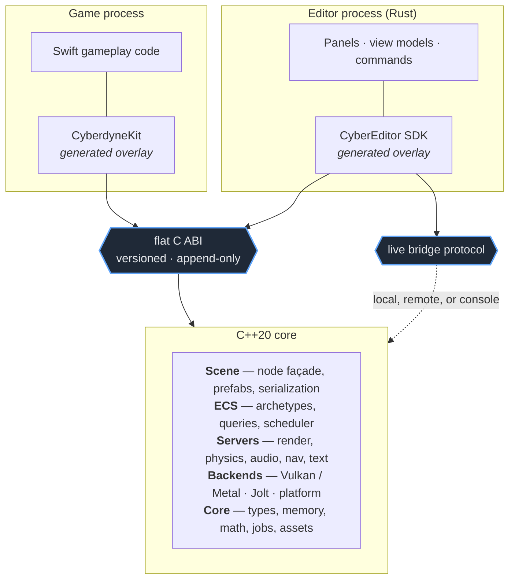
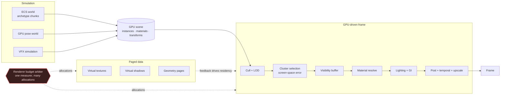
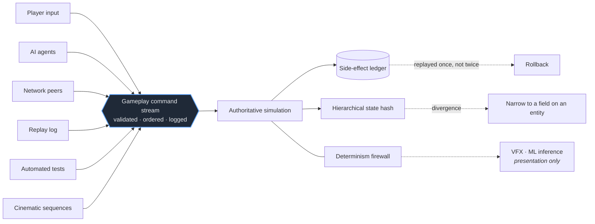
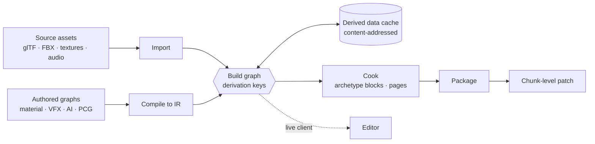

# CyberdyneEngine

An open-source game engine. **C++20** core, **Swift** for gameplay, **Rust** for the editor.

Inspired by Godot's server architecture and scene ergonomics, Unity's component composition and
prefab workflow, and Unreal's render graph and tooling ambition — but not a port of any of them.

> **Status: specification stage. There is no code yet.**
> [`openspec/specs/`](openspec/specs/) holds **73 capabilities · 1,155 requirements · 2,551
> scenarios** that define what is being built and why, and are the contract the implementation must
> satisfy. Start at [the specification index](openspec/specs/README.md).

---

## The shape of it

Three languages, three processes, two boundaries — and the same boundary serves game code, the
editor, and a game running on a console.



The editor is a **client**, not a part of the engine ([`editor-rust-application`](openspec/specs/editor-rust-application/spec.md)).
A runtime crash costs a restart, not a session. And because the runtime is already out of process,
editing on a console is the same code path as editing locally.

---

## What it is

| | | |
|---|---|---|
| **Core** | C++20, no exceptions, no RTTI; archetype ECS with a node façade | [`ecs-core`](openspec/specs/ecs-core/spec.md) · [`scene-graph-and-nodes`](openspec/specs/scene-graph-and-nodes/spec.md) |
| **Scripting** | Swift over a generated overlay on a stable C ABI | [`swift-scripting`](openspec/specs/swift-scripting/spec.md) · [`native-abi`](openspec/specs/native-abi/spec.md) |
| **Editor** | Separate Rust application; MVVM, commands, hosted runtime | [`editor-rust-application`](openspec/specs/editor-rust-application/spec.md) · [`editor-ui-ux`](openspec/specs/editor-ui-ux/spec.md) |
| **Renderer** | Explicit RHI + automatic render graph — Vulkan first, Metal second | [`rhi-and-render-graph`](openspec/specs/rhi-and-render-graph/spec.md) · [`rendering-architecture`](openspec/specs/rendering-architecture/spec.md) |
| **Geometry** | CyberGeometry: virtualised clusters, GPU culling, visibility buffer | [`virtual-geometry`](openspec/specs/virtual-geometry/spec.md) |
| **Materials** | CyberMaterial: graph → IR → closures → compiled program, bindless | [`material-compiler`](openspec/specs/material-compiler/spec.md) |
| **Illumination** | CyberGI: hybrid tracing, surface and radiance caches, shared with reflections | [`rendering-global-illumination`](openspec/specs/rendering-global-illumination/spec.md) |
| **Paging** | Virtual textures and receiver-driven virtual shadows over one residency policy | [`virtual-texturing`](openspec/specs/virtual-texturing/spec.md) · [`virtual-shadows`](openspec/specs/virtual-shadows/spec.md) · [`residency`](openspec/specs/residency/spec.md) |
| **World** | CyberWorld: partitioned cells, layers, persistence overlay | [`world-partition-and-streaming`](openspec/specs/world-partition-and-streaming/spec.md) |
| **Environment** | Terrain, foliage, water, weather and sky over one sparse field substrate | [`environment-fields`](openspec/specs/environment-fields/spec.md) · [`terrain`](openspec/specs/terrain/spec.md) · [`water`](openspec/specs/water/spec.md) |
| **Procedural** | CyberPCG: compiled graphs, region-incremental, stable generated identity | [`procedural-content-generation`](openspec/specs/procedural-content-generation/spec.md) |
| **Gameplay** | Sessions, rules and teams as data; one command stream for every producer | [`gameplay-framework`](openspec/specs/gameplay-framework/spec.md) |
| **Simulation** | Animation, AI, physics and audio — compiled programs; Jolt and miniaudio behind engine-owned interfaces | [`animation-and-skinning`](openspec/specs/animation-and-skinning/spec.md) · [`ai-system`](openspec/specs/ai-system/spec.md) · [`physics`](openspec/specs/physics/spec.md) |
| **Networking** | CyberNet: component replication, priority-scheduled interest, rollback | [`networking-and-replication`](openspec/specs/networking-and-replication/spec.md) |
| **Integrity** | Determinism profiles, one command log for replay, rollback and cinematics | [`simulation-and-determinism`](openspec/specs/simulation-and-determinism/spec.md) · [`sequencing-and-cinematics`](openspec/specs/sequencing-and-cinematics/spec.md) |
| **Diagnostics** | One trace, rolling capture, crash artefacts that reproduce | [`diagnostics-profiling-and-crash`](openspec/specs/diagnostics-profiling-and-crash/spec.md) |
| **Workflow** | One `justfile` — the same recipes CI runs | [`developer-workflow-and-just`](openspec/specs/developer-workflow-and-just/spec.md) |
| **Licence** | MIT | [LICENSE](LICENSE) |

---

## How a frame is built

Nothing walks a scene tree at render time. The GPU scene is the renderer's input, and one arbiter
decides what the frame can afford.



Every paged system degrades along a defined axis — a coarse geometry root, a resident mip tail, a
stale-but-valid shadow page — so a frame is never missing, only coarser.
See [`rendering-culling-and-lod`](openspec/specs/rendering-culling-and-lod/spec.md),
[`temporal-rendering`](openspec/specs/temporal-rendering/spec.md),
[`denoising`](openspec/specs/denoising/spec.md).

---

## One command stream

Players, AI, network peers, replays, tests and cinematics all emit the same semantic commands. The
simulation cannot tell them apart — which is precisely why replay, rollback and lockstep are one
mechanism instead of five.



A session **declares** how deterministic it needs to be — `ReplayStable`, `SamePlatform`,
`CrossPlatform`, `Lockstep` — and pays for that and no more; a configuration a subsystem cannot meet
is rejected rather than discovered as a desync months later.
See [`replay-and-rollback`](openspec/specs/replay-and-rollback/spec.md),
[`save-and-persistence`](openspec/specs/save-and-persistence/spec.md).

---

## Content is a graph of derivations

Not a script, not timestamps. Explicit inputs, deterministic keys, immutable content-addressed
outputs — which is what makes cache sharing and chunk-level patching possible at all.



A designer authors hierarchies; the runtime gets flat data. Prefabs, scenes and worlds resolve at
cook time into archetype blocks matching the runtime's chunk layout, so activating a streaming cell
is a bulk copy — and a shipping build carries no prefab link at all.
See [`build-and-packaging`](openspec/specs/build-and-packaging/spec.md),
[`serialization-and-prefabs`](openspec/specs/serialization-and-prefabs/spec.md).

---

## Design decisions worth knowing up front

Each links to the specification that owns it. The reasoning stays attached to the decision.

- **ECS is the storage; the node tree is the interface.** Component data lives in packed
  per-archetype chunks. A `Node` is a named handle onto an entity — it never duplicates data.
  Designers get the tree, the runtime gets the arrays, and the coherence invariants are specified
  rather than assumed — but UI elements deliberately live *outside* the ECS, because the right
  structure per subsystem beats one structure everywhere.
  → [`ecs-core`](openspec/specs/ecs-core/spec.md) · [`ui-system`](openspec/specs/ui-system/spec.md)
- **The scripting boundary is a flat C ABI.** Opaque handles, POD structs, a versioned append-only
  table. Swift and Rust bind through *generated* overlays, so they cannot drift.
  → [`native-abi`](openspec/specs/native-abi/spec.md)
- **Barriers are computed, not written.** The render graph owns synchronisation, transient aliasing
  and pass scheduling. No renderer code writes a barrier.
  → [`rhi-and-render-graph`](openspec/specs/rhi-and-render-graph/spec.md)
- **Cost is bounded by configuration, not by content.** Rendering, audio and VFX each hold a budget
  with importance tiers, so 8,000 noisy entities and 100 simultaneous explosions cost what you
  configured rather than what the scene happens to contain. Deciding *how much simulation each thing
  deserves* is the lever that actually matters at scale. → [`vfx-system`](openspec/specs/vfx-system/spec.md)
- **Graphs are compiled, never interpreted.** Materials, VFX, AI, animation, camera rigs, PCG,
  abilities, visual scripts and sequences all lower to shared programs with compact per-entity
  state. No object, no interpreter, no virtual tick per entity — the whole reason to build an ECS.
  → [`visual-scripting`](openspec/specs/visual-scripting/spec.md)
- **Indirect light is a scheduling problem, not an algorithm.** Screen-space, world-space caches,
  distance-field software tracing and hardware rays, chosen per sample by a computed confidence
  value. Reflections are the same system with a different ray distribution.
  → [`rendering-global-illumination`](openspec/specs/rendering-global-illumination/spec.md)
- **One component owns the frame's cost.** Several subsystems each measuring GPU time would read one
  shared signal, correct for costs they did not cause, and oscillate together. So exactly one
  arbiter measures and allocates; the rest hold allocations and report cost back.
  → [`rendering-architecture`](openspec/specs/rendering-architecture/spec.md)
- **Detail is continuous, and geometry is virtual.** Cost tracks pixels on screen rather than
  triangles in the asset, and artists stop authoring LOD chains. Render geometry is explicitly not
  collision geometry. → [`virtual-geometry`](openspec/specs/virtual-geometry/spec.md)
- **Residency is not activation.** Bytes in memory, entities simulating, textures resident, and how
  much a region is thinking are four independent decisions. Collapsing them is what makes crossing a
  boundary mean *load everything now*. → [`residency`](openspec/specs/residency/spec.md)
- **Every edit is a transaction.** Semantic operations addressing objects by stable identity — which
  makes undo, autosave, crash recovery, three-way merge and live editing one mechanism read five
  ways. → [`editor-documents-and-transactions`](openspec/specs/editor-documents-and-transactions/spec.md)
- **The editor decides what should be shown; the renderer decides how it is drawn.** No second
  renderer, no editor-only shading path, so the viewport image is the shipping image — and picking
  runs engine-side, so what is picked is what was actually rendered.
  → [`editor-viewport-and-gizmos`](openspec/specs/editor-viewport-and-gizmos/spec.md)
- **Persistent identity does not come from names.** Type and field identifiers are assigned once and
  recorded in a committed manifest with a CI gate, so renaming a field leaves every scene, override,
  save, animation binding and network schema resolving.
  → [`core-type-system`](openspec/specs/core-type-system/spec.md)
- **Integrate where it isn't differentiating.** Jolt, miniaudio, Steam Audio, HarfBuzz + ICU +
  FreeType, Slang, Recast, meshoptimizer, xatlas — each behind an engine-owned interface, each
  replaceable. → [`thirdparty-dependencies`](openspec/specs/thirdparty-dependencies/spec.md)
- **Conventions are stated once, normatively.** Right-handed, Y-up, −Z forward. Reversed-Z with a
  `[0,1]` range. Column-major matrices. Metres, seconds, radians.
  → [`engine-architecture`](openspec/specs/engine-architecture/spec.md)

---

## Gameplay code, roughly

Behaviours are the ergonomic path:

```swift
@Behaviour
final class PlayerController: Behaviour {
    @Export var speed: Float = 6.0
    @Export(range: 0...20) var jumpVelocity: Float = 8.0

    private var velocity = Vec3.zero

    override func onFixedUpdate(_ dt: Double) {
        let move = Input.vector("move")
        velocity.x = move.x * speed
        velocity.z = move.y * speed
        if Input.justPressed("jump"), characterController.isGrounded {
            velocity.y = jumpVelocity
        }
        velocity.y += Physics.gravity * Float(dt)
        characterController.move(velocity * Float(dt))
    }
}
```

Systems are the fast path — same language, same scheduler:

```swift
@System(stage: .simulation)
func applyGravity(
    _ query: Query<Write<Velocity>, Read<Mass>, Without<Grounded>>,
    time: Res<Time>
) {
    for (velocity, _) in query {
        velocity.linear.y -= 9.81 * Float(time.fixedDelta)
    }
}
```

A project can use either or both. Behaviours that can be batched compile into generated systems, and
the build tells you when they cannot. → [`swift-scripting`](openspec/specs/swift-scripting/spec.md)

---

## Repository layout

```
openspec/
  specs/          Target specifications — 73 capabilities. Start here.
  changes/        In-flight proposals (propose → apply → validate → archive)
  config.yaml     Project context and locked architectural decisions
justfile          One entry point for every developer task (planned)
```

Source directories (`src/`, `bindings/`, `editor/`, `tools/`) will appear as the specifications are
implemented.

## Working on this

Specifications are the source of truth and precede implementation. Changes flow through
[OpenSpec](https://openspec.dev):

```bash
npm install -g @fission-ai/openspec@latest

openspec list --specs                  # what is specified
openspec show engine-architecture      # read one
openspec validate --specs --strict     # check them all
```

To propose a change, use `/opsx:propose` in an agent session, or scaffold with
`openspec new change <name>`, then implement against the generated tasks and archive when done.

## Licence

MIT — see [LICENSE](LICENSE). Chosen to match the permissive licensing of the libraries the engine
integrates and to place no obligations on games built with it.
