# CyberdyneEngine

An open-source game engine. **C++20** core, **Swift** for gameplay, **Rust** for the editor.

Inspired by Godot's server architecture and scene ergonomics, Unity's component composition and
prefab workflow, and Unreal's render graph and tooling ambition — but not a port of any of them.


*`samples/12-beauty`, the M11.c closing artefact: 31 instances and three materials authored on the
editor's node-graph canvas, compiled by the material compiler and bound as BC7 and BC5 blocks, with
996 ember particles and their trails in the transparent stage and 0 validation errors
([what was authored and what the renderer produced](docs/design/beauty-shot.md)).*

> **Status: M0 through M11.d are closed. [M11.d.5 · Backends](docs/ROADMAP.md#m11d5--backends) is
> closing** — the same golden image now renders and matches on Vulkan, Metal and D3D12 hardware, and
> the gate waits on the Metal and D3D12 criteria run on that hardware
> ([#44](https://github.com/CyberdyneCorp/CyberdyneEngine/issues/44)). Next is
> [M11.e · Ship](docs/ROADMAP.md#m11e--ship) and 1.0, then [M12 · The Game](docs/ROADMAP.md#m12--the-game),
> an RTS written in Swift that proves the engine by using it.

[`openspec/specs/`](openspec/specs/README.md) holds **76 capabilities, 1,229 requirements and 2,736
scenarios** — the contract the implementation must satisfy. Today 16 are Complete, 56 Working, 3
Seed and 1 not started ([`status.yaml`](docs/roadmap/status.yaml), reported by `just roadmap-status`).

---

## Gallery

Every image below is a frame the engine rendered and read back, committed under
[`docs/design/images/`](docs/design/images/). Most renderer features ship with an off/on pair in
their module README.


*Colour grading: the beauty shot ungraded, warm and cool ([`src/rendering/grading/`](src/rendering/grading/README.md)).*

| | | |
|:---:|:---:|:---:|
| 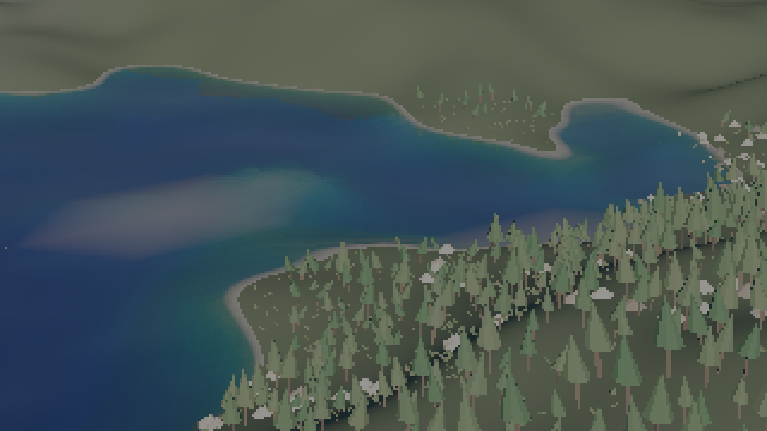 | 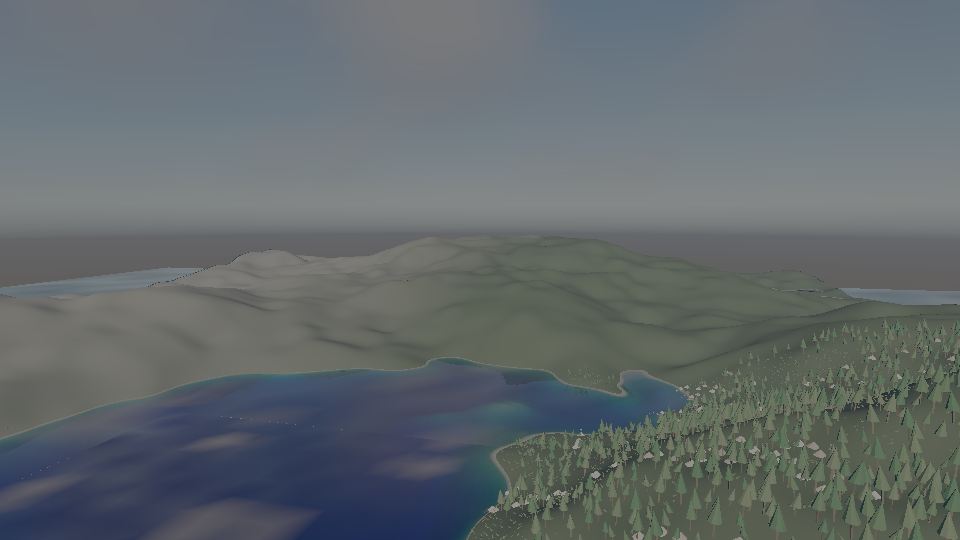 |  |
| **Water** — shading in the shallows ([`samples/10-world`](samples/10-world/README.md)) | **Aerial perspective** — the atmosphere's own table ([`samples/10-world`](samples/10-world/README.md#aerial-perspective)) | **Soft shadows** with contact shadows ([`contact_shadows/`](src/rendering/contact_shadows/README.md)) |
| 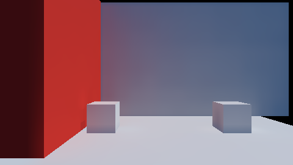 |  |  |
| **Light probes** — an irradiance volume ([`light_probes/`](src/rendering/light_probes/README.md)) | **Volumetric fog** and light shafts ([`fog/`](src/rendering/fog/README.md)) | **Depth of field** — near and far fields ([`depth_of_field/`](src/rendering/depth_of_field/README.md)) |
| 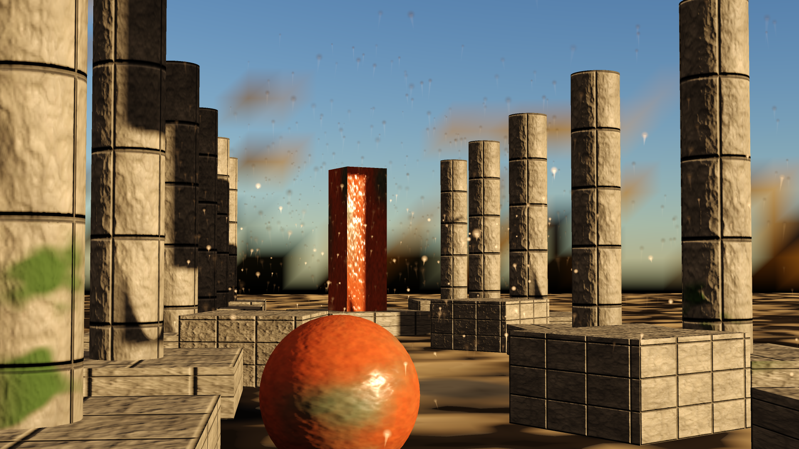 | 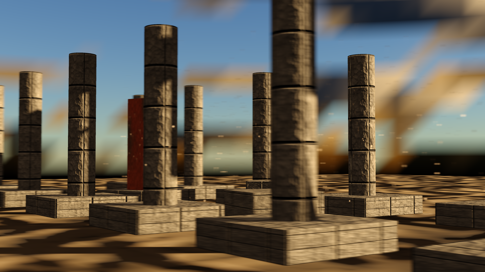 | 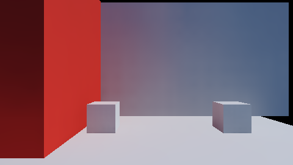 |
| **Decals** before the light loop ([`decals/`](src/rendering/decals/README.md)) | **Motion blur** from prepass velocity ([`motion_blur/`](src/rendering/motion_blur/README.md)) | **Lightmaps** — path-traced, denoised bake ([`lightmaps/`](src/rendering/lightmaps/README.md)) |
| 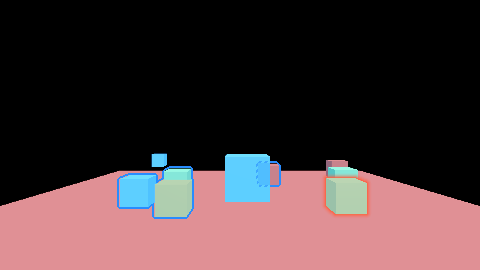 |  | 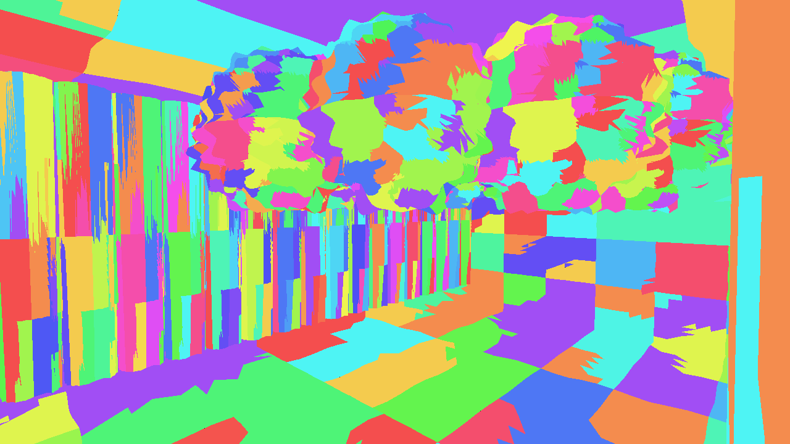 |
| **Selection outlines** — a squad, an enemy, a hidden unit ([`selection/`](src/rendering/selection/README.md)) | **GI surface cache** on the device, host left and device right ([`gi_gpu/`](src/rendering/gi_gpu/README.md)) | **Virtual geometry** — 4.48 M triangles, one colour per cluster ([write-up](docs/design/virtual-geometry.md)) |
| 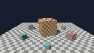 |  |  |
| **Vulkan** — NVIDIA GeForce RTX 5060 | **Metal** — Apple M2 Max, max delta 1 | **D3D12** — AMD Radeon RX 6900 XT, max delta 1 |
| 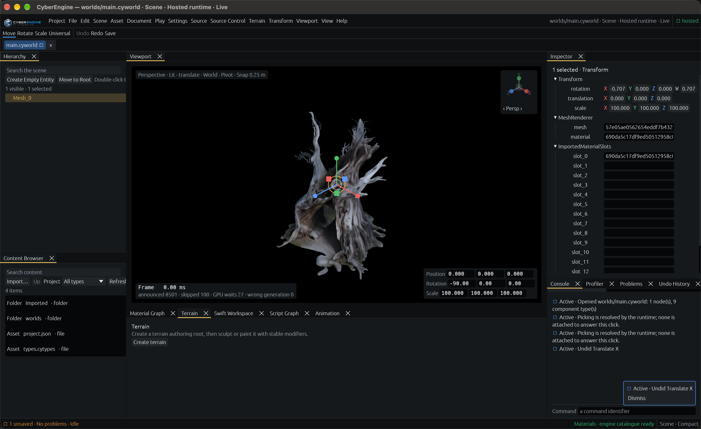 | 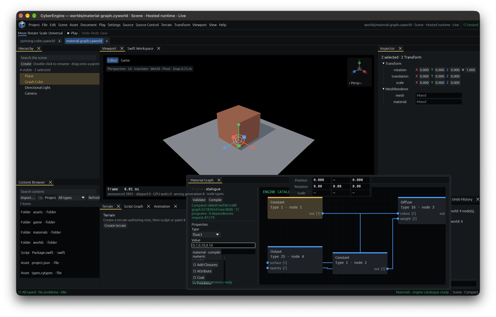 | 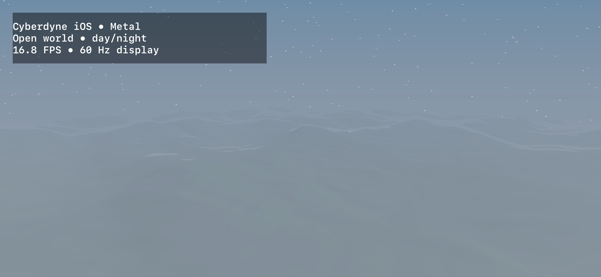 |
| **Editor** — a live FBX import on Metal ([`editor/`](editor/README.md)) | **Material graph** on the editor's canvas ([`material/`](src/rendering/material/README.md)) | **iOS** — open world on an iPhone 16 at 60 FPS ([building](docs/guides/building.md#ios)) |
|  | 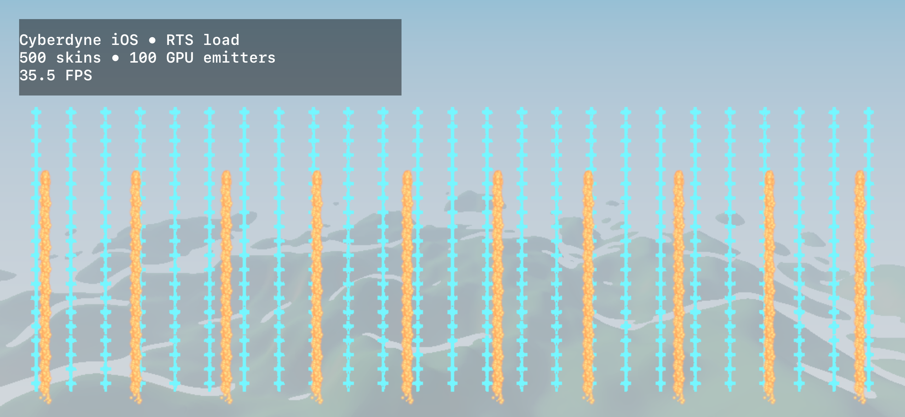 | 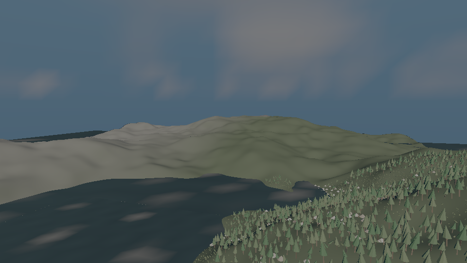 |
| **Animation** — a Mixamo character imported from four FBX files, idle to walk to run to a death ([video](docs/design/videos/animated-character.mp4) · [`samples/09b-animated-character`](samples/09b-animated-character/README.md) · [`src/animation/`](src/animation/README.md)) | **GPU skinning** — 500 skinned models and 100 GPU emitters on an iPhone 16 ([building](docs/guides/building.md#rts-capacity-scene)) | **World** — generated from a seed, a day of weather ([video](docs/design/videos/m10-world.mp4) · [`samples/10-world`](samples/10-world/README.md)) |

The three backend images are the M3 golden image, each labelled with the device that answered
(`m11d5-three-backends-*.manifest`); that comparison is M11.d.5's closing artefact.

---

## What works today

The tier of every capability is recorded in [`status.yaml`](docs/roadmap/status.yaml); Working
means the requirements a real project depends on are satisfied and covered by tests, Complete means
every requirement is. The table groups what is in the tree now.

| Area | What exists | Where |
|---|---|---|
| **Core** | Type system with stable field identity, memory domains, math, jobs, assets and IO, platform abstraction | [`src/core/`](src/core/README.md) · [`core-type-system`](openspec/specs/core-type-system/spec.md) |
| **World model** | Archetype ECS (Complete) under a node façade, prefabs and serialization (Complete) | [`src/ecs/`](src/ecs/README.md) · [`src/scene/`](src/scene/) · [`ecs-core`](openspec/specs/ecs-core/spec.md) |
| **RHI** | Vulkan, Metal and D3D12 backends plus a null device; a render graph that computes every barrier | [`src/backends/`](src/backends/README.md) · [`rhi-and-render-graph`](openspec/specs/rhi-and-render-graph/spec.md) |
| **Shaders** | Slang to SPIR-V, permutations, reflection, a tiered cache, hot reload | [`src/backends/shader/`](src/backends/shader/README.md) · [Slang guide](docs/guides/slang.md) |
| **Frame** | Forward clustered shading, GPU culling and a hierarchical depth pyramid, one temporal framework (jitter, history), post stack (exposure, AgX tonemap, bloom, grading) | [`src/rendering/`](src/rendering/README.md) · [`assembly/`](src/rendering/assembly/README.md) |
| **Materials** | Node graph → IR → compiled program, bindless, block-compressed textures | [`material/`](src/rendering/material/README.md) · [`material-compiler`](openspec/specs/material-compiler/spec.md) |
| **Light** | Shadow maps, contact shadows, ambient occlusion, light probes, baked lightmaps, GI with a GPU surface cache, ray-tracing infrastructure and a shared denoiser | [`gi/`](src/rendering/gi/README.md) · [`rendering-global-illumination`](openspec/specs/rendering-global-illumination/spec.md) |
| **Effects** | Volumetric fog, depth of field, motion blur, decals, selection outlines, GPU particles and trails | [`fog/`](src/rendering/fog/README.md) · [`particles/`](src/rendering/particles/README.md) · [`src/vfx/`](src/vfx/) |
| **Scale** | Virtual geometry clusters, virtual texturing (Complete), virtual shadows, one residency policy (Complete) | [`virtual_geometry/`](src/rendering/virtual_geometry/) · [`virtual-geometry`](openspec/specs/virtual-geometry/spec.md) |
| **Environment** | Physical sky and atmosphere, terrain, water, foliage, weather and wind over one field substrate; procedural generation | [`src/environment/`](src/environment/README.md) · [`src/pcg/`](src/pcg/README.md) |
| **Simulation** | Animation with GPU skinning, AI, navigation, physics (Jolt), audio (miniaudio), abilities, cameras, cinematics | [`src/animation/`](src/animation/README.md) · [`src/ai/`](src/ai/README.md) · [`src/physics/`](src/physics/README.md) |
| **Integrity** | Deterministic simulation, replay and rollback, networking and replication, saves | [`src/replay/`](src/replay/) · [`src/networking/`](src/networking/README.md) · [`src/save/`](src/save/) |
| **Gameplay** | Swift behaviours and systems over a versioned C ABI; the gameplay framework (Complete) | [`bindings/swift/`](bindings/swift/README.md) · [`src/abi/`](src/abi/README.md) · [`src/gameplay/`](src/gameplay/README.md) |
| **Editor** | Rust application: documents and transactions, live viewport and gizmos, material graph, FBX import, an MCP agent interface | [`editor/`](editor/README.md) · [`editor-agent-interface`](openspec/specs/editor-agent-interface/spec.md) |
| **Platforms** | SDL3 desktop, a native Linux backend, headless, iOS, and a stub that shares no desktop assumption | [`platform/`](platform/README.md) |
| **Workflow** | One `justfile`, the same recipes CI runs; diagnostics, traces and crash artefacts (Complete) | [`just/`](just/README.md) · [`diagnostics-profiling-and-crash`](openspec/specs/diagnostics-profiling-and-crash/spec.md) |

What is not there yet is stated too: `build-system-and-platforms`, `thirdparty-dependencies` and
`ml-inference` are at Seed, `xr-support` is deferred to M13, and there is no game — that is M12.

---

## The shape of it

Three languages, three processes, two boundaries — and the same boundary serves game code, the
editor, and a game running on a console.

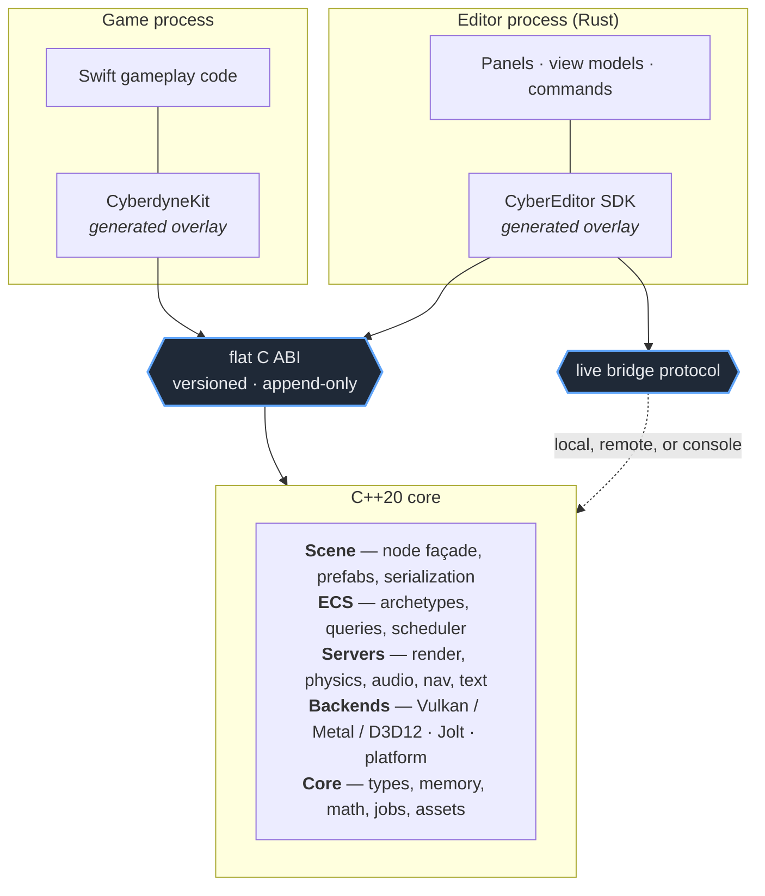
```mermaid
flowchart TB
    subgraph GAME["Game process"]
        SW["Swift gameplay code"]
        KIT["CyberdyneKit<br/><i>generated overlay</i>"]
        SW --- KIT
    end

    subgraph ED["Editor process (Rust)"]
        UI["Panels · view models · commands"]
        SDK["CyberEditor SDK<br/><i>generated overlay</i>"]
        UI --- SDK
    end

    ABI{{"flat C ABI<br/>versioned · append-only"}}
    BRIDGE{{"live bridge protocol"}}

    subgraph CORE["C++20 core"]
        LAYERS["<b>Scene</b> — node façade, prefabs, serialization<br/><b>ECS</b> — archetypes, queries, scheduler<br/><b>Servers</b> — render, physics, audio, nav, text<br/><b>Backends</b> — Vulkan / Metal / D3D12 · Jolt · platform<br/><b>Core</b> — types, memory, math, jobs, assets"]
    end

    KIT --> ABI
    SDK --> ABI
    SDK --> BRIDGE
    ABI --> CORE
    BRIDGE -.->|"local, remote, or console"| CORE

    classDef boundary fill:#1f2937,stroke:#60a5fa,stroke-width:2px,color:#e5e7eb
    class ABI,BRIDGE boundary
```

The editor is a **client**, not a part of the engine ([`editor-rust-application`](openspec/specs/editor-rust-application/spec.md)).
A runtime crash costs a restart, not a session. And because the runtime is already out of process,
editing on a console is the same code path as editing locally.

### How a frame is built

Nothing walks a scene tree at render time. The GPU scene is the renderer's input, and one arbiter
decides what the frame can afford.

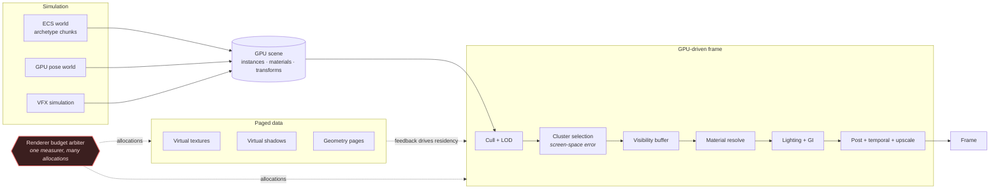
```mermaid
flowchart LR
    subgraph SIM["Simulation"]
        W["ECS world<br/>archetype chunks"]
        ANIM["GPU pose world"]
        VFX["VFX simulation"]
    end

    GS[("GPU scene<br/>instances · materials · transforms")]
    W --> GS
    ANIM --> GS
    VFX --> GS

    subgraph GPU["GPU-driven frame"]
        direction TB
        CULL["Cull + LOD"]
        CLUST["Cluster selection<br/><i>screen-space error</i>"]
        VIS["Visibility buffer"]
        MAT["Material resolve"]
        LIGHT["Lighting + GI"]
        POST["Post + temporal + upscale"]
        CULL --> CLUST --> VIS --> MAT --> LIGHT --> POST
    end

    GS --> CULL

    subgraph PAGES["Paged data"]
        direction TB
        VT["Virtual textures"]
        VSM["Virtual shadows"]
        GEO["Geometry pages"]
    end
    PAGES -.->|"feedback drives residency"| GPU

    ARB{{"Renderer budget arbiter<br/><i>one measurer, many allocations</i>"}}
    ARB -.->|allocations| GPU
    ARB -.->|allocations| PAGES

    POST --> OUT["Frame"]

    classDef arb fill:#3b1f1f,stroke:#f87171,stroke-width:2px,color:#fee2e2
    class ARB arb
```

Every paged system degrades along a defined axis — a coarse geometry root, a resident mip tail, a
stale-but-valid shadow page — so a frame is never missing, only coarser. See
[`rendering-culling-and-lod`](openspec/specs/rendering-culling-and-lod/spec.md),
[`temporal-rendering`](openspec/specs/temporal-rendering/spec.md),
[`denoising`](openspec/specs/denoising/spec.md).

### One command stream

Players, AI, network peers, replays, tests and cinematics all emit the same semantic commands. The
simulation cannot tell them apart — which is why replay, rollback and lockstep are one mechanism
instead of five.

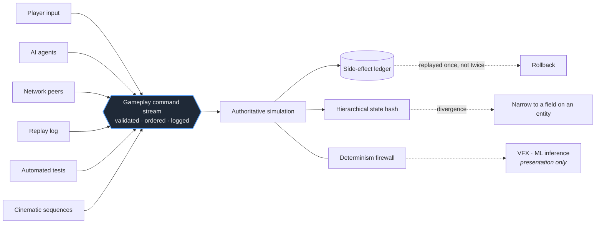
```mermaid
flowchart LR
    P["Player input"] --> CS
    AI["AI agents"] --> CS
    NET["Network peers"] --> CS
    REP["Replay log"] --> CS
    TEST["Automated tests"] --> CS
    SEQ["Cinematic sequences"] --> CS

    CS{{"Gameplay command stream<br/>validated · ordered · logged"}}
    CS --> SIMU["Authoritative simulation"]
    SIMU --> LEDGER[("Side-effect ledger")]
    SIMU --> HASH["Hierarchical state hash"]

    HASH -.->|divergence| DIAG["Narrow to a field on an entity"]
    LEDGER -.->|"replayed once, not twice"| ROLL["Rollback"]

    FIRE["Determinism firewall"] -.-> VFXN["VFX · ML inference<br/><i>presentation only</i>"]
    SIMU --- FIRE

    classDef stream fill:#1f2937,stroke:#60a5fa,stroke-width:2px,color:#e5e7eb
    class CS stream
```

A session **declares** how deterministic it needs to be — `ReplayStable`, `SamePlatform`,
`CrossPlatform`, `Lockstep` — and pays for that and no more; a configuration a subsystem cannot meet
is rejected rather than discovered as a desync months later. See
[`replay-and-rollback`](openspec/specs/replay-and-rollback/spec.md),
[`save-and-persistence`](openspec/specs/save-and-persistence/spec.md).

### Content is a graph of derivations

Explicit inputs, deterministic keys, immutable content-addressed outputs — which is what makes cache
sharing and chunk-level patching possible at all.

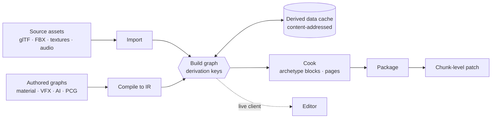
```mermaid
flowchart LR
    ASSETS["Source assets<br/>glTF · FBX · textures · audio"] --> IMP["Import"]
    GRAPHS["Authored graphs<br/>material · VFX · AI · PCG"] --> COMP["Compile to IR"]
    IMP --> BG
    COMP --> BG
    BG{{"Build graph<br/>derivation keys"}}
    BG <--> DDC[("Derived data cache<br/>content-addressed")]
    BG --> COOK["Cook<br/>archetype blocks · pages"]
    COOK --> PKG["Package"]
    PKG --> PATCH["Chunk-level patch"]
    BG -.->|"live client"| EDITOR["Editor"]
```

A designer authors hierarchies; the runtime gets flat data. Prefabs, scenes and worlds resolve at
cook time into archetype blocks matching the runtime's chunk layout, so activating a streaming cell
is a bulk copy — and a shipping build carries no prefab link at all. See
[`build-and-packaging`](openspec/specs/build-and-packaging/spec.md),
[`serialization-and-prefabs`](openspec/specs/serialization-and-prefabs/spec.md).

---

## Design decisions worth knowing up front

Each links to the specification that owns it.

- **ECS is the storage; the node tree is the interface.** Component data lives in packed
  per-archetype chunks; a `Node` is a named handle onto an entity and never duplicates data. UI
  elements deliberately live *outside* the ECS, because the right structure per subsystem beats one
  structure everywhere. → [`ecs-core`](openspec/specs/ecs-core/spec.md) · [`ui-system`](openspec/specs/ui-system/spec.md)
- **The scripting boundary is a flat C ABI.** Opaque handles, POD structs, a versioned append-only
  table. Swift and Rust bind through *generated* overlays, so they cannot drift.
  → [`native-abi`](openspec/specs/native-abi/spec.md)
- **Barriers are computed, not written.** The render graph owns synchronisation, transient aliasing
  and pass scheduling; `tools/layercheck/layercheck.py --check barriers` fails when a barrier
  symbol appears outside it. → [`rhi-and-render-graph`](openspec/specs/rhi-and-render-graph/spec.md)
- **Cost is bounded by configuration, not by content.** Rendering, audio and VFX each hold a budget
  with importance tiers, so 8,000 noisy entities and 100 simultaneous explosions cost what you
  configured rather than what the scene happens to contain. → [`vfx-system`](openspec/specs/vfx-system/spec.md)
- **Graphs are compiled, never interpreted.** Materials, VFX, AI, animation, camera rigs, PCG,
  abilities, visual scripts and sequences all lower to shared programs with compact per-entity
  state — no interpreter, no virtual tick per entity. → [`visual-scripting`](openspec/specs/visual-scripting/spec.md)
- **Indirect light is a scheduling problem, not an algorithm.** Screen-space, world-space caches,
  distance-field software tracing and hardware rays, chosen per sample by a computed confidence;
  reflections are the same system with a different ray distribution.
  → [`rendering-global-illumination`](openspec/specs/rendering-global-illumination/spec.md)
- **One component owns the frame's cost.** Several subsystems each measuring GPU time would read one
  shared signal and oscillate together, so exactly one arbiter measures and allocates.
  → [`rendering-architecture`](openspec/specs/rendering-architecture/spec.md)
- **Detail is continuous, and geometry is virtual.** Cost tracks pixels on screen rather than
  triangles in the asset; render geometry is explicitly not collision geometry.
  → [`virtual-geometry`](openspec/specs/virtual-geometry/spec.md)
- **Residency is not activation.** Bytes in memory, entities simulating, textures resident, and how
  much a region is thinking are four independent decisions. → [`residency`](openspec/specs/residency/spec.md)
- **Every edit is a transaction.** Semantic operations addressing objects by stable identity — undo,
  autosave, crash recovery, three-way merge and live editing are one mechanism read five ways.
  → [`editor-documents-and-transactions`](openspec/specs/editor-documents-and-transactions/spec.md)
- **The editor decides what is shown; the renderer decides how it is drawn.** No editor-only shading
  path, so the viewport image is the shipping image, and picking runs engine-side.
  → [`editor-viewport-and-gizmos`](openspec/specs/editor-viewport-and-gizmos/spec.md)
- **Persistent identity does not come from names.** Type and field identifiers are assigned once and
  recorded in a committed manifest with a CI gate, so renaming a field breaks no scene, save,
  animation binding or network schema. → [`core-type-system`](openspec/specs/core-type-system/spec.md)
- **Integrate where it isn't differentiating.** Jolt, miniaudio, Steam Audio, HarfBuzz + ICU +
  FreeType, Slang, Recast, meshoptimizer, xatlas — each behind an engine-owned interface.
  → [`thirdparty-dependencies`](openspec/specs/thirdparty-dependencies/spec.md) · [`THIRD_PARTY.md`](THIRD_PARTY.md)
- **Conventions are stated once, normatively.** Right-handed, Y-up, −Z forward. Reversed-Z with a
  `[0,1]` range. Column-major matrices. Metres, seconds, radians.
  → [`engine-architecture`](openspec/specs/engine-architecture/spec.md)

---

## Gameplay code

Behaviours are the ergonomic path. This one ships in `samples/05b-editor-window/project/game/SpinCube.swift`
and runs when you press Play in the editor:

```swift
import CyberdyneKit
import Foundation

@Behaviour(name: "SpinCube", schema: 1)
final class SpinCube: Behaviour {
    @Export(range: 0...360) var degreesPerSecond: Float = 45

    private var angle: Float = 0
    private var transform = ComponentType.invalid

    override func onCreate() throws {
        guard let world else { throw SpinError.missingWorld }
        transform = world.find(component: "cy::scene::LocalTransform")
        guard transform.isValid else { throw SpinError.missingTransform }
    }

    override func onFixedUpdate(_ delta: Double) throws {
        guard let world else { throw SpinError.missingWorld }
        angle += degreesPerSecond * Float(delta) * .pi / 180
        let half = angle * 0.5
        try world.setFloat(sin(half), entity, transform, field: 2)
        try world.setFloat(cos(half), entity, transform, field: 3)
    }
}
```

Systems are the fast path — same language, same scheduler. The access is the query: the `@System`
macro reads it out of the signature, and a query that reads and writes the same component is a
compile error. The inner loop indexes borrowed chunk arrays with no per-entity ABI call:

```swift
@System(stage: .simulation)
func applyGravity(
    _ query: Query<Write<Velocity>, Read<Mass>, Without<Grounded>>,
    _ chunks: ChunkSource
) {
    chunks.forEachChunk(matching: type(of: query).access) { chunk in
        guard let velocities = chunk.array(Velocity.self),
              let masses = chunk.array(Mass.self) else { return }
        for index in 0..<chunk.count {
            velocities[index].y -= 9.81 * masses[index].value
        }
    }
}
```

The system model is complete and tested, but the ABI does not yet have an entry that hands a module
a chunk; `ChunkSource` is that seam (see the header of
[`Systems.swift`](bindings/swift/Sources/CyberdyneKit/Systems.swift)). Larger examples:
[`samples/04-character`](samples/04-character/) (a third-person character) and
[`samples/13-rts-api`](samples/13-rts-api/) (an RTS unit written only in Swift).
→ [`swift-scripting`](openspec/specs/swift-scripting/spec.md) · [`bindings/swift/`](bindings/swift/README.md)

---

## Roadmap

The order is specified, with no dates: a date is an estimate that decays, while *after what* is a
design consequence that does not. The ladder has **22 rungs** — it was split and extended rather
than renumbered, so M5.5, M8.a–c, M11.a–e and M11.d.5 are insertions, and M12 and M13 follow 1.0.
Every rung ends in a runnable artefact whose checks stay in continuous integration afterwards.

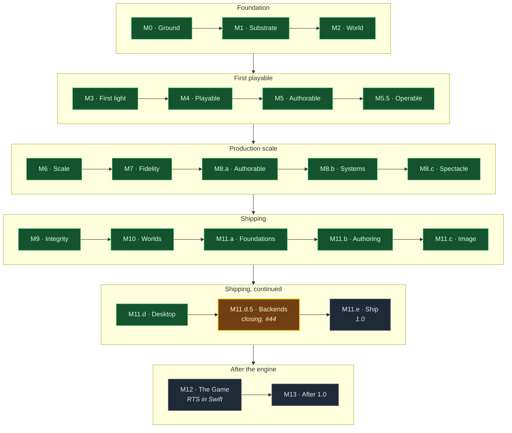
```mermaid
flowchart TB
    subgraph F["Foundation"]
        direction LR
        M0["M0 · Ground"] --> M1["M1 · Substrate"] --> M2["M2 · World"]
    end
    subgraph P["First playable"]
        direction LR
        M3["M3 · First light"] --> M4["M4 · Playable"] --> M5["M5 · Authorable"] --> M5B["M5.5 · Operable"]
    end
    subgraph S["Production scale"]
        direction LR
        M6["M6 · Scale"] --> M7["M7 · Fidelity"] --> M8A["M8.a · Authorable"] --> M8B["M8.b · Systems"] --> M8C["M8.c · Spectacle"]
    end
    subgraph SH1["Shipping"]
        direction LR
        M9["M9 · Integrity"] --> M10["M10 · Worlds"] --> M11A["M11.a · Foundations"] --> M11B["M11.b · Authoring"] --> M11C["M11.c · Image"]
    end
    subgraph SH2["Shipping, continued"]
        direction LR
        M11D["M11.d · Desktop"] --> M11D5["M11.d.5 · Backends<br/><i>closing, #44</i>"] --> M11E["M11.e · Ship<br/><i>1.0</i>"]
    end
    subgraph AF["After the engine"]
        direction LR
        M12["M12 · The Game<br/><i>RTS in Swift</i>"] --> M13["M13 · After 1.0"]
    end
    F --> P --> S --> SH1 --> SH2 --> AF

    classDef closed fill:#14532d,stroke:#4ade80,color:#dcfce7
    classDef active fill:#713f12,stroke:#facc15,stroke-width:2px,color:#fef9c3
    classDef ahead fill:#1f2937,stroke:#6b7280,color:#e5e7eb
    class M0,M1,M2,M3,M4,M5,M5B,M6,M7,M8A,M8B,M8C,M9,M10,M11A,M11B,M11C,M11D closed
    class M11D5 active
    class M11E,M12,M13 ahead
```

Green is closed (18 rungs), amber is closing, grey is ahead.

| Era | Rungs | Ends with |
|---|---|---|
| **Foundation** | M0 – M2 | A headless simulation that ticks, hashes, and reproduces its hash exactly |
| **First playable** | M3 – M5.5 | A Swift character controller, edited in an editor window that survives a runtime crash and that an agent can drive |
| **Production scale** | M6 – M8.c | A streamed world rendered at film detail, playable as a vertical slice with particles and a cinematic |
| **Shipping** | M9 – M11.e | Four-player rollback, open worlds, a beauty shot authored in the editor, three backends, every platform — 1.0 |
| **After the engine** | M12 – M13 | An RTS that proves the engine by using it; then Android, `ml-inference` and `xr-support` |

→ [**The roadmap**](docs/ROADMAP.md) · [capability matrix](docs/roadmap/capability-matrix.md) ·
[dependencies](docs/roadmap/dependencies.md) · [risks and deferrals](docs/roadmap/risks.md) ·
[implementing the roadmap](docs/roadmap/implementing.md)

---

## Building

Everything the engine links is fetched at pinned commits ([`deps/manifest.toml`](deps/manifest.toml));
you install the toolchain. On Ubuntu 24.04:

```bash
sudo apt install -y build-essential clang cmake ninja-build git just pkg-config python3
# plus the SDL3 system libraries — see the building guide

just env-doctor      # checks every tool and names the fix for anything missing
just build-engine    # configure and build, dev profile
just test-unit
just run-sample empty
```

Run `just` on its own to list every recipe. The [**building guide**](docs/guides/building.md) has
the full Linux prerequisites, Vulkan, Swift and Rust setup, and:

- **macOS** — the Metal editor: `just build-all`, then `just content-new-project <dir>` and
  `just run-editor-live --project <dir>` ([details](docs/guides/building.md#macos-building-and-running-the-metal-editor))
- **iOS** — `just run-ios-simulator`, `just run-ios-device <udid>` and the RTS capacity scene
  ([details](docs/guides/building.md#ios))
- **CI** — Linux x86_64 and ARM64, macOS ARM64, Windows x86_64 ([details](docs/guides/building.md#ci-targets))

Samples are listed in [`samples/README.md`](samples/README.md); `just capture-beauty-shot` renders
the hero image above and `just run-ship` packages and launches `samples/11-ship`.

---

## Documentation

| | |
|---|---|
| [Slang guide](docs/guides/slang.md) | Slang, and how the engine compiles and uses its shaders |
| [Physics guide](docs/guides/physics.md) | Physics and Jolt: components, the bridge, stepping, queries from C++ and Swift, determinism |
| [Building and running](docs/guides/building.md) | Toolchains, Linux, macOS editor, iOS, CI targets |
| [Roadmap](docs/ROADMAP.md) | The milestone ladder, exit criteria and the invariants that cannot wait |
| [Specification index](openspec/specs/README.md) | The 76 capabilities, in reading order |
| [`CONTRIBUTING.md`](CONTRIBUTING.md) | Profiles, building through CMake, the change workflow |
| [`just/README.md`](just/README.md) | How the recipe files are organised |
| [Beauty shot](docs/design/beauty-shot.md) | What the M11.c image is, what was authored and what the renderer produced |
| [Virtual geometry](docs/design/virtual-geometry.md) | The cluster frame, the density, and what the images do not show |
| [Editor visual language](docs/design/editor-visual-language.md) | How the editor looks and what its colours mean |
| [`src/README.md`](src/README.md) · [`editor/README.md`](editor/README.md) · [`platform/README.md`](platform/README.md) | The engine, editor and platform trees; every module has its own README |

## Repository layout

```
src/              Engine: core/ ecs/ scene/ servers/ backends/ rendering/ abi/ and the simulation modules — strictly layered
platform/         desktop-sdl3/, linux-native/, headless/, ios/, stub/, host/. The only place SDL may be named.
bindings/swift/   CyberdyneKit, the generated overlay and macros for Swift gameplay
editor/           The Rust editor (Cargo workspace under crates/)
modules/          Optional functionality, discovered by manifest
samples/          Runnable artefacts, one per milestone; each stays green forever after
content/          Authored content for the samples (content/beauty/)
tests/            unit/ integration/ smoke/ render/ determinism/ editor/ acceptance/
benchmarks/       Throughput and latency, with regression thresholds
cmake/            Build modules; module.cmake carries the layering rule
deps/             manifest.toml — every dependency, pinned to a commit
tools/            layercheck, roadmap, deps, cook, import, material, quality and more
just/             One file per recipe category, imported by the root justfile
docs/             ROADMAP.md, roadmap/ (matrix, status record), design/ (write-ups, images), guides/
openspec/         specs/ (76 capabilities, the contract), changes/ (in-flight proposals), config.yaml
```

## Working on this

Specifications are the source of truth and precede implementation. Changes flow through
[OpenSpec](https://openspec.dev):

```bash
npm install -g @fission-ai/openspec@latest

openspec list --specs                  # what is specified
openspec show engine-architecture      # read one
openspec validate --specs --strict     # check them all
```

To propose a change, use `/opsx:propose` in an agent session, or scaffold with
`openspec new change <name>`, then implement against the generated tasks and archive when done.
See [`CONTRIBUTING.md`](CONTRIBUTING.md).

## Licence

MIT — see [LICENSE](LICENSE). Chosen to match the permissive licensing of the libraries the engine
integrates and to place no obligations on games built with it.
