# CyberdyneEngine — Delivery Roadmap

The order in which [the specifications](../openspec/specs/README.md) become code.

> This document is a **view** of the [`delivery-roadmap`](../openspec/specs/delivery-roadmap/spec.md)
> capability, which is authoritative. Where the two disagree, the specification wins and this
> document is wrong.

**There are no dates here, and there will not be.** A date is a compound estimate that decays from
the moment it is written. Ordering is a design consequence that does not: the ABI must be versioned
from its first symbol whether that symbol appears next month or next year. The roadmap answers
*after what*, not *when*.

---

## The shape of it

Thirteen milestones, four eras. Each milestone ends in something that runs, committed to the
repository and exercised by continuous integration — so it becomes a regression gate for everything
after it.

Thirteen and not twelve because [`implement-m5b-operable`](../openspec/changes/implement-m5b-operable/proposal.md)
**inserted M5.5 · Operable between M5 and M6** rather than renumbering M6 through M11: M5 claimed
`editor-ui-ux` at Working and closed on a scripted session with no window, and the correct repair
was to give the window a milestone rather than to make the plan retroactively right. Inserting keeps
every reference to a later milestone valid, and the fractional number says plainly that the ladder
gained an entry rather than always having had one.

```mermaid
flowchart LR
    subgraph F["Foundation"]
        direction TB
        M0["M0 · Ground<br/><i>it builds, everywhere</i>"]
        M1["M1 · Substrate<br/><i>core services</i>"]
        M2["M2 · World<br/><i>entities and nodes</i>"]
        M0 --> M1 --> M2
    end
    subgraph P["First playable"]
        direction TB
        M3["M3 · First light<br/><i>a frame</i>"]
        M4["M4 · Playable<br/><i>Swift gameplay</i>"]
        M5["M5 · Authorable<br/><i>the editor</i>"]
        M5B["M5.5 · Operable<br/><i>a window, and an agent</i>"]
        M3 --> M4 --> M5 --> M5B
    end
    subgraph S["Production scale"]
        direction TB
        M6["M6 · Scale<br/><i>build graph, streaming</i>"]
        M7["M7 · Fidelity<br/><i>the modern renderer</i>"]
        M8A["M8.a · Authorable<br/><i>build a scene, press play</i>"]
        M8B["M8.b · Systems<br/><i>a vertical slice</i>"]
        M6 --> M7 --> M8A --> M8B
    end
    subgraph SH["Shipping"]
        direction TB
        M9["M9 · Integrity<br/><i>determinism, network</i>"]
        M10["M10 · Worlds<br/><i>environment, PCG</i>"]
        M11["M11 · Reach<br/><i>platforms · 1.0</i>"]
        M9 --> M10 --> M11
    end
    M2 --> M3
    M5B --> M6
    M8B --> M9

    classDef gate fill:#3b1f1f,stroke:#f87171,stroke-width:2px,color:#fee2e2
    class M11 gate
```



| Era | Milestones | What exists at the end |
|---|---|---|
| **Foundation** | M0 – M2 | A headless simulation that is deterministic and serializable. Nothing user-visible. |
| **First playable** | M3 – M5.5 | A game you can write in Swift and edit in the editor — in a window, or through an agent driving the same editor. |
| **Production scale** | M6 – M8.b | A world larger than memory, rendered at film detail, playable as a real game. |
| **Shipping** | M9 – M11 | Multiplayer, open worlds, every platform, 1.0. |

Foundation is one unbroken sequence. M0, M1 and M2 produce nothing usable individually, and the
roadmap says so rather than pretending otherwise.

---

## Maturity tiers

Nearly every capability spans five or more milestones. "Implemented" is not a boolean for any of
them, so progress is recorded against four tiers:

| Tier | Meaning |
|:---:|---|
| **—** | Not started. |
| **S** — Seed | Interfaces, data model and invariants exist. Dependents can be built against it. Behaviour may be minimal, single-threaded, unoptimised, or one backend only. |
| **W** — Working | The requirements a real project depends on are satisfied. Used by the samples, covered by tests, diagnostics exist. |
| **C** — Complete | Every requirement satisfied, every scenario tested or exempted, gates in continuous integration. |

A capability seeds at the milestone **its first dependent needs it** — not the milestone at which
it becomes interesting. See [the capability matrix](roadmap/capability-matrix.md) for every
capability's path through the ladder.

---

## The invariants that cannot wait

This is the load-bearing part of the roadmap. Each of these is a property of every line of code
written *after* it, not a feature of a subsystem — so each lands at **Seed** tier, early, long
before its capability is anywhere near Complete.

| Invariant | Lands | Cost of landing it late |
|---|:---:|---|
| Stable type and field identity, manifest, and gate | M1 | Every serialized artefact made before the manifest is invalidated |
| Layering enforcement over the project graph | M1 | Cheap to prevent, unbounded to unwind |
| Access declarations and structural-change deferral | M1–M2 | Systems written without declarations cannot be parallelised without rewriting them |
| Commit boundary, seeded random streams, state-hash hooks | M2 | The M9 validator can find violations but never prevent them |
| Cook-time flattening to archetype blocks | M2 | A runtime prefab graph becomes load-bearing; the ECS loses its reason to exist |
| Barriers computed by the render graph | M3 | Hand-written barriers spread to every pass; removal is a renderer rewrite |
| Camera-relative rendering; coordinate, depth and unit conventions | M3 | Precision assumptions reach every shader and transform path |
| Append-only versioned ABI with its gate | M4 | The first published symbol starts the obligation |
| One validated command stream into the simulation | M4 | Replay, rollback and lockstep are this mechanism; a second input path defeats all three |
| Transactions as the only persistent write path | M5 | Undo, autosave, recovery, merge and live editing each break silently |
| Residency ≠ activation ≠ simulation rate ≠ detail | M6 | Collapsed once, collapsed in every consumer that follows |
| The determinism firewall around presentation-only systems | per subsystem | One gameplay read from a non-deterministic system is invisible until a desync months later |
| Graphs compile, never interpret | per consumer | The interpreter becomes the compatibility surface |
| Privacy classification on every diagnostic field | M0 | Unclassified fields accumulate faster than they can be audited |

---

# Foundation

## M0 — Ground

*It builds on three platforms and does nothing.*

**Entry**: an empty repository.

**Work**

| Capability | → | Scope |
|---|:---:|---|
| `build-system-and-platforms` | S | CMake, four configurations, feature options, compiler support, the three desktop platforms |
| `developer-workflow-and-just` | S | The `justfile`, `env-doctor`, build/test/quality/roadmap recipes, profiles consistent across toolchains |
| `thirdparty-dependencies` | S | Dependency manifest, vendoring policy, generated attribution, and the five dependencies the artefact needs: SDL3, doctest, Tracy, zstd, BLAKE3 |
| `testing-and-quality` | S | The taxonomy's directory layout, the unit, integration, smoke and benchmark harnesses over doctest, formatting, static analysis and sanitizer wiring |
| `core-platform-abstraction` | S | Platform services, `DisplayServer`, an SDL3 desktop backend and a headless one behind them, a window that opens and closes |
| `diagnostics-profiling-and-crash` | S | One trace with its identity and formatting, structured logging, assertions, a crash handler that writes a report, **privacy classification from the first field** |
| `project-and-plugins` | S | Module manifests and project-graph validation — enough to enforce layering from the first module. The project-level manifest is M1 |
| `delivery-roadmap` | W | The status record and `roadmap-status`, `roadmap-milestone` and the merge-gate set — deferred to M0 by `add-delivery-roadmap` §4 |

**Closing artefact**: `samples/00-empty` — an application that opens a window, runs an empty loop,
writes a trace, and exits cleanly.

**Exit criteria**

- `just env-doctor` diagnoses a clean machine and a broken one, on Linux, Windows and macOS
- `just build-all` and `just test-all` are green on all three in continuous integration
- `just run-sample empty` opens and closes a window
- A trace file is produced and is readable by `just diagnose-trace`
- Formatting, lint and static analysis gates are live
- The layering check fails on each of the three deliberately introduced violations: an upward
  link, an upward `#include`, and an SDL header above `platform/`

Recipe names are flat and hyphenated rather than `just` modules: bare `just` must list every
recipe, and `mod` is unstable in the version in use. See `implement-m0-ground/design.md` §10.

The whole list is executable as `just roadmap-milestone m0`.

**Risk spike**: the four-toolchain profile mapping (CMake, Cargo, Slang, engine tools). Prove one
profile name means one thing everywhere before writing the rest of the recipes.

*Resolved.* The mapping is data — `cmake/profiles.cmake` and the table in the `justfile` — and the
two are checked against each other at configure time rather than merely documented. All four names
were built and run under CMake, and the four Cargo profiles named in the table were configured and
built against a scratch crate, so the M5 column is known to be expressible rather than assumed.

---

## M1 — Substrate

*The services everything else is written against.*

**Entry**: M0 green.

**Work**

| Capability | → | Scope |
|---|:---:|---|
| `core-type-system` | W | Reflection registry, the generator, `Var`, generational handles, events, `Callable`, **stable field identity, the committed manifest and its CI gate** |
| `core-memory-and-containers` | W | Allocators, memory domains, the budget tree, pressure levels, containers, handle pools, chunk storage, frame epochs |
| `core-math` | W | Types, SIMD, **the coordinate, depth and unit conventions as executable tests**, BVH, frustum primitives, curves, RNG |
| `core-jobs-and-concurrency` | W | One job system, thread roles, **access-declaration-driven scheduling**, coroutines, cancellation, priorities, non-blocking workers |
| `core-assets-and-io` | S | Asset identity, the virtual filesystem, the package format, async loading, compression |
| `project-and-plugins` | W | Layering enforced, modules and dependencies, layered typed configuration |
| `engine-architecture` | S | Layers, the module system, deterministic startup and shutdown |

**Closing artefact**: `samples/01-headless-host` — loads a package from the virtual filesystem, runs
a parallel job graph over reflected data, prints its memory budget tree, and shuts down
deterministically.

**Exit criteria**

- The identity manifest gate fails a renamed field with no tombstone, and passes when tombstoned
- Reflection round-trip golden tests pass; generated reflection data is reproducible
- The job system's throughput benchmark meets its threshold; thread sanitizer is clean
- Startup and shutdown order is identical across 100 runs
- Memory budgets report; an over-budget domain raises pressure
- A layering violation between core modules fails the build

**Risk spike**: the reflection generator's incrementality. If regeneration is not fast and
reproducible, every later capability pays for it on every build.

---

## M2 — World

*Entities, nodes, scenes — and the determinism hooks everything after this assumes.*

**Entry**: M1 green.

**Work**

| Capability | → | Scope |
|---|:---:|---|
| `ecs-core` | W | Entities, components, archetypes and chunks, queries, systems, **structural change deferral**, change detection, snapshots, multiple worlds |
| `scene-graph-and-nodes` | W | The node façade, hierarchy, transforms, visibility, lifecycle, **the coherence invariants as tests** |
| `serialization-and-prefabs` | W | Both serialization modes, prefabs, overrides against stable identifiers, variants, migration, **cook-time hierarchy flattening to archetype blocks** |
| `engine-architecture` | W | Servers, the ECS/scene duality, **the fixed-tick loop with the interpolation alpha**, the deferred command queue, feature slicing |
| `simulation-and-determinism` | S | **The simulation clock, epochs, the commit boundary, seeded random streams, state classification, hierarchical state hashing** |
| `core-assets-and-io` | W | Cooked assets, streaming, hot reload |

**Closing artefact**: `samples/02-headless-sim` — loads a scene, ticks 10,000 fixed steps, prints a
hierarchical state hash, and reproduces the hash exactly on re-run and after snapshot/restore.

**Exit criteria**

- The state hash is identical across runs, across process restarts, and across restore-from-snapshot
- A scene round-trips text → binary → text with no semantic change
- A prefab override survives a field rename with a tombstone
- Cooked scenes load as archetype blocks; a bulk-copy activation is benchmarked
- The coherence invariant tests pass: no node duplicates component data, no orphaned entity
- Structural changes are observable only at flush points, proven by a test that tries otherwise

**Risk spike**: cook-time flattening. Whether an authored hierarchy really lowers to chunk-shaped
blocks without runtime fixup is the assumption the whole storage decision rests on.

**Corrections recorded at M2's close.** The row above is the plan; where the implementation came out
differently the difference is written down in
[the capability matrix](roadmap/capability-matrix.md#where-m2s-tiers-are-thin) rather than edited
away here. The four a reader of this row should know: the spike found that a cooked block needs a
**reference fixup pass after the copy**, which the specifications already allowed for and which
makes M6's activation a copy *plus* a pass rather than a copy; `core-assets-and-io` reaches Working
on the cook path with **hot reload not implemented at all**, so two of its ten requirements are
still at none; the state hash covers **only declared subjects**, which in the closing artefact is
four of seventeen; and `engine-architecture` reaches Working with **all seven servers still the null
implementation**, because the first backend is M3's — the loop, the ECS/scene duality, the deferred
command queue and feature slicing are what is Working here.

---

# First playable

## M3 — First light

*A frame, drawn by a graph nobody wrote a barrier for.*

**Entry**: M2 green.

**Work**

| Capability | → | Scope |
|---|:---:|---|
| `rhi-and-render-graph` | W | Explicit RHI, the **null backend**, Vulkan, **automatic barriers, aliasing and scheduling**, parallel recording, descriptors, capability model |
| `shader-system` | W | Slang → SPIR-V, permutations, reflection-driven binding, the shader library and cache, hot reload |
| `rendering-architecture` | W | The render server, the simulation-to-render snapshot, frame structure, the **GPU scene**, render targets, debug visualisation, deterministic submission |
| `rendering-geometry-and-resources` | W | Mesh representation, vertex compression, instancing, texture formats |
| `rendering-materials-and-shading` | W | The BRDF, shading models, IBL, the standard material, parameter storage |
| `rendering-forward-clustered` | W | The cluster grid, light assignment, depth prepass, sorting, pass order |
| `rendering-lighting-and-shadows` | S | Light types, physical units, the shadow atlas, cascades, filtering |
| `rendering-culling-and-lod` | S | Spatial indexing, frustum culling, LOD selection |
| `core-math` / `rendering-architecture` | — | **Camera-relative rendering and reversed-Z proven by test, not by convention** |

**Closing artefact**: `samples/03-first-light` — a lit, textured, shadowed scene with a moving
camera, guarded by golden images, rendering identically through the null backend in continuous
integration.

**Exit criteria**

- Golden-image tests pass on Vulkan; the null backend records the same graph
- A grep-level check finds no barrier call outside the render graph
- Transient aliasing reduces peak GPU memory measurably against a no-aliasing build
- Shader hot reload replaces a material's shader without a restart
- A scene one million units from the origin renders without visible precision loss
- Frame submission order is identical across runs
- The XR prerequisite checks — multi-view capable, runtime-driven timing, late-latch seam — pass

**Risk spike**: render graph scheduling with async compute. Get the barrier and aliasing model
right against a hard case before thirty passes depend on it.

---

## M4 — Playable

*A game, written in Swift, over a boundary that will not move.*

**Entry**: M3 green.

**Work**

| Capability | → | Scope |
|---|:---:|---|
| `native-abi` | W | The flat C interface, **the versioned append-only table and its CI gate**, handles, marshalling, `cy::Expected` across the boundary, module entry points, hot reload |
| `swift-scripting` | W | `CyberdyneKit`, the generated overlay, behaviours and systems, macros, ARC and concurrency rules, hot reload |
| `input-and-actions` | W | Users and devices, actions, mapping contexts, bindings, processors, triggers, **fixed-tick sampling and buffering** |
| `camera-system` | S | The four separated concepts, a camera stack, follow and orbit, the lens model, render view production |
| `physics` | W | `PhysicsServer`, Jolt behind it, components, fixed-step integration, collision events and filtering, queries, the character controller |
| `gameplay-framework` | S | Gameplay lifetime, the context, **one validated command stream**, control sources and bindings, the simulation clock, deterministic random streams |
| `audio` | S | The audio driver layer over miniaudio, the bus graph, playback, spatialisation |
| `core-platform-abstraction` | W | Input devices, fixed-step input handling, system integration |

**Closing artefact**: `samples/04-character` — a third-person character controller written entirely
in Swift: move, jump, collide with a level, hear footsteps, follow with a camera.

**Exit criteria**

- The sample contains no C++ gameplay code
- The ABI gate rejects a reordered or removed entry and accepts an appended one
- A Swift module hot-reloads while the sample runs, preserving world state
- The simulation reads input only through the command stream, proven by a test that bypasses it and fails
- Physics is deterministic across runs on one platform; the character controller test suite passes
- Swift API tests run in continuous integration

**Risk spike**: hot reload across the ABI with live Swift objects. If reload cannot preserve state,
the live-editing story in M5 changes shape.

> **The spike's answer was yes, with a condition, and one exit criterion above is half met.** State
> survives a reload — including a type whose layout changed and an ARC-managed `String` — but only by
> *serialize, migrate by name, recreate*: keeping instance pointers across a module swap reads
> correct values until the layout changes and then corrupts silently, and `dlclose` of a Swift image
> is unsafe whenever the Swift runtime outlives it, so a retired generation is never unloaded. What
> is not met is the words *while the sample runs*: the loader reloads and is tested doing it;
> `samples/04-character` declares `hot_reload = true` and never calls `reload()`. Both are recorded
> where the outcome belongs — `tools/roadmap/milestones/m4.toml` and
> [the capability matrix](roadmap/capability-matrix.md#where-m4s-tiers-are-thin) — rather than
> silently in a plan nobody re-reads.

---

## M5 — Authorable

*An editor that is a client, and a crash that costs a restart rather than a session.*

**Entry**: M4 green.

**Work**

| Capability | → | Scope |
|---|:---:|---|
| `editor-rust-application` | W | The Rust workspace, hosting modes, safety rules, MVVM with services and commands, the editor SDK generated from the ABI |
| `editor-documents-and-transactions` | W | Documents, **transactions as the only persistent write path**, deltas, nesting and coalescing, the journal, autosave and recovery |
| `editor-architecture` | W | The editor as an engine application, play mode, the inspector, hierarchy and asset browser, project settings |
| `editor-viewport-and-gizmos` | W | Viewport transport, navigation, **engine-side picking**, gizmos, snapping, view modes, degradation |
| `editor-ui-ux` | W | Docking and workspaces, density, the command palette, keyboard-first operation, the generated inspector, validation surfacing |
| `asset-import-pipeline` | W | The importer framework, texture and model import via glTF and meshoptimizer, the cook cache, dependency tracking |
| `live-editing` | W | Live edit as a compilation step, policies, asset and shader reload, play modes, the live bridge, runtime inspection |
| `text-and-fonts` | S | `TextServer` over HarfBuzz, ICU and FreeType; glyph atlases for viewport and overlay text |
| `project-and-plugins` | C | Plugins over the C ABI, extension points, lifecycle, resolution and lockfile, trust tiers |

**Closing artefact**: `samples/05-editor-session` — a scripted editor session: open a project,
import a glTF asset, place and manipulate it with gizmos, undo, save, enter play mode, and — with
the hosted runtime killed mid-session — recover without losing work.

**Exit criteria**

- Killing the runtime process leaves the editor running with an unsaved document intact
- Every persistent mutation in the session goes through a transaction, proven by an audit hook
- Undo/redo round-trips the full session; the journal replays after a simulated crash
- Picking returns the object the renderer actually drew, including instanced and skinned cases
- The generated inspector edits a reflected type with no per-type editor code
- Editor headless tests run in continuous integration on all three platforms

**Risk spike**: the live bridge — latency and state synchronisation over the out-of-process
boundary, including the console-shaped case where the runtime is not local.

*Measured, and the answer is that out of process is affordable.* Against a runtime holding 1,000
entities and applying every drag through the real `CyInterface` table, the process boundary costs
about 60 microseconds at the median — 0.001 ms in process against 0.059 ms over a Unix domain
socket. What dominates is the runtime's own frame: correctly frame-coupled, in process and out of
process are within 0.3–1.3 ms at p50 and 1.4–3.5 ms at p99, and the 8.6 ms median is paid
identically with no boundary at all. Two traps were found and are written down rather than
rediscovered: an editor running at exactly the runtime's tick rate **phase-locks** into a stable
full-frame stall, which a vsynced editor on a 60 Hz monitor walks straight into; and 1% packet loss
at TCP's minimum retransmit timeout costs a 7x worse tail than a tuned application retransmit on the
same link, which is the common case during a paced drag because nothing else is in flight to trigger
a fast retransmit. The viewport transport was measured separately at task 4.1 and is where the
decision actually bites: a queue rather than a mailbox puts the image the user is dragging against
half a second behind.

**What closed, and what did not.** The table above is the plan M5 was written against. The record of
what the milestone actually reached is [`status.yaml`](roadmap/status.yaml), and where the two differ
the record wins: `editor-architecture`, `editor-ui-ux` and `live-editing` reached **Seed** rather
than Working, and `project-and-plugins` did not move from Working — the evidence for each is in
[the capability matrix](roadmap/capability-matrix.md#where-m5s-tiers-are-thin) and in
`tools/roadmap/milestones/m5.toml` beside `[criterion.expect_tiers]`. Three capabilities the row
above does not name reached **Complete**: `core-type-system`, `scene-graph-and-nodes` and
`native-abi`. The single fact behind three of the four shortfalls is that the hosted runtime the
editor talks to is a test stub: no engine binary accepts a live-bridge connection, so play mode, the
runtime-owned worlds and the bridge's engine half are all absent. Correcting this row itself belongs
to [`implement-m5b-operable`](../openspec/changes/implement-m5b-operable/proposal.md), which inserts
**M5.5 · Operable** between M5 and M6 and gives its own reasoning for the `editor-ui-ux` correction.

---

## M5.5 — Operable

*A window somebody can use, and the same editor an agent can drive.*

**Entry**: M5 green.

**Why this milestone exists at all.** M5 delivered docking, workspaces, the command palette,
keyboard-first operation and the generated inspector — *as models a test can drive, with no window,
no graphics device and no interface toolkit.* That satisfied `editor-ui-ux` to the letter and
satisfied `delivery-roadmap` not at all, which requires a milestone to end in an artefact exercising
its capabilities **through the entry points a user would use**. The row was wrong when it was
written. M5.5 is the repair, and it is an insertion rather than a renumbering so that every existing
reference to M6 through M11 stays valid.

**Work**

| Capability | → | Scope |
|---|:---:|---|
| `editor-ui-ux` | W | A window and an application shell; docking, floating, tabbing and named workspaces that persist and reset; the hierarchy, the generated inspector and the content browser; the command palette over M5's registry; keyboard-first operation with chords; density modes; validation surfacing; notifications |
| `editor-visual-language` | W | The identity lockup; charcoal chrome around a viewport that carries the screen's colour; the semantic palette; X red, Y green, Z blue everywhere; selection as a thin gold outline; gizmos separated by **shape**; the orientation widget that is not a manipulator; chrome as overlay; surfaces by luminance step; the engine's own vocabulary, enforced by a gate |
| `editor-agent-interface` | W | MCP behind an engine-owned interface, gated at build time; tools projected from the command registry with declared exclusions; resources for the hierarchy, an entity, the selection, assets and diagnostics; manipulation through the interactive path; **source authoring as a transaction with a computed effect class**; attribution; scope, confirmation and budget |
| `editor-viewport-and-gizmos` | W | Unchanged from M5 in tier and **exercised interactively for the first time**: the viewport presents another process's rendered image with no copy through the CPU, camera navigation, the transform gizmo's four modes and three states, snapping, pivots and per-axis numeric entry, and the scene orientation widget |
| `live-editing` | S | Unchanged. The cross-process viewport transport is new and measured; the runtime on the other end of it is still a fixture |

**The toolkit decision, taken here.** egui 0.36.1 + `egui_dock` 0.21.1 over wgpu 30.0.1, and the
minimum supported Rust version moves to 1.95 with it. Every candidate presented an engine-rendered
GPU image with no CPU copy; what decided it was **byte-exactness** — Dear ImGui's wgpu renderer puts
a gamma curve over the whole draw list, so "is the viewport the engine's image" would have had to be
a tolerance rather than `==` — and accessibility, which the Dear ImGui ecosystem structurally cannot
offer. The decision is kept reversible by a containment test: exactly one crate may name a toolkit,
that crate and the viewport transport may name a graphics API, and nothing at layer 2 or below may
name either.

**Closing artefact**: two, because the milestone has two audiences.
`samples/05b-editor-window` — the editor's window opened on a project and operated through
**synthesised X11 input**, so it cannot tell the driver from a hand on a keyboard: three entities
created from the keyboard, a selection by pointer, undo and redo, a command found by typing in the
palette, and a save, each observed through the journal, the outliner's drawn rows and the viewport's
pixels. `samples/05b-agent-authoring` — an agent over the Model Context Protocol composing a scene
in an empty project, writing a gameplay script that undo removes and redo restores byte for byte,
finding its own changes in the editor's history with actor, session and intent, and being refused
what its scope does not grant. The second needs no display and is therefore the half continuous
integration runs.

**Exit criteria**

- The editor opens on a project and a person can select and manipulate
- The viewport image is the engine's, proven by comparison against a direct render
- A gizmo drag returned to its origin restores exact values, in one transaction
- An agent composes a scene, writes and reloads a script, and observes the result
- An agent's source write is a transaction with an actor and an intent
- No agent capability exceeds a human one
- All four profiles build clean and `just test-all` is green in each

**Risk spike**: the interface toolkit, on the one criterion that dominates — can the viewport present
an engine-rendered GPU image without a copy through the CPU?

*Measured, and the answer changed what the milestone had to build.* All three candidates could, at
**below the measurement floor** — 0.44 ms with the image and 0.44 ms without, the same at 4K —
against ≈ 2.0 ms per frame quiet and ≈ 8.9 ms at 4K for the device→host→device path the deferral had
implicitly been costing. A second spike settled cross-process synchronisation: `wgpu_hal`'s
`Adapter::open_with_callback` hands over the extension list before `vkCreateDevice`, so pushing
`VK_KHR_external_semaphore_fd` and passing the result to `create_device_from_hal` is about thirty
lines, and timeline semaphores then export and import over `OPAQUE_FD`. Three findings are written
down rather than rediscovered: **three images minimum and four preferred**, because one wedges and
two cost a whole editor frame of latency; the editor's wait must be a **bounded host wait and never
a queue wait**, because an unsatisfiable value staged on the queue is an editor that renders nothing
and cannot be closed; and the runtime must **announce after `vkQueueSubmit`**, which is the only
reason a SIGKILLed runtime leaves the editor alive on its last complete frame.

**What closed, and what did not.** The record of what the milestone reached is
[`status.yaml`](roadmap/status.yaml); where this row and the record differ the record wins. Three
tiers advanced — `editor-ui-ux`, `editor-visual-language` and `editor-agent-interface`, each to
Working — and the evidence and the shortfalls are in
[the capability matrix](roadmap/capability-matrix.md#where-m55s-tiers-are-thin). Two of the seven
exit criteria above are **half met, and the artefacts report it on every run rather than narrowing
the claim**:

* *A person can select and manipulate.* Selecting works, through the outliner and the keyboard.
  **Manipulating does not**: `DocumentService::open` builds an empty schema because there is no
  world loader, so a gizmo has no `Transform` to bind to and a drag over the viewport commits
  nothing. The gizmo itself is real and its one-transaction rule, its three states, its snapping,
  its pivot and space modes and its per-axis numeric entry are held by tests against a document that
  declares a `Transform` — which a test can build and an editor cannot yet open.
* *An agent composes, writes and reloads a script, and observes the result.* Composing and writing
  close. **Reloading and observing do not**: no `--agent-scope` grants the `external-effect` class,
  so no agent connection can start a build; and the code that claims frames from the viewport
  transport lives in the window's crate, so `--mcp`, which runs without a window, has no host for it.

And the sentence "the viewport image is the engine's" is **stronger than what runs**. The comparison
itself is as strong as it can be made: twenty consecutive imported frames at 1920×1080, each of
8,294,400 bytes, matched an independently recomputed image **byte for byte** — `==`, not a tolerance,
which is the property the toolkit was chosen for — with the comparison shown to fail on a one-bit
change to a single channel. What the other end of it is, though, is `cy-viewport-publisher`: a Vulkan
fixture in the editor's own Cargo workspace. No binary under `src/` speaks this wire, so **the
engine's renderer has still never appeared in the editor**. Closing that is `live-editing`'s, which
is why it stays at Seed — and it is also why the transform gizmo, normative in
`docs/design/images/transform-gizmo.png` since M3, is drawn in no pixel at M5.5:
`editor-viewport-and-gizmos` assigns gizmo drawing to the engine, and the engine is not there.

`just roadmap-milestone m5b` evaluates 112 criteria — 101 inherited from M0 through M5, 11 new — and
**it exits zero without exiting zero reliably, for a reason that is not M5.5's**:
`integration.physics_jolt` traps at teardown about one run in forty, the ledger runs it at least five
times, and two of the four full runs at this gate went red on it. The defect is real, it is in
`src/backends/physics-jolt/`, and it is the first finding in six milestones that is a defect in the
engine rather than in a gate or a claim. It is written up with its stack in
[the capability matrix](roadmap/capability-matrix.md#where-m55s-tiers-are-thin).

The gate found two further defects worth carrying forward by name, both of them silences rather than
crashes, and both recorded with their fix in the capability matrix: **the editor survives its
runtime being killed and does not say so** — the sentence is computed and drawn only when there is
no image, which after a death is never — and **clicking in the viewport reports that no frame has
arrived while the overlay beside it counts a thousand**, because nothing in the product calls
`Viewport::pump`.

---

# Production scale

## M6 — Scale

*A world larger than memory, and a build that is a graph rather than a script.*

**Entry**: M5.5 green.

**Work**

| Capability | → | Scope |
|---|:---:|---|
| `build-and-packaging` | W | The derivation graph, derivation keys, explicit inputs, immutable artefacts, the derived data cache, the build service, precise invalidation, packages, chunk-level patching |
| `world-partition-and-streaming` | W | Partitioning, stable cell identity, spatial binding, **cells cooked in ECS-native form**, streaming sources, shapes and prediction, channels, priorities and deadlines, staged atomic activation, layers, HLOD, the persistence overlay |
| `residency` | W | **Shared policy with separate storage: importance, priority, deadlines, budgets, pressure, eviction, churn control** |
| `virtual-texturing` | W | Virtual address spaces, page tables, tiles, the physical cache, the resident mip tail, GPU feedback, prefetch, runtime producers |
| `save-and-persistence` | W | The overlay as the save, scopes and traits, persistent identity, dirty tracking, the journal, atomic generations, migration |
| `rendering-culling-and-lod` | W | GPU-driven culling, visibility ranges, HLOD, shadow caster culling |
| `asset-import-pipeline` | ~~C~~ **W** | ufbx, xatlas, mesh processing, cook profiles, packaging — see the correction below |
| `core-assets-and-io` | ~~C~~ — | Streaming under the residency policy — **not done**; see the correction below |

**Closing artefact**: `samples/06-open-world` — a multi-kilometre world traversed continuously at
speed: cells stream in and out, textures page, the game is saved, quit, reloaded, and resumes in the
same state. Then a content change is cooked, packaged, and shipped as a patch.

**Exit criteria**

- Continuous traversal holds the frame budget with no hitch above threshold, measured over a fixed route
- Residency and activation are provably separate: a test holds bytes resident with simulation off
- A cold build and a cache-warm build produce byte-identical artefacts
- A one-asset change invalidates only the derivations that depend on it
- A patch applies atomically and is rolled back cleanly when interrupted
- Save/load round-trips an unloaded region's state; save generations are atomic under kill -9
- Virtual texture feedback never blocks a frame; the mip tail guarantees a frame is never missing

**Risk spike**: the derivation key model. If keys are not precise, the cache is either wrong or
useless, and every later milestone builds on top of it.

**What closed here, and what did not.** M6's gate checked each planned tier against the code rather
than against this table, and **five capabilities the plan had reaching Complete did not**. Six rows
advanced, all to Working: `build-and-packaging`, `residency`, `save-and-persistence`,
`virtual-texturing` and `world-partition-and-streaming` from nothing, and
`rendering-culling-and-lod` from Seed. The five that did not, with the requirement that stops each:

- `asset-import-pipeline` — FBX through ufbx, xatlas, mesh processing and cook profiles are real and
  are what makes this the milestone someone can bring a model through. "Model import" also requires
  skeletons, animations and a prefab, "Texture import" requires BC7 and ASTC variants where the
  importer reads Targa alone, and "Virtual geometry cooking" is a whole requirement whose subject is
  M7's. **Complete moves to M8.b.**
- `core-assets-and-io` — the scope line above is "streaming under the residency policy" and nothing
  under `src/core/assets/` changed in this milestone at all. Its own header still reads "STREAMING IS
  M6. There is no residency budget driven by renderer feedback, no per-mip request and no priority
  derived from distance here." **Complete moves to M7.**
- `core-memory-and-containers` — also untouched here. "Memory diagnostics" requires attribution by
  domain, type, thread, world cell and asset; three of the five axes have no field to report into.
  **Complete moves to M7.**
- `serialization-and-prefabs` — the authoring schema landed and is what made `DocumentService::open`
  produce a schema instead of an empty one, which was M5.5's handover and this milestone's first job.
  "Apply and extract" has no implementation anywhere in the tree and no recorded exemption.
  **Complete moves to M8.b.**
- `rendering-geometry-and-resources` — "Skinning" reads bone matrices from the **GPU pose world**,
  which is `animation-and-skinning` at M8.b, and the matrix's own rule forbids Complete before a
  prerequisite reaches Working. The module refuses the value in code rather than working around it —
  `SkinningDescriptor::validate()` returns `NotImplemented` naming M8.b and the suite asserts it.
  **Complete moves to M8.b**, which is the tier moving rather than the requirement being scoped away.

The reasoning per row, with the evidence, is in
[the capability matrix](roadmap/capability-matrix.md#where-m6s-tiers-are-thin) and in
`tools/roadmap/milestones/m6.toml` beside `[criterion.expect_tiers]`.

---

## M7 — Fidelity

*Film detail at a budget an arbiter holds.*

**Entry**: M6 green.

**Work**

| Capability | → | Scope |
|---|:---:|---|
| `material-compiler` | W | Graph → IR → closures → program, optimisation passes, the GPU material table, classification and binning, quality tiers, cost analysis, cooking |
| `virtual-geometry` | W | The asset, clusters, the crack-free hierarchy, geometric error, geometry pages, the always-resident root, GPU streaming feedback, GPU traversal and cluster culling, the visibility buffer and material resolve |
| `virtual-shadows` | W | Receiver-driven pages, clipmaps, the page cache, precise invalidation, update classes, the budget, derived bias, the fallback chain |
| `temporal-rendering` | W | One framework: jitter, derived motion vectors, history, invalidation, reprojection |
| `rendering-post-processing` | W | Chain order, AO, fog, exposure, DOF, bloom, tonemap, colour grading, AA, temporal upscaling |
| `rendering-global-illumination` | W | The GI scene, surface and radiance caches, distance fields, screen/software/hardware tiers, sample confidence, reflections on the same infrastructure, probes, baking |
| `denoising` | W | One accumulation and edge-aware filter for every stochastic signal |
| `ray-tracing-infrastructure` | W | Structure lifecycle, geometry adapters, ray queries, capability gating |
| `rendering-architecture` | C | **The renderer budget arbiter**, renderer profiles, pipeline configuration |
| `rendering-lighting-and-shadows` | W | Area lights, decals, light functions, channels, stochastic many-light |
| `atmosphere-sky-and-clouds` | S | An analytic sky, sufficient for GI's sky term |
| `rhi-and-render-graph` | — | A **Metal seed**, to expose Vulkan-specific assumptions while they are still cheap |

**Closing artefact**: `samples/07-fidelity` — a film-detail interior and exterior with millions of
source triangles, dynamic lighting, indirect illumination and reflections, holding a frame budget
while the arbiter reallocates under a scripted load spike.

**Exit criteria**

- The scene holds its frame budget; the arbiter's allocations converge without oscillation under a step load
- Every paged system degrades along its declared axis: a coarse root, a resident mip tail, a stale-but-valid shadow page — a frame is never missing, only coarser
- Golden images for GI, reflections and post-processing pass within tolerance
- The material compiler's IR round-trips; a graph and a hand-written material produce identical programs
- Node previews use the real compiler, proven by comparing preview and final output
- Ray tracing disabled falls back to software tracing with no visual discontinuity beyond tolerance
- The Metal seed renders the M3 golden scene

**Risk spikes**, in this order: the material IR and closure lowering; the budget arbiter's control
loop; virtual geometry's cluster hierarchy build and GPU traversal.

*Both spikes were run before the implementing work and both met their criterion; what they found is
in `implement-m7-fidelity/design.md` §1 and §2. The third was not given a spike, by decision, because
the first two settle what it may assume.*

**What M7 actually reached, which is not what it planned.** The table above is the plan M7 was
written against; the record is [status.yaml](roadmap/status.yaml), and where the two differ the
record wins. The proposal named **nine** capabilities reaching Complete here. Three did:
`rendering-materials-and-shading`, `residency` and `virtual-texturing`. Six did not, and their
**C** cell has moved to M8.b:

- `rendering-architecture` — the budget arbiter is built, and it is the best-certified thing in the
  milestone: 71 step magnitudes, none oscillating, with a negative control that oscillates 252 times
  when every controller runs its own copy of the decision. What is missing is a renderer that uses
  it. `cy::rendering-arbiter` is linked by its own two test binaries and by `samples/07-fidelity`,
  and by nothing else in the tree; the seven `SubsystemController`s exist only inside
  `samples/07-fidelity/spike.cpp`, against a hard-coded cost table, with one of the seven costs
  substituted from the device. "Subsystem controllers SHALL … report their measured cost to the
  arbiter" has no instance in `src/`.
- `rendering-culling-and-lod` — the GPU dispatch landed and agrees with M6's CPU reference, but
  `GpuCullPass::upload` refuses `kGpuCullOcclusion` with `NotImplemented`: there is no hierarchical
  depth buffer on the device, so no frame occlusion-culls, and cluster-granular occlusion for
  virtual geometry has no implementation at all.
- `shader-system` — the "Visual material editor" requirement asks for a node-graph material editor
  in the editor. The compiler exists and `cy_material` shows every lowering stage on a command line;
  the editor has no material graph panel.
- `core-assets-and-io` — `StreamingSystem` closes "Streaming". "Hot reload" names cooked outputs and
  `AssetSystem::reload` refuses a packaged asset, and the "Development file serving" scenario has no
  implementation: `RemoteFileProvider` is an interface with no transport.
- `core-memory-and-containers` — all four missing attribution axes were built, and nothing pushes
  one: `MemoryAttributionScope` appears nowhere outside `src/core/memory/`, so in a running engine
  every axis but `thread` reports `unattributed_bytes`.
- `editor-viewport-and-gizmos` — the row that moved furthest without arriving. The engine's own
  renderer fills the viewport over a dma-buf, the engine generates the gizmo geometry, a drag lands
  on a published handle and undo restores the value exactly. But the editor and the runtime are
  still two worlds — `.cyworld` is read by nothing under `src/` or `tools/` — so "what you see is
  what ships" does not hold, and engine-side picking is unexercised.

The exit criterion "the Metal seed renders the M3 golden scene" is **not evaluated**: it needs an
Apple GPU and this project has no macOS runner with one. `src/backends/rhi-metal/README.md` says of
`src/device.mm` that nothing in that file has been compiled or run.

*The closing gate's own findings — how the ledger was run, what its three failures were, and what is
thinner than a tier suggests — are in*
[Where M7's tiers are thin](roadmap/capability-matrix.md#where-m7s-tiers-are-thin). *The one a reader
of this page should carry forward: none of the thirteen renderer modules M7 added is assembled into a
frame by anything but a test or `samples/07-fidelity`, and neither is M3's `cy_rendering_forward`.
That is what M8.a will trip over.*

---

## M8.a — Authorable

*A scene a person builds by hand, and a game they can press play on.*

**Entry**: M7 green.

**Why this milestone exists at all.** M8 as planned advanced ten capabilities; M6's gate demoted five
more into it, and three pieces with no home belonged there too. That is twenty-two capability
advances against M9's ten and M10's three. And its named risk spike — one graph IR that seven
consumers must agree on — is the hardest thing on the ladder. So *the milestone that lets someone
build a scene and press play was sitting behind the riskiest design work in the project.* Nothing in
M8.a is architecturally unsettled. It was blocked only by sharing a number with work that is.

The rule that produced the split is in `delivery-roadmap` rather than applied once: a milestone whose
artefact cannot be reached without its own risk spike succeeding, when some other coherent artefact
could be reached without it, contains two. It is not a rule about size.

**Work**

| Capability | → | Scope |
|---|:---:|---|
| `editor-ui-ux` | — | **Primitive creation**: box, cylinder, sphere, plane and capsule, through the existing transaction path. There is no `scene.create` today and no shape generation anywhere in the tree |
| `asset-import-pipeline` | W | **Import from inside the editor** — there is no `asset.import` command, so content is cooked outside it — and **OBJ**, which was in no specification at all until this change |
| `physics` | W | **The ECS bridge.** `physics` requires bodies expressed as ECS components; `src/physics/`, which would register them in a world, create bodies and write `LocalTransform` back, does not exist. M4's gate flagged it and it is still absent |
| `gameplay-framework` | S | Spawning, and enough of the session model for play mode to host a world |
| `serialization-and-prefabs` | C | The requirement M6 could not close, so that what the editor authors is what the runtime loads |
| `editor-documents-and-transactions` | C | A created primitive, an imported mesh and an added body are each one transaction, and undo returns the world to empty |

**Closing artefact**: `samples/08a-authoring` — **create a sphere, drop it on a box, press play,
watch it fall, stop, and undo back to an empty world.** One run that exercises primitive creation,
the gizmo, the physics ECS bridge, play mode and the transaction system together, and that cannot be
satisfied by a fixture.

**Exit criteria**

- A primitive created in the editor is a transaction like any other, and undo removes it
- An FBX and an OBJ both import from inside the editor, through the same derivation key as every
  other format
- A body added in the inspector simulates when play is pressed, and stops when it is released
- Undo returns the world to empty, exactly — no residue in the document, the scene or the overlay
- What the editor authored is what the runtime loaded: the same world, not a fixture beside it

**Risk spike**: none, and that is the point. The one thing worth measuring first is where the
editor's document and the engine's scene meet, because M7 left them associated in first-seen order
by a file whose own header calls itself a stand-in.

**What M8.a actually reached, which is not what it planned.** The table above is the plan M8.a was
written against; the record is [status.yaml](roadmap/status.yaml), and where the two differ the
record wins. The proposal named **two** capabilities reaching Complete here. Neither did, and each
**C** cell has moved:

- `serialization-and-prefabs` — the engine now reads and writes `.cyworld`, the file's own type
  section is the schema a transaction addresses, a type this build has never heard of survives a
  round trip byte for byte, and `cy::scene::serialization::apply_transaction` decodes all twelve of
  the editor's operation variants. That is the requirement M6 could not close, and it is not the
  capability. **"Apply and extract" still has no implementation** — pushing an instance's overrides
  back onto its prefab, and lifting a subtree into a new prefab asset — and
  `src/scene/serialization/README.md` has said so since M2 and still says so. Two of the twelve
  operation variants M8.a taught the engine to decode are `InstantiatePrefab` and
  `SetPrefabOverride`, and the engine **counts them as ignored**: the reader refuses to guess their
  length, which is correct, and then does nothing with them. The **C** cell moves to M8.b, beside
  `live-editing` and `editor-viewport-and-gizmos`, which is where the remaining prefab work belongs.
- `editor-documents-and-transactions` — a created primitive, an imported mesh and an added body are
  each exactly one transaction; undo returns the world to empty in the document *and* in the
  engine's world, which the closing artefact checks from both ends; and writing around the
  transaction path is a **compile error** rather than something audited — the gate wrote a probe
  that forges a `WriteToken`, reaches for `content_mut` and reaches for `node_mut` from outside the
  crate, and all three are refused by the compiler. What is missing is not a detail of that
  machinery. **"Source control integration" has no implementation at all**: the requirement
  asks for a provider interface — status, history, diff, check out, revert, submit, lock — with Git,
  Perforce and a null provider behind it, and there is no such trait, no provider, and no null
  implementation anywhere under `editor/`. A capability cannot be Complete with one of its twelve
  requirements unstarted. The **C** cell moves to **M11**, where every other `editor-*` row
  completes.

Both demotions are the practice M5, M6 and M7's gates set: a tier is what the code supports, and the
plan is corrected rather than the record relaxed. **M8.a therefore advances no capability tier at
all.** The other three rows it names — `physics`, `asset-import-pipeline` and `gameplay-framework` —
were already recorded at the tiers it was asked to reach. What the milestone did to those three is
make their records true: `asset-import-pipeline` was Working with no way to import from inside the
editor, `gameplay-framework` was Seed with `hosting: NoRuntime` where pressing play should be, and
`physics` was Working with **no `src/physics/` in the tree at all**, so nothing turned its components
into bodies for four milestones.

Only `physics` moves its `milestone` field, from M4 to M8.a, and that is a **correction rather than
an advance**: the capability's "Physics components" requirement had no implementation when M4
recorded the row, so *"the requirements a real project depends on are satisfied"* was not true of it.
It is the same correction M5.5's gate made when it moved `editor-ui-ux`'s Working out of M5. The
other two rows keep the milestone that last advanced their tier, because that is what the field
means, and inflating it would make the record say something it cannot support.

*The closing gate's own findings — how the ledger was run, what it failed on, and what is thinner
than a tier suggests — are in*
[Where M8.a's tiers are thin](roadmap/capability-matrix.md#where-m8as-tiers-are-thin). *The one a
reader of this page should carry forward: the mesh a created primitive references reaches no
renderer. `cy::render::MeshRenderer` is a name in the scene's component catalogue with no reflected
type behind it, so the artefact's own photograph shows the authored sphere and box drawn as two
identical unit boxes through M3's fixed slots. Authoring is real; what draws it is not yet the
renderer M7 built.*

---

## M8.b — Systems

*Everything a game needs to be played.*

**Entry**: M8.a green.

**Work**

| Capability | → | Scope |
|---|:---:|---|
| `gameplay-framework` | W | Rules, session fragments, participants and teams, ownership/control/authority, capabilities, tags, phases, spawning, time domains, interaction, features, indexes |
| `gameplay-abilities-and-effects` | W | Compiled ability programs, attributes and modifiers, effects and stacking, costs and cooldowns, targeting, the activation pipeline |
| `visual-scripting` | W | Shared graph infrastructure, typed pins, stable identity, the IR, execution backends, async graphs, semantic merge, debugging |
| `animation-and-skinning` | W | Skeletons and bone LOD, clips and compression, the animation graph, compiled programs, batched evaluation, layers and masks, root motion, IK, retargeting, the GPU pose world, pose sharing |
| `ai-system` | W | Agents as entities, the unified graph with tree/utility/GOAP semantics, compiled behaviour programs, batched perception, knowledge, environment queries, smart objects, AI LOD |
| `navigation` | W | Navmesh over Recast, runtime updates, streaming, A* and funnel, hierarchical paths, flow fields, off-mesh links, avoidance, crowds |
| `ui-system` | W | Dedicated element storage, the retained tree, documents, declarative authoring, layout, `.cyss`, data binding, input routing, the layer stack, the widget set, GPU-driven rendering, accessibility |
| `text-and-fonts` | W | BiDi, line breaking, Arabic joining, itemisation, the shaping cache, localisation. **Working, not Complete** — see below |
| `rendering-2d` | W | Sprites, ordering, batching, tilemaps, 2D lights and shadows, the screen-space SDF |
| `audio` | W | Acoustic geometry, importance tiers, voice virtualisation, effects, interactive audio. **Working, not Complete** — see below |
| `camera-system` | W | Rig graphs compiled to programs, blending, framing, aim, shake, volumes, cuts |
| `serialization-and-prefabs` | C | **Apply and extract** — pushing an instance's overrides back onto its prefab, and lifting a subtree into a new prefab asset — which is the one requirement between this capability and Complete. Inherited from M8.a's closing gate; it belongs here because it is the same editor-over-the-data-model work as `live-editing` and `editor-viewport-and-gizmos`, both of which complete in this milestone |

**Closing artefact**: `samples/08-vertical-slice` — a playable game: a level, characters that
animate and think, abilities with effects, a heads-up interface, sound, and a 2D menu. The cinematic
and the particles are M8.c's, layered onto this same slice rather than a second one.

**Exit criteria**

- Every gameplay-facing capability is at Working, with its own tests
- No graph is interpreted at runtime — an audit finds no per-entity virtual tick in any graph consumer
- Cost is bounded by configuration: 8,000 agents and 100 concurrent effects hold their budgets
- Ability activation, sequence playback and animation evaluation are deterministic under the
  simulation's declared profile
- Interface accessibility checks pass; the interface holds its frame budget

**The spike has run, and it refuted the plan's premise.** One IR cannot serve seven consumers: the
material IR is a hash-consed pure-expression DAG whose identity is a content hash, so it has no back
edges, cannot express a write, re-sorts commutative operands, deletes a value nothing reads, and
evaluates both arms of a select — which animation and AI each forbid by name.
`visual-scripting`'s own "No universal representation" requirement said so before the spike ran.

**What is built instead**: one authoring layer (CyberGraph — nodes, typed pins, stable identity,
semantic diff and three-way merge, migration, opaque preservation of unknown plugin nodes) that all
consumers adopt; one shared pure-expression core generalised from the material IR by four named
extensions; and a lowering per consumer, each to the form its own specification names, all compiling
and none interpreting. `src/rendering/material/` is not modified — it is M7's closed work, and the
generalised core's criterion is reproducing its reference digests instead.

*Reject on sight any later proposal to reach for one IR again because several compilers looks like
duplication. It was measured, not argued.*

**`audio` closes at Working and its Complete cell moved to M8.c, and the closing gate measured why
rather than reading it.** `audio` names Steam Audio in a requirement — "The engine SHALL support
**Steam Audio** as an `AcousticsBackend`" — and two things are true of it on the tree this milestone
closes: `SteamAudioBackend::simulate` returns `ErrorCode::NotImplemented` rather than simulating, and
`-D CY_AUDIO_STEAM_AUDIO=ON` **cannot be configured at all** —

```
CMake Error at _deps/steam_audio-src/core/CMakeLists.txt:235 (find_package):
  Could not find a package configuration file provided by "PFFFT"
```

— because upstream expects PFFFT, IPP and FFTS as pre-installed packages that `deps/manifest.toml`
does not provide. That is this milestone's own spike finding wearing a different name: an option
declared, defaulted off, and never once built. Everything else in `audio` is delivered and is what
Working records — acoustic geometry and its cache, the asynchronous simulation, importance tiers,
voice virtualisation, the effect chain and interactive music, over twenty-seven unit cases, with
`FallbackAcoustics` answering every query in every build, which is what "content SHALL NOT depend on
Steam Audio being present" asks for. The Complete cell moves to M8.c because spatial acoustics is
the same kind of work as particles and cuts: what makes a game feel finished once it already plays.

**`text-and-fonts` closes at Working too, and its Complete cell moved to M11.** M8.b built
`src/text/` — the bidirectional algorithm, line breaking with a Thai dictionary, Arabic joining,
itemisation, the shaping cache and localisation, engine-owned over `cy::core` alone, with
thirty-nine unit cases — and that is a real advance: three `TextCapabilities` flags that read
`false` at M5 are now algorithms that answer. It is not the specification's Complete.
`text-and-fonts` requires in normative text that the engine integrate **HarfBuzz**, **ICU** and
**FreeType**, that it "SHALL load: TrueType and OpenType (`.ttf`, `.otf`, `.ttc`), WOFF and WOFF2,
bitmap", and that "Text SHALL be shaped through HarfBuzz", with variable-font axes, OpenType
feature selection and colour glyphs beside it. None of those three libraries is in
`deps/manifest.toml` — which defers all three by name and states the cost, "the text server lays
out Latin and refuses Arabic" — and the only font the engine can load is `ImageGridFont`, a bitmap
grid. The Complete cell moves to M11, where three third-party integrations belong; the engine can
lay out Hebrew, Arabic and Thai and cannot yet load the font to draw them with.

**AND A LARGER RECORD FINDING THE GATE DID NOT RESOLVE, RECORDED HERE RATHER THAN LEFT.**
`docs/roadmap/capability-matrix.md` schedules **thirteen** capabilities to reach Complete at M8.b.
This milestone planned three of them — `serialization-and-prefabs`, which closes Complete, and the
`audio` and `text-and-fonts` cells that have now moved — and the other twelve —`asset-import-pipeline`, `core-assets-and-io`,
`core-memory-and-containers`, `editor-viewport-and-gizmos`, `input-and-actions`, `live-editing`,
`material-compiler`, `rendering-architecture`, `rendering-culling-and-lod`,
`rendering-geometry-and-resources`, `shader-system` and `swift-scripting` — have **no task in
`implement-m8b-systems`, no criterion in `tools/roadmap/milestones/m8b.toml`, and no entry in its
`expect_tiers`**. They are all recorded at Working or Seed and none was audited here. Most of them
arrived in this column when M6's gate moved five Complete cells "to M8" and M8 was later split, so
the column says M8.b because M8.b is where M8 ended up rather than because anyone planned it. Two
of them, `live-editing` and `editor-viewport-and-gizmos`, are also named as completing here by this
section's own prose above while appearing in no work-table row — the same drift, one document
further along. **Deciding the real destination of those twelve is a planning act with twelve
separate arguments in it, and this gate did not have the evidence to make it**; what it can say is
that `just roadmap-test` passes over the disagreement today, so the plan-consistency check compares
a milestone's work table against the matrix and does NOT compare the matrix's Complete cells against
that milestone's ledger. That missing comparison is the check this finding should become, per
`delivery-roadmap`'s "every audit finding SHALL be converted into an automated check".

---

## M8.c — Spectacle

*What makes a game look finished, once it already plays.*

**Entry**: M8.b green.

**Why this is separate.** M8.b's spike found that milestone larger than its plan assumed — six
compilers where one IR had been budgeted — so the scope was reduced before it was built rather than
after it failed to close. Nothing here is a prerequisite of anything M8.b keeps: `animation` names
VFX only as a consumer of its curves and its pose world, `camera-system` calls sequences "the
principal producer of anticipated cuts" and works without one, `gameplay-framework` requires that the
simulation cannot distinguish a sequence-issued command from any other, and `ml-inference` is
recorded as "`ai-system`, optionally".

**Work**

| Capability | → | Scope |
|---|:---:|---|
| `vfx-system` | W | The graph compiler and IR, GPU-first simulation, derived attribute layout, the unified world and scheduler, data interfaces, GPU scene integration, GPU events, budget scalability |
| `sequencing-and-cinematics` | W | Compiled timelines, exact time, bindings, tracks and authority, batched dispatch, arbitration, capture and restore, seek and skip, preload plans |
| `ml-inference` | S | Model assets, tensors and sessions, the backend abstraction, **the determinism boundary** |
| `audio` | C | **Steam Audio, actually built.** Inherited from M8.b's closing gate, which found the backend returning `NotImplemented` and the dependency unable to configure. Spatial acoustics belongs beside particles and cuts: it is what makes a game feel finished once it already plays |

**Closing artefact**: `samples/08-vertical-slice`, extended — the same playable game with particles
and a cinematic. Extended rather than replaced, because a second slice would prove these systems work
beside a copy of the game rather than inside it.

**Exit criteria**

- Particles and a sequence run inside the existing slice, holding its frame budget
- `-D CY_AUDIO_STEAM_AUDIO=ON` configures, builds and simulates, and the slice's sound goes through
  it — the option M8.b declared and could not build
- A sequence drives cameras through the camera stack and does not write camera transforms
- **The determinism firewall holds: VFX and inference cannot write gameplay state, proven by a
  test.** Moved here with its subjects — a criterion whose subject was deferred is a criterion its
  milestone satisfies vacuously

**Risk spike**: none new. Both graph consumers lower through the layer M8.b built, and the spike that
sized that layer already accounted for them.

**`vfx-system` REACHES SEED HERE, NOT WORKING, AND THE CLOSING GATE MOVED THE CELL AFTER READING
THE MODULE'S OWN README.** What M8.c built is large and is genuinely the shape `vfx-system` asks
for: the asset model, graph compilation to VFX's own IR (an ordered write list whose values are pure
expressions — the form M8.b's spike predicts, because the shared expression core has no Store), the
compiler-derived attribute layout with its precision selection, the unified simulation world and the
global scheduler that merged 720 dispatches where 42,258 unmerged ones would have been, data
interfaces, the bounded readback with its `WriteScope`, importance classes whose reduction is
visible in a photograph rather than in a counter, and the sprite and mesh publication paths. Four
suites, five mutations each proven red, and the vertical slice plays 477 effects and 4,346 live
particles a frame inside the budget M8.b declared.

**What does not exist is the GPU compute dispatch, and the specification's own Purpose is what makes
that decisive**: *"GPU simulation is the **default**, not an advanced mode"*, over a system
*"targeting millions of particles"*. `decide_path` returns `ExecutionPath::Gpu` for every emitter
that could have it and `device_dispatch_available()` answers false, so all 36,880 emitter-steps of
the slice ran on the CPU — reported honestly, every frame, as
`FallbackReason::DeviceDispatchUnimplemented`, which is far better than a silence, and still not the
requirement. The slice's own numbers put that path at 1.57 ms a tick against a peak population of
4,346 — **0.36 µs per live particle per tick measured at the peak, so a lower bound on the average**
— and a million particles is therefore at least a third of a second a frame: three orders of
magnitude from the target the capability is defined by, on the machine the capability was built on. Beside it, `Async compute` is a requirement with nothing to schedule,
six of the eight `Renderers` kinds are absent, `Collision`'s response half is absent, and there is
no GPU sort.

The tier ladder's own words decide it. **Working** is *"the requirements a real project depends on
are satisfied … optional and advanced requirements may be outstanding"* — and this specification
pre-emptively refuses that escape for this requirement, in the Purpose, by name. **Seed** is *"the
interfaces, the data model, and the invariants exist … behaviour may be minimal, single-threaded,
unoptimised, or restricted to one backend"*, which is this module exactly. **The W cell moves to
M10**, where the renderer's remaining GPU compute work already lives, and the gap this milestone
leaves is one file and one function rather than a redesign: everything above
`device_dispatch_available()` already reads it.

**AND THE CONSEQUENCE, STATED RATHER THAN LEFT FOR SOMEBODY TO FIND.** `delivery-roadmap`'s own
milestone table gives M8's artefact as *"a playable vertical-slice game exercising every
gameplay-facing capability at Working"*, and with this cell at Seed that sentence is no longer
literally true of the M8 series: eleven gameplay-facing capabilities are at Working and the twelfth
is at Seed, in the slice, drawing particles, on the CPU. **That is an argument for correcting the
sentence, not for claiming the tier** — a milestone criterion satisfied by moving a record is the
failure mode this ladder's whole apparatus exists to catch, and it is the second time in three gates
that a planned cell had to move rather than be met. Correcting `delivery-roadmap`'s M8 row is an
OpenSpec change against that capability and is recorded here as work M9 inherits rather than
performed by a gate that did not plan it. The **M8.c work table above still says W because it
is the plan the milestone was written against**; the record is `docs/roadmap/status.yaml` and this
paragraph is the correction — the same convention M5's section uses.

**AND ONE MORE THING THE MILESTONE HAD TO BUILD BEFORE IT COULD BUILD ANYTHING ELSE: A SHADER AND
PIPELINE LAYER.** M8.b's own closing report said a person could build all of M8.b and still not
*see* it without writing their own renderer — `FrameAssembly` hands each pass's record callback to
its caller and every caller in the tree supplied none, so the engine had a frame nothing drew into.
A particle renderer is the first consumer that cannot proceed without one, so the layer was
scheduled here rather than assumed: `src/rendering/pipeline/` is the pipeline state objects, the
per-frame bindings and the five record callbacks each of the frame's stages already declared, and
`src/rendering/particles/` is the first thing to reach the frame through its extension seam. It is
also why this milestone's closing artefact is the first one in this project's history whose picture
is **photographed rather than drawn**.

**`audio` DOES NOT REACH COMPLETE HERE, AND ITS CELL MOVES TO M11 — for the same reason
`text-and-fonts`' did at M8.b's gate, and with a great deal more evidence than the gate that moved
it in.** M8.c ran the experiment rather than repeating M8.b's sentence, and the answer is different
from the report and more specific. **Steam Audio 4.8.1 can be built on this machine** — `libphonon.so`
was produced out of tree — and what it costs is now written out in full in `deps/manifest.toml`:
upstream's own `dependencies.json` requires **PFFFT, zlib, libmysofa and flatbuffers**, of which
flatbuffers is a build-time *tool* this manifest has no field for; IPP and FFTS, which M8.b's gate
named as blockers, are optional and turn off cleanly; `core/CMakeLists.txt` runs
`-fabi-version=6` on every Linux build, which breaks libstdc++'s `<future>` under GCC 13 and is
rejected outright by clang 18, so **both pinned compilers are blocked by one line** and removing it
is a recorded patch; and Valve's Find modules look inside this repository's own `deps/` directory
under `add_subdirectory`. That is a dependency change with five arguments in it — four new manifest
entries, a patch file and cache-variable plumbing every other dependency would then share a
configure with — and it is the same shape as the three text libraries: a third-party integration
rather than a milestone's worth of engine work. `SteamAudioBackend::simulate` still returns
`ErrorCode::NotImplemented`, and `tools/roadmap/milestones/m8c.toml` declares
`steam-audio-configures` as a criterion **that fails today**, deliberately, so that the gap keeps
saying so instead of quietly disappearing from the plan. Everything else in `audio` is what Working
already records, with `FallbackAcoustics` answering every query in every build.

---

# Shipping

## M9 — Integrity

*One command log, read five ways.*

**Entry**: M8.b green.

**Work**

| Capability | → | Scope |
|---|:---:|---|
| `simulation-and-determinism` | C | Determinism profiles, deterministic parallelism, stable iteration, floating-point policy, generated state codecs, hierarchical hashing, **the validator and the determinism lint** |
| `replay-and-rollback` | W | One command log, external results, snapshot kinds, checkpoints, playback and seeking, presentation tracks, rollback, **the side-effect ledger**, lockstep, resynchronisation, the crash replay buffer |
| `networking-and-replication` | W | Three network modes, the authority model, transports, replication schemas, component replication, baselines and deltas, spawning, RPCs, interest management, priority scheduling, bandwidth, prediction and reconciliation, lag compensation, the dedicated server |
| `diagnostics-profiling-and-crash` | C | Rolling capture, crash artefacts, breadcrumbs, reproduction artefacts, remote and server diagnostics, telemetry export |
| `save-and-persistence` | C | Integrity and confidentiality, storage backends, checkpoints |
| `gameplay-framework` | C | Network integration, save and replay contracts, headless operation, performance contracts |

**Closing artefact**: `samples/09-multiplayer` — a four-player session over a simulated adverse
network: prediction, reconciliation and rollback under packet loss; the session recorded and
replayed bit-exactly; a deliberately injected divergence narrowed to one field on one entity.

**Exit criteria**

- A recorded replay reproduces the final state hash exactly, including after seeking
- Rollback re-simulates without re-applying ledgered side effects, proven by a duplicate-effect test
- An injected divergence is localised to a field by the validator, with the artefact to reproduce it
- A session declaring a determinism profile a subsystem cannot meet is **rejected at configuration**, not discovered later
- Lockstep holds across two platforms for the `CrossPlatform` profile
- A crash produces an artefact that reproduces the crash from the replay buffer
- Bandwidth stays within budget as entity count scales; interest management is measured, not assumed

**Risk spike**: cross-platform floating-point determinism. It either holds under the declared
profile or the profile's definition changes — and that is cheaper to learn at the head of M9.

**What M9 closed on, and the four cells it did not reach.** The work table above is the plan; this
paragraph is the record, written the way M5's, M6's, M7's, M8.a's and M8.c's gates wrote theirs —
the plan is corrected rather than the record relaxed. **M9 completes nothing.**
`replay-and-rollback` and `networking-and-replication` reach **Working** from nothing, and
`design.md` §4's predicted demotion — networking — did not need one, though the closing gate's
adversarial pass found a defect in it that is in the engine rather than in the checking: a
reliable-ordered channel under 25 % packet loss stops delivering to the application for the rest of
the session, nothing detects it, and `m9:reliable-channel-stalls-under-loss` says so on every run
until M10 closes it. `simulation-and-determinism`
advances Seed → **Working**: profiles declared and refused at *configuration*, deterministic
parallelism, stable iteration, the floating-point policy with the thirteen `<cmath>` functions the
spike measured, the generated codecs, hierarchical hashing, the validator and the lint all landed,
and the one guarantee this project cannot evaluate — cross-architecture lockstep — is *refused* by
`DeterminismConfiguration::require()` rather than claimed. Its criterion is a **declared gap that
runs and fails**, closing at M11: it carried `where = "ci"` until the closing gate read it, and that
would have reported it green the first time continuous integration ran the ledger, because `--ci`
lifts the `where` and the command underneath was a single-leg suite with no second architecture in
it.

Four rows the table marks Complete stay at Working, each because a named requirement is unmet and
each recorded as a running, failing, rung-bearing criterion in `tools/roadmap/milestones/m9.toml`
rather than as a sentence:

- **`simulation-and-determinism`** stays at Working, and **its closing gate demoted it** — the one
  demotion no implementing agent proposed, found by reading the specification requirement by
  requirement. Two of its twenty are unmet with no recorded exemption. "Floating-point policy"
  obliges the engine to provide **deterministic math types as an optional module** — fixed-point
  scalars, vectors, angles and transcendental approximations — and there is no such module;
  `profile.h` says so in its own comment, and two of the five profiles in the specification's own
  table therefore cannot be granted by this engine. "Simulation performance and testing" obliges a
  **strategy-scale determinism benchmark** — eight participants, 100 000 units, 5 000 agent groups,
  minutes of simulation under 1, 8 and 16 workers — and names it "the reference, not a small
  synthetic case"; nothing of the kind exists, which is the same evidence that demotes
  `gameplay-framework` below, and the part of it the tree does test it tests in a model:
  `integration.determinism_scale` is single-threaded and its `worker_count` seeds a permutation
  rather than starting a job system. Its Complete cell moves to M11 with the deterministic math module,
  because the guarantee that module turns on cannot be measured on one architecture.
- **`diagnostics-profiling-and-crash`** advances Seed → Working. Rolling capture, crash artefacts,
  source-location privacy and reproduction artefacts landed; **breadcrumbs are armed and have no
  callers outside their own module**, so a crash artefact reports `0 of 64`, and a *produced*
  artefact still carries the build machine's absolute paths through `backtrace_symbols_fd()`. Its
  Complete cell moves to M10.
- **`save-and-persistence`** stays at Working. Integrity, storage backends and checkpoints landed;
  **confidentiality is a vetted-AEAD dependency decision rather than a coding task**, and conflict
  resolution is unstarted. Its Complete cell moves to M10.
- **`gameplay-framework`** stays at Working. Network integration, the save and replay contracts and
  headless operation landed — `cy_require_headless()` fails the configure if a rendering, audio or
  interface module enters the closure — but the specification's **performance table is required to
  be benchmarked and is benchmarked nowhere**: `benchmarks/baseline.json` holds six entries and all
  six are `ecs/*` or `harness/*`. Its Complete cell moves to M10.

M9's own load is therefore **four cells and no Completes**.
[The capability matrix](roadmap/capability-matrix.md) carries the three moved cells in M10's column
and `simulation-and-determinism`'s in M11's — and **six more Complete cells that sat in the M9
column for rows this milestone never proposed, never touched and never audited**
(`camera-system`, `core-jobs-and-concurrency`, `ecs-core`, `gameplay-abilities-and-effects`,
`physics`, `sequencing-and-cinematics`) were moved to M11 by the closing gate rather than left
claiming a completion that did not happen. No existing check compared a milestone's column with the
status record; `m9:record-matches-plan` is that comparison, and `m9:record-matches-plan-history` is
the declared gap it opened over four earlier milestones whose columns claim nineteen cells the
record does not support.

---

## M10 — Worlds

*Environment as one substrate with one producer per field.*

**Entry**: M9 green.

**Work**

| Capability | → | Scope |
|---|:---:|---|
| `environment-fields` | W | The shared substrate, field declaration, **one producer per field**, sparse tiled storage and streaming, CPU and GPU access, the wind field, residency levels, determinism of gameplay-visible fields |
| `terrain` | W | Tiled hierarchical storage, terrain as a geometry source, material layers and frequency separation, deformation classes, deltas through the persistence overlay, collision, navigation contribution, HLOD, the modifier stack |
| `foliage` | W | Instances that are not entities, clusters, promotion, deterministic procedural placement, GPU grass, wind response, the interaction field, the budget |
| `water` | W | Water bodies, the displacement contract, spectral ocean, rivers, shoreline, surface and underwater shading, foam, caustics, queries, buoyancy |
| `weather-and-wind` | W | Climate and weather cells, environment sampling, the wind field, precipitation, wetness and snow, storms, presets and transitions, ecosystem state, **the firewall** |
| `atmosphere-sky-and-clouds` | W | The physical atmosphere and its tables, aerial perspective, celestial bodies, volumetric clouds and their shadows, planetary scale |
| `procedural-content-generation` | W | Typed datasets, compiled graphs, execution domains, deterministic derivation, **stable generated identity**, regions and spatial invalidation, caching, output adapters, provenance, persistence of generated content |
| `vfx-system` | W | **The GPU compute dispatch M8.c did not build**: particle state resident in GPU buffers, indirect dispatch driven by GPU-maintained counts, async compute where the device exposes a queue, the GPU sort behind `BudgetLevers::sorted`, and the renderer kinds beyond `Sprite` and `Mesh`. M8.c took the capability to Seed — the asset model, the IR, the compiler, the shared simulation world, the scheduler, the budget controller and the determinism firewall's producer side — and its closing gate moved this cell here rather than claim Working over an absent default path |

**Closing artefact**: `samples/10-world` — an open world: procedurally populated terrain with rivers
and an ocean, foliage responding to a wind field driven by weather, wetness and snow accumulating,
a full day/night cycle with volumetric clouds, all streamed and all persistent.

**Exit criteria**

- Regenerating a region from the same seed produces identical content and identical generated identity
- A hand-placed override survives regeneration of its region
- Gameplay-visible fields are deterministic; presentation-only fields are firewalled, proven by tests
- Weather transitions hold their environment budgets; foliage and water hold theirs
- Terrain deformation persists through the save overlay and replays correctly
- One producer per field is enforced — a second producer registration fails
- The environment demo holds its frame budget across a full day/night cycle

**Risk spike**: region invalidation in PCG. Getting dependency-driven partial regeneration wrong
means either stale content or full-world regeneration, and both are project-defining.

---

## M11 — Reach — the 1.0 gate

*The same project, everywhere, from one command.*

**Entry**: M10 green.

**Work**

| Capability | → | Scope |
|---|:---:|---|
| `rhi-and-render-graph` | C | **Metal** (native, not a translation layer) and **D3D12** to parity with Vulkan |
| `build-system-and-platforms` | C | Cross-compilation, the **porting surface**, mobile targets, distribution artefacts, full continuous integration matrix |
| `core-platform-abstraction` | C | A **native** `Platform` and `DisplayServer` backend for one desktop platform, replacing SDL3 there and proving the abstraction carries no SDL assumption; the porting surface proven to carry no desktop assumption |
| `build-and-packaging` | C | Content audit, provenance and symbols, downloadable content, distributed execution |
| `rendering-forward-clustered` | C | Mobile pipeline differences, MSAA, multi-view |
| `xr-support` | — | Prerequisites verified and held open; XR itself remains deferred |
| Everything else | C | Every remaining requirement, or an explicitly recorded deferral |
| `testing-and-quality` | C | The full gate set, the documentation gate |

**Closing artefact**: `samples/11-ship` — one project built, cooked, packaged and launched on every
supported target from a single recipe.

**Exit criteria**

- Golden images match across Vulkan, Metal and D3D12 within tolerance
- A native backend for one desktop platform passes the M0 sample and the M3 golden images, requiring no change in `src/core/`, `src/ecs/`, `src/servers/` or `src/scene/`
- The porting surface builds against a stub platform that shares no desktop assumption
- Every capability is Complete or has a recorded deferral with its re-entry point
- Every requirement maps to a test, a gate, or a recorded exemption
- The documentation gate passes: every public API documented, every recipe described
- The XR prerequisite checks still pass
- Version, changelog and artefacts are produced by the release recipes

---

## How this document is maintained

Re-sequencing the ladder, moving a capability between milestones, changing exit criteria, or
bringing deferred scope forward is an **OpenSpec change** against
[`delivery-roadmap`](../openspec/specs/delivery-roadmap/spec.md), stating what was learned that made
the previous ordering wrong. This document is updated in the same change.

Per-capability status lives in [the capability matrix](roadmap/capability-matrix.md) and is checked
against `openspec/specs/` by `just roadmap-status`. A change that advances a capability updates the
matrix in the same commit.

## See also

- [Implementing the roadmap](roadmap/implementing.md) — how a milestone becomes changes, and what is in flight
- [Capability matrix](roadmap/capability-matrix.md) — every capability, every milestone, every tier
- [Dependencies](roadmap/dependencies.md) — the graphs the ordering follows, and the three cycles
- [Risks and deferrals](roadmap/risks.md) — the register, the spikes, and where deferred scope re-enters
- [Specification index](../openspec/specs/README.md) — what is being built and why
