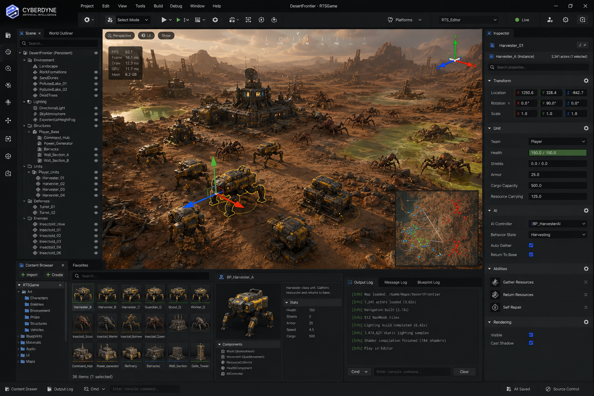
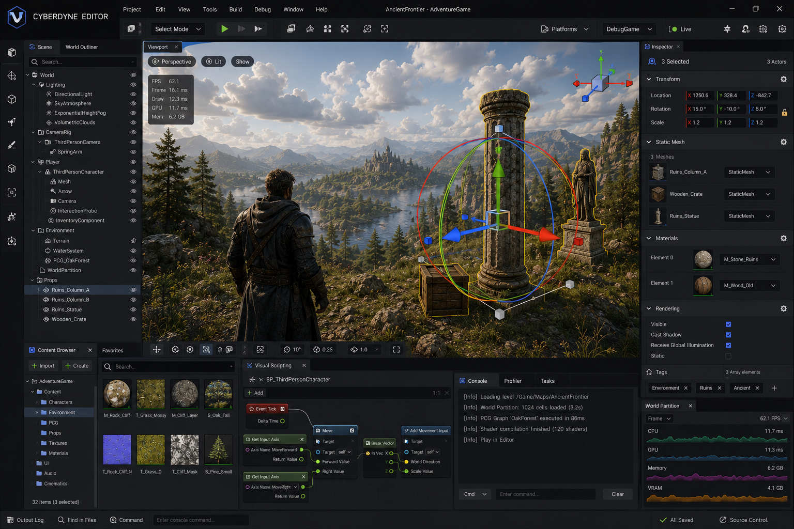

# Cyberdyne Editor — Visual Design Language

The illustrated reference for how the editor looks, what its colours mean, and what it calls things.

> This document is a **view** of the [`editor-visual-language`](../../openspec/specs/editor-visual-language/spec.md)
> capability, which is authoritative. Where the two disagree, the specification wins and this
> document is corrected.
>
> Three capabilities divide the editor's front end: `editor-ui-ux` owns **interaction**,
> `editor-viewport-and-gizmos` owns **behaviour**, and this one owns **appearance and vocabulary**.

---

## The one-sentence version

> **A high-end game creation environment where the sophistication is in the engine, not in the
> amount of interface the user has to fight.**

Which gives every future decision a usable test: **adding capability does not automatically justify
adding permanently visible interface.**

---

## The ten principles

1. **Viewport first** — the game world is the subject of the interface, not a panel within it.
2. **Dark and neutral** — the chrome disappears behind the content.
3. **Dense but calm** — professional information density without visual noise.
4. **Progressive complexity** — simple by default, complete when expanded.
5. **Context aware** — the tools shown follow what is selected.
6. **Spatially stable** — context changes content, never position.
7. **Search everywhere** — find capability instead of memorising where it was put.
8. **Semantic colour** — colour means something or it is not used.
9. **Non-modal** — editing stays fluid; modals are for decisions and destruction.
10. **Cyberdyne identity** — recognisably its own product, not a reskin of another engine.

---

## Reference: the strategy scene



*`DesertFrontier — RTSGame`. A post-apocalyptic desert with a player base, harvester units,
insectoid enemies, polluted lakes and a minimap overlay.*

What this reference establishes, region by region:

| Region | What to read from it |
|---|---|
| **Header** | The Cyberdyne mark at far left, application menus, project and scene name centred, then platform, configuration, `● Live`, account and settings. One row. The mark identifies; it does not dominate. |
| **Toolbar** | Selection mode, play controls, build, transform tools, snapping, viewport options — icons with tooltips, text only where an icon would be ambiguous. Generous hit areas despite the compact row. |
| **Left, upper** | The outliner: about thirty rows visible without crowding, permanent search at the top, per-row visibility toggles at the right edge. Dense enough for thousands of entities, scannable at a glance. |
| **Centre** | The viewport takes roughly two thirds of the window. `Perspective`, `Lit`, `Show` float **in** it. The performance overlay sits top-left, small and unobtrusive. The minimap overlays bottom-right. |
| **Selection** | The harvester carries a thin gold outline. It reads instantly against sunlit sand, and the material underneath is still judgeable. |
| **Gizmo** | Translation: three large arrows, X red, Y green, Z blue, handles sized to grab without precision. |
| **Orientation widget** | Top-right, three axes, nothing else — visually much quieter than the transform gizmo a few hundred pixels away. The two are never confusable. |
| **Left, lower** | Content browser with rendered thumbnails. Every harvester, insectoid and structure is distinguishable *by its thumbnail* — this is what makes a large unit library navigable. |
| **Centre, lower** | Asset preview beside the browser: a large render, stats, and the component list, without opening a separate editor. |
| **Right, lower** | Console with tabs — output, messages, graph log — and a command input at its foot. |
| **Right** | Inspector: Transform, Unit, AI, Abilities, Rendering all visible at once, sections collapsible, headers subtle. |
| **Footer** | Content drawer, output log, command input, and `All Saved` / source-control state. Ambient, interrupting nothing. |

---

## Reference: the adventure scene



*`AncientFrontier — AdventureGame`. A third-person character above a lake valley, with ruins,
procedural forest, volumetric clouds and a distant castle.*

What this reference adds beyond the first:

| Region | What to read from it |
|---|---|
| **Multi-selection** | The inspector states `3 Selected` / `3 Actors`, then lists the three meshes by name and type. The count and composition are explicit — never an arbitrary member's values presented as the selection's. |
| **Universal gizmo** | Translation arrows, rotation rings and scale boxes at once, on a slender column. This is close to the density at which a universal gizmo stops being individually acquirable — the specification permits the mode and requires it to stay readable or degrade. |
| **Vector fields** | `Location`, `Rotation`, `Scale` with X red, Y green, Z blue — the same three hues as the handles in the viewport. One axis language across the whole editor. |
| **Materials section** | Rendered material thumbnails inline in the inspector, not swatches or file icons. |
| **Tags** | Chips with removal affordances, plus an add control. |
| **Centre, lower** | The visual scripting graph docked in the workspace rather than in its own window — dark surface, restrained semantic node colouring, connections traceable at working zoom. |
| **Content browser** | Textures show their own content, materials show a representative sphere, meshes show renders. |
| **Left rail** | A vertical tool rail — a second, quieter way to reach mode-level tools without spending toolbar width. |

---

## The mark


The normative artwork is [`images/cyberdyne-mark.png`](images/cyberdyne-mark.png). It appears in the
upper-left application area, adjacent to the menus.

It may be cropped or simplified for a compact header. Its geometry is **not** redesigned for the
editor, and the editor does **not** get a separate engine emblem in the manner of competing engines.

---

## Visual hierarchy

```text
Highest visual weight
        │
        ▼
┌────────────────────────────────┐
│         GAME / SCENE           │   rich colour, full luminance range
└────────────────────────────────┘
        Selected object              gold outline, thin, no bloom
        Active controls              blue, only while active
        Important state              green live · orange warn · red error
        Editor panels                charcoal, near-black
        Secondary metadata           muted grey
```

If a panel presents a larger area of saturated colour than the content does, the hierarchy has
inverted and something is wrong.

---

## Semantic colour

| Family | Meaning |
|---|---|
| Neutral grey | Ordinary interface surface |
| White / light grey | Primary text |
| Muted grey | Secondary and derived information |
| Blue | Active, focused, informational |
| Green | Success, live, valid |
| Yellow / gold | Selection, attention |
| Orange | Warning |
| Red | Error, destructive consequence |

A hue is not reused for an unrelated meaning on one surface, and colour is never introduced for
variety.

**Colour is never the sole encoding.** That rule comes from `editor-ui-ux` and it governs here too:
every meaning above is also carried by shape, icon, weight or text, so the editor still works in a
colour-blind-safe palette.

### The axis language

```text
X = red        Y = green        Z = blue
```

This holds in transform gizmos, rotation rings, scale handles, the orientation widget, inspector
vector fields, coordinate readouts and debug visualisation. A value in the inspector and a handle in
the viewport are recognisably the same axis. It is not user-remappable — it is the one colour
convention shared with every other tool in the industry.

---

## Default workspace

```text
┌──────────────────────────────────────────────────────────────────────────────┐
│ ◆ CYBERDYNE  Project Edit View Tools Build Debug Window Help                 │
│                       DesertFrontier — RTSGame    Platforms  Config  ● Live  │
├──────────────────────────────────────────────────────────────────────────────┤
│ ▣ Select  │ ▶ ‖ ▮ │ Build │ ✥ ↻ ⤢ │ snap │ viewport                          │
├───────────┬───────────────────────────────────────────────┬──────────────────┤
│ Scene ·   │ ⌜Perspective  Lit  Show⌝            ⌜ Y       │  Inspector       │
│ Outliner  │                                       │ Z     │                  │
│           │                                       ●──X⌟   │  Transform       │
│ 🔍 search │              3D VIEWPORT                      │  Static Mesh     │
│           │                                               │  Materials       │
│           │         (the largest single region)           │  Rendering       │
│           │                                               │  Gameplay        │
│           │  ⌞FPS 62.1  16.1 ms  6.2 GB⌟        ⌞minimap⌟ │  Tags            │
├───────────┼──────────────────────────────┬────────────────┤                  │
│ Content   │  Visual Scripting /          │ Console        │                  │
│ Browser   │  active specialised editor   │ Profiler       │                  │
│           │                              │ Tasks          │                  │
├───────────┴──────────────────────────────┴────────────────┴──────────────────┤
│ Output Log   Find in Files   Command ▸            ✓ All Saved   Source Control│
└──────────────────────────────────────────────────────────────────────────────┘
```

Everything here is rearrangeable. What is specified is the **default**, because the default is what
a new user learns and what every screenshot teaches.

**Content adapts; position does not.** Selecting terrain, a character or a unit changes which
sections and tools a panel offers. It never moves the hierarchy, the inspector, the browser or the
viewport, and never docks, undocks, opens or closes a panel the user did not ask for. Muscle memory
is the thing that makes a professional tool fast, and contextual panel movement destroys it.

---

## Gizmo language

Distinguishable by **shape**, not only by colour — the active mode must be identifiable from the
gizmo alone, with the toolbar cropped out of view.

```text
   TRANSLATE              ROTATE                   SCALE

        ▲ Y            ╭──────────────╮               ■
        │          ╭───┼──────────────┼───╮           │
        │         │    │              │    │          │
        ■────► X   │   │    OBJECT    │    │   ■──────□──────■
       ╱           ╰───┼──────────────┼───╯         ╱
      ▼                ╰──────────────╯            ■
     Z
    arrows              axis-coloured arcs        box handles
    + plane handles     hover emphasises ring     + centre = uniform
```

A **universal** mode combining all three is permitted and constrained: it stays individually
acquirable or it degrades to a simpler presentation. Explicit Move / Rotate / Scale modes are always
available.

### The orientation widget is not a manipulator

```text
        Y
        ▲
        │
        ●──────► X          three axes · no rings · no boxes · no arrows
       ╱                    quieter than the transform gizmo
      Z                     click an axis to align the camera
```

Its purpose is camera and world orientation. Making it resemble a transform gizmo costs the user
every time they glance at it.

---

## Typography, icons, density, surfaces

**Type.** One modern sans family for the interface; monospace only for code, console output and
identifiers where character alignment carries meaning. Few sizes. Primary and secondary text
separated by weight and luminance rather than by size. Subtle headings. **Tabular figures**, so
columns of numbers align.

**Icons.** One system: geometric, monochromatic by default, one stroke weight, legible at compact
density. Colour enters only when it carries meaning from the vocabulary above. No reproduction of
Unity's, Unreal's, Godot's, Blender's or the host OS's recognisable symbols — a borrowed icon set
makes the product read as a derivative of whatever it borrowed from.

**Density.** More compact than consumer software, less cramped than legacy engineering tools.

```text
   too sparse                Cyberdyne                    too dense

   [ Property ]              Health   150 / 150           Hlth150Arm25Spd4.5
                             Armor     25
                             Speed      4.5
```

**Surfaces.** Panels are separated by small luminance steps, spacing and subtle separators — not by
borders, cards or shadows. Subtle corner rounding. No gradients, no glass, no heavy drop shadows, no
nested cards. This is a tool, not a dashboard.

---

## Vocabulary

Interface text uses **the engine's own words**. Where a competing engine's term is widely understood,
it is kept as a **search alias** — type what you know, find the feature, see it labelled with the
engine's term.

| Use | Not |
|---|---|
| Node, entity | Actor, GameObject |
| Mesh, mesh instance | Static Mesh Actor |
| Graph, script graph | Blueprint |
| Content browser | Content Drawer |
| Prefab | Blueprint class |
| World, scene, cell | Level, Persistent Level |

Vocabulary is identity. An editor that calls things by another engine's names has told the user what
it is a copy of before they have evaluated a single feature.

---

## What the mockups get wrong

The references are concept art. They are normative about **visual language** and not about detail,
and four things in them should not be copied:

1. **Unreal's vocabulary throughout** — `2,341 actors`, `3 Actors`, `Static Mesh`, `BP_Harvester_A`,
   `Blueprint Log`, `Content Drawer`. Use the table above. This is the single most important
   correction, because terminology spreads into every panel, document and tutorial and then into
   users' habits.
2. **The panel labelled "World Partition"** in the adventure reference contains CPU, GPU, memory and
   VRAM graphs. That is a profiler. World partition is a streaming capability with entirely
   different concerns. The ambient overlay answers *is this frame affordable*; the profiler panel
   answers *why*.
3. **Inconsistent branding** between the two references — one uses the Cyberdyne mark, the other a
   different symbol beside the words "CYBERDYNE EDITOR". The mark is normative.
4. **The universal gizmo on a slender column** in the adventure reference is at the edge of
   readability. Permitted, constrained: readable or it degrades.

## What a reference image is — and is not

Both scenes show volumetric clouds, procedural forests, physical skies with aerial perspective,
water with shoreline foam, and thousands of instanced units. **None of that exists before M7–M10.**

A reference states **visual language** — hierarchy, density, colour, chrome, composition — not
feature completeness. Every constraint in this document is implementable at **M5**, when the editor
is actually built, against whatever the renderer can produce at that point. A grey box on a flat
ground plane still gets the charcoal chrome, the gold selection outline, the axis colours, the
overlaid viewport controls and the correct vocabulary.

Reading the imagery as a completion target would make the design language depend on the last third
of the roadmap and stop it guiding anything at the moment it is most needed.

---

## On the roadmap

`editor-visual-language` reaches **Working at M5** with the rest of the editor and **Complete at
M11**. See [the roadmap](../ROADMAP.md).

Three rules bind earlier than the capability does — cheap now, expensive to retrofit:

| Rule | Binds from | Why it cannot wait |
|---|---|---|
| Engine vocabulary | The first label drawn | Terminology spreads into every panel, doc, tutorial and habit |
| Semantic colour and the axis mapping | The first coloured element | A second meaning for a hue is discovered only when both appear on one screen |
| A disclosure decision accompanies new properties | The first inspector | Default views accrete; nothing is ever removed from one |

## See also

- [`editor-visual-language`](../../openspec/specs/editor-visual-language/spec.md) — the authoritative contract
- [`editor-ui-ux`](../../openspec/specs/editor-ui-ux/spec.md) — interaction
- [`editor-viewport-and-gizmos`](../../openspec/specs/editor-viewport-and-gizmos/spec.md) — viewport behaviour
- [`editor-rust-application`](../../openspec/specs/editor-rust-application/spec.md) — why the toolkit is an implementation detail
- [The roadmap](../ROADMAP.md) — when the editor is built
