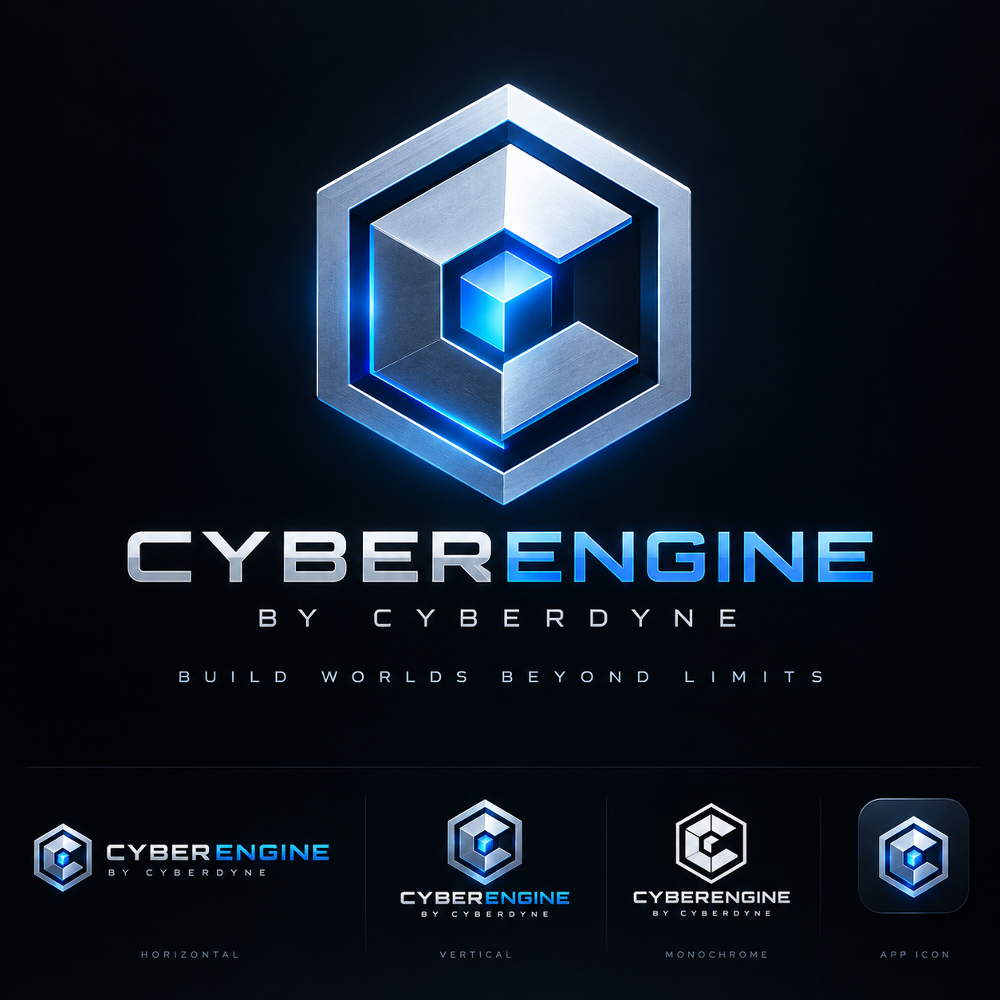
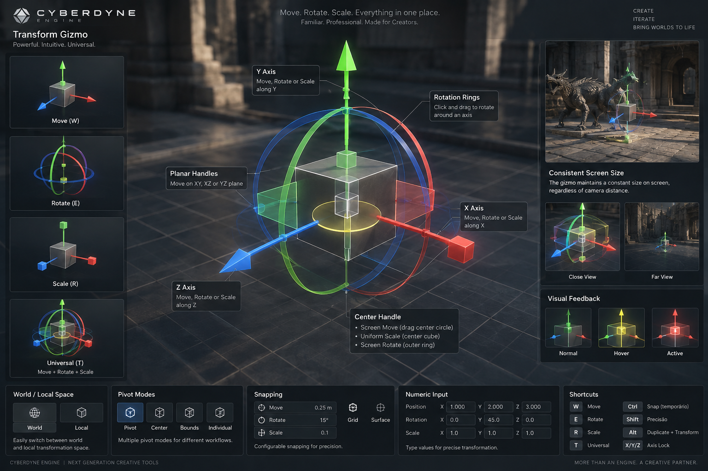
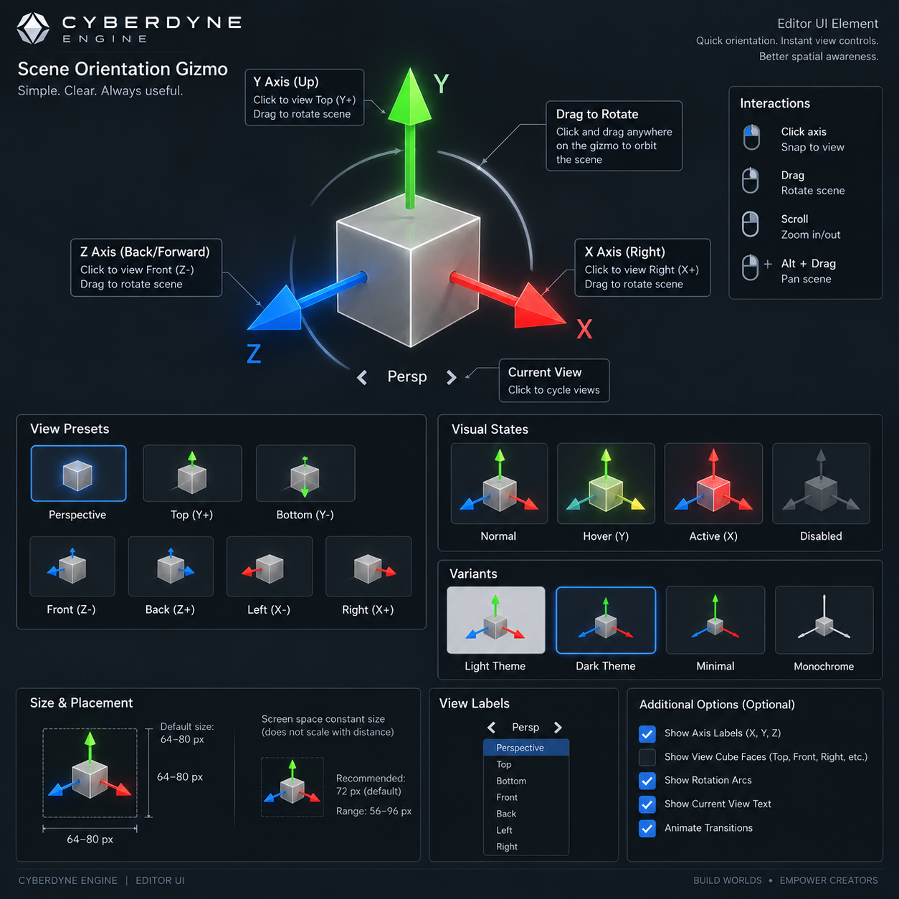
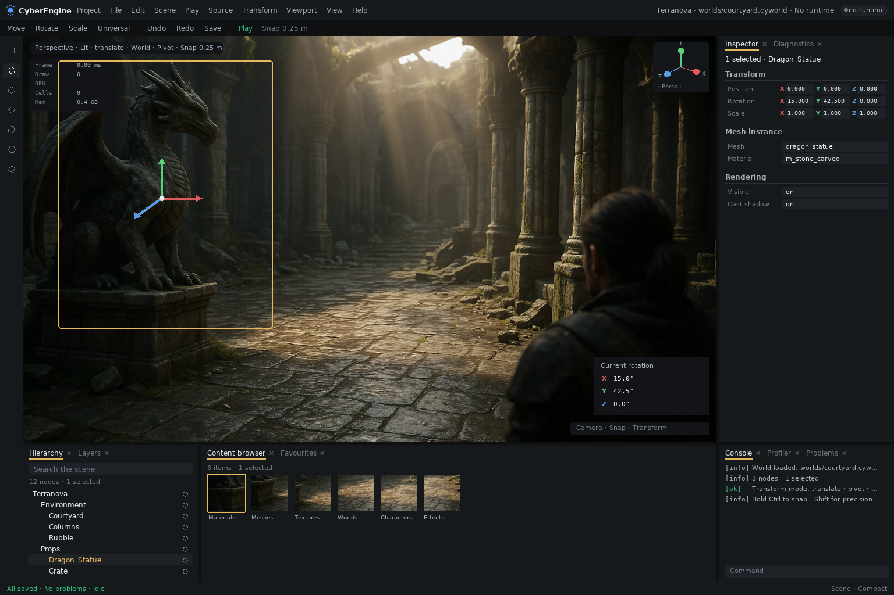

# CyberEngine — Editor Visual Design Language

The illustrated reference for how the editor looks, what its colours mean, and what it calls things.

> This document is a **view** of the [`editor-visual-language`](../../openspec/specs/editor-visual-language/spec.md)
> capability, which is authoritative. Where the two disagree, the specification wins and this
> document is corrected.
>
> Three capabilities divide the editor's front end: `editor-ui-ux` owns **interaction**,
> `editor-viewport-and-gizmos` owns **behaviour**, and this one owns **appearance and vocabulary**.

---

## The one-sentence version

> **A high-end game creation environment where the sophistication is in the engine, not in the
> amount of interface the user has to fight.**

Which gives every future decision a usable test: **adding capability does not automatically justify
adding permanently visible interface.**

---

## The ten principles

1. **Viewport first** — the game world is the subject of the interface, not a panel within it.
2. **Dark and neutral** — the chrome disappears behind the content.
3. **Dense but calm** — professional information density without visual noise.
4. **Progressive complexity** — simple by default, complete when expanded.
5. **Context aware** — the tools shown follow what is selected.
6. **Spatially stable** — context changes content, never position.
7. **Search everywhere** — find capability instead of memorising where it was put.
8. **Semantic colour** — colour means something or it is not used.
9. **Non-modal** — editing stays fluid; modals are for decisions and destruction.
10. **Its own identity** — recognisably CyberEngine, not a reskin of another engine.

---

## Reference: the strategy scene


*`DesertFrontier · worlds/basin.cyworld · Live runtime`. A post-apocalyptic desert with a player
base, harvester units, insectoid enemies, polluted lakes and a minimap overlay.*

**Replaced at M6, and here is what changed.** M5.5 drove the built editor through synthesised input
and compared it against the previous version of this image row by row
([`samples/05b-editor-window/README.md`](../../samples/05b-editor-window/README.md), task 4.4). Three
rows came back saying the REFERENCE was wrong, and this is the corrected one — see
[What the references got wrong](#what-the-references-got-wrong) below for all three, and
[How these images are made](#how-these-images-are-made) for the script that draws them.

What this reference establishes, region by region:

| Region | What to read from it |
|---|---|
| **Header** | The CyberEngine mark at far left — **the product, not the publisher** — then the application menus; then, right-aligned, the project, the open document and **whether a runtime is attached**, with a live pill. One row. The mark identifies; it does not dominate. |
| **Toolbar** | Transform tools, undo/redo/save, play and the snap increment. The built editor's row, and thinner than the previous reference's: play, snapping and the viewport options are registered commands reachable from the menus and the palette, and only what is used constantly earns permanent width. |
| **Left, upper** | The hierarchy: about thirty rows visible without crowding, permanent search at the top, per-row visibility toggles at the right edge. Dense enough for thousands of nodes, scannable at a glance. |
| **Centre** | The viewport takes roughly two thirds of the window. The view state — `Perspective · Lit · translate · World · Pivot · Snap` — floats **in** it. The performance overlay sits **top-left**, small and unobtrusive. The minimap overlays bottom-right. |
| **Selection** | The harvester carries a thin gold outline. It reads instantly against sunlit sand, it does not glow, and the material underneath is still judgeable. |
| **Gizmo** | Translation: three arrows, X red, Y green, Z blue, handles sized to grab without precision. |
| **Orientation widget** | Top-right, three axes, nothing else — visually much quieter than the transform gizmo a few hundred pixels away. The two are never confusable. |
| **Left, lower** | Content browser with **rendered thumbnails**. Every harvester, insectoid and structure is distinguishable *by its thumbnail* — this is what makes a large content library navigable, and it is why a grid of file icons is not a content browser. |
| **Right** | Inspector: Transform, Unit, Behaviour, Mesh instance and Rendering visible at once, sections collapsible, headers subtle, vector fields carrying the same X red / Y green / Z blue as the handles in the viewport. |
| **Right, lower** | **Console · Profiler · Problems**, and a command input at its foot. Three tabs, all three the engine's own words. |
| **Footer** | Saved state, problem count and runtime state. Ambient, interrupting nothing. |

---

## Reference: the adventure scene


*`AncientFrontier · worlds/valley.cyworld · Live runtime`. A third-person character above a lake
valley, with ruins, procedural forest, volumetric clouds and a distant castle.*

What this reference adds beyond the first:

| Region | What to read from it |
|---|---|
| **Multi-selection** | The inspector states `3 selected` and the kind, then lists the three meshes by name. The count and composition are explicit — never an arbitrary member's values presented as the selection's. |
| **Universal gizmo** | Translation arrows, rotation rings and scale boxes at once. This is close to the density at which a universal gizmo stops being individually acquirable — the specification permits the mode and requires it to stay readable or degrade. |
| **Vector fields** | `Position`, `Rotation`, `Scale` with X red, Y green, Z blue — the same three hues as the handles in the viewport. One axis language across the whole editor. |
| **Materials section** | Material slots named in the inspector rather than presented as file paths. |
| **Centre, lower** | The **script graph** docked in the workspace rather than in a window of its own — dark surface, restrained semantic node colouring, connections traceable at working zoom. It is a *graph*, and the panel says so; the previous reference called this region a `Blueprint Log`. |
| **Left rail** | A vertical tool rail — a second, quieter way to reach mode-level tools without spending toolbar width. |
| **Console** | The same three tabs as the strategy scene, and the lines in it are the streaming and paging the engine actually reports: cells resident, cells prefetching, the virtual texture's mip tail. |

---

## The identity



Normative: [`images/cyberengine-logo.png`](images/cyberengine-logo.png). It supersedes the bare
`cyberdyne-mark.png` this document previously named, because it is a complete system rather than a
single symbol — **horizontal, vertical, monochrome and app icon**, each to be used where it fits
rather than one scaled to serve all.

**The product is CyberEngine; the publisher is Cyberdyne.** The lockup says so, and interface text
follows it: the application is CyberEngine, and Cyberdyne is named where a publisher is named. The
repository directory keeps its historical name — a filesystem artefact, not a product name.

The horizontal lockup sits in the editor header. It identifies the product and occupies the header
and no more.

**One thing that does not travel.** The mark is rendered with metallic gradients and a blue emissive
core. Those belong to the logo, not to the interface. The chrome around it stays charcoal and flat,
per the surface system — a header that picks up the logo's gradients has misread it.

---

## Visual hierarchy

```text
Highest visual weight
        │
        ▼
┌────────────────────────────────┐
│         GAME / SCENE           │   rich colour, full luminance range
└────────────────────────────────┘
        Selected object              gold outline, thin, no bloom
        Active controls              blue, only while active
        Important state              green live · orange warn · red error
        Editor panels                charcoal, near-black
        Secondary metadata           muted grey
```

If a panel presents a larger area of saturated colour than the content does, the hierarchy has
inverted and something is wrong.

---

## Semantic colour

| Family | Meaning |
|---|---|
| Neutral grey | Ordinary interface surface |
| White / light grey | Primary text |
| Muted grey | Secondary and derived information |
| Blue | Active, focused, informational |
| Green | Success, live, valid |
| Yellow / gold | Selection, attention |
| Orange | Warning |
| Red | Error, destructive consequence |

A hue is not reused for an unrelated meaning on one surface, and colour is never introduced for
variety.

**Colour is never the sole encoding.** That rule comes from `editor-ui-ux` and it governs here too:
every meaning above is also carried by shape, icon, weight or text, so the editor still works in a
colour-blind-safe palette.

### The axis language

```text
X = red        Y = green        Z = blue
```

This holds in transform gizmos, rotation rings, scale handles, the orientation widget, inspector
vector fields, coordinate readouts and debug visualisation. A value in the inspector and a handle in
the viewport are recognisably the same axis. It is not user-remappable — it is the one colour
convention shared with every other tool in the industry.

---

## Default workspace

```text
┌──────────────────────────────────────────────────────────────────────────────┐
│ ◆ CyberEngine  Project File Edit Scene Play Source Transform Viewport View   │
│                DesertFrontier · worlds/basin.cyworld · Live runtime   ● live │
├──────────────────────────────────────────────────────────────────────────────┤
│ Move  Rotate  Scale  Universal │ Undo  Redo  Save │ Play │ Snap 0.25 m       │
├───────────┬───────────────────────────────────────────────┬──────────────────┤
│ Hierarchy │ ⌜Perspective · Lit · translate · World · Pivot⌝│  Inspector      │
│           │ ⌞Frame  Draw  GPU  Cells  Mem⌟        ⌜ Y     │                  │
│ 🔍 search │                                       │ Z     │  Transform       │
│           │              3D VIEWPORT              ●──X⌟   │  Unit            │
│           │                                               │  Behaviour       │
│           │         (the largest single region)           │  Mesh instance   │
│           │                                     ⌞minimap⌟ │  Rendering       │
├───────────┤                                               ├──────────────────┤
│ Content   ├───────────────────────────────────────────────┤ Console          │
│ browser   │  Script graph / active specialised editor     │ Profiler         │
│           │                                               │ Problems         │
├───────────┴───────────────────────────────────────────────┴──────────────────┤
│ All saved · No problems · Live                                Scene · Compact│
└──────────────────────────────────────────────────────────────────────────────┘
```

Everything here is rearrangeable. What is specified is the **default**, because the default is what
a new user learns and what every screenshot teaches.

**Content adapts; position does not.** Selecting terrain, a character or a unit changes which
sections and tools a panel offers. It never moves the hierarchy, the inspector, the browser or the
viewport, and never docks, undocks, opens or closes a panel the user did not ask for. Muscle memory
is the thing that makes a professional tool fast, and contextual panel movement destroys it.

---

## Gizmo language

Distinguishable by **shape**, not only by colour — the active mode must be identifiable from the
gizmo alone, with the toolbar cropped out of view.

```text
   TRANSLATE              ROTATE                   SCALE

        ▲ Y            ╭──────────────╮               ■
        │          ╭───┼──────────────┼───╮           │
        │         │    │              │    │          │
        ■────► X   │   │    OBJECT    │    │   ■──────□──────■
       ╱           ╰───┼──────────────┼───╯         ╱
      ▼                ╰──────────────╯            ■
     Z
    arrows              axis-coloured arcs        box handles
    + plane handles     hover emphasises ring     + centre = uniform
```

A **universal** mode combining all three is permitted and constrained: it stays individually
acquirable or it degrades to a simpler presentation. Explicit Move / Rotate / Scale modes are always
available.

### The reference



Normative for the gizmo: four modes on `W`/`E`/`R`/`T`, planar handles at the axis pairs, rotation
rings plus an outer screen-space ring, a centre cube for uniform scale, world and local space, four
pivot modes, snapping with `Ctrl`/`Shift`/`Alt` modifiers and `X`/`Y`/`Z` axis lock, per-axis numeric
entry, **constant screen size regardless of camera distance**, and three states — normal, hover,
active — with the hovered handle emphasised before it is pressed.

**One thing in it is not followed literally.** The reference tints the active state red, and red
already means both the X axis and error. The active state is instead a luminance and saturation lift
on the handle being dragged, so a dragged X arrow is a brighter red and a dragged Y arrow a brighter
green. The hue identifies the axis and nothing else; red means error everywhere in the product.

### The orientation widget is not a manipulator



Normative. Click an axis to snap the camera to that view; drag anywhere to orbit; scroll to zoom;
modifier-drag to pan. Seven presets — perspective, top, bottom, front, back, left, right — and the
current view shown as cycleable text. **Constant screen size, 56–96 px with 72 the default.** Normal,
hover, active and disabled states, legible in both themes.

**A correction to this document.** An earlier draft said the widget "SHALL NOT display… translation
arrows." That was wrong, and the reference is right. What makes a manipulator is **rings, planar
handles and scale boxes** — not arrows. The transform gizmo is identified by its rings and planes,
and the widget carries none of them, so arrows cost nothing. The requirement now separates the two
by form, size and position together, which is what the editor scene view below actually demonstrates.

Dragging the widget orbits the **camera**, never the selection, and produces no transaction. That is
what the widget is for, not an exception to it.

### The two gizmos, in one viewport



This is the case the requirement exists to protect: both gizmos visible at once, and unmistakable —
the transform gizmo large, on the selection, with arrowheads on three coloured axes; the orientation
widget small, cornered, thin axes with dots and nothing else. No rings, no boxes, no arrowheads on
the widget: they are separated by SHAPE and not only by size, which is what
`the_two_gizmos_are_unmistakable.rs` holds the built editor to.

It also shows a **third layout variant**. The strategy and adventure references put the content
browser bottom-left with the hierarchy above it; this one gives the viewport the full width and
docks the hierarchy bottom-left and the content browser bottom-centre, with the inspector down the
right and a rotation read-out floating in the viewport. The composition requirement fixes *regions*,
not pixel positions, and all three satisfy it.

**The default is decided, at M5.5, and it is the strategy one.** `editor-rts-desertfrontier.png`:
the hierarchy upper-left with the content browser beneath it, the viewport centre with its chrome
overlaid, the specialised editor below the viewport, the inspector down the right, and the
diagnostics tabs beneath the inspector. `cy_editor_interface::docking::Layout::scene_editing` builds
it, and it derives its proportions from `cy_editor_visual::chrome::Composition` rather than restating
them, so this document and the product cannot drift.

Why that one, in the order the reasons decided it:

1. It is what `Composition::default()` already encodes and what the **Default workspace** diagram
   above already draws. Choosing either of the others would have made this document disagree with
   the product on the day the editor opened.
2. The adventure reference is the same arrangement plus a vertical tool rail and a graph docked
   below the viewport. The rail spends permanent width on a second route to mode-level tools before
   there are enough modes to need it, and the graph is M8 — so shipping it means shipping two
   regions that are empty.
3. The editor scene view puts the content browser in the **centre-lower** region. That region is
   where a specialised editor goes — script graph, animation, sequencer — so a browser living there
   is displaced every time one opens. A panel that moves because of context is the one thing
   *"content adapts; position does not"* exists to prevent.

The other two remain normative about visual language, which is what a reference image is for. They
are not competing defaults.


```text
        Y
        ▲
        │
        ●──────► X          three axes · no rings · no boxes · no arrows
       ╱                    quieter than the transform gizmo
      Z                     click an axis to align the camera
```

Its purpose is camera and world orientation. Making it resemble a transform gizmo costs the user
every time they glance at it.

---

## Typography, icons, density, surfaces

**Type.** One modern sans family for the interface; monospace only for code, console output and
identifiers where character alignment carries meaning. Few sizes. Primary and secondary text
separated by weight and luminance rather than by size. Subtle headings. **Tabular figures**, so
columns of numbers align.

**Icons.** One system: geometric, monochromatic by default, one stroke weight, legible at compact
density. Colour enters only when it carries meaning from the vocabulary above. No reproduction of
Unity's, Unreal's, Godot's, Blender's or the host OS's recognisable symbols — a borrowed icon set
makes the product read as a derivative of whatever it borrowed from.

**Density.** More compact than consumer software, less cramped than legacy engineering tools.

```text
   too sparse                Cyberdyne                    too dense

   [ Property ]              Health   150 / 150           Hlth150Arm25Spd4.5
                             Armor     25
                             Speed      4.5
```

**Surfaces.** Panels are separated by small luminance steps, spacing and subtle separators — not by
borders, cards or shadows. Subtle corner rounding. No gradients, no glass, no heavy drop shadows, no
nested cards. This is a tool, not a dashboard.

---

## Vocabulary

Interface text uses **the engine's own words**. Where a competing engine's term is widely understood,
it is kept as a **search alias** — type what you know, find the feature, see it labelled with the
engine's term.

| Use | Not |
|---|---|
| Node, entity | Actor, GameObject |
| Mesh, mesh instance | Static Mesh Actor |
| Graph, script graph | Blueprint |
| Content browser | Content Drawer |
| Prefab | Blueprint class |
| World, scene, cell | Level, Persistent Level |

Vocabulary is identity. An editor that calls things by another engine's names has told the user what
it is a copy of before they have evaluated a single feature.

---

## What the references got wrong

The references are concept art, and they are normative about **visual language** rather than about
detail. Three faults in the previous set were not detail: they were the language itself, and M5.5
found all three by building the editor and looking at the two side by side. **All three are
corrected in the images above**, and they are recorded here rather than deleted, because a
correction nobody can see is one the next reference will repeat.

| The fault | What it said | What the images say now |
|---|---|---|
| **1. The publisher branded as the product** | `CYBERDYNE · ARTIFICIAL INTELLIGENCE`, `CYBERDYNE EDITOR`, `CYBERDYNE ENGINE` in the three headers | **CyberEngine**, small, far left. The product is CyberEngine and Cyberdyne is the publisher — the identity section above says so, and the built editor's header already did it correctly while the references did not. |
| **2. Another engine's vocabulary in the console** | A `Blueprint Log` tab, `BP_` prefixes, `2,341 actors`, `Static Mesh` | **Console · Profiler · Problems**, nodes rather than actors, mesh instances rather than static meshes, a *script graph* rather than a blueprint. The vocabulary table above is the list, and `cy-editor-interface`'s own gate rejects a competing engine's product words in a registered command's prose — a reference image was the last place in this project still using them. |
| **3. A header that said nothing about the runtime** | `DesertFrontier - RTSGame` and nothing more | The project, the open document, **and whether a runtime is attached**. From M5.5 the editor is a separate process that survives its runtime being killed, so whether one is attached is load-bearing and belongs where the eye already goes. |

Two things in the references are still deliberately **not** the built editor, and both are the
reference winning rather than the implementation:

* **The performance overlay sits top-left.** The region table above says so and the images do it;
  `cy-editor-shell` puts it bottom-left. That is an open correction against the editor, not against
  this document.
* **Per-row visibility toggles in the hierarchy.** `NodeState` has no visibility field, so the built
  editor draws none. The reference keeps them, because dropping them would quietly turn a gap into a
  decision.

Two more corrections from the older set, kept here because the reasoning outlives the images:

1. **A panel labelled "World Partition" holding CPU, GPU, memory and VRAM graphs.** That was a
   profiler wearing a streaming capability's name, and world partition has entirely different
   concerns — the ambient overlay answers *is this frame affordable*, a profiler panel answers
   *why*. The new images carry no such panel, and the console lines in them are what the engine
   actually reports at M6: cells resident, cells prefetching, the virtual texture's mip tail.
2. **The universal gizmo on a slender column** is at the edge of readability. It is still there, in
   the adventure reference, and deliberately: the specification permits the mode and requires it to
   stay readable or degrade, and a reference that quietly dropped the hard case would stop stating
   the constraint.

## How these images are made

The three references are **drawn**, by
[`references/render_references.py`](references/render_references.py), over three plates that hold the
viewport contents and nothing else — no interface, no text, no mark.

```
python3 docs/design/references/render_references.py            # all three
python3 docs/design/references/render_references.py --only rts
```

That split is the point rather than a convenience. **Every string in the chrome comes from a table in
that script**, so a reference cannot drift back into another engine's words without somebody editing
the table; and an image nobody can regenerate is an image that decays, which is the argument
`editor-visual-language` makes when it requires a stale reference to be *replaced rather than left to
decay*. The plates stand for what a renderer produces, which is exactly what a reference image is
**not** normative about — see the next section.

## What was actually built

Two committed screenshots, both produced by the artefacts that drove the editor rather than taken by
hand, so both are refreshed by re-running them:

| Image | What it is |
|---|---|
| [`editor-window-m5b.png`](images/editor-window-m5b.png) | The editor's window at M5.5, opened on a project and operated through synthesised X11 input, compositing another process's rendered image in its viewport. `just run-editor-window --shot <path>` refreshes it. |
| [`agent-authoring-m5b.png`](images/agent-authoring-m5b.png) | The same editor at M5.5 with no window at all: an agent authoring over the Model Context Protocol. What there is to photograph is the conversation, so the transcript is rendered in this palette. `just run-agent-authoring --shot <path>` refreshes it. |

Read them against the references above rather than instead of them: the references state the
language, and these two state how much of it is built.

## What a reference image is — and is not

The three scenes show volumetric clouds, procedural forests, physical skies with aerial perspective,
water with shoreline foam, and thousands of instanced units. **None of that exists before M7–M10**,
and none of it is drawn by this project: the plates behind the chrome stand for what a renderer
produces, and everything over them is drawn from a table.

A reference states **visual language** — hierarchy, density, colour, chrome, composition — not
feature completeness. Every constraint in this document is implementable at **M5**, when the editor
is actually built, against whatever the renderer can produce at that point. A grey box on a flat
ground plane still gets the charcoal chrome, the gold selection outline, the axis colours, the
overlaid viewport controls and the correct vocabulary.

Reading the imagery as a completion target would make the design language depend on the last third
of the roadmap and stop it guiding anything at the moment it is most needed.

---

## On the roadmap

`editor-visual-language` reaches **Working at M5** with the rest of the editor and **Complete at
M11**. See [the roadmap](../ROADMAP.md).

Three rules bind earlier than the capability does — cheap now, expensive to retrofit:

| Rule | Binds from | Why it cannot wait |
|---|---|---|
| Engine vocabulary | The first label drawn | Terminology spreads into every panel, doc, tutorial and habit |
| Semantic colour and the axis mapping | The first coloured element | A second meaning for a hue is discovered only when both appear on one screen |
| A disclosure decision accompanies new properties | The first inspector | Default views accrete; nothing is ever removed from one |

## See also

- [`editor-visual-language`](../../openspec/specs/editor-visual-language/spec.md) — the authoritative contract
- [`editor-ui-ux`](../../openspec/specs/editor-ui-ux/spec.md) — interaction
- [`editor-viewport-and-gizmos`](../../openspec/specs/editor-viewport-and-gizmos/spec.md) — viewport behaviour
- [`editor-rust-application`](../../openspec/specs/editor-rust-application/spec.md) — why the toolkit is an implementation detail
- [The roadmap](../ROADMAP.md) — when the editor is built
