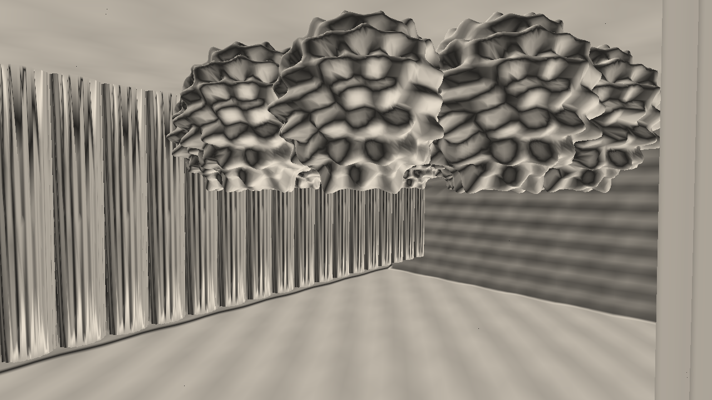
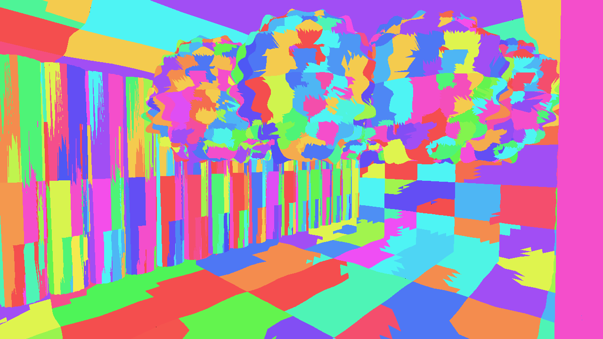
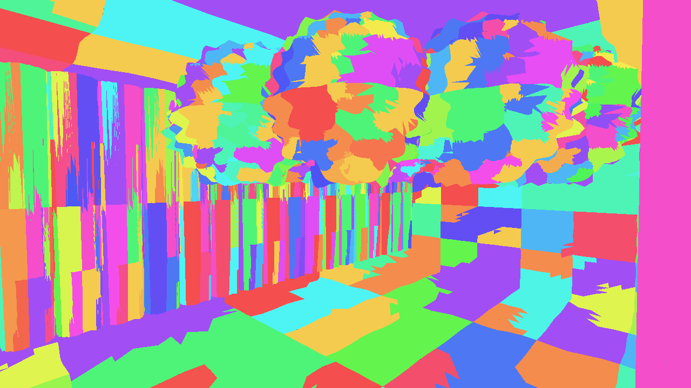
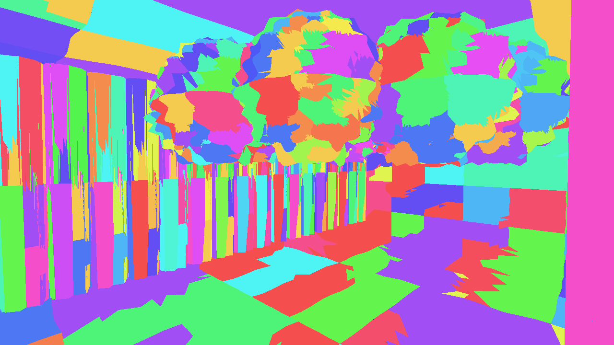
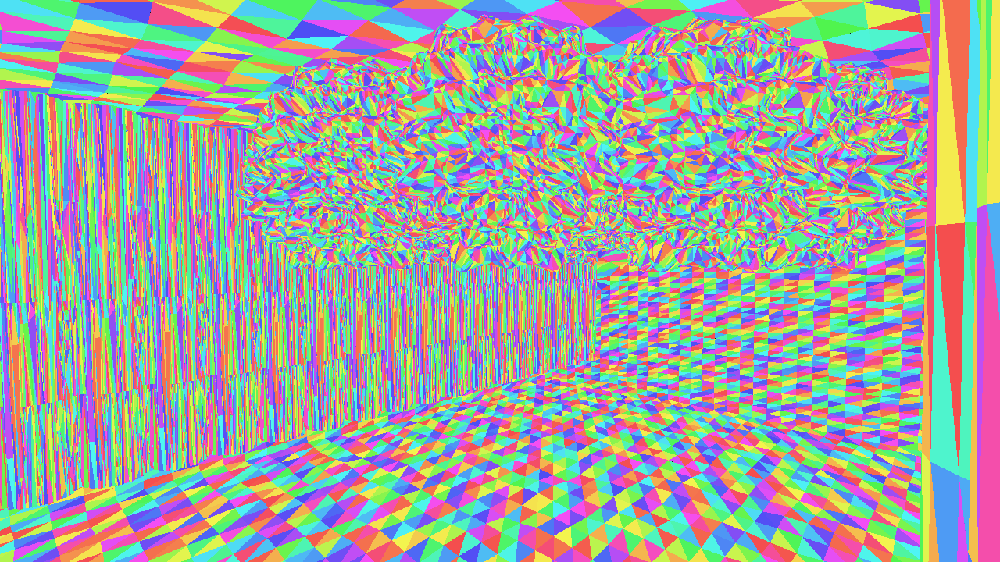

# Virtual geometry, rendered

> Regenerate every image here with `just capture-virtual-geometry`. It renders
> `samples/07-fidelity`'s own scene through that sample's own frame, so there is one scene and one
> renderer to keep true rather than a second copy that drifts.

`virtual-geometry` reached **Working** at M7, and for two milestones the only committed picture of
it was a chart — because at M7 nothing in this engine could turn a frame into a file. M8.c built
that layer. These are the frames.

## The scene

One film-detail interior, cooked through the real builder with the crack-free check the cook is
required to run, put on the device through the cluster traversal and the visibility buffer, at
1280x720 on Vulkan with validation on.

| Figure | Value |
|---|---|
| Source triangles (every instance counted) | **4,478,208** |
| Distinct triangles cooked | 116,928 |
| Clusters / geometry pages | 1,915 / 31 |
| Covered pixels | 921,593 of 921,600 |
| Source triangles per covered pixel | **≈ 4.9** |

The last row is the point of the technique: there is more geometry in the set than there are pixels
to show it in, so the question is never "draw it all" but "which clusters, at which error".

*Resolved world normals under one light. Fluted left wall, three displaced shells on the ceiling, a
corrugated back wall, a striped floor — all of it real geometry rather than a normal map, which is
what makes the triangle count above meaningful.*

## The hierarchy choosing

A still frame cannot show level-of-detail selection; only the **same view at different error
budgets** can. `threshold_pixels` is the screen-space geometric error the hierarchy is allowed to
commit, and it is the only thing changed between these three.

| Threshold | Visible cluster instances | Covered pixels |
|---|---|---|
| 1 px | **5,247** | 921,593 |
| 4 px | **3,332** | 921,592 |
| 16 px | **1,878** | 921,592 |

| 1 px | 4 px | 16 px |
|---|---|---|
|  |  |  |

One colour per cluster. Three things are visible at once, and each is a claim the specification
makes:

- **The patches grow.** The ceiling shells go from finely speckled to broad plates. Nobody authored
  a level of detail; the hierarchy descended less far because it was allowed more error.
- **Coverage does not move.** 921,592 pixels at 16 px error as at 1 px. Coarsening does not open
  holes between neighbouring clusters — that is the crack-free property, and it is what a naive
  per-cluster decimation fails.
- **Visible instances exceed cooked clusters.** 5,247 visible against 1,915 cooked is not a
  contradiction: a cooked cluster is *instanced*, drawn at many placements, and the traversal picks
  a level per placement. That is why 116,928 distinct triangles can present 4,478,208.

## Triangle density

*One colour per triangle, at the 1 px threshold. Where this reads as noise rather than as facets,
the triangles have reached pixel size — which is the regime the whole cluster hierarchy exists to
make affordable.*

## What these images do not show

They are reproducible to **one to three pixels in 921,593** (0.0003%), not exactly. Where two
surfaces tie on the depth key exactly — neighbouring clusters meeting on a shared edge — the winner
is broken by the traversal's append order, which is atomic and permutes between runs. Removing that
residue needs a stable cluster identity in the raster payload rather than the visible index.

It used to be **110 to 150 pixels**, and that was a different and worse thing: `vgVisRaster` settled
depth with an atomic and then wrote the payload as a separate, unordered store, so a *farther*
surface could take a pixel simply by storing last. Depth and payload are now one 64-bit atomic, and
[`test_visbuffer.cpp`](../../src/rendering/virtual_geometry/tests/test_visbuffer.cpp) renders one
frame six times and requires the resolve and the bin counts to match — it fails on the old raster.
That defect was found by making these pictures.

For the same reason the capture colours clusters by the stable `(instance, cluster)` pair rather
than by the visibility sample's `visible` index: that index is traversal *append* order, which
differs every run and repaints the entire image.
