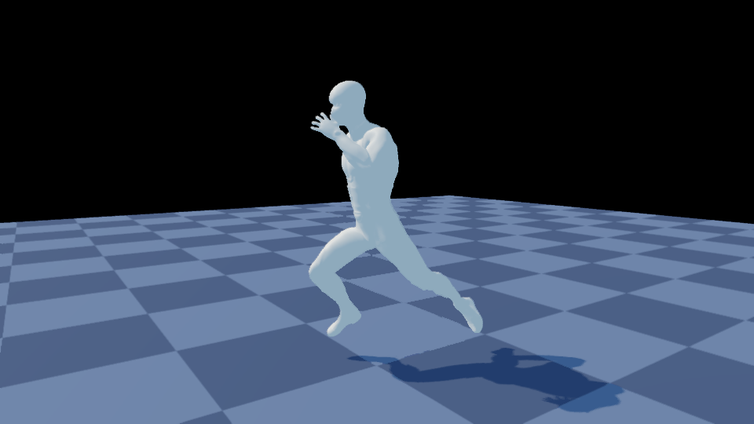
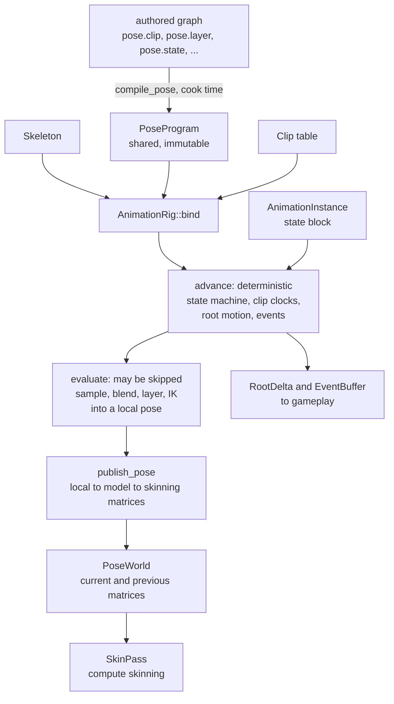

# Animation in CyberEngine

A tutorial for a gameplay or engine contributor: how a skeleton, a clip and a compiled animation
program become a pose, how a character and its clips get in from FBX and are cooked and loaded, how
the engine's animation system animates an entity every frame, how the pose reaches the skinning pass
and the engine's forward frame, how a Swift game drives a character through the ABI, and what is not
built yet.

**Governed by**: [`animation-and-skinning`](../../openspec/specs/animation-and-skinning/spec.md)
(the runtime), with skinning in
[`rendering-geometry-and-resources`](../../openspec/specs/rendering-geometry-and-resources/spec.md),
import in [`asset-import-pipeline`](../../openspec/specs/asset-import-pipeline/spec.md) and ragdolls
in [`physics`](../../openspec/specs/physics/spec.md). The module READMEs linked below are the
detailed reference; this guide is the route through them. Where they disagree, the specification is
the contract and the module README says what the code does today.



*`samples/09b-animated-character` since issue #76 stage 3: the character is a skinned draw in the
engine's forward frame — skinned by `SkinnedScene` from the pose world's dirty range, drawn by the
skinned depth, shadow and opaque pipelines with the dispatch's own normal-tangent stream, casting
its shadow on a tiled ground. Frame 165, mid-run, 960x540.*


*The M8.d capture, from before the sample drew through the frame: one frame of [`samples/09b-animated-character`](../../samples/09b-animated-character/README.md):
four Mixamo FBX exports imported, three clips retargeted onto the fourth's rig, a four-state machine
compiled at cook time, everything loaded by asset id, the character animated by the engine's
`AnimationSystem` at a fixed step, and the mesh skinned by a compute dispatch. A still of a
skinned character looks the same as a still of a posed one, so the sample's claim is the video:
[`docs/design/videos/animated-character.mp4`](../design/videos/animated-character.mp4), idle to walk
to run to a death, 13 seconds at 30 frames per second.*

## Contents

1. [The model: skeleton, clip, pose, evaluation](#1-the-model-skeleton-clip-pose-evaluation)
2. [Importing a character and its clips from FBX](#2-importing-a-character-and-its-clips-from-fbx)
3. [Playing and blending: compiled pose programs](#3-playing-and-blending-compiled-pose-programs)
4. [IK and retargeting](#4-ik-and-retargeting)
5. [Skinning, and the frame path to the renderer](#5-skinning-and-the-frame-path-to-the-renderer)
6. [Ragdoll hand-off](#6-ragdoll-hand-off)
7. [Worked example: `samples/09b-animated-character`](#7-worked-example-samples09b-animated-character)
8. [Testing, debugging, pitfalls, and what is not built](#8-testing-debugging-pitfalls-and-what-is-not-built)
9. [Further reading](#9-further-reading)

---

## 1. The model: skeleton, clip, pose, evaluation

Animation is split across three places, and the split is the first thing to learn:

| Where | What | Namespace |
|---|---|---|
| [`src/animation/`](../../src/animation/README.md) | the runtime and the assets it names: skeleton, clip and codec, evaluation, LOD and the pose cache, IK, retargeting, the pose world | `cy::animation` |
| `src/animation/assets/` | the cooked skeleton, clip and program records, and `AnimationLibrary`, which loads them through the asset system and binds rigs by asset id | `cy::animation` (target `cy::animation-assets`) |
| `src/animation/system/` | the `Animator` component and `AnimationSystem`, which animates every entity carrying one in the frame | `cy::animation` (target `cy::animation-system`) |
| [`src/graph/`](../../src/graph/README.md) `lower_pose.h`, `locomotion.h` | the **compiler**: an authored graph of `pose.*` nodes lowered to a `PoseProgram` | `cy::graph::pose` |
| [`src/rendering/skinning/`](../../src/rendering/skinning/README.md) and `src/servers/render/geometry/` | the skinning compute pass and the buffer layouts it reads | `cy::rendering::skinning`, `cy::render::geometry` |

`src/animation/README.md` states the rule: *"The compiler is not here."* The runtime contains no
graph compiler, as the specification requires (*"Compilation SHALL occur at cook time; the runtime
SHALL contain no graph compiler"*).

### The types

| Type | Header | Shared or per instance | What it is |
|---|---|---|---|
| `Skeleton` | `cy/animation/skeleton.h` | shared | joints in parent-before-child order, bind poses, inverse bind matrices, bone LOD masks, per-joint bounds |
| `SkeletonProfile` | `cy/animation/skeleton.h` | shared | a side table mapping the 22 `HumanoidJoint` slots onto one skeleton's indices |
| `Clip` | `cy/animation/clip.h` | shared | tracks (`Translation`, `Rotation`, `Scale`, `Curve`, `Property`), 16-bit quantised keys, markers, events, a root motion joint |
| `PoseProgram` | `cy/graph/lower_pose.h` | shared, immutable | the compiled instruction array, states, transitions, masks, clip table and parameter names |
| `AnimationRig` | `cy/animation/evaluate.h` | shared | one skeleton + one program + the clips its clip table names |
| `AnimationInstance` | `cy/animation/evaluate.h` | per instance | the small state block: state machine position, parameters, one `ClipCursor` per clip, root motion, LOD tier, event policy |
| `PoseScratch` | `cy/animation/evaluate.h` | caller-owned, reused | pose buffers for one evaluation; reuse one across a whole batch |
| `PoseWorld` | `cy/animation/pose_world.h` | shared | current and previous skinning matrices per instance, and a `PoseHandle` per instance |
| `Animator` | `cy/animation/animation_system.h` | per entity | the ECS component: rig, LOD tier, event policy, root motion mode, play rate, and the instance and pose handles the system writes back |
| `AnimationSystem` | `cy/animation/animation_system.h` | per world | one batch per rig, the tick half in the fixed step and the pose half in `Stage::Animation`, and the pose world |
| `AnimationLibrary` | `cy/animation/library.h` | per asset system | cooked skeletons, clips and programs loaded by asset id, and rigs bound from them by name |

A pose is an array of `Transform` (translation, rotation, scale), one per joint, in the parent's
space. `Skeleton::to_model` turns it into model space in one forward loop, and
`Skeleton::to_skinning` multiplies by the inverse bind matrices. The loop has no recursion because
`add_joint` refuses a parent index that is not smaller than the joint's own:

```cpp
    /// Append a joint. `parent` must already have been added, or be `kInvalidJoint` for a root.
    [[nodiscard]] Expected<u16, Error> add_joint(Name name, u16 parent, const Transform& bind_local,
                                                 u8 dropped_at = kBoneLodLevels) noexcept;
```

`dropped_at` is the joint's bone level of detail: the first of the four levels (`kBoneLodLevels`)
at which it is not evaluated. `finalize()` refuses a child that outlives its parent.

The joint cap is 256 (`kMaxJoints`, from `graph::pose::kMaxJoints`), because a `JointMask` is a
fixed 256-bit mask. A larger rig is refused by the skeleton and by the importer. It is not
truncated.

### Evaluation: two halves



The two runtime calls do different jobs:

- **`advance(rig, instance, dt, events)`** moves the state machine and the clip clocks forward,
  integrates **root motion** and emits **events**. It samples no pose. It runs at every LOD tier,
  `Baked` included. Nothing that must be deterministic happens anywhere else.
- **`evaluate(rig, instance, bone_lod, scratch, out_local, stats)`** samples and blends the active
  state's tree into `out_local`. A LOD tier may skip it or run it less often, and a pose cache may
  stand in for it.

`evaluate()` is lazy: it starts at the active state's root instruction and walks only what that
reaches. A state no instance is in costs nothing, a layer at zero weight samples nothing, and a
masked layer samples only the joints in its mask. `EvaluationStats` (`clips_sampled`,
`joints_sampled`, `instructions_skipped`) reports this, and the tests assert it.

`out_local` must be seeded before `evaluate()`, usually with `Skeleton::reference_pose()`: a joint
that no track drives keeps whatever value it was handed.

A game does not call either one. Section 5 shows the `AnimationSystem` that calls both for every
entity carrying an `Animator`; the two calls are documented here because they are what it runs.

### Why there are two evaluators

`cy::graph::pose::evaluate()` exists, and the frame does not call it. `src/animation/README.md`
gives two reasons. `cy::graph` does not depend on `cy::core-math`, so its pose is eight floats per
joint blended component by component, and a rotation blended that way is not a rotation. It also
allocates scratch per call. `cy::animation::evaluate()` walks the same program with the same
`PoseInstruction::required` masks, works over `Transform`, slerps properly, and allocates nothing.

---

## 2. Importing a character and its clips from FBX

FBX goes through [`tools/import/`](../../tools/import/README.md). ufbx is pinned in
`deps/manifest.toml` (`name = "ufbx"`, `v0.20.0`) and is private to `cy_import`: the ufbx calls are
in `src/fbx.cpp`, `src/fbx_skeleton.cpp` and `src/fbx_clip.cpp`, and the public headers take the
scene by an opaque `ufbx_scene` reference. A model import has ten numbered steps. Animation uses two
of them:

| Step | Header | Output | Needs `CY_ANIMATION`? |
|---|---|---|---|
| 7, skeletons | `cy/import/fbx_skeleton.h` (`import_fbx_skeleton`) | a `skeleton/` sub-asset: an `ImportedSkeleton` record (names, parents, bind poses, bone LOD, humanoid table) | no; the bytes are the same in every build |
| 8, animations | `cy/import/fbx_clip.h` (`import_fbx_animations`) | one `animation/` sub-asset per stack, compressed by `cy::animation::Clip`'s own codec | yes; the codec *is* the runtime's |

Since M11.b the cooked mesh also carries skin weights (`MeshData::skin`: four joint indices and four
weights per vertex, from ufbx's skin clusters), and glTF reaches steps 7 and 8 through the same
records (`cy/import/clip_record.h` is the one writer).

### What the importer decides for you

- **Coordinates and units are ufbx's conversion**: right-handed, Y up, metres. A bind pose is read
  from `local_transform`, the same field step 10 reads for the node table.
- **Humanoid slots are matched on the part of the name after the last `:`** (`humanoid_joint_of`).
  Mixamo writes `mixamorig:Hips` in one export and `mixamorig1:Hips` in the next, so matching the
  prefix would find nothing.
- **Bone LOD from names** (`joint_bone_lod`): fingers, twist joints and `_End` terminators are
  dropped at level 1, and everything else is kept at every level. The importer does not drop heads
  or toes. That choice depends on a game's camera distances, so the game makes it.
- **Every stack is imported.** A stack that animates nothing is skipped and reported by name. A
  file with one clip names the sub-asset after the source file (`animation/Walking`).
- **Root motion is off by default** (`animation-root-motion`, choices `none` and `root-joint`).
  The option description says why: the sampler still writes the designated joint's translation into
  the pose as well as reporting it as a delta, so a designated clip would be applied twice.

The step 8 options, all declared so that each one reaches the cook cache key: `import-animations`,
`animation-sample-rate` (default 30), `animation-key-reduction`,
`animation-translation-tolerance-mm` (default 0.1) and `animation-rotation-tolerance-degrees`
(default 0.1). The tolerances are in millimetres and degrees, not quality numbers. The codec
quantises what the fit kept on top of them, so the measured worst case in `CompressionReport` can
sit a little above the setting.

### From record to runtime

A cooked record is read by the runtime, not by the importer. [`cy/animation/cooked.h`](../../src/animation/assets/include/cy/animation/cooked.h)
decodes the importer's skeleton and clip records byte for byte, with nothing of `cy::import` linked:

| Record | Decoder | What it gives |
|---|---|---|
| skeleton, version 1 | `decode_skeleton(payload, skeleton, humanoid)` | a finalized `Skeleton` and its `SkeletonProfile` |
| clip, version 1 (version 2 adds markers and events) | `decode_clip(payload, clip, joints)` | a `Clip` whose keys are ADOPTED as the codec stored them (`Clip::adopt_compressed`), and the names of the joints its tracks index |
| program, version 1 (`CYPG`) | `decode_program(allocator, payload)` | a `PoseProgram`, rebuilt by `graph::pose::assemble_pose_program`, which validates every index and compiles nothing |

Each has an `encode_*` beside it, and the importer's clip writer (`write_cooked_clip`) now calls the
runtime's `encode_clip`, so one writer produces the record. `integration.animation_cook` re-encodes
an imported skeleton and clip and requires the importer's bytes back.

A clip carries the names of the joints its tracks index because a track addresses a joint by
**index**, and `AnimationRig::bind` checks only counts (the program's joints against the skeleton's,
and the clip table's length), never which joint a track means. `clip_matches_skeleton(clip, joints,
skeleton, out_joint)` is that check, and `AnimationLibrary` refuses a clip that fails it, naming the
joint.

`cy/import/animation_bridge.h`'s `build_runtime_skeleton` still turns an `ImportedSkeleton` record
into a runtime skeleton for the importer's own suites; a game uses `decode_skeleton`.

### Cooking a character: `cook_locomotion_set` and the `animation` producer

A character is several files — a Mixamo character is one export per motion — so making one belongs
to no single import. [`cy/import/animation_cook.h`](../../tools/import/include/cy/import/animation_cook.h)'s
`cook_locomotion_set(spec, out)` takes the imports and produces the three records a game loads:

1. the skeleton of the import named `rig`;
2. each clip brought onto it: as it is when its rig is congruent with the character's and shares its
   rest pose (`compare_rigs`), retargeted and baked otherwise (`build_retarget_profile`,
   `bake_clip`), named as the program calls it, and set to hold its last frame when the spec says it
   does not loop (FBX has no loop flag);
3. the locomotion program, compiled by `compile_locomotion` over the clips' names and durations, at
   cook time.

The `animation` build-graph producer ([`tools/build/README.md`](../../tools/build/README.md)) runs it
as a node over upstream import nodes, from a `cyanim 1` description:

```text
cyanim 1
name "locomotion"
rig "derived/walk.bundle"
clip "idle" "derived/idle.bundle"
clip "walk" "derived/walk.bundle"
clip "run" "derived/run.bundle"
clip "die" "derived/die.bundle" hold
blend "walk_to_run" 0.15
```

Its outputs are matched by suffix: `.skeleton`, `.program`, and `.<clip>.clip`.

### Loading by asset id: `AnimationLibrary`

`AssetSystem` loads bytes by asset id; [`AnimationLibrary`](../../src/animation/assets/include/cy/animation/library.h)
is the typed layer over it:

```cpp
animation::AnimationLibrary library(allocator, asset_system);
(void)library.watch();  // hot reload of clips
const AssetId clips[] = {idle_id, walk_id, run_id, die_id};
Expected<const animation::AnimationRig*, Error> rig =
    library.rig(animation::RigAssets{skeleton_id, program_id, Span<const AssetId>(clips, 4)});
```

Each id is loaded and decoded once and kept for the library's life. `rig()` matches the program's
clip table to the given clips **by name**, in any order, and refuses a clip the program names and the
list lacks, with the name in the error (`program 'locomotion' names clip 'die', and no clip of that
name was given`); a clip cooked for another skeleton, naming the joint; and a missing asset, naming
its id. Every refusal is also emitted as an `animation` diagnostic.

**Hot reload.** After `watch()`, an `AssetSystem::reload` of a clip decodes the new bytes beside the
live clip, checks them against every skeleton the clip is bound to, then moves them into the SAME
`Clip` object, so rigs and instances keep their pointers and play the new keys on their next
evaluation; the rigs are rebound so a changed duration reaches the clocks. A reload that does not
decode, or no longer matches, is refused and the working clip plays on. Skeleton and program reloads
are refused, because live instances are laid out from them.

From the command line, `cy_import_cli --list-importers` prints every importer and its options, and
`just content-import` wraps the CLI. Set an option with `--set NAME=VALUE`, for example
`--set animation-rotation-tolerance-degrees=0.05`.

---

## 3. Playing and blending: compiled pose programs

### The node vocabulary

`register_pose_nodes` registers nine node types, and `compile_pose` lowers them to seven ops
(`PoseOp`):

| Node | Op | Inputs | Properties it reads |
|---|---|---|---|
| `pose.ref` | `RefPose` | none | none |
| `pose.clip` | `SampleClip`, the only op that samples | none | `clip`, `duration`, `loop`, `time_parameter` |
| `pose.blend` | `Blend` | `a`, `b` | `mask_first`, `mask_count`, `weight_parameter` |
| `pose.blend_mask` | `BlendMask` | `a`, `b` | `mask_first`, `mask_count`, `weight_parameter` |
| `pose.additive` | `Additive` | `a`, `b` | `mask_first`, `mask_count`, `weight_parameter` |
| `pose.layer` | `Layer` | `a`, `b` | `mask_first`, `mask_count`, `weight_parameter` |
| `pose.ik` | `IK` | `a` | `chain` |
| `pose.state` | a `PoseState` | `pose` | `name` |
| `pose.transition` | a `Transition` | `from`, `to` | `condition`, `duration`, `priority`, `interruption` (`none`, `higher_priority`, `any`) |

The four two-input nodes are lowered by one branch of `lower_pose.cpp`, so each reads the same three
properties, although `cy::animation::evaluate()` applies a `BlendMask` at full weight and ignores
its weight parameter. A mask is a contiguous joint range (`mask_first`, `mask_count`), and a node
without both gets a mask of every joint. A graded weight per joint inside it is set on the rig with `AnimationRig::set_mask_weight(mask, joint, weight)`. Its default is 1, so a
program with no weights set follows its bit masks exactly.

Here is a walk with an upper-body aim layer masked to four arm joints, from
`src/animation/tests/test_evaluate.cpp`:

```cpp
    writer.node(1, "pose.clip");
    writer.prop(1, "clip", text("walk"));
    writer.prop(1, "time_parameter", text("walk_time"));
    writer.node(2, "pose.clip");
    writer.prop(2, "clip", text("aim"));
    writer.prop(2, "time_parameter", text("aim_time"));
    writer.node(3, "pose.state");

    if (with_layer) {
        writer.node(4, "pose.layer");
        // The arm, from the shoulder to the finger: four joints of twelve.
        writer.prop(4, "mask_first", integer(kShoulder));
        writer.prop(4, "mask_count", integer(4));
        writer.prop(4, "weight_parameter", text("aim_weight"));
        writer.link(1, "pose", 4, "a");
        writer.link(2, "pose", 4, "b");
        writer.link(4, "pose", 3, "pose");
```

compiled, bound and evaluated with:

```cpp
    CY_REQUIRE(graph::pose::register_pose_nodes(harness.registry).has_value());

    Graph graph(allocator(), Name::intern("locomotion"));
    CY_REQUIRE(build_locomotion(graph, true, true).has_value());
    graph.resolve(harness.registry);
    DiagnosticSink sink(allocator());
    auto program = graph::pose::compile_pose(graph, harness.registry, kJointCount, sink);
```

then `AnimationRig::bind`, `AnimationInstance::prepare`, `PoseScratch::prepare`,
`instance.set_parameter(rig, Name::intern("aim_weight"), 1.0F)` and `evaluate`. The test checks that
two clips are sampled rather than three, and that the layer samples four joints rather than twelve.
This is **pose dependency analysis**: `analyse_dependencies` fills `PoseInstruction::required`, and
the sampler is only given that mask.

### State machines

States and transitions are part of the program. `graph::pose::advance` checks transitions **from
the current state only**. A transition fires when its `condition` parameter is non-zero. It blends
over `duration` seconds, and a duration of zero is a cut. A running transition with `interruption`
`none` (also the result of an unrecognised value) runs to completion; `higher_priority` lets a
candidate with a higher `priority` take over; `any` lets any valid candidate take over.

Parameters are one flat `f32` array named by `PoseProgram::parameters()`. Set them through
`AnimationInstance::set_parameter(rig, name, value)`, or index `parameters()` directly when you have
resolved the indices once. **Clip clocks are parameters too**: `time_parameter` names the parameter
that `SampleClip` reads. `advance()` moves every clock by `dt * play_rate`. A looping clock wraps by
its clip's duration (twice it for `LoopMode::PingPong`); a clock whose clip the program compiled as
non-looping, or whose clip's loop mode is `None`, HOLDS at the duration, and a held clip over an asset
that loops is sampled with `Clip::sample_unwrapped`, so the pose there is the last key and not the
first frame. A state's clocks restart when it starts being sampled — when it becomes a blend's
target, or when a cut makes it current — and NOT when a blend into it completes.

### A machine the engine writes: `locomotion.h`

The editor cannot save an animation graph asset yet (section 8), so
[`cy/graph/locomotion.h`](../../src/graph/include/cy/graph/locomotion.h) writes one in code, at
cook time: `cook_locomotion_set` (section 2) compiles it and writes the cooked program a game loads. It
builds `pose.clip`, `pose.state` and `pose.transition` nodes and passes them to `compile_pose`. This
is not a second compiler:

```
        request_walk           request_run
   idle ------------> walk ---------------> run
        <-----------       <---------------
        request_idle           request_walk

   idle, walk and run each ------ request_die -----> die  (terminal)
```

Three decisions are built in. There is **no `run -> idle` edge**. **Death outranks locomotion and
cannot be interrupted** (`kDeathPriority = 9` against `kLocomotionPriority = 1`). **A zero blend
duration is refused.** `die` has no outgoing transition, and its clip is `looping = false`, so
`clip_time()` holds the clock on the last frame. `LocomotionSpec` sets the five blend durations
(defaults: `idle_to_walk` 0.20 s, `walk_to_run` 0.15 s, `run_to_walk` 0.25 s, `walk_to_idle`
0.25 s, `to_die` 0.30 s). `compile_locomotion` is the one call a cook makes. `LocomotionDriver` binds the eight
parameters (four requests, four clocks) by name, and `request(state)` raises exactly one request.
With `AnimationSystem` the clocks are the runtime's and only the four requests are the game's.

### Layers, additive, masks, sync groups, curves

- **Layers and masks**: `pose.layer` and `pose.blend_mask`, as above.
- **Additive**: `pose.additive` applies `b` over `a` at a weight.
- **Sync groups and markers**: `Clip::add_marker`, `Clip::marker_time` and the `SyncGroup` and
  `SyncMarker` tables in `PoseProgram` exist, but **`compile_pose` does not populate the sync
  tables, and the evaluator does not align clips by marker**. A walk-to-run blend today uses each
  clip's own clock.
- **Curves**: a `TrackKind::Curve` track is read with `Clip::sample_curve(name, time, cursor, out)`.
- **Property tracks** bind by `TypeId` and `FieldId`, not by a name path. Resolve them once with
  `resolve_properties`, which reports bindings it cannot resolve rather than failing, and write them
  with `Clip::write_properties`.

### Events

Events are data written to an `EventBuffer`, never callbacks. Pass a buffer to `advance()` (or call
`emit_events` directly). Each crossing produces one `EmittedEvent` (`instance`, `name`,
`normalised_time`, `parameter`), in time order, and again on the next loop. With
`EventPolicy::Suppress` on the instance, crossings are counted in `EventBuffer::suppressed()`
instead of being emitted. That is the hook for keeping a distant crowd from flooding the buffer with
footsteps.

### Root motion

Root motion is gameplay state, so it is computed in `advance()` from the clips' root tracks and
weighted by the same blend weights the pose tree uses. It is never derived from a pose. Read the
per-tick delta from `AnimationInstance::root_motion()` (a `RootDelta`: `translation`, `rotation`,
`distance`, `contacts`) and the running total from `travelled()`. Designate the joint with
`Clip::set_root_motion_joint`. Read the pitfall in section 8 before you enable it on an imported
clip.

### Batches and LOD

`AnimationBatch` holds the instances that share one rig. `advance_all(dt, events)` makes one pass
over packed state, and `evaluate_range(first, count, bone_lod, scratch, poses, stats)` is the unit
of work a job worker takes. `samples/08-vertical-slice` animates its characters this way
(`Slice::animate` in `tick.cpp`): `advance_all` for everyone, then `evaluate_range` over a bounded
window of at most `kEvaluatedPoses` instances that moves each tick.

`lod.h` has the four tiers from the specification's table:

| Tier | `bone_lod_for` | `evaluation_hertz` | Evaluates a pose | Runs IK | May use the pose cache |
|---|---|---|---|---|---|
| `Full` | 0 | 0 (every frame) | yes | yes | no |
| `Simplified` | 1 | 30 | yes | no | yes |
| `Cached` | 2 | 12 | yes | no | yes |
| `Baked` | 3 | 0 | no | no | yes |

`select_tier(policy, inputs, current)` takes distance, coverage, visibility, importance and a pin,
and deliberately no frame time. It applies hysteresis. `LodPolicy::authoritative` keeps an instance
at `Simplified` or above. `evaluate()` reads the instance's tier only to gate IK, and
`AnimationBatch::evaluate_range` leaves a `Baked` instance at the reference pose. Called directly,
**choosing the evaluation rate and the bone LOD passed in are the caller's job**; `AnimationSystem`
(section 5) makes both from the tier. Filling a `PoseCache` (keyed on clip, phase bucket and bone
LOD) and applying `PoseVariation` over a shared pose are the caller's either way.

---

## 4. IK and retargeting

### IK

[`cy/animation/ik.h`](../../src/animation/include/cy/animation/ik.h) is the constraint framework in
its current, small form:

- `solve_two_bone(skeleton, chain, target, weight, local)` solves a root, mid, tip chain with a pole
  vector. An unreachable target straightens the chain toward it, and a weight of zero changes
  nothing.
- `solve_look_at(skeleton, joint, target, weight, local)`.
- `ConstraintDecl` declares the `reads` and `writes` joint masks and an `order`.
  `detect_conflicts` reports two constraints that write one joint at the same order, and names both.
- **In a graph**, `pose.ik` lowers to `PoseOp::IK` over chain `chain`. The chain comes from
  `AnimationRig::set_ik_chain(index, IkChain{...})`. Its target is three consecutive program
  parameters starting at `target_param`, in model space, and its weight is `weight_param`. An `IK`
  instruction whose chain was never set is skipped and counted, and IK runs only at `Full` tier.

FABRIK, CCD, spline IK, full-body IK, spring bones and foot placement are **refused by name**:
`solve_unimplemented(UnimplementedSolver::FullBodyIk)` returns `NotImplemented`, and
`unit.animation` asserts that it does.

### Retargeting

A clip's tracks are absolute local transforms indexed by joint. To play a clip authored for one rig
on another, map it through a `RetargetProfile` ([`retarget.h`](../../src/animation/include/cy/animation/retarget.h)).
The profile holds joint **index** pairs grouped by semantic `Chain` (`Root`, `Spine`, `Neck`,
`Head`, `LeftArm`, `RightArm`, `LeftLeg`, `RightLeg`) and compares no names. Rotations are
transferred. Bone lengths are not: only the root chain's translation crosses, scaled by the ratio of
the two rigs' hip heights. That is what keeps a shorter character's feet on the ground.

[`retarget_build.h`](../../src/animation/include/cy/animation/retarget_build.h) builds the pairs:

- `compare_rigs(source, target)` returns a `RigMatch`. If two rigs are `congruent` (same joint
  count, same parent per joint) **and** `same_rest_pose`, a clip binds to the other rig unchanged
  and no retarget is needed.
- `build_retarget_profile(source, source_humanoid, target, target_humanoid, profile, report)`
  chooses `Correspondence::Congruent` (joint for joint, fingers included) when the hierarchies
  match, and `Correspondence::Humanoid` (the 22 standard joints) otherwise. **It refuses to build a
  profile that maps nothing**, because an empty profile leaves the character in its bind pose on
  every frame and nothing reports it.

Retarget in one of two ways:

| | Call | Cost |
|---|---|---|
| At runtime | `RetargetProfile::retarget_pose(source, target, source_local, target_local)` after the source is evaluated | one quaternion multiply and one composition per mapped joint, per evaluation |
| At cook time | `bake_clip(allocator, profile, source, target, clip, sample_rate, settings, out)` | nothing at runtime; one clip of memory per source and target pair |

`retarget.h` recommends baking for the combinations a game ships, and the runtime path for content
it did not ship with.

---

## 5. Skinning, and the frame path to the renderer

### CPU and GPU

| Path | Where | Used for |
|---|---|---|
| GPU compute | `skin.slang`, driven by `cy::rendering::skinning::SkinPass` | every skinned pixel in the tree |
| CPU | `cy::render::geometry::cpu_reference_skin` in `skin_dispatch.h` | the **reference** the dispatch is tested against, vertex by vertex; not a runtime skinning path |

`skin.slang` is written in the same order as the reference, expression for expression. Its README
calls the chain of evidence *"paper → reference → dispatch → pixels"*. It does linear blend
skinning by default. Dual quaternion skinning (`SkinningMethod::DualQuaternion`) and blend shapes
(applied to the bind pose before the skin) are in the same entry point. Four or eight influences
per vertex are selectable (`InfluenceCount`). The compiled SPIR-V and MSL are committed headers
(`src/skin_spirv.h`, `src/skin_msl.h`), written by `shaders/embed_spirv.py` and `embed_msl.py`.
The exact `slangc` invocations are in `skin.slang`'s header comment; this module has no
`regenerate.py`. The [Slang guide](slang.md) covers the embed flow in general.

### The animation system: an entity animates with no code in the game

[`cy/animation/animation_system.h`](../../src/animation/system/include/cy/animation/animation_system.h)
is what runs `advance` and `evaluate` for a game. An entity carries an `Animator`:

```cpp
const ecs::ComponentTypeId animator = *animation::register_animator(world);
animation::AnimationSystem system(allocator, world, animator, &scene_tree);
const animation::RigId hero = *system.add_rig(*rig);          // one batch per rig
(void)system.install(simulation.schedule(), simulation.clock());

animation::Animator settings;
settings.rig = hero;
settings.tier = animation::LodTier::Full;
settings.root_motion = animation::RootMotionMode::Controller;
(void)world.set(entity, animator, settings);
```

From then on the game raises requests — `system.set_parameter(entity, name, value)` — and reads
results: `events()` with `entity_of(event)`, `root_motion(entity)`, `take_root_motion(entity)` for a
controller, `travelled(entity)`, and `pose_of(entity)` for the skinning descriptor. `install` adds two
systems:

| System | Stage | When | What |
|---|---|---|---|
| `AnimationSystem::advance` | `PostSimulation` | once per simulation tick, after gameplay's `Simulation` stage | sync instances with the components (create, remove, copy tier, event policy, play rate and root motion mode); `advance_all` per batch with one `EventBuffer`; route each tick's root motion; mark instances due for evaluation |
| `AnimationSystem::evaluate` | `Animation` | once per frame | evaluate the due instances in slices of a batch across job workers, each slice's buffers from its worker's scratch arena, writing matrices into `PoseWorld::staging`; then commit them in slot order |

THE TICK HALF IS IN THE FIXED STEP, and that is the determinism rule: the animation is a function of
the simulation's ticks and the requests, never of the frame rate. `integration.animation_system`
runs one session a tick per frame and another three ticks per frame and requires the same poses,
root motion, transforms and events bit for bit. A frame that ran no tick evaluates nothing new.

**Instances come and go without rebuilding anything.** A batch removes by moving its last instance
into the hole (`AnimationBatch::remove`), the pose world reuses the freed range, and an instance's
event identifier is its slot, which the move does not change.

**Level of detail is applied, not left to the caller.** The tier on the `Animator` sets the
evaluation rate (counted in simulation time), the bone level of detail, whether IK runs, and at
`Baked` that the pose is never evaluated — it keeps the reference pose published when the instance
was created. Every tier is advanced every tick, so root motion and events do not depend on it.

**Root motion goes where the instance says.** `RootMotionMode::Ignore`, `ApplyToTransform`
(composed onto `LocalTransform` each tick and marked changed, so propagation follows),
`Controller` (accumulated for `take_root_motion`) or `ExtractOnly` (the last tick's delta, applied
nowhere). Remember the pitfall in section 8 before applying an imported clip's root motion.

`CY_ANIMATION=OFF` removes the system with the runtime.

### Requests a game makes: play, stop, triggers

Issue #76 stage 4 gave the system the verbs a game needs beyond raising the program's own
parameters:

| Call | What it does |
|---|---|
| `play(entity, state, seconds)` | crossfades from where the machine is to `state` over `seconds`, or cuts when it is zero, whatever the program's transitions say: `graph::pose::request_state` marks the blend `kRequestedTransition` with its own duration. The entered state's clips start at zero, as a program transition's do (`animation::request_state` restarts them, because a request is made between two `advance` calls). A requested blend runs to completion; the program's transitions are considered again from the state it lands in. A request during a blend starts from the blend's source. |
| `stop(entity, seconds)` | the same, to the program's entry state |
| `fire_trigger(entity, parameter)` | sets the parameter to 1 for exactly the next tick's advance; `step` clears it after the batches have advanced, so a transition conditioned on it fires once |
| `status(entity)` | the state, the blend target and weight, the time in the state, and whether the blend was requested |
| `joint_model_matrix(entity, joint)` | a joint's model-space placement from the published pose: the skinning matrix times the joint's bind placement |

`integration.animation_system`'s *"play crossfades to any state, and its clips start at zero"*,
*"a trigger is read by exactly one tick"* and *"a joint's model matrix is its published pose"* are
the cases.

### The frame path

```mermaid
flowchart LR
    subgraph tick["CPU, per simulation tick: AnimationSystem::advance"]
        advance["advance_all per batch<br/>clocks, state machine,<br/>root motion, events"]
    end
    subgraph cpu["CPU, per frame: AnimationSystem::evaluate"]
        evaluate["animation::evaluate<br/>local pose, on job workers"] --> publish["to_model, to_skinning<br/>into PoseWorld::staging"]
        publish --> world["PoseWorld::commit<br/>packed Mat4 array,<br/>two halves per instance,<br/>dirty range"]
    end
    advance --> evaluate
    world -->|"upload_offset, upload_size<br/>and matrix_offset(handle)"| upload["SkinnedScene::upload_poses<br/>one device pose buffer,<br/>the dirty range only"]
    subgraph gpu["Render graph"]
        upload --> dispatch["one compute pass: skin.slang<br/>a dispatch per instance,<br/>each its own output window"]
        dispatch -->|"barrier derived by the graph<br/>(FramePassCallback::vertex_reads)"| draw["the forward frame:<br/>depth prepass, shadow,<br/>opaque, transparent,<br/>selection mask"]
    end
```



In order:

1. The system — or a caller with `publish_pose(skeleton, local, bone_lod, world, handle,
   model_scratch, matrix_scratch)` — runs local to model to skinning matrices and publishes them.
   `PoseWorld::publish` (and `commit`, its second half) swaps current and previous without copying,
   so **`matrix_offset(handle)` changes every frame**. Read it each frame. Never cache it. With the
   system the handle is `system.pose_of(entity)` and the world is `system.poses()`.
2. The renderer owns ONE device pose buffer, `cy::rendering::skinning::SkinnedScene`'s:
   `scene.upload_poses(world.matrices(), world.upload_offset(), world.upload_size())` writes the
   range the world says changed, at the world's own indices, and the caller then calls
   `world.clear_upload_range()`. Nothing outside the range is touched — `render.skinned_frame` (g)
   stages a sentinel outside it and checks the device buffer never sees it.
3. Each skinned instance is in the scene's table: `add_mesh` once per mesh (bind pose, frames,
   influences), `add_instance` once per character, and `set_pose(instance, world.matrix_offset(handle))`
   every frame.
4. `scene.declare(graph, frame_index)` adds ONE compute pass that skins every posed instance — a
   dispatch each, over one descriptor set — into the half of its output window the frame's parity
   selects; the other half keeps last frame's positions.
5. The frame draws the output. `skinning::skinned_draw_geometry` fills the geometry lookup's
   `pipeline::DrawGeometry` with the instance's buffers and windows; `FramePipelines` created with
   `PipelineSetup::skinned` binds the normal-tangent stream as the `rhi::Format::Rgba16Snorm` the
   dispatch wrote, through `cySkinnedDepthVertex` and `cySkinnedForwardVertex`; the depth prepass
   reads last frame's window for per-object motion; the shadow pass and the selection mask read the
   skinned positions; and every one of those stages declares `scene.vertex_reads()` so the graph
   orders it after the dispatch.

**With no skinned instance the frame is the frame from before.** The skinned pipelines are created
only when asked for, the rigid entries of `frame.slang` came out byte-identical, and
`render.skinned_frame` (a) holds the frame with the skinned pipelines on and no skinned instance to
`frame_scene_before_bloom.png`, which a build from before them wrote, byte for byte.

`SkinPass`, one skin driven by hand, is still there for a mesh with active blend shapes and for the
dispatch-against-reference suites; `src/rendering/skinning/README.md` has both.

### From Swift: the ABI 1.7 animation API

Issue #76 stage 4 appended fourteen entries to the ABI, reaching the `AnimationSystem` through
`cy::game_backend::AnimationAdapter` (`src/game_backend/animation/`, built only with
`CY_ANIMATION`). A host loads its rigs, adds them to the system and registers each under a name
(`adapter.add_rig("worker", rig)`); a Swift game does the rest:

```swift
let worker = try Animator.attach(to: unit, rig: "worker")        // onCreate or onFixedUpdate
try worker.play(moving ? "walk" : "idle", crossfade: 0.2)       // onFixedUpdate
try worker.fire("wave")                                         // one tick
for event in try Animation.events(for: unit) where event.name == "footstep" { … }  // onUpdate
```

| | |
|---|---|
| Attach and detach | `Animator.attach(to:rig:tier:emitsEvents:rootMotion:playRate:)` writes the entity's `Animator` and syncs the system at once, so the instance can be played in the same callback |
| Play and blend | `play(_:crossfade:)` and `stop(blend:)` are `AnimationSystem::play` and `stop`; blend weights are float parameters, `set(_:to:)` |
| Parameters | `set(_:to: Float)`, `set(_:to: Bool)`, `fire(_:)` (a trigger, one tick), `float(_:)` |
| Events and notifies | `Animation.events()`: the events of the ticks since the previous frame, as data — the entity, the name, the normalised time and the payload — each delivered in exactly one frame (`AnimationAdapter::begin_frame` snapshots them only when the system ticked since the last frame) and honouring the animator's event policy |
| Root motion | `rootMotion` (the last tick's delta and the running total), `takeRootMotion()` for an animator in `.accumulate`, and `setRootMotion(_:)`: `.ignore`, `.transform`, `.accumulate`, `.extract`, or `.character`, which `AnimationAdapter::update` feeds to the entity's character controller every tick, turned into the world by the node's placement |
| A joint | `jointPose(_:)`: a joint's world placement from the evaluated pose |

State and event names cross as `AnimationName` — `CY_NAME_HASH`, FNV-1a 64 of the text — because no
engine pointer escapes a game entry. The phases follow the rule the other game services do: what a
character does is `N F`, the frame's events and a joint's pose are `N U`, everything else is read
anywhere. `src/abi/README.md` has the per-entry table; `docs/guides/swift.md` the Swift side.

`samples/13-rts-api` is the proof end to end: its host cooks a worker rig and loads it back through
the asset system, and its Swift `Commander` plays walk while a unit moves, idle when it stands, a
held cheer on arrival, and idle again on the cheer's own `cheer_done` event.

### The iOS RTS load

The iPhone scenes in [building.md](building.md#rts-capacity-scene) show 500 GPU-skinned models (18,000
vertices in one batch, 35.13 FPS median on an iPhone 16). They exercise the **skinning pass on
Metal**, not the animation runtime. `samples/11-ship/ios/main.mm` builds a five-bone pose from `sin`
in `upload_animation` and uploads it with `PoseSource::UploadedPerSkin`. The models share that one
pose. No skeleton, clip, program or `PoseWorld` is involved. Replacing it with real skeletons, clips
and the pose world through `SkinnedScene`, and re-measuring the scene on the iPhone 16 beside the
35.13 FPS figure, is the part of issue #76 stage 3 that needs an Apple device and is not done.

---

## 6. Ragdoll hand-off

Ragdolls live at the animation and physics boundary in `src/physics/ragdoll/`
(`cy::physics::ragdoll`), which is built only with `CY_ANIMATION=ON`. It runs over `PhysicsServer`.
The reference backend reports constraints as unsupported (`Capabilities::constraints`), so
`activate` there fails with `Unsupported` before any body is allocated. A real ragdoll needs a backend
with constraints, which in this tree is Jolt (`src/backends/physics-jolt/`, `CY_PHYSICS=ON`).

1. `Profile::generate(skeleton, allocator)` builds one `BoneProfile` per joint (primitive shape,
   `mass`, swing and twist limits, `motor_torque`, `motor_frequency`), which you can then refine by
   hand.
2. `Ragdoll ragdoll(server, world, skeleton, profile, allocator)`.
3. `activate(current, previous, actor_world, previous_actor_world, dt, activation)` takes the
   **current and previous model-space poses**, so the bodies start at the animated pose *and
   velocity*. That is the specification's *"Death is not a switch"*. `Activation::mode` is
   `Mode::Full` (all bodies simulated), `Mode::Powered` (root kinematic, motors follow the
   animation) or `Mode::Partial` (a per-bone weight in `partial_weights`, where zero stays animated).
   `blend_seconds` fades the physics in.
4. Each fixed step: `set_animation_target(model_pose, actor_world, dt)` before the physics step,
   then `advance_blend(dt)` after it, then `sample_pose(animation_model, actor_world, out_model)`.
5. `apply_hit(joint, impulse, recovery_seconds)` is a hit reaction that blends back to the mode's
   base weight.
6. `deactivate()`, or destroy the `Ragdoll`, **before** the physics world is destroyed.

`sample_pose` returns a **model-space** pose. To skin it, either convert it back to local space and
call `publish_pose`, or call `Skeleton::to_skinning(model, skeleton.retained(0), matrices)` and
`PoseWorld::publish(handle, matrices)` directly. No sample in the tree wires a ragdoll to a skinned
character yet. The coverage is `integration.physics_ragdoll`: *"partial ragdoll keeps locomotion
animated while the arm reacts and blends back"*, *"full ragdoll seeds animated pose and world
velocity, then blends continuously"* and *"powered ragdoll motor tracks animation after an impulse
and hit weight recovers"*.

---

## 7. Worked example: `samples/09b-animated-character`

The sample is the first program that joins every link from sections 2 to 5 in one binary. Its
[README](../../samples/09b-animated-character/README.md) is the full account. This section follows
the code.

### Running it

It needs a graphics device and four Mixamo exports that are **not in the repository** and not
redistributable: `Breathing Idle.fbx`, `Walking.fbx` (the only one with a mesh), `Running.fbx` and
`Dying Backwards.fbx`.

```sh
just capture-animated-character --sources <directory holding the four .fbx files>
```

The recipe (`just/run.just`) builds the engine, runs
`build/<profile>/samples/09b-animated-character/cy_sample_animated-character --frames ... --still ...`,
and encodes the video with `tools/docs/collect_animated_character.py`. Its other flags are
`--profile`, `--seconds` (default 13), `--width` (960), `--height` (540) and `--fps` (30, or
`CY_CAPTURE_FPS`). Always pass `--sources`: the built-in default in `main.cpp` is a path on one
developer's machine. The frames are written under the build directory, not `/tmp`, because the PNG
writer does not compress: the recipe's comment puts three hundred frames at 960x540 at about half a
gigabyte, and the default take is 390 frames. The frames are deleted when the recipe finishes.

The sample has no CTest entry, because it needs both a device and the four files. Each link under it
is tested on its own (section 8).

### Import, cook, load

`character.cpp`'s `load_character` imports each file with `import::FbxImporter` and hands the four
imports to `cook_locomotion_set` (section 2), the `animation` producer's work, with `Walking.fbx` as
the rig and the death marked to hold:

```cpp
    import::AnimationCookSpec spec;
    spec.rig = &imports[static_cast<u32>(sources.mesh_from)];
    for (u32 index = 0; index < kMotionCount; ++index) {
        const auto motion = static_cast<Motion>(index);
        spec.clips.push_back(
            import::AnimationClipSource{&imports[index], motion_name(motion), motion != Motion::Die});
    }
    if (Status cooked = import::cook_locomotion_set(spec, out.cooked); !cooked) {
        return cooked;
    }
```

All four rigs have the same 65-joint hierarchy, so the walk plays as imported and the other three
are retargeted: their rest poses differ from the mesh's by up to 29.89°, and the bake absorbs that
difference. The program is compiled here, at cook time, with blend durations at the defaults.

`main.cpp` then does what a game does. `AssetHost` writes the cooked records into a memory mount
under fixed asset ids, starts the job system, the async service and the asset system over it, and
`AnimationLibrary::rig` loads the skeleton, the four clips and the program by id and binds them,
matching the program's clip table by name. Nothing in the program after this point compiles,
retargets or reads a file.

### One frame

`World` is a `runtime::Simulation` at `--fps` ticks a second with the `AnimationSystem` installed
and one entity carrying an `Animator`. The game's whole per-frame animation code is the request:

```cpp
        // THE GAME'S WHOLE PER-FRAME ANIMATION CODE: one request. The system advances, evaluates
        // and publishes in the simulation's own stages.
        const f32 seconds = static_cast<f32>(frame) * dt;
        Status stepped = world.request(requested_at(seconds));
        if (stepped) {
            stepped = world.frame();
        }
```

`world.frame()` runs the tick — the system's `PostSimulation` half advances the machine, the clocks,
root motion and events — and the frame stages, whose `Animation` half evaluates and publishes. The
shot then hands `system.poses()` and `pose_of(entity)` to `stage.cpp`'s `Stage::shoot`, which draws
through the engine's forward frame (since issue #76 stage 3): it uploads the pose world's dirty
range, sets the instance's pose offset, declares the skinning pass ahead of the frame, and lets the
frame's geometry lookup answer the character's draw from the skinning output:

```cpp
    if (Status uploaded =
            state.skins.upload_poses(poses.matrices(), poses.upload_offset(), poses.upload_size());
        !uploaded) {
        return uploaded;
    }
    poses.clear_upload_range();
    const u32 pose_offset = poses.matrix_offset(handle);
    if (Status posed = state.skins.set_pose(state.character, pose_offset); !posed) {
        return posed;
    }
```

The request schedule (`kSchedule`) is idle at 0.0 s, walk at 2.0 s, run at 4.5 s, walk at 7.0 s
(the machine has no run-to-idle edge, so it slows down through the walk), and die at 8.0 s. The take
is 13 seconds long because the death clip lasts 4.6 s and then holds on its last frame.

**What changed in the picture when the sample moved onto the system** (issue #76). The take was
captured with the sample before and after, frame for frame, and the frames are not byte-identical,
for three reasons, each a property of the engine path rather than of the sample:

- The clocks are the runtime's. Before, the sample's `StateClocks` started a blend target's clock at
  one tick and kept its own unwrapped elapsed time; the runtime starts it at zero on the tick the
  blend begins and wraps incrementally. Every clip after a transition therefore plays one frame
  (1/30 s) later than before, and its wrap rounds differently in the last bits.
- The clips are adopted, not re-authored. Before, `character.cpp` dequantised every cooked clip and
  ran the codec a second time; now the keys arrive as the importer's codec stored them, so the
  walk and the three bakes' sources differ by up to the codec's quantisation.
- The baked clips' last frame is the source's last frame (defect 1, fixed): it was the first.

The measured effect over the 390 frames is recorded in the sample's README.

### What the capture does and does not show

Read the sample README before quoting the video:

- **The committed video was captured with a derived skin**, not the artist's weights. It was taken
  at M8.d, before M11.b taught the importer to keep skin weights. `derive_influences` binds by
  distance to each bone, so a few vertices at the hips stretch between the legs during the run. The
  program now prefers the file's weights and prints `skin  IMPORTED` or
  `skin  DERIVED, NOT IMPORTED`. A new capture made with imported weights should not show the
  stretching.
- **The character runs in place.** All four exports are in-place takes, so there is no forward
  motion. The death is the exception: the hips end 0.9 m behind their start.
- **The video's shading is flat.** It was captured when the sample drew with a pipeline of its own
  that rebuilt normals from screen-space derivatives. The sample now draws through the forward
  frame, with the dispatch's normals, the clustered lights and a directional shadow — the still at
  the top of this guide — and a new take would show that.

---

## 8. Testing, debugging, pitfalls, and what is not built

### Suites

| Suite | What it covers |
|---|---|
| `unit.animation` | skeleton order and bone LOD, clip compression and cursors, tier selection and the pose cache, IK conflicts and the two-bone solver, retargeting and profile building |
| `integration.animation_runtime` | compiling a graph, laziness, the state machine blend, root motion across tiers and rates, a batch of five hundred, events, the pose world handoff to a real `SkinningDescriptor`, and the export retargets |
| `integration.animation_system` | the frame system over a real `runtime::Simulation`: an entity against the hand-driven path bit for bit, ticks not frames, transitions, level of detail, events, root motion modes, removal mid-run, 500 instances over three rigs on a job system, two runs that must agree; `play` to any state with its clips started at zero and a requested blend that runs to completion, a trigger read by exactly one tick, a joint's model matrix |
| `integration.animation_assets` | the cooked skeleton, clip and program records round-trip byte for byte; `AnimationLibrary` over a real asset system binds by name, refuses a missing clip, a foreign clip and a missing asset, and swaps a reloaded clip under a live instance |
| `unit.animation_runtime_only` | a LINK-time test: it defines `compile_pose` itself and loads and plays a cooked program, so it links only while the runtime pulls in no compiler |
| `integration.animation_cook`, `integration.build_animation` | the importer's records read back in the runtime byte for byte, `cook_locomotion_set`, and the `animation` build-graph producer |
| `integration.animation_teardown` | 64 rounds of building and tearing down rigs, batches and pose worlds under load |
| `integration.graph_compiler` | the pose lowering and `locomotion.h`'s machine |
| `integration.import_fbx_skeleton`, `integration.import_fbx_clip`, `integration.asset_import_gltf` | FBX skeleton, skin and clip import, and glTF skins and animations |
| `unit.render_geometry` | `cpu_reference_skin` against values worked out on paper, the descriptor rules, dual quaternions |
| `render.skinning`, `render.skinning_metal`, `render.skinned_draw` | the dispatch against the reference on Vulkan and on Metal, and a draw of its output |
| `integration.skinned_scene` | `SkinnedScene` on the null backend: one pass and one dispatch per posed instance, the output halves, the dirty-range upload, the table's windows and refusals |
| `render.skinned_frame` | skinned limbs in the engine's forward frame on Vulkan: the frame with skinned pipelines and no skinned instance byte for byte the frame before them, the reference skin word for word, golden images with and without a directional shadow, motion vectors of a still and a moving limb, the selection mask, one pass for three limbs, the dirty-range upload |
| `integration.render_pipeline` | (its skinned cases) the skinned pipelines bound for a skinned draw recorded from vertex zero, a skinned draw skipped without them, and the same commands with them and no skinned draw |
| `unit.abi`, `integration.game_backend_animation` | ABI 1.7: the thunks' phases, checks, `struct_size`, events sizing and epoch against a fake; the adapter over a real system — a crossfade through the table bit for bit the C++ path, parameters and triggers, every event once across five ticks a frame, root motion taken, extracted and fed to a character controller, a joint's world pose, the refusals |
| `integration.swift_package` (`AnimationTests`), `integration.rts_api_sample` | the Swift `Animator` and `Animation` facades through `FakeEngine`; the RTS units walking, cheering and standing down from Swift, with `--no-behaviours` animating nothing |
| `integration.physics_ragdoll` | profile generation, full, powered and partial ragdoll, hit recovery, rollback |

```sh
just test-suites unit:^unit.animation integration:^integration.animation integration:^integration.graph_compiler$ integration:^integration.build_animation$
just test-suites integration:^integration.import_fbx integration:^integration.asset_import_gltf$ integration:^integration.physics_ragdoll$
just test-suites render:^render.skinn integration:^integration.skinned_scene$
just test-suites unit:^unit.abi$ integration:^integration.game_backend_animation$ integration:^integration.rts_api_sample$
```

`-D CY_ANIMATION=OFF` removes `src/animation/` — the runtime, the cooked-asset library and the frame
system — its suites, the `animation` producer and the ragdoll module, and static meshes still
render. It does not remove `cy::graph`'s pose lowering, which belongs to
`visual-scripting`.

**Requirements coverage.** `tools/roadmap/requirements-coverage.toml` maps every
`animation-and-skinning` requirement since the M11.e sweep, to a case or to an exemption naming what
is not built. Issue #76 moved *Animation evaluation* and *Batched evaluation* to
`integration.animation_system`'s five-hundred-instance case, and cut the *Root motion* exemption to
its blending half; stages 3 and 4 moved *GPU skinning* and the frame's skinned draw to
`render.skinned_frame`, and the game-facing requirements to the ABI and RTS suites. `just
quality-requirements animation-and-skinning` prints the map.

### Determinism

- Root motion and events come from `advance()` only. `integration.animation_runtime`'s *"animation:
  root motion is integrated whatever the tier and whatever the rate"* runs sixty ticks at 60 Hz
  against ten at 10 Hz with the slow instance at `Baked` tier (no pose at all), and requires both the
  same distance and an identical replay.
- Through the frame system the deterministic half runs once per simulation TICK, in the fixed step:
  *"animation system: two runs of the same ticks reproduce pose, root motion and events exactly"*
  groups the same ticks one per frame and three per frame, on a job system, and requires the same
  bits. Instance state is the system's, not the world's, so it is not in a rollback capture yet.
- `select_tier` takes no frame time. Choose tiers from simulation state for any instance whose root
  motion is authoritative.
- The import is deterministic too: *"fbx: two imports of one animated file produce byte-identical
  clips"* and *"fbx skeleton: two imports of one rig produce byte-identical skeletons"*.

### Debugging

The diagnostics exist as numbers and nothing draws them yet: `EvaluationStats`,
`CompressionReport`, `PoseCacheStats`, `PoseWorldStats`, `LodDistribution`, `RetargetReport`,
`RetargetBuildReport` and `ConflictReport`. `samples/09b-animated-character`'s *worst joint step
between two frames* measurement is a good model. A character frozen in one pose has it at zero, and a
clock that jumps shows it as a spike. That measurement found both defects listed below.

| Symptom | Likely cause | Where to look |
|---|---|---|
| Character stands in its bind pose, no error | a null clip-table entry, or a retarget profile that maps nothing | match `program.clips()` by name and fail on a miss; `build_retarget_profile` now refuses the empty profile |
| Wrong limbs move | a clip bound to a different rig's joint indices (`bind` checks only counts) | `compare_rigs`, then retarget; the cooked clip carries its joint names |
| Joints not driven by any clip are garbage | `out_local` not seeded before `evaluate()` | `Skeleton::reference_pose()` |
| Skin reads last frame's bones or runs off the end | a cached `pose_offset` | read `matrix_offset(handle)` every frame; `SkinPass::upload` rejects an out-of-range offset |
| Character moves twice as far | root motion joint designated *and* its translation still in the pose | keep `animation-root-motion=none`, or ignore the root in the pose |
| A blend visibly pops | a zero-duration transition, which is a cut | `build_locomotion_graph` refuses it; check hand-authored `duration` |
| `NotImplemented` from an IK call | FABRIK, CCD, spline, full-body, spring bones or foot placement | not built; see below |

### Two defects the sample found, and fixed in issue #76

Both were worked around in `samples/09b-animated-character` until the frame system needed them gone;
each now has a regression test that fails on the old code.

1. **`bake_clip` ended a baked clip on the source's first frame.** It resamples
   `floor(duration * rate) + 1` frames, so the last sample is at exactly `duration`, and a
   `LoopMode::Loop` source wrapped that to zero. It now samples with `Clip::sample_unwrapped`.
   Regression: *"retarget: a baked looping clip ends on the source's last frame, not its first"*.
2. **A state's clip clock restarted when its incoming blend completed**, and every clock wrapped by
   its clip's duration whatever the loop flag, so a non-looping clip restarted. A state's clocks now
   start when it becomes a blend's target, and a held clock stops at the duration. Regressions:
   `integration.animation_runtime`'s three *"animation clocks: ..."* cases. The sample's
   `StateClocks` is gone.

### Not built yet

From `src/animation/README.md`'s own table, and from the tree:

- **Motion matching and pose search**, **animation warping** (motion, stride, orientation, distance
  matching), **clip streaming**, **control rig** assets, **facial animation** (visemes and the ML
  path; blend shapes exist on the renderer side), **tweens**.
- **Graph nodes the specification lists but the compiler does not have**: `Blend1D`, `Blend2D` and
  `Custom`. Transitions have a condition, a duration, a priority and an interruption rule, and no
  exit-time or automatic transitions. Sync groups exist in the data structures and are not compiled
  or honoured (section 3).
- **Cubic interpolation** is accepted and stored as linear (no tangents).
- **Full-body IK, FABRIK, CCD, spline IK, spring bones, foot placement**: refused by name.
- **Animation state in a rollback capture.** `AnimationSystem` keeps instance state outside the
  world, so it is not in the state hash or a checkpoint; a restore re-simulates from the animation
  state the system has. Capturing it is a `StateProvider`.
- **Hot reload of a skeleton or a program** is refused (a clip's is applied): live instances are laid
  out from both. Rebuild the rig to use a new one.
- **A pose cache in the frame system.** `Cached` and `Simplified` instances evaluate at their rate;
  none is satisfied from a `PoseCache` automatically.
- **What the Swift API does not reach** (issue #76 stage 4 built it, section 5): a rig is a name the
  HOST registered, so a module cannot load one itself; a requested blend cannot be interrupted by a
  program transition; there is no per-frame bone write (IK targets go through float parameters); and
  the events a frame delivers are those of its ticks, with no history.
- **Editor** (issue #76 stage 5). The model has the pieces and the app has no animation editor.
  `cy-editor-interface`'s `specialised` module declares `Domain::AnimationGraphsAndClips` with a
  graph palette of the nine `pose.*` node names (`POSE_NODES`, *"names only"*, with no pins) and the
  shared timeline surface (`specialised/timeline.rs`, whose `TrackKind::Animation` is *"An animation
  clip on a bound skeleton"*). The desktop shell docks an **Animation** tab, but it is the pending
  panel: *"The animation editor arrives with the animation capability."* There is no rigging
  workspace, weight painting or retarget preview, and the editor cannot save an animation graph.
- **What the frame's skinning does not do** (issue #76 stage 3 built it, section 5): blend shapes in
  `SkinnedScene` (a mesh with active shapes is a `SkinPass`), frames in flight over one scene (a
  host that overlaps frames keeps a scene per frame), a skinned draw through a material's own vertex
  variant, a bone read by another compute pass (the pose buffer is there to bind; no consumer and no
  test exists), the iOS capacity scene on real skeletons (section 5), and a Metal or D3D12 device run
  of the skinned pipelines: their shaders are compiled for both and checked by `just build-shaders
  --strict`, and drawn only on Vulkan.

---

## 9. Further reading

In this tree:

- [`openspec/specs/animation-and-skinning/spec.md`](../../openspec/specs/animation-and-skinning/spec.md): the contract, thirty requirements
- [`src/animation/README.md`](../../src/animation/README.md): the runtime, its five design decisions, and what is absent
- [`src/graph/README.md`](../../src/graph/README.md) and [`lower_pose.h`](../../src/graph/include/cy/graph/lower_pose.h): the pose IR, the compiler and the locomotion builder
- [`tools/import/README.md`](../../tools/import/README.md), [`fbx_skeleton.h`](../../tools/import/include/cy/import/fbx_skeleton.h) and [`fbx_clip.h`](../../tools/import/include/cy/import/fbx_clip.h): steps 7 and 8
- [`src/rendering/skinning/README.md`](../../src/rendering/skinning/README.md): the compute pass
- [`src/servers/render/geometry/include/cy/servers/render/geometry/skinning.h`](../../src/servers/render/geometry/include/cy/servers/render/geometry/skinning.h): `SkinningDescriptor` and `PoseSource`
- [`src/physics/README.md`](../../src/physics/README.md): the ragdoll paragraph
- [`samples/09b-animated-character/README.md`](../../samples/09b-animated-character/README.md): the worked example and its two findings
- [`cy/animation/animation_system.h`](../../src/animation/system/include/cy/animation/animation_system.h), [`cooked.h`](../../src/animation/assets/include/cy/animation/cooked.h) and [`library.h`](../../src/animation/assets/include/cy/animation/library.h): the frame system and the cooked assets
- [`tools/import/include/cy/import/animation_cook.h`](../../tools/import/include/cy/import/animation_cook.h) and [`tools/build/README.md`](../../tools/build/README.md): the character cook and the `animation` producer
- [`samples/08-vertical-slice/README.md`](../../samples/08-vertical-slice/README.md): batched evaluation of a crowd
- [Building and running](building.md#rts-capacity-scene): the iOS skinning load
- [Slang in CyberEngine](slang.md): how `skin.slang` is compiled and embedded
