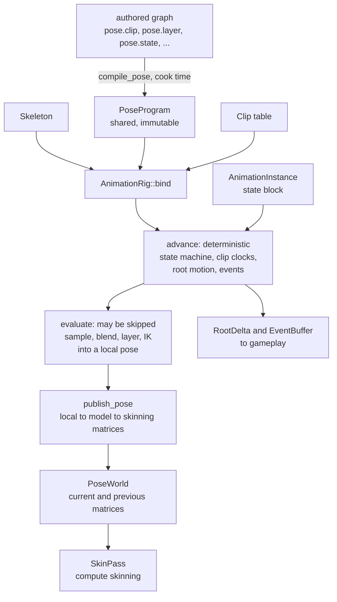
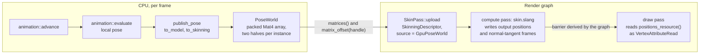

# Animation in CyberEngine

A tutorial for a gameplay or engine contributor: how a skeleton, a clip and a compiled animation
program become a pose, how a character and its clips get in from FBX, how the pose reaches the
skinning pass and the screen, and what is not built yet.

**Governed by**: [`animation-and-skinning`](../../openspec/specs/animation-and-skinning/spec.md)
(the runtime), with skinning in
[`rendering-geometry-and-resources`](../../openspec/specs/rendering-geometry-and-resources/spec.md),
import in [`asset-import-pipeline`](../../openspec/specs/asset-import-pipeline/spec.md) and ragdolls
in [`physics`](../../openspec/specs/physics/spec.md). The module READMEs linked below are the
detailed reference; this guide is the route through them. Where they disagree, the specification is
the contract and the module README says what the code does today.


*One frame of [`samples/09b-animated-character`](../../samples/09b-animated-character/README.md):
four Mixamo FBX exports imported, three clips retargeted onto the fourth's rig, a four-state machine
compiled and evaluated at a fixed step, and the mesh skinned by a compute dispatch. A still of a
skinned character looks the same as a still of a posed one, so the sample's claim is the video:
[`docs/design/videos/animated-character.mp4`](../design/videos/animated-character.mp4), idle to walk
to run to a death, 13 seconds at 30 frames per second.*

## Contents

1. [The model: skeleton, clip, pose, evaluation](#1-the-model-skeleton-clip-pose-evaluation)
2. [Importing a character and its clips from FBX](#2-importing-a-character-and-its-clips-from-fbx)
3. [Playing and blending: compiled pose programs](#3-playing-and-blending-compiled-pose-programs)
4. [IK and retargeting](#4-ik-and-retargeting)
5. [Skinning, and the frame path to the renderer](#5-skinning-and-the-frame-path-to-the-renderer)
6. [Ragdoll hand-off](#6-ragdoll-hand-off)
7. [Worked example: `samples/09b-animated-character`](#7-worked-example-samples09b-animated-character)
8. [Testing, debugging, pitfalls, and what is not built](#8-testing-debugging-pitfalls-and-what-is-not-built)
9. [Further reading](#9-further-reading)

---

## 1. The model: skeleton, clip, pose, evaluation

Animation is split across three places, and the split is the first thing to learn:

| Where | What | Namespace |
|---|---|---|
| [`src/animation/`](../../src/animation/README.md) | the runtime and the assets it names: skeleton, clip and codec, evaluation, LOD and the pose cache, IK, retargeting, the pose world | `cy::animation` |
| [`src/graph/`](../../src/graph/README.md) `lower_pose.h`, `locomotion.h` | the **compiler**: an authored graph of `pose.*` nodes lowered to a `PoseProgram` | `cy::graph::pose` |
| [`src/rendering/skinning/`](../../src/rendering/skinning/README.md) and `src/servers/render/geometry/` | the skinning compute pass and the buffer layouts it reads | `cy::rendering::skinning`, `cy::render::geometry` |

`src/animation/README.md` states the rule: *"The compiler is not here."* The runtime contains no
graph compiler, as the specification requires (*"Compilation SHALL occur at cook time; the runtime
SHALL contain no graph compiler"*).

### The types

| Type | Header | Shared or per instance | What it is |
|---|---|---|---|
| `Skeleton` | `cy/animation/skeleton.h` | shared | joints in parent-before-child order, bind poses, inverse bind matrices, bone LOD masks, per-joint bounds |
| `SkeletonProfile` | `cy/animation/skeleton.h` | shared | a side table mapping the 22 `HumanoidJoint` slots onto one skeleton's indices |
| `Clip` | `cy/animation/clip.h` | shared | tracks (`Translation`, `Rotation`, `Scale`, `Curve`, `Property`), 16-bit quantised keys, markers, events, a root motion joint |
| `PoseProgram` | `cy/graph/lower_pose.h` | shared, immutable | the compiled instruction array, states, transitions, masks, clip table and parameter names |
| `AnimationRig` | `cy/animation/evaluate.h` | shared | one skeleton + one program + the clips its clip table names |
| `AnimationInstance` | `cy/animation/evaluate.h` | per instance | the small state block: state machine position, parameters, one `ClipCursor` per clip, root motion, LOD tier, event policy |
| `PoseScratch` | `cy/animation/evaluate.h` | caller-owned, reused | pose buffers for one evaluation; reuse one across a whole batch |
| `PoseWorld` | `cy/animation/pose_world.h` | shared | current and previous skinning matrices per instance, and a `PoseHandle` per instance |

A pose is an array of `Transform` (translation, rotation, scale), one per joint, in the parent's
space. `Skeleton::to_model` turns it into model space in one forward loop, and
`Skeleton::to_skinning` multiplies by the inverse bind matrices. The loop has no recursion because
`add_joint` refuses a parent index that is not smaller than the joint's own:

```cpp
    /// Append a joint. `parent` must already have been added, or be `kInvalidJoint` for a root.
    [[nodiscard]] Expected<u16, Error> add_joint(Name name, u16 parent, const Transform& bind_local,
                                                 u8 dropped_at = kBoneLodLevels) noexcept;
```

`dropped_at` is the joint's bone level of detail: the first of the four levels (`kBoneLodLevels`)
at which it is not evaluated. `finalize()` refuses a child that outlives its parent.

The joint cap is 256 (`kMaxJoints`, from `graph::pose::kMaxJoints`), because a `JointMask` is a
fixed 256-bit mask. A larger rig is refused by the skeleton and by the importer. It is not
truncated.

### Evaluation: two halves



The two runtime calls do different jobs:

- **`advance(rig, instance, dt, events)`** moves the state machine and the clip clocks forward,
  integrates **root motion** and emits **events**. It samples no pose. It runs at every LOD tier,
  `Baked` included. Nothing that must be deterministic happens anywhere else.
- **`evaluate(rig, instance, bone_lod, scratch, out_local, stats)`** samples and blends the active
  state's tree into `out_local`. A LOD tier may skip it or run it less often, and a pose cache may
  stand in for it.

`evaluate()` is lazy: it starts at the active state's root instruction and walks only what that
reaches. A state no instance is in costs nothing, a layer at zero weight samples nothing, and a
masked layer samples only the joints in its mask. `EvaluationStats` (`clips_sampled`,
`joints_sampled`, `instructions_skipped`) reports this, and the tests assert it.

`out_local` must be seeded before `evaluate()`, usually with `Skeleton::reference_pose()`: a joint
that no track drives keeps whatever value it was handed.

### Why there are two evaluators

`cy::graph::pose::evaluate()` exists, and the frame does not call it. `src/animation/README.md`
gives two reasons. `cy::graph` does not depend on `cy::core-math`, so its pose is eight floats per
joint blended component by component, and a rotation blended that way is not a rotation. It also
allocates scratch per call. `cy::animation::evaluate()` walks the same program with the same
`PoseInstruction::required` masks, works over `Transform`, slerps properly, and allocates nothing.

---

## 2. Importing a character and its clips from FBX

FBX goes through [`tools/import/`](../../tools/import/README.md). ufbx is pinned in
`deps/manifest.toml` (`name = "ufbx"`, `v0.20.0`) and is private to `cy_import`: the ufbx calls are
in `src/fbx.cpp`, `src/fbx_skeleton.cpp` and `src/fbx_clip.cpp`, and the public headers take the
scene by an opaque `ufbx_scene` reference. A model import has ten numbered steps. Animation uses two
of them:

| Step | Header | Output | Needs `CY_ANIMATION`? |
|---|---|---|---|
| 7, skeletons | `cy/import/fbx_skeleton.h` (`import_fbx_skeleton`) | a `skeleton/` sub-asset: an `ImportedSkeleton` record (names, parents, bind poses, bone LOD, humanoid table) | no; the bytes are the same in every build |
| 8, animations | `cy/import/fbx_clip.h` (`import_fbx_animations`) | one `animation/` sub-asset per stack, compressed by `cy::animation::Clip`'s own codec | yes; the codec *is* the runtime's |

Since M11.b the cooked mesh also carries skin weights (`MeshData::skin`: four joint indices and four
weights per vertex, from ufbx's skin clusters), and glTF reaches steps 7 and 8 through the same
records (`cy/import/clip_record.h` is the one writer).

### What the importer decides for you

- **Coordinates and units are ufbx's conversion**: right-handed, Y up, metres. A bind pose is read
  from `local_transform`, the same field step 10 reads for the node table.
- **Humanoid slots are matched on the part of the name after the last `:`** (`humanoid_joint_of`).
  Mixamo writes `mixamorig:Hips` in one export and `mixamorig1:Hips` in the next, so matching the
  prefix would find nothing.
- **Bone LOD from names** (`joint_bone_lod`): fingers, twist joints and `_End` terminators are
  dropped at level 1, and everything else is kept at every level. The importer does not drop heads
  or toes. That choice depends on a game's camera distances, so the game makes it.
- **Every stack is imported.** A stack that animates nothing is skipped and reported by name. A
  file with one clip names the sub-asset after the source file (`animation/Walking`).
- **Root motion is off by default** (`animation-root-motion`, choices `none` and `root-joint`).
  The option description says why: the sampler still writes the designated joint's translation into
  the pose as well as reporting it as a delta, so a designated clip would be applied twice.

The step 8 options, all declared so that each one reaches the cook cache key: `import-animations`,
`animation-sample-rate` (default 30), `animation-key-reduction`,
`animation-translation-tolerance-mm` (default 0.1) and `animation-rotation-tolerance-degrees`
(default 0.1). The tolerances are in millimetres and degrees, not quality numbers. The codec
quantises what the fit kept on top of them, so the measured worst case in `CompressionReport` can
sit a little above the setting.

### From record to runtime

A cooked record is not a runtime object. `cy/import/animation_bridge.h` is the one function that
turns a skeleton record into a runtime skeleton:

```cpp
[[nodiscard]] inline Status build_runtime_skeleton(const ImportedSkeleton& skeleton,
                                                   animation::Skeleton& out,
                                                   animation::SkeletonProfile& profile) noexcept {
```

`read_cooked_clip` (`cy/import/fbx_clip.h`) reads a clip payload back as a `CookedClip`. The payload
carries its joint names, because a track addresses a joint by **index**, and `AnimationRig::bind`
checks only counts (the program's joints against the skeleton's, and the clip table's length), never
which joint a track means. `cy/import/animation_bridge.h` says: *"Nothing in the engine loads a cooked skeleton
yet — there is no runtime asset loader for `cy::animation::Skeleton` anywhere in the tree."* A
caller does the loading, as `samples/09b-animated-character/character.cpp` does (section 7).

From the command line, `cy_import_cli --list-importers` prints every importer and its options, and
`just content-import` wraps the CLI. Set an option with `--set NAME=VALUE`, for example
`--set animation-rotation-tolerance-degrees=0.05`.

---

## 3. Playing and blending: compiled pose programs

### The node vocabulary

`register_pose_nodes` registers nine node types, and `compile_pose` lowers them to seven ops
(`PoseOp`):

| Node | Op | Inputs | Properties it reads |
|---|---|---|---|
| `pose.ref` | `RefPose` | none | none |
| `pose.clip` | `SampleClip`, the only op that samples | none | `clip`, `duration`, `loop`, `time_parameter` |
| `pose.blend` | `Blend` | `a`, `b` | `mask_first`, `mask_count`, `weight_parameter` |
| `pose.blend_mask` | `BlendMask` | `a`, `b` | `mask_first`, `mask_count`, `weight_parameter` |
| `pose.additive` | `Additive` | `a`, `b` | `mask_first`, `mask_count`, `weight_parameter` |
| `pose.layer` | `Layer` | `a`, `b` | `mask_first`, `mask_count`, `weight_parameter` |
| `pose.ik` | `IK` | `a` | `chain` |
| `pose.state` | a `PoseState` | `pose` | `name` |
| `pose.transition` | a `Transition` | `from`, `to` | `condition`, `duration`, `priority`, `interruption` (`none`, `higher_priority`, `any`) |

The four two-input nodes are lowered by one branch of `lower_pose.cpp`, so each reads the same three
properties, although `cy::animation::evaluate()` applies a `BlendMask` at full weight and ignores
its weight parameter. A mask is a contiguous joint range (`mask_first`, `mask_count`), and a node
without both gets a mask of every joint. A graded weight per joint inside it is set on the rig with `AnimationRig::set_mask_weight(mask, joint, weight)`. Its default is 1, so a
program with no weights set follows its bit masks exactly.

Here is a walk with an upper-body aim layer masked to four arm joints, from
`src/animation/tests/test_evaluate.cpp`:

```cpp
    writer.node(1, "pose.clip");
    writer.prop(1, "clip", text("walk"));
    writer.prop(1, "time_parameter", text("walk_time"));
    writer.node(2, "pose.clip");
    writer.prop(2, "clip", text("aim"));
    writer.prop(2, "time_parameter", text("aim_time"));
    writer.node(3, "pose.state");

    if (with_layer) {
        writer.node(4, "pose.layer");
        // The arm, from the shoulder to the finger: four joints of twelve.
        writer.prop(4, "mask_first", integer(kShoulder));
        writer.prop(4, "mask_count", integer(4));
        writer.prop(4, "weight_parameter", text("aim_weight"));
        writer.link(1, "pose", 4, "a");
        writer.link(2, "pose", 4, "b");
        writer.link(4, "pose", 3, "pose");
```

compiled, bound and evaluated with:

```cpp
    CY_REQUIRE(graph::pose::register_pose_nodes(harness.registry).has_value());

    Graph graph(allocator(), Name::intern("locomotion"));
    CY_REQUIRE(build_locomotion(graph, true, true).has_value());
    graph.resolve(harness.registry);
    DiagnosticSink sink(allocator());
    auto program = graph::pose::compile_pose(graph, harness.registry, kJointCount, sink);
```

then `AnimationRig::bind`, `AnimationInstance::prepare`, `PoseScratch::prepare`,
`instance.set_parameter(rig, Name::intern("aim_weight"), 1.0F)` and `evaluate`. The test checks that
two clips are sampled rather than three, and that the layer samples four joints rather than twelve.
This is **pose dependency analysis**: `analyse_dependencies` fills `PoseInstruction::required`, and
the sampler is only given that mask.

### State machines

States and transitions are part of the program. `graph::pose::advance` checks transitions **from
the current state only**. A transition fires when its `condition` parameter is non-zero. It blends
over `duration` seconds, and a duration of zero is a cut. A running transition with `interruption`
`none` (also the result of an unrecognised value) runs to completion; `higher_priority` lets a
candidate with a higher `priority` take over; `any` lets any valid candidate take over.

Parameters are one flat `f32` array named by `PoseProgram::parameters()`. Set them through
`AnimationInstance::set_parameter(rig, name, value)`, or index `parameters()` directly when you have
resolved the indices once. **Clip clocks are parameters too**: `time_parameter` names the parameter
that `SampleClip` reads. `advance()` moves every clock by `dt * play_rate` and wraps it by the clip's
duration.

### A machine the engine writes: `locomotion.h`

The editor cannot save an animation graph asset yet (section 8), so
[`cy/graph/locomotion.h`](../../src/graph/include/cy/graph/locomotion.h) writes one in code. It
builds `pose.clip`, `pose.state` and `pose.transition` nodes and passes them to `compile_pose`. This
is not a second compiler:

```
        request_walk           request_run
   idle ------------> walk ---------------> run
        <-----------       <---------------
        request_idle           request_walk

   idle, walk and run each ------ request_die -----> die  (terminal)
```

Three decisions are built in. There is **no `run -> idle` edge**. **Death outranks locomotion and
cannot be interrupted** (`kDeathPriority = 9` against `kLocomotionPriority = 1`). **A zero blend
duration is refused.** `die` has no outgoing transition, and its clip is `looping = false`, so
`clip_time()` holds the clock on the last frame. `LocomotionSpec` sets the five blend durations
(defaults: `idle_to_walk` 0.20 s, `walk_to_run` 0.15 s, `run_to_walk` 0.25 s, `walk_to_idle`
0.25 s, `to_die` 0.30 s). `compile_locomotion` is the one call a cook makes. `LocomotionDriver` binds the eight
parameters (four requests, four clocks) by name, and `request(state)` raises exactly one request.

### Layers, additive, masks, sync groups, curves

- **Layers and masks**: `pose.layer` and `pose.blend_mask`, as above.
- **Additive**: `pose.additive` applies `b` over `a` at a weight.
- **Sync groups and markers**: `Clip::add_marker`, `Clip::marker_time` and the `SyncGroup` and
  `SyncMarker` tables in `PoseProgram` exist, but **`compile_pose` does not populate the sync
  tables, and the evaluator does not align clips by marker**. A walk-to-run blend today uses each
  clip's own clock.
- **Curves**: a `TrackKind::Curve` track is read with `Clip::sample_curve(name, time, cursor, out)`.
- **Property tracks** bind by `TypeId` and `FieldId`, not by a name path. Resolve them once with
  `resolve_properties`, which reports bindings it cannot resolve rather than failing, and write them
  with `Clip::write_properties`.

### Events

Events are data written to an `EventBuffer`, never callbacks. Pass a buffer to `advance()` (or call
`emit_events` directly). Each crossing produces one `EmittedEvent` (`instance`, `name`,
`normalised_time`, `parameter`), in time order, and again on the next loop. With
`EventPolicy::Suppress` on the instance, crossings are counted in `EventBuffer::suppressed()`
instead of being emitted. That is the hook for keeping a distant crowd from flooding the buffer with
footsteps.

### Root motion

Root motion is gameplay state, so it is computed in `advance()` from the clips' root tracks and
weighted by the same blend weights the pose tree uses. It is never derived from a pose. Read the
per-tick delta from `AnimationInstance::root_motion()` (a `RootDelta`: `translation`, `rotation`,
`distance`, `contacts`) and the running total from `travelled()`. Designate the joint with
`Clip::set_root_motion_joint`. Read the pitfall in section 8 before you enable it on an imported
clip.

### Batches and LOD

`AnimationBatch` holds the instances that share one rig. `advance_all(dt, events)` makes one pass
over packed state, and `evaluate_range(first, count, bone_lod, scratch, poses, stats)` is the unit
of work a job worker takes. `samples/08-vertical-slice` animates its characters this way
(`Slice::animate` in `tick.cpp`): `advance_all` for everyone, then `evaluate_range` over a bounded
window of at most `kEvaluatedPoses` instances that moves each tick.

`lod.h` has the four tiers from the specification's table:

| Tier | `bone_lod_for` | `evaluation_hertz` | Evaluates a pose | Runs IK | May use the pose cache |
|---|---|---|---|---|---|
| `Full` | 0 | 0 (every frame) | yes | yes | no |
| `Simplified` | 1 | 30 | yes | no | yes |
| `Cached` | 2 | 12 | yes | no | yes |
| `Baked` | 3 | 0 | no | no | yes |

`select_tier(policy, inputs, current)` takes distance, coverage, visibility, importance and a pin,
and deliberately no frame time. It applies hysteresis. `LodPolicy::authoritative` keeps an instance
at `Simplified` or above. `evaluate()` reads the instance's tier only to gate IK, and
`AnimationBatch::evaluate_range` leaves a `Baked` instance at the reference pose. **Choosing the
evaluation rate and the bone LOD passed in are the caller's job**, and so is filling a `PoseCache`
(keyed on clip, phase bucket and bone LOD) and applying `PoseVariation` over a shared pose. None of
that is automatic.

---

## 4. IK and retargeting

### IK

[`cy/animation/ik.h`](../../src/animation/include/cy/animation/ik.h) is the constraint framework in
its current, small form:

- `solve_two_bone(skeleton, chain, target, weight, local)` solves a root, mid, tip chain with a pole
  vector. An unreachable target straightens the chain toward it, and a weight of zero changes
  nothing.
- `solve_look_at(skeleton, joint, target, weight, local)`.
- `ConstraintDecl` declares the `reads` and `writes` joint masks and an `order`.
  `detect_conflicts` reports two constraints that write one joint at the same order, and names both.
- **In a graph**, `pose.ik` lowers to `PoseOp::IK` over chain `chain`. The chain comes from
  `AnimationRig::set_ik_chain(index, IkChain{...})`. Its target is three consecutive program
  parameters starting at `target_param`, in model space, and its weight is `weight_param`. An `IK`
  instruction whose chain was never set is skipped and counted, and IK runs only at `Full` tier.

FABRIK, CCD, spline IK, full-body IK, spring bones and foot placement are **refused by name**:
`solve_unimplemented(UnimplementedSolver::FullBodyIk)` returns `NotImplemented`, and
`unit.animation` asserts that it does.

### Retargeting

A clip's tracks are absolute local transforms indexed by joint. To play a clip authored for one rig
on another, map it through a `RetargetProfile` ([`retarget.h`](../../src/animation/include/cy/animation/retarget.h)).
The profile holds joint **index** pairs grouped by semantic `Chain` (`Root`, `Spine`, `Neck`,
`Head`, `LeftArm`, `RightArm`, `LeftLeg`, `RightLeg`) and compares no names. Rotations are
transferred. Bone lengths are not: only the root chain's translation crosses, scaled by the ratio of
the two rigs' hip heights. That is what keeps a shorter character's feet on the ground.

[`retarget_build.h`](../../src/animation/include/cy/animation/retarget_build.h) builds the pairs:

- `compare_rigs(source, target)` returns a `RigMatch`. If two rigs are `congruent` (same joint
  count, same parent per joint) **and** `same_rest_pose`, a clip binds to the other rig unchanged
  and no retarget is needed.
- `build_retarget_profile(source, source_humanoid, target, target_humanoid, profile, report)`
  chooses `Correspondence::Congruent` (joint for joint, fingers included) when the hierarchies
  match, and `Correspondence::Humanoid` (the 22 standard joints) otherwise. **It refuses to build a
  profile that maps nothing**, because an empty profile leaves the character in its bind pose on
  every frame and nothing reports it.

Retarget in one of two ways:

| | Call | Cost |
|---|---|---|
| At runtime | `RetargetProfile::retarget_pose(source, target, source_local, target_local)` after the source is evaluated | one quaternion multiply and one composition per mapped joint, per evaluation |
| At cook time | `bake_clip(allocator, profile, source, target, clip, sample_rate, settings, out)` | nothing at runtime; one clip of memory per source and target pair |

`retarget.h` recommends baking for the combinations a game ships, and the runtime path for content
it did not ship with.

---

## 5. Skinning, and the frame path to the renderer

### CPU and GPU

| Path | Where | Used for |
|---|---|---|
| GPU compute | `skin.slang`, driven by `cy::rendering::skinning::SkinPass` | every skinned pixel in the tree |
| CPU | `cy::render::geometry::cpu_reference_skin` in `skin_dispatch.h` | the **reference** the dispatch is tested against, vertex by vertex; not a runtime skinning path |

`skin.slang` is written in the same order as the reference, expression for expression. Its README
calls the chain of evidence *"paper → reference → dispatch → pixels"*. It does linear blend
skinning by default. Dual quaternion skinning (`SkinningMethod::DualQuaternion`) and blend shapes
(applied to the bind pose before the skin) are in the same entry point. Four or eight influences
per vertex are selectable (`InfluenceCount`). The compiled SPIR-V and MSL are committed headers
(`src/skin_spirv.h`, `src/skin_msl.h`), written by `shaders/embed_spirv.py` and `embed_msl.py`.
The exact `slangc` invocations are in `skin.slang`'s header comment; this module has no
`regenerate.py`. The [Slang guide](slang.md) covers the embed flow in general.

### The frame path



In order:

1. `publish_pose(skeleton, local, bone_lod, world, handle, model_scratch, matrix_scratch)` runs
   local to model to skinning matrices and publishes them. `PoseWorld::publish` swaps current and
   previous without copying, so **`matrix_offset(handle)` changes every frame**. Read it each frame
   when you build the descriptor. Never cache it.
2. Build a `render::geometry::SkinningDescriptor` with `source = PoseSource::GpuPoseWorld` and
   `pose_offset = world.matrix_offset(handle)`. `validate()` rejects a `Baked` tier instance
   claiming a place in the world and a per-skin upload with a non-zero offset.
3. `SkinPass::upload(descriptor, world.matrices(), frame_index)` packs the bones into the pass's
   bone buffer. `frame_index` selects which half of the double-buffered output the dispatch writes,
   so the other half keeps the previous frame's positions for motion vectors.
4. `SkinPass::declare(graph)` adds the compute pass. The draw pass reads
   `positions_resource()` with `Access::VertexAttributeRead`. The render graph derives the barrier,
   and the skinning module emits none of its own.

**What "GPU pose world" means today.** `PoseWorld` holds the packed matrix array and a dirty range
(`upload_offset`, `upload_size`, `clear_upload_range`). *"NO DEVICE, NO BUFFER, NO UPLOAD"*: the
renderer is meant to own one shared device buffer. No renderer code reads the dirty range yet.
`SkinPass::upload` copies the matrices it is given into its own host-mapped bone buffer, and one
`SkinPass` skins one mesh, driven by hand. `src/rendering/skinning/README.md` says: *"There is no
per-instance skinning table and no dispatch that skins a scene's worth of characters in one
submit."*

**The engine's forward frame does not draw a skinned mesh yet.** `samples/09b-animated-character`
binds the dispatch output with its own pipeline. Its README explains why `FramePipelines` cannot
take the skinned normal stream (`Rgba16Sfloat` against the 16-bit snorm `PackedNormalTangent`).

### The iOS RTS load

The iPhone scenes in [building.md](building.md#rts-capacity-scene) show 500 GPU-skinned models (18,000
vertices in one batch, 35.13 FPS median on an iPhone 16). They exercise the **skinning pass on
Metal**, not the animation runtime. `samples/11-ship/ios/main.mm` builds a five-bone pose from `sin`
in `upload_animation` and uploads it with `PoseSource::UploadedPerSkin`. The models share that one
pose. No skeleton, clip, program or `PoseWorld` is involved.

---

## 6. Ragdoll hand-off

Ragdolls live at the animation and physics boundary in `src/physics/ragdoll/`
(`cy::physics::ragdoll`), which is built only with `CY_ANIMATION=ON`. It runs over `PhysicsServer`.
The reference backend reports constraints as unsupported (`Capabilities::constraints`), so
`activate` there fails with `Unsupported` before any body is allocated. A real ragdoll needs a backend
with constraints, which in this tree is Jolt (`src/backends/physics-jolt/`, `CY_PHYSICS=ON`).

1. `Profile::generate(skeleton, allocator)` builds one `BoneProfile` per joint (primitive shape,
   `mass`, swing and twist limits, `motor_torque`, `motor_frequency`), which you can then refine by
   hand.
2. `Ragdoll ragdoll(server, world, skeleton, profile, allocator)`.
3. `activate(current, previous, actor_world, previous_actor_world, dt, activation)` takes the
   **current and previous model-space poses**, so the bodies start at the animated pose *and
   velocity*. That is the specification's *"Death is not a switch"*. `Activation::mode` is
   `Mode::Full` (all bodies simulated), `Mode::Powered` (root kinematic, motors follow the
   animation) or `Mode::Partial` (a per-bone weight in `partial_weights`, where zero stays animated).
   `blend_seconds` fades the physics in.
4. Each fixed step: `set_animation_target(model_pose, actor_world, dt)` before the physics step,
   then `advance_blend(dt)` after it, then `sample_pose(animation_model, actor_world, out_model)`.
5. `apply_hit(joint, impulse, recovery_seconds)` is a hit reaction that blends back to the mode's
   base weight.
6. `deactivate()`, or destroy the `Ragdoll`, **before** the physics world is destroyed.

`sample_pose` returns a **model-space** pose. To skin it, either convert it back to local space and
call `publish_pose`, or call `Skeleton::to_skinning(model, skeleton.retained(0), matrices)` and
`PoseWorld::publish(handle, matrices)` directly. No sample in the tree wires a ragdoll to a skinned
character yet. The coverage is `integration.physics_ragdoll`: *"partial ragdoll keeps locomotion
animated while the arm reacts and blends back"*, *"full ragdoll seeds animated pose and world
velocity, then blends continuously"* and *"powered ragdoll motor tracks animation after an impulse
and hit weight recovers"*.

---

## 7. Worked example: `samples/09b-animated-character`

The sample is the first program that joins every link from sections 2 to 5 in one binary. Its
[README](../../samples/09b-animated-character/README.md) is the full account. This section follows
the code.

### Running it

It needs a graphics device and four Mixamo exports that are **not in the repository** and not
redistributable: `Breathing Idle.fbx`, `Walking.fbx` (the only one with a mesh), `Running.fbx` and
`Dying Backwards.fbx`.

```sh
just capture-animated-character --sources <directory holding the four .fbx files>
```

The recipe (`just/run.just`) builds the engine, runs
`build/<profile>/samples/09b-animated-character/cy_sample_animated-character --frames ... --still ...`,
and encodes the video with `tools/docs/collect_animated_character.py`. Its other flags are
`--profile`, `--seconds` (default 13), `--width` (960), `--height` (540) and `--fps` (30, or
`CY_CAPTURE_FPS`). Always pass `--sources`: the built-in default in `main.cpp` is a path on one
developer's machine. The frames are written under the build directory, not `/tmp`, because the PNG
writer does not compress: the recipe's comment puts three hundred frames at 960x540 at about half a
gigabyte, and the default take is 390 frames. The frames are deleted when the recipe finishes.

The sample has no CTest entry, because it needs both a device and the four files. Each link under it
is tested on its own (section 8).

### Import, retarget, compile

`character.cpp`'s `load_character` imports each file with `import::FbxImporter`, reads the
`skeleton/` and `animation/` sub-assets back (`read_cooked_skeleton`, `build_runtime_skeleton`,
`read_cooked_clip`), and retargets the three animation-only rigs onto the mesh's rig:

```cpp
        const animation::RigMatch match = animation::compare_rigs(source_rig, out.skeleton);
        report.rest_difference_degrees = match.worst_rest_rotation_degrees;
        report.rest_difference_metres = match.worst_rest_translation;
        report.retargeted = true;

        animation::RetargetProfile profile(allocator);
        animation::RetargetBuildReport retarget;
        if (Status built = animation::build_retarget_profile(
                source_rig, source_humanoid, out.skeleton, out.humanoid, profile, retarget);
            !built) {
            return built;
        }
```

All four rigs have the same 65-joint hierarchy, so the correspondence is congruent. Their rest poses
differ by up to 29.89°, and the bake absorbs that difference. The clips are then baked with
`bake_clip`, named `idle`, `walk`, `run` and `die` (`motion_name`), and `die` is set to
`LoopMode::None`. `main.cpp` compiles the machine with `compile_locomotion`, using a `LocomotionSpec`
(`spec_for`) whose clip durations are the imported clips' own and whose blend durations are the
defaults. `build_clip_table` then matches `program.clips()` to the clips
**by name**, and an unmatched name is an error. A null entry would be legal to `AnimationRig::bind`
and would silently give the reference pose.

### One frame

`main.cpp`'s `step` is the whole per-frame path. The step is fixed at `1/--fps` with no wall clock,
so two runs produce the same pose at the same frame index:

```cpp
    // 1. The request. Exactly one is raised; the machine decides whether it has an edge for it.
    take.driver.request(requested_at(seconds));
    Span<f32> parameters = take.instance.parameters();
    for (usize index = 0; index < parameters.size(); ++index) {
        parameters[index] = take.driver.parameters()[index];
    }

    // 2. The deterministic half: the state machine, the clip clocks, root motion and events.
    if (Status advanced = animation::advance(take.rig, take.instance, dt, nullptr); !advanced) {
        return advanced;
    }
```

Step 3 overwrites the clip clocks with the sample's own `StateClocks` (see the pitfalls below). Then:

```cpp
    // 4. The pose. The seed is mandatory: only the joints a track wrote are copied out, so a joint
    //    no clip drives keeps whatever it was handed.
    character.skeleton.reference_pose(take.local.span());
    animation::EvaluationStats stats;
    if (Status evaluated =
            animation::evaluate(take.rig, take.instance, 0, take.scratch, take.local.span(), stats);
        !evaluated) {
        return evaluated;
    }

    // 5. Local to model to skinning matrices, published into the pose world. `matrix_offset` moves
    //    on every publish, which is what the double buffering IS.
    if (Status published =
            animation::publish_pose(character.skeleton, take.local.span(), 0, take.world,
                                    take.handle, take.model.span(), take.matrices.span());
        !published) {
        return published;
    }
```

`stage.cpp`'s `Stage::shoot` builds the descriptor from the offset it was just given, uploads it,
and declares the skin pass into a render graph ahead of its draw:

```cpp
    descriptor.pose_offset = pose_offset;
    descriptor.influences = render::geometry::InfluenceCount::Four;
    descriptor.method = render::geometry::SkinningMethod::LinearBlend;
    descriptor.source = render::geometry::PoseSource::GpuPoseWorld;
    descriptor.tier = render::geometry::AnimationTier::Full;
    if (Status uploaded = device_->skin.upload(descriptor, pose, frame_index); !uploaded) {
        return uploaded;
    }
```

The request schedule (`kSchedule`) is idle at 0.0 s, walk at 2.0 s, run at 4.5 s, walk at 7.0 s
(the machine has no run-to-idle edge, so it slows down through the walk), and die at 8.0 s. The take
is 13 seconds long because the death clip lasts 4.6 s and then holds on its last frame.

### What the capture does and does not show

Read the sample README before quoting the video:

- **The committed video was captured with a derived skin**, not the artist's weights. It was taken
  at M8.d, before M11.b taught the importer to keep skin weights. `derive_influences` binds by
  distance to each bone, so a few vertices at the hips stretch between the legs during the run. The
  program now prefers the file's weights and prints `skin  IMPORTED` or
  `skin  DERIVED, NOT IMPORTED`. A new capture made with imported weights should not show the
  stretching.
- **The character runs in place.** All four exports are in-place takes, so there is no forward
  motion. The death is the exception: the hips end 0.9 m behind their start.
- **Shading is flat.** Normals are rebuilt from screen-space derivatives because the forward frame
  cannot bind the skinned normal stream (section 5).

---

## 8. Testing, debugging, pitfalls, and what is not built

### Suites

| Suite | What it covers |
|---|---|
| `unit.animation` | skeleton order and bone LOD, clip compression and cursors, tier selection and the pose cache, IK conflicts and the two-bone solver, retargeting and profile building |
| `integration.animation_runtime` | compiling a graph, laziness, the state machine blend, root motion across tiers and rates, a batch of five hundred, events, the pose world handoff to a real `SkinningDescriptor`, and the export retargets |
| `integration.animation_teardown` | 64 rounds of building and tearing down rigs, batches and pose worlds under load |
| `integration.graph_compiler` | the pose lowering and `locomotion.h`'s machine |
| `integration.import_fbx_skeleton`, `integration.import_fbx_clip`, `integration.asset_import_gltf` | FBX skeleton, skin and clip import, and glTF skins and animations |
| `unit.render_geometry` | `cpu_reference_skin` against values worked out on paper, the descriptor rules, dual quaternions |
| `render.skinning`, `render.skinning_metal`, `render.skinned_draw` | the dispatch against the reference on Vulkan and on Metal, and a draw of its output |
| `integration.physics_ragdoll` | profile generation, full, powered and partial ragdoll, hit recovery, rollback |

```sh
just test-suites unit:^unit.animation$ integration:^integration.animation integration:^integration.graph_compiler$
just test-suites integration:^integration.import_fbx integration:^integration.asset_import_gltf$ integration:^integration.physics_ragdoll$
just test-suites render:^render.skinn
```

`-D CY_ANIMATION=OFF` removes `src/animation/`, its three suites and the ragdoll module, and static
meshes still render. It does not remove `cy::graph`'s pose lowering, which belongs to
`visual-scripting`.

**Requirements coverage.** `tools/roadmap/requirements-coverage.toml` has **no rows for
`animation-and-skinning` yet**. The nearby rows are `physics` → *Soft bodies and additional
simulation* (the ragdoll case above) and `rendering-geometry-and-resources` → *Skinning*
(`unit.render_geometry`, *"skin dispatch: the pose offset addresses this skin's slice of the shared
world"*). `just quality-requirements animation-and-skinning` reports the gap. M11.b's ledger
(`tools/roadmap/milestones/m11b.toml`) carries it as a `known_gap`, declared at M11.c, that M11.e's
`every-requirement-maps` is to sweep.

### Determinism

- Root motion and events come from `advance()` only. `integration.animation_runtime`'s *"animation:
  root motion is integrated whatever the tier and whatever the rate"* runs sixty ticks at 60 Hz
  against ten at 10 Hz with the slow instance at `Baked` tier (no pose at all), and requires both the
  same distance and an identical replay.
- `select_tier` takes no frame time. Choose tiers from simulation state for any instance whose root
  motion is authoritative.
- The import is deterministic too: *"fbx: two imports of one animated file produce byte-identical
  clips"* and *"fbx skeleton: two imports of one rig produce byte-identical skeletons"*.

### Debugging

The diagnostics exist as numbers and nothing draws them yet: `EvaluationStats`,
`CompressionReport`, `PoseCacheStats`, `PoseWorldStats`, `LodDistribution`, `RetargetReport`,
`RetargetBuildReport` and `ConflictReport`. `samples/09b-animated-character`'s *worst joint step
between two frames* measurement is a good model. A character frozen in one pose has it at zero, and a
clock that jumps shows it as a spike. That measurement found both defects listed below.

| Symptom | Likely cause | Where to look |
|---|---|---|
| Character stands in its bind pose, no error | a null clip-table entry, or a retarget profile that maps nothing | match `program.clips()` by name and fail on a miss; `build_retarget_profile` now refuses the empty profile |
| Wrong limbs move | a clip bound to a different rig's joint indices (`bind` checks only counts) | `compare_rigs`, then retarget; the cooked clip carries its joint names |
| Joints not driven by any clip are garbage | `out_local` not seeded before `evaluate()` | `Skeleton::reference_pose()` |
| Skin reads last frame's bones or runs off the end | a cached `pose_offset` | read `matrix_offset(handle)` every frame; `SkinPass::upload` rejects an out-of-range offset |
| Character moves twice as far | root motion joint designated *and* its translation still in the pose | keep `animation-root-motion=none`, or ignore the root in the pose |
| A blend visibly pops | a zero-duration transition, which is a cut | `build_locomotion_graph` refuses it; check hand-authored `duration` |
| `NotImplemented` from an IK call | FABRIK, CCD, spline, full-body, spring bones or foot placement | not built; see below |

### Known defects, worked around in the sample

Both are still in the tree. The sample works around them in place and records why:

1. **`bake_clip` ends a baked clip on the source's first frame.** It resamples
   `floor(duration * rate) + 1` frames, so the last sample is at exactly `duration`, and a
   `LoopMode::Loop` source wraps that to zero. FBX has no loop flag, so every imported clip arrives
   as `Loop`. Workaround: set the source clip to `LoopMode::None` for the bake
   (`character.cpp`).
2. **A state's clip clock restarts when its incoming blend completes.** `graph::pose::advance` sets
   `state_time = 0` at that moment, and `animation::advance` resets the state's clip clocks on a
   state change (`reset_state_times`), so the incoming clip jumps back by one blend duration.
   Relatedly, `animation::advance` wraps every clock by its clip's duration whatever the loop flag,
   so a non-looping clip restarts. Workaround: the host keeps its own clocks (`StateClocks` in
   `main.cpp`) and writes them through `clip_time()` after `advance()`.

### Not built yet

From `src/animation/README.md`'s own table, and from the tree:

- **Motion matching and pose search**, **animation warping** (motion, stride, orientation, distance
  matching), **clip streaming**, **control rig** assets, **facial animation** (visemes and the ML
  path; blend shapes exist on the renderer side), **tweens**.
- **Graph nodes the specification lists but the compiler does not have**: `Blend1D`, `Blend2D` and
  `Custom`. Transitions have a condition, a duration, a priority and an interruption rule, and no
  exit-time or automatic transitions. Sync groups exist in the data structures and are not compiled
  or honoured (section 3).
- **Cubic interpolation** is accepted and stored as linear (no tangents).
- **Full-body IK, FABRIK, CCD, spline IK, spring bones, foot placement**: refused by name.
- **No ECS integration.** `ecs::Stage::Animation` exists and runs each frame, but the engine installs
  no animation system in it. Samples call `advance` and `evaluate` themselves. There is no runtime
  asset loader for a cooked skeleton or clip.
- **No Swift API.** `bindings/swift` has `SystemStage.animation`, the stage enumerator, and nothing
  else for animation: no skeleton, clip, parameter, event or root-motion calls cross the ABI.
  Gameplay in Swift cannot drive a character's animation today.
- **Editor.** The model has the pieces and the app has no animation editor.
  `cy-editor-interface`'s `specialised` module declares `Domain::AnimationGraphsAndClips` with a
  graph palette of the nine `pose.*` node names (`POSE_NODES`, *"names only"*, with no pins) and the
  shared timeline surface (`specialised/timeline.rs`, whose `TrackKind::Animation` is *"An animation
  clip on a bound skeleton"*). The desktop shell docks an **Animation** tab, but it is the pending
  panel: *"The animation editor arrives with the animation capability."* There is no rigging
  workspace, weight painting or retarget preview, and the editor cannot save an animation graph.
- **Renderer integration**: one `SkinPass` per mesh, driven by hand. There is no shared device pose
  buffer, no scene-wide skinning table and no skinned draw in the forward frame (section 5).

---

## 9. Further reading

In this tree:

- [`openspec/specs/animation-and-skinning/spec.md`](../../openspec/specs/animation-and-skinning/spec.md): the contract, thirty requirements
- [`src/animation/README.md`](../../src/animation/README.md): the runtime, its five design decisions, and what is absent
- [`src/graph/README.md`](../../src/graph/README.md) and [`lower_pose.h`](../../src/graph/include/cy/graph/lower_pose.h): the pose IR, the compiler and the locomotion builder
- [`tools/import/README.md`](../../tools/import/README.md), [`fbx_skeleton.h`](../../tools/import/include/cy/import/fbx_skeleton.h) and [`fbx_clip.h`](../../tools/import/include/cy/import/fbx_clip.h): steps 7 and 8
- [`src/rendering/skinning/README.md`](../../src/rendering/skinning/README.md): the compute pass
- [`src/servers/render/geometry/include/cy/servers/render/geometry/skinning.h`](../../src/servers/render/geometry/include/cy/servers/render/geometry/skinning.h): `SkinningDescriptor` and `PoseSource`
- [`src/physics/README.md`](../../src/physics/README.md): the ragdoll paragraph
- [`samples/09b-animated-character/README.md`](../../samples/09b-animated-character/README.md): the worked example and its two findings
- [`samples/08-vertical-slice/README.md`](../../samples/08-vertical-slice/README.md): batched evaluation of a crowd
- [Building and running](building.md#rts-capacity-scene): the iOS skinning load
- [Slang in CyberEngine](slang.md): how `skin.slang` is compiled and embedded
