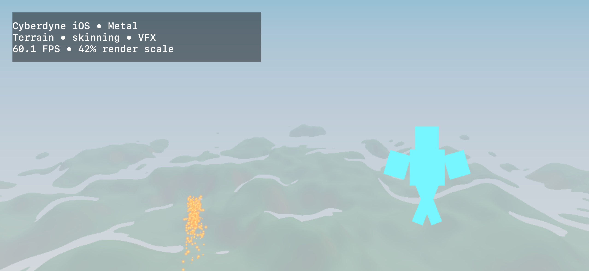
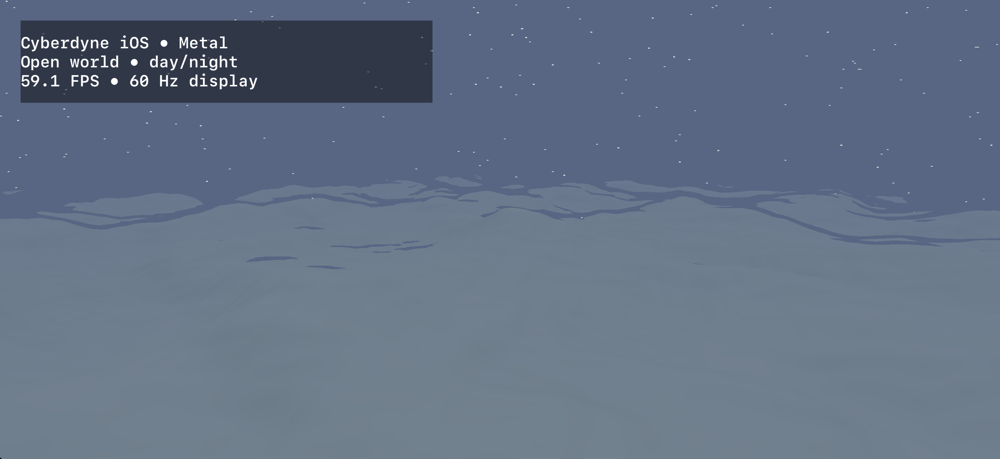

# Building and running CyberdyneEngine

How to install the toolchain, build the engine and the editor, and run them on Linux, macOS and iOS.
The [root README](../../README.md) has the short version; this page has the detail.

`just` is the entry point for every task. Run `just` on its own to list every recipe with a
description, and see [`just/README.md`](../../just/README.md) for how the recipe files are organised.
[`CONTRIBUTING.md`](../../CONTRIBUTING.md) covers profiles, building through CMake directly, and the
change workflow.

Contents:

- [Linux](#linux)
  - [Prerequisites](#prerequisites)
  - [First build](#first-build)
  - [Vulkan](#vulkan-m3--first-light)
  - [Swift](#swift-m4--playable)
  - [Rust](#rust-m5--authorable)
- [macOS: building and running the Metal editor](#macos-building-and-running-the-metal-editor)
- [iOS](#ios)
- [CI targets](#ci-targets)

---

## Linux

Reference platform: **Ubuntu 24.04 LTS "noble"** and derivatives (Linux Mint 22.x). Other
distributions work; only the package names differ.

### Prerequisites

Everything the engine *links* — SDL3, doctest, Tracy, zstd, BLAKE3, Jolt, Slang and the rest — is
fetched and built from source by CMake at pinned commits recorded in
[`deps/manifest.toml`](../../deps/manifest.toml). You do not install those. What you install is the
toolchain, plus the system libraries SDL3 itself links against.

```bash
# Toolchain
sudo apt install -y build-essential clang cmake ninja-build git just pkg-config python3

# System libraries SDL3 builds against (windowing, input, audio, IME)
sudo apt install -y libx11-dev libxext-dev libxrandr-dev libxcursor-dev libxi-dev \
                    libxfixes-dev libxkbcommon-dev \
                    libwayland-dev wayland-protocols libdecor-0-dev \
                    libudev-dev libasound2-dev libpulse-dev libibus-1.0-dev
```

`libudev-dev` is not optional in practice — it is what gives SDL3 gamepad hot-plug on Linux, which
[`core-platform-abstraction`](../../openspec/specs/core-platform-abstraction/spec.md) requires.

**The six `libx*-dev` packages are the ones a missing header turns into a configure error rather
than a missing feature**, and `.github/workflows/ci.yml` installs exactly them —
`tools/ci/check_workflows.py` fails when the two lists drift, which is how M9's closing gate found
that they had been apart since M0 and that no continuous-integration run had ever gone green.
`libxss-dev` was in this list and is not needed: `cmake/dependencies.cmake` forces
`SDL_X11_XSCRNSAVER` off — each X11 extension left on "is a -dev package every Linux contributor
must have installed for a feature no code uses" — and says in the same comment that it rejoins this
list on the day an idle-inhibition policy lands.

| | Minimum | Why |
|---|---|---|
| CMake | **3.28** | Required by [`build-system-and-platforms`](../../openspec/specs/build-system-and-platforms/spec.md); presets and target-level layering |
| Ninja | 1.11 | The default generator |
| Clang | 17 | Or GCC 13, AppleClang 15, MSVC 19.38 (`cmake/compilers.cmake`). The engine is C++20 with `-fno-exceptions -fno-rtti` |
| just | 1.21 | What `just env-doctor` requires; noble ships 1.21 |
| Python | 3.10 | Code generation and the layering, roadmap and dependency tools |
| clang-format, clang-tidy | 22.1.8, pinned | The formatting and lint merge gates refuse another major: `pip install clang-format==22.1.8 clang-tidy==22.1.8` |
| openspec | 1.14.0, pinned | `just quality-specs` is a merge gate, and a newer CLI can add `--strict` failures: `npm install -g @fission-ai/openspec@1.14.0` |

### First build

```bash
git clone https://github.com/CyberdyneCorp/CyberdyneEngine.git && cd CyberdyneEngine

just env-doctor      # checks every tool above and names the fix for anything missing
just build-engine    # configure and build, dev profile
just test-unit       # under a minute
just run-sample empty
```

Four profiles — `debug`, `dev`, `profile`, `release` — mean the same thing across every toolchain
([`developer-workflow-and-just`](../../openspec/specs/developer-workflow-and-just/spec.md)).
`just build-all` builds the engine and the editor together.

The toolchains below were each added by the milestone that first needed them. `just env-doctor`
checks Swift (as advisory); it does not yet check Rust or the Vulkan validation layers, and its
"not checked yet" list says so.

### Vulkan (M3 · First light)

You also need a working driver and ICD; Mesa or the proprietary NVIDIA/AMD drivers provide one, and
`/usr/share/vulkan/icd.d/` is where to check.

```bash
sudo apt install -y libvulkan-dev vulkan-tools vulkan-validationlayers spirv-tools glslang-tools
vulkaninfo --summary        # must list a device, with its apiVersion
vkcube                      # a spinning cube confirms the swapchain path works
```

There is no `vulkan-validationlayers-dev` on noble — that package name is from 22.04 and was
dropped. Noble's `vulkan-tools` is from SDK 1.3.275 while a current driver will report Vulkan 1.4;
that mismatch is fine, and the LunarG SDK is only worth adding if newer validation coverage turns
out to be needed.

Shaders are written in Slang and compiled to SPIR-V by the engine's own shader pipeline
(`src/backends/shader/`); Slang is one of the pinned dependencies, so there is nothing extra to
install. See [the Slang guide](slang.md).

### Swift (M4 · Playable)

The Swift toolchain, via swift.org's own installer. Two things about this install are not obvious
and both have already cost time; they are written out below rather than left to be rediscovered.

```bash
sudo apt install -y binutils gnupg2 libc6-dev libcurl4-openssl-dev libedit2 libgcc-13-dev \
                    libpython3-dev libsqlite3-0 libstdc++-13-dev libxml2-dev libz3-dev \
                    tzdata unzip zlib1g-dev

curl -O https://download.swift.org/swiftly/linux/swiftly-x86_64.tar.gz
tar zxf swiftly-x86_64.tar.gz && ./swiftly init
. ~/.local/share/swiftly/env.sh
swiftly install --use latest --platform ubuntu24.04
```

**On a Ubuntu derivative, name the platform.** `/etc/os-release` reports `ID=linuxmint` rather than
`ubuntu`, so swiftly stops and asks you to pick a platform from a menu. Passing
`--platform ubuntu24.04` answers it up front — which matters because a script or a CI job cannot
answer a prompt. The Ubuntu 24.04 toolchain is the correct choice on Mint 22.x; `UBUNTU_CODENAME`
in `/etc/os-release` is what confirms the base.

**Then put the environment line in `~/.bashrc`, not just `~/.profile`.** `swiftly init` writes it
to `~/.profile`, which only *login* shells read. A new terminal window is an interactive
*non-login* shell that reads `~/.bashrc` and never touches `~/.profile` — so `swift` appears to
vanish the moment you open a second terminal, and build tooling that spawns its own shells does not
see it either:

```bash
printf '\n# Added by swiftly\n. "$HOME/.local/share/swiftly/env.sh"\n' >> ~/.bashrc
```

Verify from a **new** terminal, which is the case that actually fails:

```bash
swift --version                                  # expect 6.x, x86_64-unknown-linux-gnu
echo 'print("ok")' > /tmp/t.swift && swift /tmp/t.swift
```

Any script that must not depend on shell configuration should source the environment explicitly
instead: `bash -lc '. ~/.local/share/swiftly/env.sh; swiftc …'`.

### Rust (M5 · Authorable)

Rust for the editor, via [rustup](https://rustup.rs). The repository pins its toolchain in
`rust-toolchain.toml`. The engine and the editor are separate builds; `just` drives both.

---

## macOS: building and running the Metal editor

The native path uses the Metal RHI in the engine process and imports its IOSurface-backed frames
into the Rust editor's wgpu Metal device. It needs a real Apple GPU; a hosted macOS runner does not
exercise the Apple-family tile-memory or Tier 2 argument-buffer paths.

Install Xcode Command Line Tools, CMake 3.28 or newer, Ninja, `just`, Python 3.10 or newer, and the
repository's Rust toolchain. Run `just env-doctor` after installing them. If `/usr/bin/python3` is
Apple's older Python 3.9, install `uv` and prefix each recipe with `uv run --python 3.12`, as in
`uv run --python 3.12 just build-all`.

Build both processes from the repository root:

```bash
xcode-select --install
brew install cmake ninja just python
# Install Rust with https://rustup.rs if `cargo --version` is unavailable.

just env-doctor
just build-all --profile dev
```

### Create an empty project and author it

Create a project from the editor's `empty` template, then start the engine and the editor on it:

```bash
just content-new-project ~/CyberdyneProjects/MyGame
just run-editor-live --project ~/CyberdyneProjects/MyGame
```

`content-new-project` writes `project.json`, the engine's component types (`types.cytypes`) and an
empty world, `worlds/main.cyworld`. It refuses a directory that already holds a project.
`--template swift-gameplay` also declares a Swift gameplay module. Relative paths are relative to
the directory you run `just` from.

`run-editor-live` builds the engine and the editor, and starts the engine on the project's first
world. It then opens the editor window attached to the engine. Closing the editor stops the engine,
and the engine's output goes to `build/<profile>/engine-live.log`. Pass `--world <path>` to open
another world. Any other arguments go to the editor.

In the editor, `Ctrl+Shift+N` creates an entity, and the command palette (`Ctrl+P`) lists every
command, including `scene.create-primitive`. `Ctrl+S` saves the world. On macOS these shortcuts use
the Control key, not Command. The viewport is the engine's image, and selection, gizmo drags, undo
and Play all go through the engine.

Drop an FBX from `~/Downloads` onto the editor window to stage and import it into the project. The
import places its mesh in the open world; select it and use the Move, Rotate, and Scale gizmos before
saving with `Ctrl+S`. The live viewport draws the cooked mesh with its texture and full transform.
The mesh and transform fields update while a gizmo drag is held; releasing commits one undo step,
and cancelling restores the starting transform. Reopen the world to continue editing its saved
placement. [Selected editor view](../design/images/editor-ui-aligned-controls-metal.png) and
[live scale preview](../design/images/editor-ui-live-scale-preview-metal.png) show the Metal
viewport with the same imported FBX.


To run the two processes separately, for example to restart the editor without restarting the
engine, use two terminals:

```bash
just run-engine --project ~/CyberdyneProjects/MyGame
```

`run-engine` prints the `just run-editor` command that attaches to it. It runs until interrupted.
Arguments it does not use go to the engine host, for example `--width 960 --height 540`. Metal
validation is off unless `--validation` is passed.

The editor also runs without an engine, which is enough for document and content-browser work but
shows no rendered viewport:

```bash
just run-editor --project ~/CyberdyneProjects/MyGame --open worlds/main.cyworld
```

The editor's engine host is `cy_editor_window_runtime`, built from
`samples/05b-editor-window/runtime/`. It renders the world on the platform's native device (Metal on
macOS, Vulkan on Linux), holds up to 64 nodes (`kWorldCapacity` in `world_view.h`), publishes frames
over the viewport transport and applies the editor's transactions over the control socket. The
lower-level [viewport transport README](../../editor/crates/cy-editor-viewport-transport/README.md)
documents the headless pixel and control probes, and
[`samples/05b-editor-window/README.md`](../../samples/05b-editor-window/README.md) the editor
session in more depth. `just run-editor-window --hold` is the automated X11/XTEST artefact and is
not the interactive launcher.

---

## iOS

The iOS port uses UIKit for application lifecycle, `CADisplayLink` for frame pacing, and the native
Metal RHI for presentation. The included mobile sample renders procedural open-world terrain with
a moving day/night cycle, a GPU-skinned walking character, and a GPU-simulated spark plume. It
reports measured FPS both on screen and as `CY_IOS_FPS` log records. It requires Xcode 27 or newer
and targets iOS 17 or newer.


*The terrain-only baseline on an iPhone 16 reported the Apple A18 GPU and a median 60.10 FPS. The
3D workload shades a 1534 × 707 drawable at 60% linear scale while UIKit remains native at
2556 × 1179. The [physical-device evidence](../../openspec/changes/implement-ios-platform-support/evidence/physical-device.md)
and [before/after comparison](../../openspec/changes/optimize-ios-mobile-rendering/evidence/physical-device-performance.md)
record the reproducible measurements and platform contract.*



The shared compute renderer is native on Metal: GPU skinning and GPU particle simulation pass their
CPU/GPU parity suites on an Apple M3 Pro, and the combined iPhone scene consumes both outputs in
the presented frame. Its frame graph derives the compute-to-graphics barriers; the particle draw
uses 512 fixed-capacity instances and reads device-local liveness, with no CPU particle readback.
On the iPhone 16, the combined mobile tier rendered at 1074 × 495 (42% linear scale), three terrain
octaves, and 32 march steps with a median 60.09 FPS and a 55.09–60.12 FPS range. Skinning uses one
pose buffer per frame slot, and the VFX state stays ordered on the Metal graphics queue, so normal
frames in flight replace a per-frame device drain.
See the [Apple GPU compute evidence](../../openspec/changes/port-compute-workloads-to-metal/evidence/apple-gpu-compute.md)
and [combined iPhone evidence](../../openspec/changes/integrate-ios-compute-scene/evidence/physical-device.md).

### Simulator

Build and run the simulator lifecycle check:

```bash
just run-ios-simulator
```



*The simulator is a lifecycle and presentation check; its 60 FPS overlay is not physical-device
performance evidence.*

### Physical device

Supply the Apple development team and a bundle identifier covered by its provisioning profile. With
the iPhone unlocked and connected, one command builds, installs, runs a twelve-second sample,
verifies the engine markers, records several FPS samples, and captures the screen:

```bash
CY_IOS_DEVELOPMENT_TEAM=YOUR_TEAM_ID \
CY_IOS_BUNDLE_IDENTIFIER=com.example.cyberdyne \
  just run-ios-device YOUR_DEVICE_UDID
```

The simulator verifies packaging, UIKit lifecycle, and Metal presentation. Performance evidence
must come from a physical Apple GPU. The device recipe rejects simulators and fails unless it sees
the platform contract, a native Metal device and swapchain, internally consistent mobile-quality
dimensions, non-zero skinning and VFX workloads with particle readback disabled, and at least eight
FPS samples with a median of 55 FPS or better. It writes the raw log under `build/ios-device/` and
the reviewable screenshot and evidence report into the source tree.

### RTS capacity scene

An opt-in RTS capacity scene raises that load to 500 GPU-skinned models and 100 independently
resident GPU emitters. It skins 18,000 vertices in one batch and submits 400 VFX simulation
dispatches plus 51,200 fixed-capacity particle instances per frame. On the same iPhone 16 it
measured a **35.13 FPS median**, with a 30.08–37.50 FPS range. That is a 41.5% reduction from the
60.09 FPS combined-scene baseline and corresponds to a 28.47 ms median frame interval.


Run the exact stress workload separately from the normal 55 FPS presentation gate:

```bash
CY_IOS_DEVELOPMENT_TEAM=YOUR_TEAM_ID \
CY_IOS_BUNDLE_IDENTIFIER=com.example.cyberdyne \
  just run-ios-rts-device YOUR_DEVICE_UDID
```

The [RTS physical-device evidence](../../openspec/changes/benchmark-ios-rts-load/evidence/physical-device.md)
records the exact counts and raw FPS samples. The models share one five-bone animation pose while
every copied vertex is processed by the skinning kernel. Each emitter has independent simulation
buffers; the 400-dispatch result identifies cross-emitter batching as the next mobile VFX target.

---

## CI targets

The build and test matrix covers Linux x86_64 and ARM64, macOS ARM64, and Windows x86_64; macOS
x86_64 and Windows ARM64 are not CI targets. Windows x86_64 is a supported CI target; see
[`CONTRIBUTING.md`](../../CONTRIBUTING.md) for building from a Developer Command Prompt.

### How a CI run hands its build to its tests

Each `build` leg builds `build/dev` once and runs `just ci-build-tree-pack`, which records the
commit in the tree and packs it as the run artefact `build-tree-<label>`. The `test` legs, and the
Linux jobs that need the build (`world`, `render`, `playable`, `authorable`, `scale`, `agent`),
download that artefact and run `just ci-build-tree-unpack`. That recipe refuses a tree built at any
other commit or over modified tracked files. Then it backdates every tracked file to 2000-01-01, so
Ninja treats the tree as current. Without that step, the fresh checkout's file times are later than
every object, and Ninja rebuilds the whole engine. Anything a job restores from a cache made at an
older commit, such as the editor's Cargo tree, must be built before the unpack. `just ci-check`
enforces that order.

The actions cache is only a warm start for the jobs that compile, and most of what it saves is
third-party build output. Its keys contain the dependency manifest and the build scripts but no
commit, so an entry is written only when those inputs change or the old entry was evicted. Before
this, every push wrote a new multi-gigabyte entry for each job, which pushed the repository past
GitHub's 10 GB limit. Then a test leg's cache could be evicted before it ran, and the leg rebuilt
everything. To start a cache from scratch, delete it with `gh cache delete <key>`.
