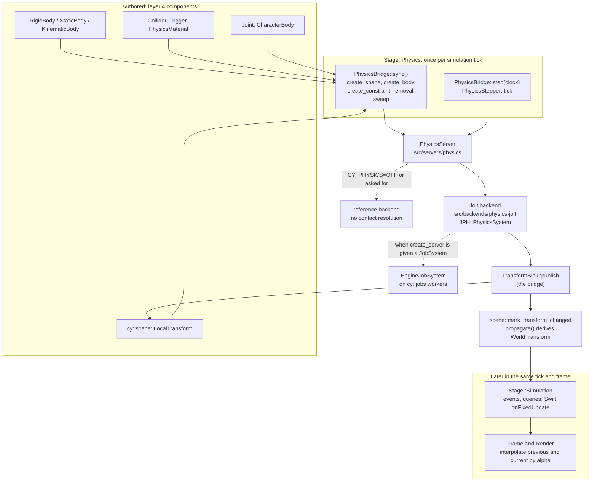

# Physics in CyberEngine

A tutorial for a gameplay or engine contributor: how physics is put together, where Jolt sits and
where it may not, how a body is authored and stepped, how to query the world from C++ and from
Swift, and how the physics suites prove what they claim.

**Governed by**: [`physics`](../../openspec/specs/physics/spec.md) (the interface, the Jolt backend,
2D, components, fixed step, events, filtering, queries, characters, constraints, soft bodies,
determinism, debugging, height fields, buoyancy, teardown), with
[`simulation-and-determinism`](../../openspec/specs/simulation-and-determinism/spec.md) for the
determinism profiles. The module READMEs linked below are the detailed reference; this guide is the
route through them.

| Where | Layer | What |
|---|---|---|
| [`src/servers/physics/`](../../src/servers/physics/README.md) | 2 | `PhysicsServer`, the component layouts, the character controller, the stepper, determinism, 2D, and the **reference backend** |
| [`src/backends/physics-jolt/`](../../src/backends/physics-jolt/README.md) | 3 | Jolt behind `PhysicsServer`; the only directory that names a Jolt type |
| [`src/physics/`](../../src/physics/README.md) | 4 | The ECS bridge (`PhysicsBridge`), the state schema, `ragdoll/` and `buoyancy/` |
| [`src/game_backend/`](../../src/game_backend/include/cy/game_backend/physics_backend.h) | | The ABI 1.3 physics query adapter the Swift API calls into |
| [`bindings/swift/Sources/CyberdyneKit/Physics.swift`](../../bindings/swift/Sources/CyberdyneKit/Physics.swift) | | `Physics.raycast`, `raycastAll`, `shapeCast`, `overlap` |


*The photograph `just run-authoring` takes: a sphere and a box authored in the editor, each given a
body with `scene.add-body` ([`samples/08a-authoring`](../../samples/08a-authoring/README.md)).*

## Contents

1. [Why Jolt, and the one rule](#1-why-jolt-and-the-one-rule)
2. [Architecture](#2-architecture)
3. [Authoring a body](#3-authoring-a-body)
4. [Stepping, interpolation, sleeping and determinism](#4-stepping-interpolation-sleeping-and-determinism)
5. [Queries](#5-queries)
6. [Characters, joints, ragdolls and buoyancy](#6-characters-joints-ragdolls-and-buoyancy)
7. [Worked example: a falling body and a raycast from Swift](#7-worked-example-a-falling-body-and-a-raycast-from-swift)
8. [Testing, debugging and common pitfalls](#8-testing-debugging-and-common-pitfalls)
9. [Further reading](#9-further-reading)

---

## 1. Why Jolt, and the one rule

The engine does not write a rigid-body solver. The spec says why, in its purpose:

> Jolt is integrated rather than reimplemented. Writing a competitive rigid-body solver is a
> multi-year effort with no differentiating value for this engine; Jolt is mature, multithreaded,
> deterministic, and permissively licensed.

The pin is in `deps/manifest.toml`:

```toml
name = "jolt"
version = "5.6.0"
tag = "v5.6.0"
commit = "e77f175595e64cb44218cc9d9d56fc365ad0e36a"
repository = "https://github.com/jrouwe/JoltPhysics"
licence = "MIT"
...
feature = "CY_PHYSICS"
...
interface = "cy::physics::PhysicsServer in src/servers/physics/, implemented by src/backends/physics-jolt/, which is the only directory that names a JPH symbol"
```

`CY_PHYSICS` is **on by default**. It gates the Jolt backend and the Jolt fetch, and nothing else:
the interface, the character controller, the bridge and the reference backend are always built, so
`-D CY_PHYSICS=OFF` downloads nothing and still simulates (`cmake/features.cmake` explains the
default at length). `cy__configure_jolt` in `cmake/dependencies.cmake` turns off Jolt's samples,
viewer, object streams, profiler, debug renderer and all four GPU compute backends, and turns
**on** `CROSS_PLATFORM_DETERMINISTIC`, because that switch also fixes the floating-point mode within
one platform (section 4).

### No Jolt type outside the backend

The spec's scenario is "no Jolt type SHALL appear in any header outside the backend module". Three
things hold it.

**The public header names no `JPH` type.** Past its two includes (`cy/core/memory/allocator.h` and
`cy/servers/physics/server.h`) and a forward declaration of `cy::jobs::JobSystem`, the declarations
in `src/backends/physics-jolt/include/cy/backends/physics/jolt/server.h` are:

```cpp
namespace cy::physics::jolt {

/// The backend's name, as `backend_name()` reports it and as a configuration selects it.
inline constexpr const char* kBackendName = "jolt";

[[nodiscard]] Expected<PhysicsServer*, Error> create_server(Allocator& allocator,
                                                            cy::jobs::JobSystem* jobs) noexcept;

void destroy_server(PhysicsServer* server, Allocator& allocator) noexcept;

}  // namespace cy::physics::jolt
```

**Jolt is a private link.** From `src/backends/physics-jolt/CMakeLists.txt`:

```cmake
    PUBLIC_DEPENDENCIES cy::servers-physics
    # PRIVATE, and that is the whole point: `cy::dep::jolt` is an implementation detail of this
    # target and a consumer inherits none of Jolt's include directories.
    ...
    PRIVATE_DEPENDENCIES cy::dep::jolt cy::core-jobs cy::core-diagnostics)
```

so `#include <Jolt/Jolt.h>` does not even resolve outside the target, and `src/servers/physics/` is
layer 2 and cannot include a layer-3 header at all.

**The layer checker names it.** `tools/layercheck/layercheck.py` has a `thirdparty` check whose Jolt
row is:

```python
JOLT = ("Jolt", "src/backends/physics-jolt/", "cy::physics::PhysicsServer")
```

and an include under `Jolt/`, or of `Jolt.h`, anywhere else is reported as
`thirdparty: includes '...'. No Jolt header appears outside src/backends/physics-jolt/ — Jolt sits
beneath cy::physics::PhysicsServer, ...`. Run it with `just quality-layers`, which CI calls.

> The Jolt backend's README and CMakeLists.txt still say a `physicsapi` check is "missing". That
> check now exists under the name `thirdparty`; the comment predates it.

### The reference backend

`src/servers/physics/reference/` implements the whole interface with no library behind it. It was
written before Jolt and is kept because it is what proves the interface does not leak Jolt, and
because running the character controller's suite over two backends makes it a conformance test. Its
header states its limits:

> IT DOES NOT: resolve contacts. Two solid bodies pass through each other, and
> `Capabilities::contact_resolution` is FALSE so that a caller is told rather than surprised. It
> also does not implement constraints, soft bodies or vehicles, and creating one returns
> `Unsupported` naming this backend.

Always check `PhysicsServer::capabilities()` rather than the backend's name.

---

## 2. Architecture

A body is authored as components on a scene node. `PhysicsBridge` (layer 4) turns components into
server calls; `PhysicsServer` (layer 2) is the interface; the Jolt backend (layer 3) runs the solve;
`PhysicsStepper` hands each moved body back through a `TransformSink`, which the bridge implements
by writing `cy::scene::LocalTransform`.



The stages are `cy::ecs::Stage` in `src/ecs/include/cy/ecs/system.h`: `PreSimulation`, `Physics`,
`Simulation` and `PostSimulation` run on the fixed step (`stage_is_fixed_step`), and `Frame`,
`Animation`, `UI` and `Render` run per frame. `PhysicsBridge::install(schedule, clock)` registers the
bridge in `Stage::Physics` and no other, so running `Stage::Frame` cannot step physics however wrong
the caller's loop is.

### What the Jolt backend maps

Each line of the spec's "Jolt as the 3D backend" requirement has a place in
`src/backends/physics-jolt/src/`:

| Spec | Where |
|---|---|
| Engine handles map to Jolt body ids | generational `BodyHandle`s (`src/servers/physics/include/cy/servers/physics/handles.h`) index `JoltServer`'s own slots in `jolt_server.cpp` |
| Shapes shared through a cache | `ShapeSlot` in `jolt_server.cpp`, keyed by `shape_key(description)`; `ShapeStatistics` reports `unique_shapes`, `requests`, `cache_hits` |
| Layers and masks to broad-phase and object layers | `jolt_common.h`: an object layer is the engine layer shifted up one bit with "is moving" in bit 0; two broad-phase layers, moving and non-moving |
| Jolt's job system on the engine's | `jolt_jobs.h`: `EngineJobSystem`, derived from `JPH::JobSystemWithBarrier` |
| Temp allocator on an engine arena | `EngineTempAllocator` in `jolt_server.cpp` |

`create_server(allocator, jobs)` takes an optional `cy::jobs::JobSystem*`. With one, Jolt's
parallelism runs on engine workers and `Capabilities::uses_engine_jobs` is true; with `nullptr` (what
the tests and samples pass) Jolt's work runs on the calling thread and the flag says so.

The backend README lists **four places Jolt's model and the engine's disagree**, and each is worth
knowing before you debug a filter or an event: masks are applied per body (the first collider's),
not per collider; a body whose colliders are all triggers becomes a sensor and a mixed one is
refused; contact impulses are an estimate, because Jolt's callbacks run before the solver; and
contact callbacks arrive on worker threads, so the event buffer is sorted by pair and phase at the
end of the step.

---

## 3. Authoring a body

### The components

The layouts live in `src/servers/physics/include/cy/servers/physics/components.h`, plain data and
trivially copyable because ECS chunk storage is memset and moved by memcpy. The registration lives
in `src/physics/`: `PhysicsComponents::register_all(world)` registers all eight under stable names
(`kRigidBodyComponentName` is `"cy::physics::RigidBody"`, and so on).

| Component | Holds |
|---|---|
| `RigidBody` | `mass` (zero derives it from collider volume and density), `center_of_mass`, damping, `gravity_scale`, `allow_sleeping`, `start_asleep`, `continuous`, `locked_axes` |
| `StaticBody` | nothing but the runtime handle |
| `KinematicBody` | nothing but the runtime handle; moved by code, pushes and is not pushed |
| `Collider` | a `ShapeDescription`, a local `Transform`, a `MaterialHandle`, a `CollisionFilter`, `contact_impulse_threshold`, `report_stay` |
| `Trigger` | a shape, a local transform and a filter; a non-solid volume |
| `PhysicsMaterial` | `friction`, `restitution`, their `CombineMode`s, `density` |
| `Joint` | a `ConstraintDescription` by value |
| `CharacterBody` | a `CharacterDescription` |

```cpp
/// A dynamic body. `physics`' `RigidBody`.
struct RigidBody {
    /// Zero derives the mass from the colliders' volumes and densities.
    f32 mass = 0.0f;
    Vec3 center_of_mass{0.0f, 0.0f, 0.0f};
    bool override_center_of_mass = false;
    f32 linear_damping = 0.05f;
    f32 angular_damping = 0.05f;
    f32 gravity_scale = 1.0f;
    bool allow_sleeping = true;
    bool start_asleep = false;
    bool continuous = false;
    /// See body.h's kLock* constants. `kLockPlaneXY` is the 2D body.
    u8 locked_axes = 0;
    BodyHandle body;
};
```

**Shapes** are `ShapeType` in `shapes.h`: `Sphere`, `Box`, `Capsule`, `Cylinder`, `ConvexHull`,
`TriangleMesh`, `HeightField`, `Compound`, `Plane`. `is_static_only()` is true for `TriangleMesh`,
`HeightField` and `Plane`; a triangle mesh on a dynamic body is refused with a diagnostic
recommending convex decomposition. A height field sample of `kHeightFieldHole` is a hole, and
`PhysicsServer::update_height_field` rewrites one region.

**Layers and masks.** `CollisionFilter` is a `layer` (0 to 31) and a `mask` (a bit per layer). Two
colliders interact only if **each** one's layer is in the other's mask (`accepts()`), and the world's
`CollisionMatrix` (`WorldDescription::matrix`, `allow(a, b, enabled)`) must allow the pair as well
(`pair_collides()`). `PhysicsServer::set_pair_ignored(a, b, true)` is the per-body exception.

**Mass.** With `mass = 0` the mass comes from the colliders' volumes and densities, and a
`RigidBody` with no `Collider` has no volume and is refused by `validate()`. The bridge counts that
refusal in `BridgeStatistics::bodies_refused`, names it in `last_error()`, and keeps simulating the
rest of the world.

The bridge's limits today are in [`src/physics/README.md`](../../src/physics/README.md): one
`Collider` and one `Trigger` per entity (compounds need a buffer component), `CharacterBody` is
registered but the bridge does not create its controller, and `Joint` endpoints are runtime body
handles. A joint authored in a world names its bodies by entity reference, and the play session
resolves them (section 6).

### In C++

This is `src/physics/tests/test_simulation.cpp`, the M8.a arrangement written as components. No body,
shape or step is named; the bridge creates all three:

```cpp
const cy::ecs::Entity ground = fixture.node("Ground", cy::Vec3{0.0F, 0.0F, 0.0F});
CY_REQUIRE(ground.valid());
Collider slab;
slab.shape.type = ShapeType::Box;
slab.shape.half_extents = cy::Vec3{5.0F, 0.5F, 5.0F};
CY_REQUIRE(fixture.world.add(ground, fixture.components.collider, &slab).has_value());
StaticBody immovable;
CY_REQUIRE(fixture.world.add(ground, fixture.components.static_body, &immovable).has_value());

const cy::ecs::Entity ball = fixture.node("Ball", cy::Vec3{0.0F, 4.0F, 0.0F});
CY_REQUIRE(ball.valid());
Collider sphere;
sphere.shape.type = ShapeType::Sphere;
sphere.shape.radius = 0.5F;
CY_REQUIRE(fixture.world.add(ball, fixture.components.collider, &sphere).has_value());
RigidBody dynamic;
CY_REQUIRE(fixture.world.add(ball, fixture.components.rigid_body, &dynamic).has_value());
```

The setup around it: create a `PhysicsServer` (`jolt::create_server` or
`reference::create_server`), `initialize()` it, `create_world(WorldDescription)`, register the
components, configure a `determinism::SimulationClock`, then construct
`PhysicsBridge(allocator, tree, components, server, physics_world)`. The bridge owns neither the
server nor the world; which backend a host uses is the host's decision.

Below the bridge, `PhysicsServer` can be driven directly: `create_shape`, then `create_body` with a
`BodyDescription` whose `colliders` point at `ColliderDescription`s. `body_from()` in `components.h`,
with its siblings `static_body_from()` and `kinematic_body_from()`, is the mapping from components to
a `BodyDescription` that the header says must not differ between the ECS bridge, the scene cooker
and the ABI.

### In a scene file

A `.cyworld` carries the physics components **by name**, in its own type section, because they are
registered with `register_builtin` and have no reflected type. The golden world in
`src/gameplay/play/tests/test_play.cpp` is a static box slab at the origin and a dynamic sphere four
metres above it:

```text
cyworld 1
type 1 runtime "Transform"
  field 1 vec3 "translation" ""
  field 2 quat "rotation" ""
  field 3 vec3 "scale" ""
type 2 runtime "StaticBody"
type 3 runtime "RigidBody"
  field 4 float "mass" ""
  field 5 float "gravity_scale" ""
type 4 runtime "Collider"
  field 6 text "shape" ""
  field 7 vec3 "extent" ""
  field 8 float "radius" ""
  field 9 float "height" ""
node 0 - "default"
  component 1
    field 1 0 0 0
    field 2 0 0 0 1
    field 3 1 1 1
  component 4
    field 6 "box"
    field 7 5 0.5 5
    field 8 0.5
    field 9 1
  component 2
node 1 - "default"
  component 1
    field 1 0 4 0
    field 2 0 0 0 1
    field 3 1 1 1
  component 4
    field 6 "sphere"
    field 7 0.5 0.5 0.5
    field 8 0.5
    field 9 1
  component 3
    field 4 0
    field 5 1
```

`shape` is one of `box`, `sphere`, `capsule` or `cylinder`; `extent` is a box's half extents;
`height` is a capsule's or cylinder's **total** height, caps included. These four type names and six
field names are a contract across the process and language boundary, pinned by `kRigidBody`,
`kFieldMass` and the rest in `src/gameplay/play/src/session.cpp` and by `BodyBinding` and
`ColliderBinding` in `editor/crates/cy-editor-services/src/bodies.rs`
([`src/gameplay/play/README.md`](../../src/gameplay/play/README.md)).

### In the editor

"Add a rigid body in the Inspector" is the command `scene.add-body` (label *Add Physics Body*,
`Ctrl+Shift+P`), and the Inspector's control is a caller of it. It writes the body **and** its
collider as one undoable transaction, because a dynamic body without a collider cannot simulate.
Its parameters are `kind` (`dynamic`, `static`, `kinematic`; dynamic by default), `mass` (zero
derives it), `shape` (`box`, `sphere`, `capsule`, `cylinder`, or `none`), `extent`, `radius`, `height`
and `entity`. `scene.add-collider` adds a collider to an existing body, and `scene.remove-body`
takes one away, recording its values so undo restores it.

**Play** runs `cy::gameplay::PlaySession` over `PhysicsBridge` in the attached engine runtime
(`cy_editor_window_runtime`), which picks Jolt when it is built and the reference backend only when
asked (`--physics reference`). Play advances hosted physics and calls Swift `onFixedUpdate` after it;
Stop restores the authored document byte for byte. See the
[editor README](../../editor/README.md#adding-a-body-and-pressing-play-m8a-tasks-43-51-and-52) and
[`samples/08a-authoring`](../../samples/08a-authoring/README.md), whose closing artefact runs exactly
that: place the sphere above the box with the gizmo, add a rigid body to each in the inspector, press
play, stop, and undo back to an empty world.

---

## 4. Stepping, interpolation, sleeping and determinism

### One step per tick

`PhysicsServer::step(world, StepInput)` takes `delta_seconds`, `tick` and `collision_steps`. Nothing
in gameplay calls it: `PhysicsStepper::tick(clock, sink)` calls it exactly once per simulation tick,
at the clock's rate (a `TickRate`, 60/1 by default), and the bridge calls the stepper from
`advance(clock)` = `sync()` then `step(clock)`. The clock is `const` for both, because advancing it
belongs to the runtime; a stepper that advanced it could step twice for one tick. The
`integration.physics_behaviour` case *"a frame with several ticks steps physics once per tick and
never in between"* checks this against `PhysicsStepper::steps()` and the tick the server recorded;
through the bridge, `BridgeStatistics::steps` counts the same thing.

Queries are refused while the step runs: `PhysicsServer::stepping()` is true, and
`reject_query_during_step` turns a query into a diagnostic in development builds. The ABI adapter
refuses in every build (section 5).

### Write-back

`PhysicsBridge::publish` is the `TransformSink`. It writes the placement into `LocalTransform`,
**keeps the authored scale** (a solver has no opinion about scale), and calls
`scene::mark_transform_changed` so `propagate()` derives `WorldTransform` from it. A static body stays where it was authored
(`test_bridge.cpp`, *"a static body is created and never moved"*).

### Interpolation and teleports

The previous and current transforms live in the stepper's `InterpolationRecord`, not in the server,
because interpolation is presentation and must not be hashed or replicated.
`PhysicsStepper::interpolate(body, alpha)` blends them with `SimulationClock::interpolation_alpha()`.
`set_body_transform(body, transform, TeleportMode::Teleport)` sets the teleport flag, and a teleported
body returns its current transform unchanged for that frame instead of smearing across the gap. The
scene and render layers apply the same rule to what they draw (`Node::render_transform(alpha)` in
`src/scene/src/node_transform.cpp`, `render::resolve_transform` in `src/servers/render/src/snapshot.cpp`).

### Sleeping and tuning

`RigidBody::allow_sleeping` and `start_asleep` set the per-body policy; `set_body_awake(body, true)`
wakes one, and so does an impulse (the Jolt case *"a resting body goes to sleep and an impulse wakes
it"*). The thresholds are world tuning, `Tuning` in `types.h`, with documented defaults:

```cpp
struct Tuning {
    u32 velocity_iterations = 10;
    u32 position_iterations = 2;
    f32 penetration_slop = 0.02f;
    f32 baumgarte = 0.2f;
    f32 speculative_contact_distance = 0.02f;
    f32 sleep_linear_velocity = 0.03f;
    f32 sleep_angular_velocity = 0.05f;
    f32 time_before_sleep_seconds = 0.5f;
    ...
};
```

`sleep_angular_velocity` has no Jolt analogue: Jolt folds rotation into one linear threshold.

### Determinism

Physics declares a **policy**, `DeterminismPolicy` in `types.h`: `SamePlatformDeterministic` (the
default, and what Jolt reports), `ExternalAuthority`, or `NonAuthoritative`. What is claimed and what
is not is stated in `src/servers/physics/include/cy/servers/physics/determinism.h`:

> CLAIMED, AND TESTED: the same binary, on this platform, from the same initial state and the same
> per-tick inputs, produces bit-identical results.
>
> NOT CLAIMED, AND NOT TESTED: anything across platforms, architectures or compilers.

Jolt's `CROSS_PLATFORM_DETERMINISTIC` build switch is on, but the engine claims only its
same-platform half. What that means for a session is the job of `validate_session(session,
authority, backend)`, which takes a `SessionDeterminism` (`None`, `SamePlatform`,
`CrossPlatform`, `Lockstep`) and a `PhysicsAuthority` (`Authoritative`, `Presentation`):

| Session | Physics authoritative | Physics as presentation |
|---|---|---|
| `None` | accepted | accepted |
| `SamePlatform` | needs a `SamePlatformDeterministic` backend | accepted |
| `CrossPlatform`, `Lockstep` | **rejected** | accepted; authoritative movement uses the deterministic math path of `simulation-and-determinism` |

So a lockstep RTS across an iPhone and a PC cannot let Jolt decide where units are; it can use physics
for debris and ragdolls.

**What the state hash covers.** On Jolt, `PhysicsServer::hash_state(world, tree)` opens one
`HashLevel::Entity` node per body, walked in the engine's **creation order** (not Jolt's body-manager
order), and folds for each body its position, rotation, linear and angular velocity, motion type and
active/asleep state; a cloth body adds every vertex position and velocity, and vehicles are hashed
under their own subsystem node. Separately, `declare_physics_state(schema, components)` in
`src/physics/include/cy/physics/state_schema.h` declares the eight components' **authored** fields
(mass, damping, gravity scale, locks, shape dimensions, filter, friction and restitution) as
`Authoritative` and every handle as `Derived`. Pointer-backed geometry (hull points, mesh vertices,
compound children) is not folded, so a divergence only in a triangle mesh's vertex data is caught by
the asset identity that named the mesh, not by this hash.

`DeterminismProbe` is the determinism test mode: `record(server, world, tick)` keeps a hash tree per
tick up to its capacity, and `DeterminismProbe::compare(left, right)` returns a `PhysicsDivergence`
naming the first tick and the body that disagreed.

---

## 5. Queries

### From C++

`PhysicsServer` provides `raycast` (nearest), `raycast_all` (sorted by distance), `shape_cast`,
`overlap`, `overlap_point` and `closest_point`, all `const`. Every one takes a `QueryFilter`: a
`CollisionFilter` for the querying "collider", an `ignore` list of bodies, `include_triggers`
(false by default), `cull_back_faces` (true), and `include_static`, `include_kinematic`,
`include_dynamic`. A raycast that hits nothing returns a value with a null `body`; an error means a
bad world handle or a query during the step.

From `src/backends/physics-jolt/tests/test_jolt.cpp`, *"a raycast excludes its own body and reports
the surface it hit"*:

```cpp
RayCastInput ray;
ray.origin = Vec3{0.0f, 2.0f, 0.0f};
ray.direction = Vec3{0.0f, -1.0f, 0.0f};
ray.max_distance = 10.0f;
QueryFilter filter;
filter.ignore = &self;
filter.ignore_count = 1;
const Expected<RayCastHit, Error> hit = fixture.server->raycast(fixture.world, ray, filter);
CY_REQUIRE(hit.has_value());
CY_CHECK_EQ(hit->body.bits(), floor.bits());
CY_CHECK_EQ(hit->user_data, 99U);
```

`RayCastHit` carries `body`, `user_data`, `position`, `normal`, `distance`, `material` and `trigger`.
The bridge creates every body with `user_data = entity.bits()`, so a hit names its entity.
`ShapeCastHit` adds `fraction` and `started_penetrating`; a shape cast and an overlap take a
`ShapeHandle` from `create_shape`. Queries read the post-step world and are safe from parallel
systems in the `Simulation` stage.

For 2D, `cy::physics::two_d` in `physics2d.h` has `create_body`, `body_state` and `raycast` over
`Vec2`, `Transform2D` and `ShapeDescription2D`; underneath, the body is a 3D body with
`kLockPlaneXY` and the shape is extruded.

### From Swift

ABI 1.3 added four entries (`physics_raycast`, `physics_raycast_all`, `physics_shape_cast`,
`physics_overlap` in [`src/abi/include/cy/abi/cy_abi.h`](../../src/abi/include/cy/abi/cy_abi.h)), and
CyberdyneKit wraps them as `Physics`:

| Swift | Returns |
|---|---|
| `Physics.raycast(_ ray: Ray, filter:)` | `Physics.Hit?` |
| `Physics.raycastAll(_ ray: Ray, filter:)` | `[Physics.Hit]`, nearest first |
| `Physics.shapeCast(_ shape:, from: Pose, direction:, maxDistance:, filter:)` | `Physics.Hit?` |
| `Physics.overlap(_ shape:, at: Pose, filter:)` | `[Entity]`, in entity order |

`Physics.Shape` is `.sphere(radius:)`, `.capsule(radius:halfHeight:)` or `.box(halfExtents:)`.
`Physics.Filter` has a `layer`, a `mask`, `options` (`.includeTriggers`, `.hitBackFaces`,
`.skipStatic`, `.skipKinematic`, `.skipDynamic`) and an `ignoring` list of entities; `Filter.all`
hits everything solid. A `Hit` has `entity`, `point`, `normal`, `distance`, `fraction`, `isTrigger`
and `startedPenetrating`. The file's own example:

```swift
extension Physics.Filter { static let units = Physics.Filter(mask: 1 << 3) }

if let hit = try Physics.raycast(ray, filter: .units) { select(hit.entity) }
let inBlast = try Physics.overlap(.sphere(radius: 6), at: Pose(position: impact))
```

The adapter behind them, `src/game_backend/include/cy/game_backend/physics_backend.h`, adds what the
server does not: entities in place of bodies, a **total order** (distance, then entity, then body
handle) so a query in `onFixedUpdate` replays exactly, the whole count for the sizing pattern, and
`.unavailable` during the physics step **in every build**, not only development ones. The first use
of each distinct query shape creates it, so do that on the game thread or through `prewarm()` at
load.

---

## 6. Characters, joints, ragdolls and buoyancy

### Character controller

`cy::physics::CharacterController` (`character.h`) is engine code over `shape_cast` and `overlap`,
not a backend call, so stair and slope behaviour does not change when the backend does.
`CharacterDescription` sets `radius`, `height`, `max_slope_radians`, `step_offset`, `skin_width`,
`max_iterations`, `mode` (`CharacterMode::Grounded` or `Floating`), `push_dynamic_bodies`,
`push_force`, `inherit_platform_velocity` (`Inherit`, `Discard`, `HorizontalOnly`), `filter` and
`start`. `move(delta, CharacterInput)` takes `desired_velocity`, `jump` and `jump_speed`; `state()`
reports `ground` (`GroundState::Grounded`, `OnSteepSlope`, `InAir`), `ground_normal`,
`touching_ceiling`, `touching_wall`, `stepped_up` and `platform_velocity`. From
`src/servers/physics/tests/test_character.cpp`, *"a character on a moving platform is carried by
it"* (the kinematic platform set-up is omitted):

```cpp
CharacterController character(*fixture.server, fixture.world);
CharacterDescription description;
description.start = Transform::from_translation(Vec3{0.0f, 0.9f, 0.0f});
CY_REQUIRE(character.create(description).has_value());

for (u32 index = 0; index < 60; ++index) {
    CY_REQUIRE(fixture.step(index).has_value());
    CY_REQUIRE(character.move(kStep, CharacterInput{}).has_value());
}
CY_CHECK_EQ(character.state().ground, GroundState::Grounded);
CY_CHECK_GT(character.state().platform_velocity.x, 0.5f);
```

The controller holds a pointer to the server, so it is not a component; `CharacterBody` is its
description, and who owns the controller object is left to gameplay.

### Joints

`ConstraintType` in `constraints.h` has ten kinds: `Fixed`, `Point`, `Hinge`, `Slider`, `Distance`,
`Cone`, `SwingTwist`, `SixDof`, `RackAndPinion`, `Gear`. A `ConstraintDescription` names
`body_a`/`body_b`, the two frames, a `limit`, a `motor` (`MotorSettings`), per-axis `dof_limits` and
`dof_motors`, `ratio`, `break_force`/`break_torque` and `collide_connected`. Only Jolt implements
them; the reference backend reports `Capabilities::constraints` false. From the Jolt suite:

```cpp
ConstraintDescription description;
description.type = ConstraintType::Hinge;
description.body_a = base;
description.body_b = driven;
description.limit = AxisLimit{-0.2f, 0.2f};
description.motor.target_velocity = 10.0f;
description.motor.max_force = 100.0f;
CY_REQUIRE(fixture.server->create_constraint(fixture.world, description).has_value());
```

A joint that exceeds its break threshold is disabled and reported by
`PhysicsServer::broken_constraints(world)` as a `ConstraintBroken` for that step. Hinge and slider
motors change at run time with `set_constraint_motor`; swing-twist orientation drive with
`set_constraint_orientation_motor`. In the ECS, a `Joint` component becomes a constraint when the
backend supports constraints and its description names live body handles.

**Authored in the editor**, a joint is a `Joint` component on body A's node in the `.cyworld`: its
kind (the ten words `constraint_type_name` spells), body B's node as an entity reference or none for
the world, the anchor and axis in body A's rotated, unscaled frame, and the fields the kind reads —
`limit_min`/`limit_max` (the hinge angle, slider travel, swing-twist twist or distance span),
`swing_y`/`swing_z`, six-axis `linear_*`/`angular_*`, `motor_velocity`/`motor_max_force`, `ratio`,
`break_force`/`break_torque` and `collide_connected`. `PlaySession` creates the constraint after the
bodies, with frame B derived so both anchors meet where the bodies were authored
(`cy/gameplay/play/joints.h`). The editor writes it with `physics.joint.add`, `physics.joint.set`
(one field, one undo step) and `physics.joint.remove`, which the Physics panel calls and an agent
calls over MCP; selecting the entity draws the joint's anchors, axis and limits in the viewport.

### Ragdolls

`src/physics/ragdoll/` (built with `CY_ANIMATION=ON`) generates a `ragdoll::Profile` from a finalized
skeleton with `Profile::generate(skeleton, allocator)`, one `BoneProfile` per joint with shape, mass,
swing and twist limits and motor settings you can refine. `ragdoll::Ragdoll(server, world, skeleton,
profile, allocator)` then drives it in one of three `ragdoll::Mode`s:

| Mode | What simulates |
|---|---|
| `Full` | every body, blended in from the current animated pose and velocity; later animation targets are ignored |
| `Powered` | the root stays kinematic and joint motors follow the animated pose |
| `Partial` | a per-bone weight mask (`Activation::partial_weights`); zero-weight bones stay kinematic |

The call order per fixed step: `activate(current, previous, actor_world, previous_actor_world,
delta, activation)` once; then `set_animation_target` before the step, `advance_blend` after it, and
`sample_pose` to read the blended model-space pose. `apply_hit(joint, impulse, recovery_seconds)`
pushes one bone and blends it back. Destroy the ragdoll before its physics world. On the reference
backend activation fails before allocating any body.

The editor cannot set up a profile yet: `Profile::generate` needs a skeleton and model import stops
before importing skeletons, so the Physics panel states the limit rather than offering an empty
editor.

### Buoyancy

`src/physics/buoyancy/` is a force adapter over the authoritative water system, not a backend feature:

```cpp
class Driver {
public:
    Driver(PhysicsServer& physics, water::WaterSystem& water, Allocator& allocator) noexcept
    ...
    [[nodiscard]] Expected<water::BuoyancyResult, Error> apply(
        BodyHandle body, Span<const water::BuoyancySample> hull,
        const water::BuoyancyParams& params, world::WorldVec3d origin = {}) noexcept;
```

Call `apply` before each fixed step with body-local hull samples and the world's absolute origin; it
queries water at each sample and applies force and torque through `PhysicsServer`. Several samples
along a hull are what make a long vessel pitch and roll on swell. Only dynamic bodies are accepted,
and both backends integrate the forces.

Cloth (`create_soft_body`) and wheeled vehicles (`create_vehicle`) are Jolt-only and gated by
`Capabilities::soft_bodies` and `Capabilities::vehicles`; the server README describes both.

---

## 7. Worked example: a falling body and a raycast from Swift

The tree has both halves of this, in two places. There is no single sample that does both.

**The body falls.** `src/physics/tests/test_simulation.cpp`, *"a sphere authored above a box falls
and comes to rest on it"*, is the component arrangement from section 3 run on Jolt for 180 ticks:

```cpp
CY_REQUIRE(fixture.run(180).has_value());
CY_CHECK_EQ(fixture.bridge->tracked_bodies(), 2U);
CY_CHECK_EQ(fixture.bridge->statistics().steps, 180U);

// The slab's top is at y = 0.5 and the sphere's radius is 0.5, so it rests at y = 1.0.
const cy::Vec3 resting = fixture.position_of(ball);
CY_CHECK_NEAR(resting.y, 1.0F, 0.05);
```

`fixture.run` is `clock.advance()` then `bridge->advance(clock)` per tick, and `position_of` reads
`LocalTransform`: the result arrives where the rest of the engine reads a placement. The same scene,
authored in the editor and played, is `just run-authoring` ([`samples/08a-authoring`](../../samples/08a-authoring/README.md));
`just run-authoring --physics reference` is its negative control and must fail, because the
reference backend lets the sphere fall through.

**Swift raycasts.** [`samples/13-rts-api`](../../samples/13-rts-api/README.md) is a Swift behaviour
that picks units and ground points with `Physics.raycast`. Its host puts the ground on layer 0 and
every unit's kinematic capsule on layer 1, and `game/Contract.swift` names the two filters:

```swift
enum Layers {
    static let ground = Physics.Filter(mask: 1 << 0)
    static let units = Physics.Filter(mask: 1 << 1)
}
```

`game/Commander.swift` casts a camera ray in `onUpdate` and acts on the result in the next
`onFixedUpdate`, because the pointer and the camera are refused in a fixed step:

```swift
private func order(under pointer: Pointer, through camera: Camera) throws {
    let ray = try camera.ray(under: pointer)
    if let ground = try Physics.raycast(ray, filter: Layers.ground) {
        pendingOrder = ground.point
    }
}
```

```sh
just run-sample rts-api                    # 420 frames of scripted play, headless
ctest -R rts_api_sample                    # integration.rts_api_sample
```

To put the two together in your own behaviour: author a `RigidBody` and `Collider` on a node (the
editor's `scene.add-body`, or the `.cyworld` in section 3), press Play, and in `onFixedUpdate` cast
`Ray(origin:direction:maxDistance:)` down with `Physics.raycast`. `onFixedUpdate` runs after the
physics step, so the hit reflects the body's position this tick. `ignoring:` in the filter skips the
caller's own entity.

---

## 8. Testing, debugging and common pitfalls

### The suites

Test names are `<kind>.<name>`, declared by `cy_add_test` beside each module.

| Test | Backend | What it covers |
|---|---|---|
| `unit.physics_server` | reference | types, filtering, shapes, events, queries, 2D, debug overlays |
| `integration.physics_behaviour` | reference | the character controller, the determinism probe, shape sharing, the stepper |
| `integration.physics_jolt` | Jolt | contacts, sleep, events, queries, all ten joints, cloth, vehicles, debug draw, statistics |
| `integration.physics_bridge` | reference | the bridge and the state schema |
| `integration.physics_simulation` | Jolt | a body at rest on a box through the bridge, repeatability, ECS joints |
| `integration.physics_teardown` | both | sixty-four play sessions under load; the world dying before the bridge |
| `integration.physics_ragdoll` | both | profiles, full, powered and partial modes, rollback, reference refusal |
| `integration.physics_buoyancy` | both | multi-point buoyancy on swell |
| `integration.game_backend_physics` | reference | the ABI adapter: ordering, ignore lists, masks, refusal mid-step |

```sh
just test-unit
just test-integration
ctest --test-dir build/dev -R physics --output-on-failure
```

The Swift facade's own cases are `bindings/swift/Tests/CyberdyneKitTests/PhysicsTests.swift`, run by
`integration.swift_package` when a Swift toolchain is present.

Every `physics` requirement has a row in `tools/roadmap/requirements-coverage.toml` pointing at the
one case that makes it observable, for example:

```toml
[[coverage]]
row = "physics"
requirement = "Determinism"
evidence = "test:integration.physics_behaviour"
case = "two runs of the same scene on the same binary produce identical state hashes"
```

When you add or change a physics requirement, point its row at a case, not a suite.

### Debugging

`PhysicsServer::debug_draw(world, DebugDrawFlags, DebugDrawSink&)` emits primitives into a sink the
caller implements. The flags are `Colliders`, `Contacts`, `Constraints`, `SleepState`, `Velocities`,
`CentersOfMass`, `BroadPhaseBounds` and `All`; shapes are drawn at their simulated transforms.
`debug_draw_query` overloads draw a ray, shape cast, overlap or closest-point query and its result,
without touching the world. `statistics(world)` returns `StepStatistics`: body, active body, contact, constraint and
island counts, and `broad_phase_ns`, `narrow_phase_ns`, `solve_ns`, `total_ns`. On Jolt the phase
counters are cumulative CPU time over concurrent jobs, so their sum can exceed `total_ns`.

`debug_draw_constraint(description, frame_a, frame_b, sink)` draws one constraint's anchors, the
line between them and its limits from a description and two world frames. The Jolt backend draws a
simulated constraint through it, and the editor's runtime draws an authored joint that does not
exist yet through the same function.

**In the editor**, every flag is a layer a viewport can ask for: the physics panel's checkboxes, or
the commands `viewport.physics.colliders`, `.contacts`, `.constraints`, `.sleep-state`,
`.velocities`, `.centres-of-mass`, `.broad-phase-bounds` and `viewport.physics.hide-all`. The bits
travel in the gizmo intent (`GizmoIntent::physics_overlays`) and `cy_editor_window_runtime` hands
them to `debug_draw` on the play session's world, projecting every primitive through the frame's own
view (`samples/05b-editor-window/runtime/physics_overlay.h`). The layers draw the simulated world, so
they appear while a world plays or is paused. Jolt's own debug renderer and profiler are compiled
out on purpose; use the sink and `StepStatistics`.

### Common pitfalls

| Symptom | Cause | Fix |
|---|---|---|
| A body falls through the floor | the reference backend, which does not resolve contacts | check `capabilities().contact_resolution`; build with `CY_PHYSICS=ON` (the default) and use `jolt::create_server` |
| A `RigidBody` never moves; `bodies_refused` is nonzero | no `Collider`, so no volume and no mass | add a collider (`scene.add-body` does both) and read `PhysicsBridge::last_error()` |
| A pair does not collide though one mask includes the other | filtering is mutual: **both** masks must accept the other's layer, and the matrix must allow it | fix both filters, or `CollisionMatrix::allow` |
| Colliders with different masks on one body behave differently on Jolt | Jolt applies the mask per body, from the first collider | give a body's colliders one filter |
| A query fails with `Unavailable` (Swift: `.unavailable`) | it ran during the physics step | query in `Stage::Simulation`, or in Swift `onUpdate`/`onFixedUpdate` |
| A body is refused on Jolt as a mixed sensor | its colliders mix triggers and solids; a `Collider` and a `Trigger` on one entity is exactly that | put the `Trigger` on its own entity |
| A triangle mesh collider is refused on a dynamic body | concave dynamic bodies are unsupported | use convex hulls or a compound, or make the body static |
| A scaled object snaps back to scale 1 | not this engine: `publish` keeps authored scale | if you see it, it is a bridge regression; `test_bridge.cpp` has *"the authored scale survives a step"* |
| A fault with no physics call on the stack at shutdown | teardown order | bridge first (`teardown()`, which its destructor also calls), then `destroy_world`, then `shutdown` and `destroy_server`, as `test_simulation.cpp`'s fixture does |
| `#if defined(CY_PHYSICS)` is false in a build with Jolt | `CY_PHYSICS` is a CMake option, not a compile definition | add `CY_PHYSICS=1` to the target's definitions beside linking `cy::physics-jolt`, as `src/physics/tests/CMakeLists.txt` does |
| A cross-platform or lockstep session is rejected at configuration | `validate_session` with authoritative physics | classify physics as `PhysicsAuthority::Presentation` and move authoritative state to the deterministic math path |

---

## 9. Further reading

In this tree:

- [`openspec/specs/physics/spec.md`](../../openspec/specs/physics/spec.md) — the contract
- [`openspec/specs/simulation-and-determinism/spec.md`](../../openspec/specs/simulation-and-determinism/spec.md) — determinism profiles and the deterministic math path
- [`src/servers/physics/README.md`](../../src/servers/physics/README.md) — the interface, the reference backend, and what is not there yet
- [`src/backends/physics-jolt/README.md`](../../src/backends/physics-jolt/README.md) — the boundary, and the four places Jolt and the engine disagree
- [`src/physics/README.md`](../../src/physics/README.md) — the ECS bridge, ragdolls, buoyancy, teardown
- [`src/gameplay/play/README.md`](../../src/gameplay/play/README.md) — play sessions, and why the components are read by name
- [`bindings/swift/README.md`](../../bindings/swift/README.md) — CyberdyneKit and the ABI
- [`samples/04-character`](../../samples/04-character/README.md) — the bridge written out longhand in a host (`just run-sample character --jolt`)

Jolt itself:

- Documentation: <https://jrouwe.github.io/JoltPhysics/>
- Source and releases: <https://github.com/jrouwe/JoltPhysics> (the engine pins `v5.6.0`)
