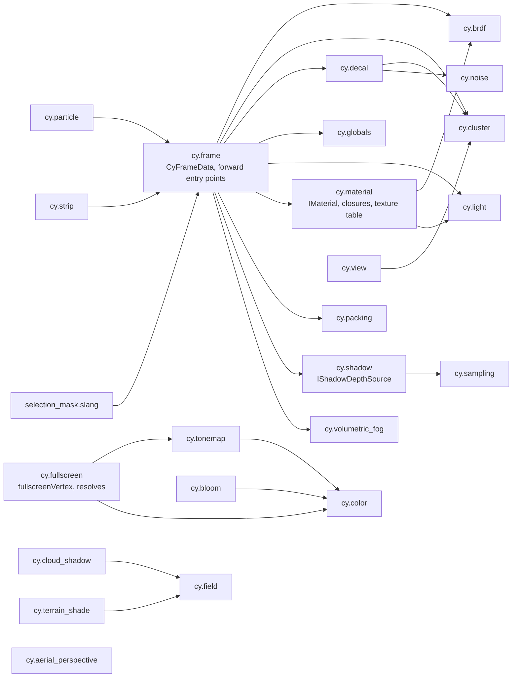
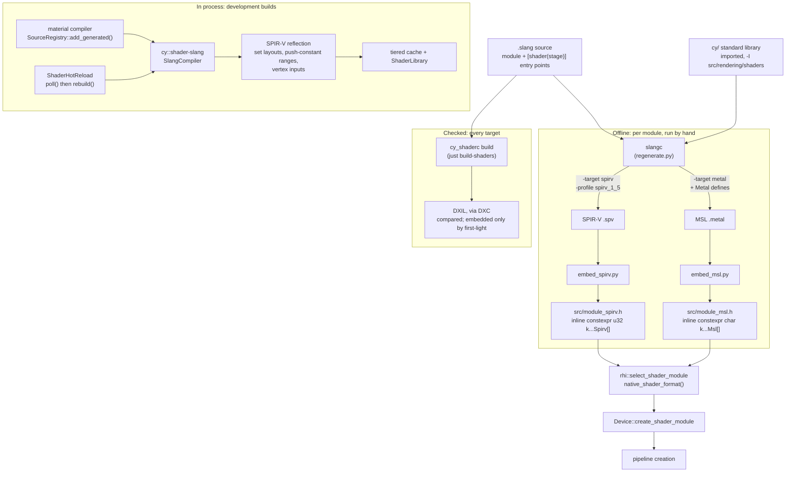
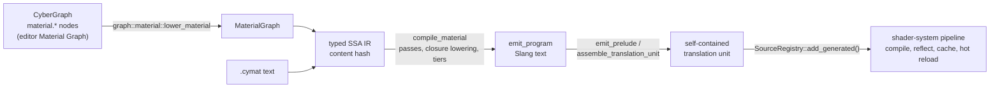
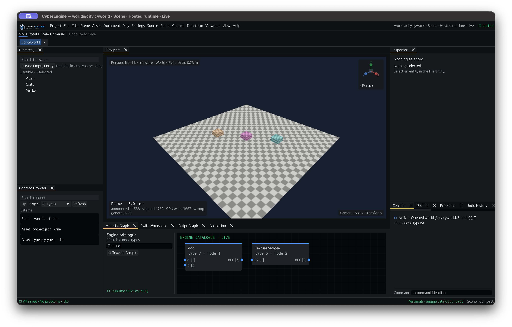

# Slang in CyberEngine

A tutorial for an engine or rendering contributor: what Slang is, where the engine's shaders live,
how one `.slang` file becomes the SPIR-V, MSL and DXIL the three backends run, and the rules that
keep the committed shader artefacts honest.

**Governed by**: [`shader-system`](../../openspec/specs/shader-system/spec.md) (authoring,
compilation, reflection, permutations, hot reload) and
[`material-compiler`](../../openspec/specs/material-compiler/spec.md) (how a material becomes
Slang). The module READMEs linked below are the detailed reference; this guide is the route through
them.

| Vulkan | Metal | D3D12 |
|:---:|:---:|:---:|
|  |  |  |

*`render.golden_backends`' first-light scene on Vulkan, Metal and D3D12 — one Slang source compiled
for each. The `.manifest` beside each image in [`docs/design/images/`](../design/images/) names the
device that drew it.*

## Contents

1. [What Slang is, and why the engine uses it](#1-what-slang-is-and-why-the-engine-uses-it)
2. [Where shaders live](#2-where-shaders-live)
3. [The compile pipeline](#3-the-compile-pipeline)
4. [The frame block contract](#4-the-frame-block-contract)
5. [Worked example: a full-screen pass in a new module](#5-worked-example-a-full-screen-pass-in-a-new-module)
6. [Materials: the graph becomes Slang](#6-materials-the-graph-becomes-slang)
7. [Rules](#7-rules)
8. [Debugging and common errors](#8-debugging-and-common-errors)
9. [Further reading](#9-further-reading)

---

## 1. What Slang is, and why the engine uses it

[Slang](https://shader-slang.org/) is an open-source shading language, HLSL-compatible in syntax,
with a compiler (`slangc`, and a library API) that emits many targets from one source. The engine
does not author a shading language; `shader-system` adopts Slang and states why:

> Writing a bespoke shading language is a multi-year commitment that competes directly with
> building the renderer. Slang gives generics, interfaces, modules, automatic differentiation, and
> multi-target output, and is designed for exactly this use.

What the engine uses from it:

| Slang feature | What it buys here |
|---|---|
| **Multiple targets** | One source compiles to SPIR-V (Vulkan), MSL source (Metal) and DXIL (D3D12). |
| **Modules and `import`** | Shared code is a module, never a textual include — a `shader-system` requirement. |
| **Interfaces and generics** | One function specialised per caller instead of copied per caller: `IMaterial`, `IShadowDepthSource`, `ICyDecalSource`, `ICyFogVolumeSource`. |
| **`[SpecializationConstant]`** | A quality switch becomes a new pipeline from the same SPIR-V, not a new compilation. |
| **`ParameterBlock`** | A descriptor set in SPIR-V, an argument buffer in MSL — the same declaration. |

An interface and a generic, from `src/rendering/shaders/cy/shadow.slang`:

```slang
/// A shadow map read without comparison: the depth a texel stores.
public interface IShadowDepthSource
{
    public float storedDepth(float2 uv);
}

public float pcssFilter<S : IShadowDepthSource>(S source, float2 uv, float receiver, float radius,
                                                float rotation, int taps)
```

and the frame's implementation of it, in `src/rendering/shaders/cy/frame.slang`, which reads the
shadow map through the bindless texture table while a sample binds a depth texture directly — one
filter either way:

```slang
struct CyFrameShadowMap : IShadowDepthSource
{
    uint slot;
    float storedDepth(float2 uv)
    {
        return cyMaterialSampleTextureLevel(slot, uv, 0.0).r;
    }
};
```

The pinned Slang is `v2026.9.2` (`deps/manifest.toml`, `name = "slang"`), fetched and built by
`cmake/dependencies.cmake` when `CY_SHADER_SLANG` is on. See
[`THIRD_PARTY.md`](../../THIRD_PARTY.md) for the licence.

### When the compiler is present

| Option | Default | Effect |
|---|---|---|
| `CY_SHADER_SLANG` | on in Debug and Development, off in Profile and Shipping | builds `cy::shader-slang`, `tools/shaders/cy_shaderc` and the Slang suites |
| `CY_SHADER_DXIL` | same as above, requires `CY_SHADER_SLANG` | Slang fetches Microsoft's DXC (a prebuilt release) and loads it to emit DXIL |

`shader-system` requires that a shipping build "SHALL contain compiled backend-native shader
artefacts and no Slang compiler". That is why every pass in the tree **commits its compiled
shaders as C++ headers** (section 3) and why the SPIR-V passthrough front end in
`src/backends/shader/` is the shipping path rather than a fallback.

---

## 2. Where shaders live

| Where | What |
|---|---|
| [`src/rendering/shaders/cy/`](../../src/rendering/shaders/README.md) | the **shader standard library**: 23 modules imported as `cy.<name>` |
| `src/rendering/<module>/shaders/` | a render module's own passes, with `regenerate.py` and the `embed_*.py` scripts |
| `src/rendering/pipeline/shaders/` | the committed frame modules (`frame_spirv.h`, `frame_msl.h`) and bloom's |
| `src/vfx/gpu/shaders/`, `src/pcg/shaders/` | GPU VFX and GPU PCG kernels |
| `samples/*/shaders/` | a sample's own shaders (for example `samples/12-beauty/shaders/beauty.slang`) |
| `tests/render/shaders/` | convention tests run on a device |
| generated, in memory | material programs, from the material compiler (section 6) |

`cy::shaders` (the `src/rendering/shaders/` target) compiles no C++: its build step stages the tree
into `${CMAKE_BINARY_DIR}/shaders/` so a tool or test mounts it through
`cy::assets::VirtualFileSystem` under the same virtual paths a shipped build uses.

### The standard library's import graph

Arrows point from a module to what it imports. Modules with no arrows import nothing.



The [shader library README](../../src/rendering/shaders/README.md) says what each module holds.
Three conventions every file keeps:

- **A module, never a textual include.** Every file is a `module` and every dependency an `import`.
- **Camera-relative from the first draw.** `cy/view.slang` has no world-to-clip matrix; positions
  are relative to the camera.
- **Reversed-Z.** Depth is `[0,1]`, cleared to 0, compared `GreaterEqual`. `fullscreenVertex`
  writes depth 1 so a full-screen pass survives the test.

### The descriptor set convention

From `src/backends/shader/include/cy/backends/shader/reflection.h`:

| Set | Constant | Frequency | In the frame |
|---|---|---|---|
| 0 | `kSetGlobal` | per frame | `cyGlobals`, the bindless `cyMaterialTextures[]`, `cyMaterialSampler` |
| 1 | `kSetView` | per view | `cyFrameView`: `CyFrameData`, lights, cluster lists, instances, material words |
| 2 | `kSetPass` | per pass | a pass's own resources (for example `FullscreenPassSet`) |
| 3 | `kSetDraw` | per draw | a material's parameter block |

The per-draw index is a push constant, not a fourth set.

---

## 3. The compile pipeline

`shader-system` fixes the offline pipeline as five steps: Slang source to SPIR-V per entry point and
permutation, validation and optimisation, reflection, a per-backend artefact, and a shader library
keyed by content hash. (The spec names SPIRV-Cross for MSL; the tree has Slang emit MSL directly
from the same session, which `cmake/features.cmake` records.) In this tree it runs in two shapes: **offline and committed** for every engine pass, and
**in process** for generated material programs and development hot reload.



### The committed path, step by step

Every module that owns a pass has a `shaders/regenerate.py`. From
`src/rendering/contact_shadows/shaders/regenerate.py`, the whole loop:

```python
common = [args.slangc, source, "-I", str(SHADERS), "-entry", entry, "-stage", "compute"]
subprocess.run(common + ["-target", "spirv", "-profile", "spirv_1_5", "-o",
                         str(out / f"{stem}.spv")], cwd=ROOT, check=True)
subprocess.run(common + ["-target", "metal", "-o", str(out / f"{stem}.metal")],
               cwd=ROOT, check=True)
```

then `embed_spirv.py` and `embed_msl.py` write `src/contact_spirv.h` and `src/contact_msl.h`, and
`clang-format -i` runs over both because the headers are subject to the formatting gate. `slangc`
runs from the repository root so the `#line` directives in the MSL name repository-relative paths
and the committed text is the same on every machine.

The headers carry a banner saying they are generated. The SPIR-V is a `u32` array; the MSL is split
into adjacent raw-string literals about every 300 lines, because MSVC rejects one raw string that
long.

At run time a pass hands both to the RHI, which picks the one the device consumes. From
`src/rendering/grading/src/grading_renderer.cpp`:

```cpp
rhi::ShaderModuleBundle bundle;
bundle.spirv = request.spirv;
bundle.msl = request.msl;
bundle.spirv_entry_point = "main";
bundle.msl_entry_point = request.entry;
rhi::ValidationMessage message;
auto module =
    rhi::select_shader_module(bundle, device_->capabilities().native_shader_format(),
                              request.name, request.stage, message);
```

**Engine passes compile DXIL and compare it; they do not embed it.** `just build-shaders --strict`
proves every entry point reaches D3D12, and module READMEs state "no DXIL is embedded". The one
embedded DXIL payload is the first-light scene's: `samples/03-first-light/shaders/embed_dxil.py`
writes `first_light_dxil.h`, `rhi::ShaderModuleBundle` carries it in `dxil`, and the
`m11d5-dxil` workflow regenerates it on Windows before the golden image is judged
([`src/backends/rhi-d3d12/README.md`](../../src/backends/rhi-d3d12/README.md)).

### Where reflection fits

Reflection reads **SPIR-V, not Slang** (`src/backends/shader/include/cy/backends/shader/reflection.h`),
so a module from a cache tier, a shipped library or a generator reflects identically to one compiled
locally. `Reflection::set_layout` and `Reflection::push_constant_ranges` hand back
`rhi::DescriptorBinding` and `rhi::PushConstantRange` values directly, and `vertex_inputs()` lists
the vertex inputs, which is what "bindings are derived, not declared" means in the
[shader backend README](../../src/backends/shader/README.md).

Committed passes still declare their C++ set layouts by hand (`GradingRenderer::create_layouts`,
for instance); what keeps those honest is the device suites and the layout check in section 4.

### The every-target check

```sh
just build-shaders --strict src samples
just build-shaders --targets            # which targets this machine can emit, probed by compiling
```

`just build-shaders` builds the engine and runs `tools/shaders/cy_shaderc build`. It discovers every
`.slang` file under the roots, finds entry points by their `[shader("stage")]` attribute, compiles
each for SPIR-V, MSL and DXIL, and asserts that each artefact is in its target's form, that the
artefacts differ, and that they **declare the same interface** (entry point, stage, workgroup size,
parameters and their kinds). It ends with one parseable line:

```text
shader-set: modules=... entry_points=... artefacts=... comparisons=... disagreements=... failures=... target_refusals=... modules_without_entry_points=... modules_needing_a_generator=...
```

| Field | Meaning | Must be |
|---|---|---|
| `failures` | an entry point that compiled for no target, or failed outright | 0 |
| `disagreements` | two targets declared a different interface for one entry point | 0 |
| `target_refusals` | one target refused an entry point another compiled — a portability finding | 0 under `--strict` |

`--strict` turns a nonzero `target_refusals` into a red exit. `smoke.shader_targets` runs the same
measurement over `src/rendering/` on every smoke run. See
[`tools/shaders/README.md`](../../tools/shaders/README.md).

The recipe needs a profile with Slang in it: under Profile or Shipping it stops with
`build-shaders: ... was not built.` and tells you to use `--profile dev`.

---

## 4. The frame block contract

`CyFrameData` in `src/rendering/shaders/cy/frame.slang` is the per-view constant block at set 1,
binding 0. Its C++ half is `cy::rendering::pipeline::FrameViewData` in
`src/rendering/pipeline/include/cy/rendering/pipeline/frame_pipelines.h`. The two are the **same
bytes**, and three things keep them so.

**Explicit rows, not `float4x4`.** A matrix in a constant block has a layout that depends on the
compiler's flags, and `mul(M, v)` against `mul(v, M)` silently transposes. Rows and dot products
leave nothing to disagree about:

```slang
public struct CyFrameData
{
    public float4 relativeToClipRow0;
    public float4 relativeToClipRow1;
    public float4 relativeToClipRow2;
    public float4 relativeToClipRow3;
    ...
```

```cpp
struct alignas(16) FrameViewData {
    f32 relative_to_clip[16] = {};
    ...
```

**Every field is a 16-byte `float4` or `uint4` group**, so std140 inserts no padding the C++ side
could miss. `ClusterGrid` is the one struct member; it is 32 bytes on both sides, asserted in
`src/rendering/forward/`.

**Size and offsets are asserted** at the foot of the struct:

```cpp
static_assert(sizeof(FrameViewData) == 592, "CyFrameData's std140 block is 592 bytes");
static_assert(offsetof(FrameViewData, decal_control) == 512);
static_assert(offsetof(FrameViewData, volumetric_fog_control) == 528);
static_assert(offsetof(FrameViewData, motion_control) == 544);
static_assert(offsetof(FrameViewData, lightmap_control) == 560);
static_assert(offsetof(FrameViewData, lightmap_layout) == 576);
```

### Appending a word

New frame state is **appended at the end, never inserted**. Committed modules compiled against the
old block — `cy/particle.slang`'s SPIR-V in `src/rendering/particles/shaders/`, for one — keep
reading every field at the offset it was at; the buffer is simply longer than the block they
declare, and they need no regeneration. An inserted field moves everything after it.

This is not hypothetical. Temporal anti-aliasing once inserted `previousRelativeToClipRow0..3`
before `relativeToViewRow0..3`. `FrameViewData` moved with it; the embedded particle module did
not, so every sprite read its billboard basis out of last frame's clip matrix. The regression suite
is `unit.particle_modules` (`src/rendering/particles/tests/test_particle_modules.cpp`): it reads the
`OpMemberDecorate ... Offset` decorations out of the embedded SPIR-V and compares each against
`offsetof(FrameViewData, ...)`.

The checklist for a new frame word:

1. Append a `uint4` or `float4` to the end of `CyFrameData`, with a doc comment saying what each
   component is and what the default means.
2. Append the matching field to `FrameViewData`, **defaulted to "off"** — usually
   `kNoMaterialTexture` (`~0u`, which is `rhi::kInvalidBindlessIndex`) in `.x`. Zero is a valid slot
   of the global table and cannot mean "none".
3. Update `sizeof(FrameViewData)` and add an `offsetof` assertion for the new field.
4. Write the shader so the default reproduces the old arithmetic exactly (section 7, "off is
   byte-identical").
5. Regenerate the `frame.slang` entry points that read the block (the invocations are in
   `frame.slang`'s header; `src/rendering/pipeline/shaders/embed_spirv.py` and `embed_msl.py` write
   the headers), and every other module that imports `cy.frame` and reads the new field.
6. Record the addition in [`src/rendering/pipeline/README.md`](../../src/rendering/pipeline/README.md),
   as each earlier word is.

### The Metal defines

A module that **imports `cy.frame`** defines two macros when compiled for Metal:

```python
METAL_DEFINES = ["-D", "CY_FRAME_METAL=1", "-D", "CY_MATERIAL_METAL_ARGUMENT_BUFFER=1"]
```

(`src/rendering/selection/shaders/regenerate.py`). Metal binds one descriptor set as one argument
buffer, which needs a fixed-capacity `ParameterBlock`:

- `CY_MATERIAL_METAL_ARGUMENT_BUFFER` removes `cy/material.slang`'s unbounded
  `cyMaterialTextures[]` table, its `cyMaterialSampler` and the two sampling functions over them. Keeping it out of the imported module matters: Slang would
  otherwise place the imported argument buffer after the root module's push constants, which cannot
  match the RHI's set layout.
- `CY_FRAME_METAL` supplies the replacement in `cy/frame.slang`: `CyFrameGlobalSet`, with the
  globals at argument index 0, `textures[128]` at 1..128 and the sampler at 129, and the two
  `cyMaterialSampleTexture*` functions over it.

`src/rendering/pipeline/shaders/embed_msl.py` also patches what Slang emits so the MSL layout
matches the C++ one: `float3` light fields become `packed_float3`, the cluster grid's `uint3`
becomes `packed_uint3`, and the view block moves from Slang's compacted `buffer(0)` to the RHI's
`buffer(1)` (the global set moves the other way, to `buffer(0)`). It raises instead of guessing when the text it expects is not there.

### Bindless material textures

`cyMaterialTextures[]` at (set 0, binding 1) is the global texture table
(`rhi::Device::global_texture_table()`), and a material block stores **slot indices** into it. The
frame reads them by word offset: `CyFrameData::materialTextures` carries the offsets of a block's
texture slots, derived from the `MaterialProgram` exactly as `materialOffsets` carries the constant
ones — never hardcoded. `pipeline::MaterialTextureTable` makes cooked pixels resident and
`FrameBindings::set_material_textures` names a frame's textures. Screen-space results that the
forward pass reads — ambient occlusion, contact shadows, the fog volume, the decal table — reach it
the same way: a slot in the table, written into that feature's control word.

---

## 5. Worked example: a full-screen pass in a new module

The template is **[`src/rendering/grading/`](../../src/rendering/grading/README.md)**: a fragment
pass over the library's full-screen triangle, reaching the frame through the `PostProcess` stage,
with committed headers and a device suite that pins the "off" frame. Its OpenSpec change,
[`add-exposure-and-grading`](../../openspec/changes/add-exposure-and-grading/tasks.md), is the task
list to copy. For a compute pass copy `src/rendering/contact_shadows/` (one dispatch, 57-line
`regenerate.py`); for a new stage position in the post chain copy `src/rendering/motion_blur/`,
which declares its passes through `FrameStageDeclaration`.

Suppose the module is `src/rendering/vignette/` (the name is illustrative; nothing by it exists).

### 5.1 The shader

`src/rendering/vignette/shaders/vignette.slang`. Reuse `fullscreenVertex` rather than writing a
second triangle, and **match its output struct instead of importing `cy.fullscreen`** — that
module's own parameter blocks would claim your pipeline's set 0. Grading does exactly this:

```slang
import cy.tonemap;

struct CyGradedResolveSet
{
    Texture2D<float4> sceneColor;
    SamplerState linearClamp;
    ...
};

[[vk::binding(0, 0)]] ParameterBlock<CyGradedResolveSet> cyGradedSet;
[[vk::push_constant]] ConstantBuffer<CyGradedResolvePush> cyGradedPush;

/// The curve, as `fullscreenResolve`'s `kTonemapOperator`: 0 none, 1 Reinhard, 2 the ACES fit.
[SpecializationConstant]
const int kGradedTonemapOperator = 1;

struct CyGradedFragment
{
    float4 position : SV_Position;
    float2 uv : TEXCOORD0;
};

[shader("fragment")]
float4 cyGradedResolve(CyGradedFragment input) : SV_Target
{
    let scene = cyGradedSet.sceneColor.Sample(cyGradedSet.linearClamp, input.uv).rgb;
    ...
}
```

Points to copy:

- The push block has a C++ twin (`GradedResolvePush`, 32 bytes) and the comment says so. Assert its
  size on the C++ side, as `grading_renderer.h` does for `GradedResolvePush` and `bloom_renderer.h`
  for `BloomPush`.
- A variation that only changes a constant is a `[SpecializationConstant]`, not a `#define`
  (`shader-system`'s order: specialization constants, then generics and interfaces, then
  preprocessor permutations as a last resort).
- A pass stays within the RHI's 128-byte push-constant limit (`rhi::kMaxPushConstantBytes`).
- If the pass reads the frame block, `import cy.frame` and use the Metal defines in section 4.

### 5.2 `regenerate.py`

Copy `src/rendering/grading/shaders/regenerate.py` with its `embed_spirv.py` and `embed_msl.py`,
change the namespace and header banners in the embed scripts, and list your entry points. The vertex
stage is compiled from the library source:

```python
MODULES = (
    (SHADERS / "cy" / "fullscreen.slang", "fullscreenVertex", "vertex",
     "kGradingVertexSpirv", "kGradingVertexMsl"),
    (None, "cyGradedResolve", "fragment", "kGradedResolveSpirv", "kGradedResolveMsl"),
    ...
)
```

Run it with the `slangc` a Development build stages:

```sh
python3 src/rendering/grading/shaders/regenerate.py --slangc build/dev/Development/bin/slangc
```

Commit `src/<module>_spirv.h` and `src/<module>_msl.h` in the same commit as the `.slang` change.
The module's `CMakeLists.txt` says the headers are checked in and why (see
`src/rendering/grading/CMakeLists.txt`).

### 5.3 Pipeline creation

Build the modules from the embedded arrays with `rhi::select_shader_module` and
`Device::create_shader_module` (the snippet in section 3), then the set layout, pipeline layout and
graphics pipeline. Create pipelines in `initialize`, outside a device frame: `shader-system` forbids
blocking a frame to compile a pipeline state.

### 5.4 The stage seam

A frame is declared by `FrameAssembly` and recorded through the callbacks in `FrameSinks`
(`src/rendering/assembly/include/cy/rendering/assembly/frame_assembly.h`), one per `FramePassKind`
(`src/rendering/forward/include/cy/rendering/forward/frame.h`). Grading replaces the frame's own
resolve:

```cpp
grading.import_state(graph);                                  // before assemble
sinks.passes[PostProcess] = grading.post_process();           // in place of the frame's resolve
assembly.assemble(...);
grading.declare_metering(graph, assembly.resources(), w, h);  // after assemble
```

The other seams:

| Seam | Where | Use it for |
|---|---|---|
| `FrameSinks::passes[kind]` | `rendering/assembly` | replacing the record callback of a stage the frame already declares |
| `FrameStageDeclaration` | `forward/frame.h`, a field of `FrameSinks` | a producer that declares its own passes at a stage's position (fog, contact shadows, depth of field, motion blur) |
| `PassExtension` via `FrameRecorder::add_extension` | `pipeline/frame_recorder.h` | drawing after or inside an existing stage (particles, strips) |

A genuinely new position in the chain is a new `FramePassKind` enumerator and a `FrameFeatures`
flag; `add-motion-blur` and `add-depth-of-field` are the changes that did it.

### 5.5 The test

Copy `src/rendering/grading/tests/`: a `cy_add_test(NAME ... KIND render ...)` in its
`CMakeLists.txt`, the shared `cy::pipeline_test::FrameScene` (`src/rendering/pipeline/tests/frame_scene.h`), and at least:

- a case that the effect does what it claims, against a host twin where one exists, and
- **a case that the frame with the effect off is byte-identical to a reference drawn before the
  module existed** — grading's is `"with grading off the frame is the committed frame from before
  grading existed"`, against `src/rendering/grading/tests/references/grading_absent.png`, with
  `CY_CHECK_EQ(comparison.differing, 0U)`.

A render suite skips loudly on a machine with no GPU. Run it with:

```sh
just test-suites render:^render.grading$
just build-shaders --strict src samples     # target_refusals=0
```

Setting `CY_RENDER_UPDATE_GOLDEN=1` rewrites the reference and fails the run on purpose; look at the
image before you commit it.


*What the template module draws: `samples/12-beauty` ungraded, with the warm look and with the cool
look.*

---

## 6. Materials: the graph becomes Slang

Engine materials are not hand-written shaders. `shader-system` gives the material compiler the job
of generating material source, and `cy/material.slang` gives it a deliberately small target: a
material implements a surface function and returns a `Surface`, and cannot see a light, a cluster,
a shadow atlas or a render target.

```slang
/// The one thing a material implements.
public interface IMaterial
{
    Surface evaluateSurface(SurfaceInput input);
};
```



The steps, with the code that owns each:

1. **Author.** The editor's Material Graph edits a CyberGraph whose node types are `material.*`;
   [`src/graph/material/`](../../src/graph/material/include/cy/graph/material/lower_material.h)'s
   `lower_material` turns it into the compiler's `MaterialGraph`. A `.cymat` text definition is the
   other front end.
2. **Compile.** `compile_material` in
   [`src/rendering/material/`](../../src/rendering/material/README.md) builds the IR, runs the
   optimisation passes, lowers closures to shading models and derives the program family
   (`Primary`, `Secondary`, `FarField`, `Shadow`) per quality tier. **A material's identity is a
   content hash over the canonical IR**, so a graph and a text definition of the same material
   produce byte-identical Slang.
3. **Emit.** `emit_program` writes Slang text that imports `cy.material` and fills a `CySurface`
   through `CyClosure` values and `cy_closure_*` functions. The header names what it came from:

   ```text
   // CyberMaterial generated source. Do not edit: the material is the source.
   // material: <name>
   // program: primary  tier: high  model: <shading model>
   // ir: 0x<digest>
   import cy.material;
   ```

   and the entry point is `cy_material_<name>_<program>_<tier>(in CyMaterialContext ctx, inout CySurface surface)`.
4. **Prelude.** The emitted body names a parameter struct, an attribute struct and texture slot
   constants that differ per material. `emit_prelude` and `assemble_translation_unit`
   (`slang_program.h`, target `cy::rendering-material-slang`) generate them. The material's
   parameter block goes to set 3 by default; `PreludeOptions::argument_buffer` emits it as a
   `ParameterBlock` for Metal.
5. **Compile as any shader.** The unit goes to `SourceRegistry::add_generated()`. Nothing downstream
   branches on whether a `SourceUnit` was authored or generated: the same compiler, reflection,
   cache key, library and hot-reload path. Node previews go the same way
   (`compile_preview` in `preview.h`), and a preview with no source compiler available is an error,
   never a stand-in picture.

What the forward pass reads today is the **GPU material table**: `cy/frame.slang`'s opaque fragment
reads base colour, roughness, metallic, emission and the base colour texture slot out of
`cyMaterialWords` at the offsets `CyFrameData::materialOffsets` and `materialTextures` carry, derived
from the `MaterialProgram`. Wiring each compiled material program into the forward pass as its own
permutation is `material-compiler`'s "Secondary material programs" work and is recorded as open in
`slang_program.h`.

To change what materials can express, change the compiler or `cy/material.slang`'s closure
vocabulary — not a copy of a generated file. The compiler's suites (`unit.material_compiler`,
`smoke.material_slang`) check properties of the text and that it compiles.



---

## 7. Rules

**Generated headers are regenerated, never edited or hand-merged.** `*_spirv.h` and `*_msl.h` say
`GENERATED — do not edit by hand` in their banner. The source of truth is the `.slang` file plus
`regenerate.py`. Commit the source change and the regenerated headers together.

**Resolving a merge conflict in a generated header.** A SPIR-V word array cannot be merged by
hand: two edited modules interleaved line by line are neither module.

1. Resolve the conflicts in the `.slang` sources (and in `frame.slang`'s block, if both sides
   appended a field — keep both, one after the other, and update `FrameViewData` and its
   `static_assert`s to match).
2. Take either side of each conflicting header, for example `git checkout --theirs -- src/rendering/<module>/src/<module>_spirv.h`,
   only to get a file without conflict markers.
3. Rerun that module's `regenerate.py` with the pinned `slangc`. This overwrites the header from the
   merged source.
4. Check that the result is what the merged source compiles to: rebuild, run the module's suites,
   `unit.particle_modules` if the frame block changed, and `just build-shaders --strict src samples`.
5. Commit the regenerated headers with the merge resolution.

**Every shader compiles for all three targets.** `just build-shaders --strict src samples` reports
`failures=0 disagreements=0 target_refusals=0`, and `smoke.shader_targets` holds `src/rendering/` to
the same. A semantic one target does not have is a portability bug, not a Vulkan-only feature: the
four vertex stages that used `SV_VulkanVertexID` were moved to `SV_VertexID` because DXC rejects
the former for every vertex shader model.

**Off is byte-identical.** A new feature's default must reproduce the frame from before the feature
existed, bit for bit, and a device test must prove it against a committed reference rendered by the
pre-change SPIR-V. Examples: `render.grading` (`grading_absent.png`), `render.soft_shadows` ("soft
shadows off is the frame before the change, byte for byte"), `render.volumetric_fog` ("with the fog
off the frame is the frame before it, and an empty medium changes nothing";
`cy/volumetric_fog.slang` interpolates as `a + (b - a) t` rather than with the intrinsic so that
holds exactly). This is what keeps every committed capture in the tree valid.

**Append to the frame block, never insert** (section 4).

**Shared code is a module.** `import`, never `#include` of another shader's text.

**Shaders are content; the compiler is layer 3.** No Vulkan, Slang or SPIR-V header may appear
outside `src/backends/` (`tools/layercheck/layercheck.py --check gpuapi`), and inside it the Slang
front end is its own target, `cy::shader-slang` in `src/backends/shader/slang/`, so a build with
`CY_SHADER_SLANG` off contains no Slang.

---

## 8. Debugging and common errors

| Symptom | Cause | Fix |
|---|---|---|
| `build-shaders: build/<profile>/tools/shaders/cy_shaderc was not built.` | Profile or Shipping configures `CY_SHADER_SLANG=OFF` | `just build-shaders --profile dev ...` |
| `failed to load dynamic library 'dxcompiler'`, or DXIL absent from `just build-shaders --targets` | DXC not fetched or not beside libslang | configure with `CY_SHADER_DXIL=ON` (the Debug and Development default) |
| `undefined identifier` for `cyFrame` (or `cyLights`, ...) in a module importing `cy.frame` | `cyFrame` is a `#define` in `frame.slang`, and a macro does not cross an `import` | use `cyFrameView.frame` (the macros expand to `cyFrameView.*`); this is why `cy/particle.slang` once compiled for no target |
| `target_refusals` nonzero: DXIL refuses a vertex stage | `SV_VulkanVertexID` or another single-target semantic | `SV_VertexID` / `SV_InstanceID`, and draw with a first vertex of zero, as `cy/fullscreen.slang` explains |
| Slang refuses `Sample` in a vertex or compute stage | implicit derivatives exist only in a pixel stage | `SampleLevel` — `cyMaterialSampleTextureLevel` for the material table |
| Metal: a pass reads garbage from the frame block or lights | compiled without the Metal defines, or an unpatched `float3`/`uint3` | the defines in section 4; the `packed_float3` handling in `pipeline/shaders/embed_msl.py` |
| A pass draws plausibly but wrong after a frame-block change | an embedded module compiled against the old block | `unit.particle_modules`'s offset check; append rather than insert; regenerate importers that read moved fields |
| The formatting gate fails on a header | `regenerate.py` run without `clang-format` | rerun it (`--clang-format` if the binary has another name) |
| Nested `import` fails through the engine's own front end but works with `slangc` | `RegistryFileSystem` implements `ISlangFileSystem`, not `ISlangFileSystemExt`, so no `calcCombinedPath` | known; recorded in `slang_program.h`, and `smoke.material_slang` works around it in its own resolver |

Useful commands:

```sh
just build-shaders --strict src samples --verbose   # every comparison, not only the summary
just build-shaders src --target msl --out-dir /tmp/cy-msl   # keep the artefacts to read them
slangc path/to/file.slang -I src/rendering/shaders -entry <entry> -stage <stage> -target spirv -profile spirv_1_5 -o out.spv
```

Diagnostics from the in-process front end are structured
(`src/backends/shader/include/cy/backends/shader/diagnostics.h`) and carry the Slang file, line and
column. A shader that fails to rebuild under hot reload keeps its previous artefact:
`ShaderHotReload::rebuild()` calls `ShaderLibrary::replace()` only on success, so a broken edit does
not break the frame.

Hot reload applies to shaders compiled through `cy::shader` (generated materials, and sources in a
`SourceRegistry`). A committed pass header does not reload: edit the `.slang`, rerun
`regenerate.py`, rebuild.

---

## 9. Further reading

In this tree:

- [`openspec/specs/shader-system/spec.md`](../../openspec/specs/shader-system/spec.md) — the contract
- [`openspec/specs/material-compiler/spec.md`](../../openspec/specs/material-compiler/spec.md) — materials
- [`src/backends/shader/README.md`](../../src/backends/shader/README.md) — the pipeline, cache, reflection and hot reload
- [`src/rendering/shaders/README.md`](../../src/rendering/shaders/README.md) — the standard library
- [`tools/shaders/README.md`](../../tools/shaders/README.md) — `cy_shaderc` and the every-target check
- [`src/rendering/pipeline/README.md`](../../src/rendering/pipeline/README.md) — the frame block's history, word by word
- [`src/rendering/material/README.md`](../../src/rendering/material/README.md) — the material compiler

Slang itself:

- Slang home: <https://shader-slang.org/>
- User's guide: <https://shader-slang.org/slang/user-guide/>
- Source and releases: <https://github.com/shader-slang/slang> (the engine pins `v2026.9.2`)
