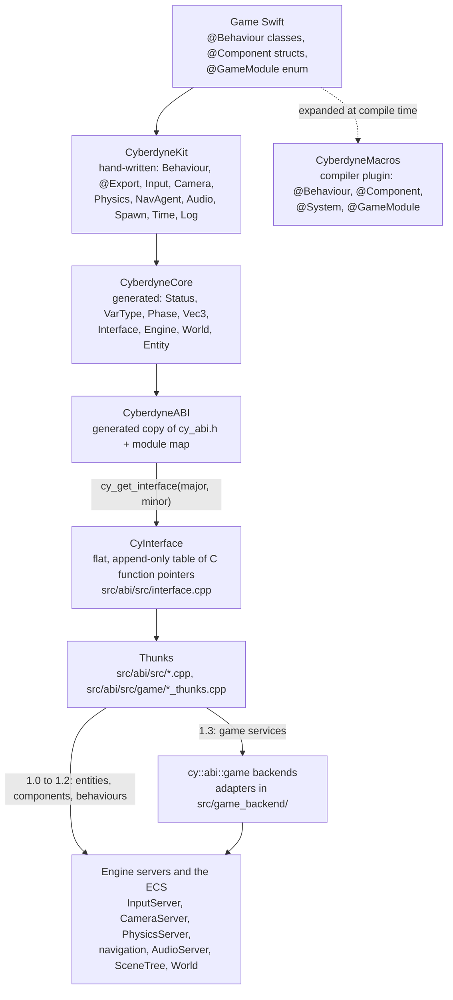
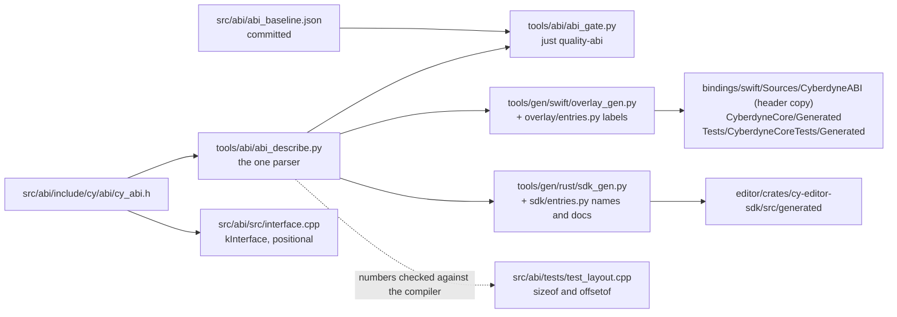

# Swift gameplay in CyberEngine

A tutorial for a gameplay programmer, and for the engine contributor who extends what gameplay can
reach: how a Swift game is put together, built, loaded and hot-reloaded; the behaviour and system
models; the ABI 1.3 game services (time, input, camera, physics queries, navigation, audio,
spawning) with the real API; a walk through the Swift-only RTS sample; and the bindings underneath,
including how to add an ABI entry end to end without breaking a module that already shipped.

**Governed by**: [`swift-scripting`](../../openspec/specs/swift-scripting/spec.md) (the package,
the generated overlay, behaviours, systems, macros, lifetime, concurrency, hot reload, debugging,
packaging) and [`native-abi`](../../openspec/specs/native-abi/spec.md) (the flat C interface, the
versioned table, module entry, handles, marshalling, errors, reload, the compatibility gate, the
Rust SDK overlay). The game services were added by the open change
[`add-swift-game-api`](../../openspec/changes/add-swift-game-api/design.md), whose design is the
per-entry reference for phases, determinism, ownership and errors. The module READMEs linked below
are the detailed reference; this guide is the route through them.

| Where | What |
|---|---|
| [`bindings/swift/`](../../bindings/swift/README.md) | The `CyberdyneKit` Swift package a game depends on: four targets, the tests, the module builder |
| [`src/abi/`](../../src/abi/README.md) | The C ABI: `cy_abi.h`, the interface table, the module loader, hot reload, the 1.3 thunks |
| [`src/game_backend/`](../../src/game_backend/include/cy/game_backend/) | The adapters behind the 1.3 entries: input, camera, physics queries, navigation, audio, spawn |
| [`tools/abi/`](../../tools/abi/README.md) | The ABI description and its compatibility gate |
| [`tools/gen/swift/`](../../tools/gen/swift/README.md), [`tools/gen/rust/`](../../tools/gen/rust/README.md) | The Swift overlay generator and the editor's Rust SDK generator |
| [`samples/13-rts-api`](../../samples/13-rts-api/README.md) | An RTS written only in Swift, through ABI 1.3 |
| [`samples/05b-editor-window/project`](../../samples/05b-editor-window/project/) | The editor project whose `game/SpinCube.swift` runs when you press Play |


*`SpinCube`'s `@Export var degreesPerSecond` as an authored `ScriptBehaviour` field in the
Inspector ([`samples/05b-editor-window`](../../samples/05b-editor-window/README.md), "Swift cube
during Play").*

## Contents

1. [The layering, and why the boundary is a flat C table](#1-the-layering-and-why-the-boundary-is-a-flat-c-table)
2. [A game project: create, build, load, run](#2-a-game-project-create-build-load-run)
3. [Behaviours](#3-behaviours)
4. [Components, values, entities and systems](#4-components-values-entities-and-systems)
5. [The game services (ABI 1.3)](#5-the-game-services-abi-13)
6. [Worked example: `samples/13-rts-api`](#6-worked-example-samples13-rts-api)
7. [The bindings, and adding an ABI entry](#7-the-bindings-and-adding-an-abi-entry)
8. [Hot reload, determinism, testing, debugging, pitfalls, and what is not built](#8-hot-reload-determinism-testing-debugging-pitfalls-and-what-is-not-built)
9. [Further reading](#9-further-reading)

---

## 1. The layering, and why the boundary is a flat C table

The engine core is C++20 and never links Swift (`integration.swift_no_runtime` checks that no engine
binary links or embeds the Swift runtime). A game is an ordinary Swift package that depends on
`CyberdyneKit` and builds a shared library; the engine opens it as a module and the two talk only
through one C header, `src/abi/include/cy/abi/cy_abi.h`.



| Target | Written by | Contents |
|---|---|---|
| `CyberdyneABI` | the generator | `cy_abi.h`, copied verbatim with a "GENERATED COPY" banner, and a module map. Its one C source compiles the header as C on every build. |
| `CyberdyneCore` | the generator | `Generated/ABI.swift`, `Enums.swift`, `Math.swift`, `Interface.swift`, `Handles.swift` |
| `CyberdyneKit` | by hand | the ergonomic layer, one file per concern under `Sources/CyberdyneKit/` |
| `CyberdyneMacros` | by hand | the macro plugin; `swift-syntax` pinned `exact: "603.0.2"` in `Package.swift` |

A game writes `import CyberdyneKit` and nothing else: `Exports.swift` re-exports the other two
(`@_exported import CyberdyneABI`, `@_exported import CyberdyneCore`).

### Why a flat C table

`cy_abi.h` states four rules at its top. The two that shape everything a gameplay programmer sees:

> 1. C CONSTRUCTS ONLY. `extern "C"` functions, opaque pointer handles, POD structs with explicit
>    layout, fixed-width integers, function pointers. [...] C++ has no stable ABI across compilers,
>    standard library versions or optimisation settings; C does, and that is the whole reason this
>    boundary is C.
>
> 2. APPEND-ONLY WITHIN A MAJOR VERSION. Every struct that a module may have compiled against
>    carries `struct_size` as its first member, and `CyInterface` carries `CyInterfaceHeader` with
>    `table_size`. New entries are appended at the end and the size grows; an existing entry is
>    never reordered, removed, or given a different signature.

The engine exports exactly one symbol, `cy_get_interface`; everything else is a pointer in the
returned table. That is what lets a module built against an older minor keep running on a newer
engine without recompilation: the first entries of today's table are the older table, byte for
byte, and a module reads only the prefix it knows. Failure crosses as a value (`CyResult`), never as
an exception, and every service handle is an integer the engine resolves and generation-checks,
never an engine address.

### Why the overlay is generated

`bindings/swift/README.md` gives the reason: *a declaration that can drift from the thing it
describes will.* A hand-written Swift mirror of a C struct whose member order disagreed would still
compile, and read the wrong bytes. So `CyberdyneCore` is generated by
`tools/gen/swift/overlay_gen.py` from the description `tools/abi/abi_describe.py` computes — the
one parser of `cy_abi.h` in the repository — and the Rust editor SDK is generated from the same
description (section 7). The generated overlay does **not** mirror C structs at all: Swift's C
importer already produces `CyPose`, `CyTime` and the rest from the header, so only the vectors, the
enums, the table wrapper and the handle wrappers are generated.

The version this tree is at, from `cy_abi.h` and `Generated/ABI.swift`:

```c
#define CY_ABI_MAJOR 1u
#define CY_ABI_MINOR 3u
#define CY_ABI_PATCH 0u
```

```swift
public static let interfaceTableSize: UInt32 = 664
```

The table has 81 entries (`just quality-abi` reports 82, counting the header): 43 from 1.0 to 1.2 (diagnostics, values, entities, components,
behaviours, component description, hierarchy, `world_chunks`, the editor service envelope) and the
38 game-service entries 1.3 appended after `service_poll`, together with
`CyBehaviourVTable.frame_update`.

---

## 2. A game project: create, build, load, run

### The toolchain

Install Swift with `swiftly` as [the building guide](building.md#swift-m4--playable) describes, and
put the environment line in `~/.bashrc`, not only `~/.profile`: every Swift invocation in the tree
goes through `bash -lc '. ~/.local/share/swiftly/env.sh; …'`, but a terminal or a tool that does not
will not find `swift`. `just env-doctor` diagnoses the case. Every measurement in
`bindings/swift/README.md` is Linux with Swift 6.3.3; the toolchain version is not pinned anywhere
yet (section 8).

Without a Swift toolchain the engine still configures and builds: `integration.swift_package`,
`integration.swift_reload`, `samples/04-character` and `samples/13-rts-api` are not built or
registered, and the configure says so.

### The smallest module

Two declarations make a loadable module: a behaviour and a `@GameModule`. From
`samples/13-rts-api/game/Game.swift`:

```swift
import CyberdyneKit

@GameModule
enum RtsGame: GameModule {
    static let behaviours: [any BehaviourClass.Type] = [
        Commander.self
    ]
}
```

`@GameModule` emits `cy_module_entry` and `cy_module_shutdown` into the **game's** module. They
cannot live in `CyberdyneKit`: it is linked as a static archive, and a linker drops an unreferenced
object, so an entry point there would be absent from the game's library and the loader would report
a module that "did not export its declared entry symbol" (`Module.swift`). The generated entry calls
`ModuleBootstrap.entry`, which refuses a table it may not call — a different major, or a
`table_size` smaller than `ABI.interfaceTableSize` — by setting the engine's last error and
returning false, which the loader reports and survives.

`GameModule.initialize(at:)` defaults to registering every type in `behaviours` at `InitLevel.scene`
(the levels are `.core`, `.servers`, `.scene`, `.editor`). Override it to do more, such as
registering components or systems (section 4).

### The module manifest

A host that loads a module by hand reads a `module.toml`. `samples/13-rts-api/module.toml`:

```toml
name = "rts-api"
entry_symbol = "cy_module_entry"
min_abi_major = 1
min_abi_minor = 3
hot_reload = true

[platform.linux]
library = "libCyGame_g0.so"

[platform.windows]
library = "CyGame_g0.dll"

[platform.macos]
library = "libCyGame_g0.dylib"
```

`min_abi_minor = 3` because the game calls 1.3 entries. The parser (`parse_module_manifest` in
`src/abi/include/cy/abi/module.h`) accepts a deliberately small TOML subset and refuses an unknown
key by name, so a typo is an error rather than a setting that silently did not apply.

### Building: one library per generation

A module is built by `bindings/swift/tools/cy_swift_module.py`, never by a bare `swift build`,
because hot reload needs two things SwiftPM will not do for you (the tool's header and
`bindings/swift/README.md`, "Hot reload"):

* **a different file per generation**, because `dlopen` of a path already open returns the image
  already loaded;
* **a different Swift `-module-name` per generation**, because name-based type lookup is
  process-global and first-registration-wins, and two resident images called `CyGame` make the new
  one find the old one's metadata.

The tool writes a small package whose target is `CyGame_g<N>`, copies the sources in, and builds it
with SwiftPM:

```sh
python3 bindings/swift/tools/cy_swift_module.py --probe
python3 bindings/swift/tools/cy_swift_module.py --work build/my-game \
    --generation 0=path/to/game --out build/my-game/out [--configuration debug|release]
```

`samples/13-rts-api/CMakeLists.txt` runs exactly this as a custom command, choosing `release` for the
Profile and Shipping configurations and `debug` otherwise.

### A project from the editor's template

```sh
just content-new-project ~/CyberdyneProjects/MyGame --template swift-gameplay
just run-editor-live --project ~/CyberdyneProjects/MyGame
```

The `swift-gameplay` template (`Template::builtin` in
`editor/crates/cy-editor-services/src/settings.rs`) writes `project.json`, the engine's
`types.cytypes`, an empty `worlds/main.cyworld`, and `gameplay/Gameplay.swift` containing one
comment line. It does not write a behaviour, a `@GameModule` or a `Package.swift`; you write those.
**Read the pitfall in section 8 before you build it**: the editor's build compiles `game/`, not
`gameplay/`.

The reference layout is the editor sample's project, `samples/05b-editor-window/project/`:

```
project.json            {"name": ..., "engine": "CyberEngine", "scripts": "game", "worlds": "worlds"}
Package.swift           SourceKit-LSP only: depends on bindings/swift, path "game"
game/SpinCube.swift     the behaviour and the @GameModule
types.cytypes           the engine's component types
worlds/*.cyworld        the scenes; a node's ScriptBehaviour component names the class to run
```

Its `Package.swift` exists so SourceKit-LSP can resolve `CyberdyneKit` for diagnostics and
completion; the runtime generations are built separately by `cy_swift_module.py`.

### Running it in the editor

The editor's Swift Workspace (`editor/README.md`, "Current authoring surfaces") lists the project's
Swift files, edits them in buffers, and offers two commands:

| Command | Key | What it does |
|---|---|---|
| `project.build` | `Ctrl+B` | runs `cy_swift_module.py` in the background over `<project>/game`, into `<project>/build/script-module/out/libCyGame_g<N>.so` |
| `project.reload` | | asks the attached runtime to load the newest built generation, keeping live state |

A node runs a behaviour when it has a `ScriptBehaviour` component whose text `class` field names a
registered `@Behaviour`. From `samples/05b-editor-window/project/worlds/spinning-cube.cyworld`:

```
type 3 runtime "ScriptBehaviour"
  field 6 text "class" "The registered Swift behaviour to run during Play."
  field 14 float "degreesPerSecond" "SpinCube rotation speed in degrees per second (0–360)."
...
  component 3
    field 6 "SpinCube"
    field 14 45
```

Build, wait for the build to finish, then press Play. The engine process `just run-editor-live`
starts is `cy_editor_window_runtime`; its `ScriptRuntime`
(`samples/05b-editor-window/runtime/script_runtime.cpp`) loads the newest
`libCyGame_g<N>.so`, creates each scripted node's behaviour, applies the authored field values,
and calls `fixed_update` on every Play tick. Pause holds the simulation; Stop restores the authored
world. A successful build during Play reloads the running session; Stop and Play again also loads
the newest build. A scene that names a script with no built module refuses Play with that reason.

What this host does **not** do yet is as important:

* it calls `fixed_update` only, never `frame_update`, so **`onUpdate` does not run during editor
  Play**;
* it binds none of the 1.3 game-service backends, so `Input`, `Camera`, `Physics`, `Navigation`,
  `Audio` and `Spawn` throw `CyberdyneError.status(.unavailable, …)` there (`Camera.active()`
  turns that into nil). `Time` has no backend and answers. The editor README says
  as much for audio ("Audio is still unavailable in this host").

A behaviour that only reads and writes components, as `SpinCube` does, works in the editor today. A
game that uses the services runs under a host that binds them, which is what the RTS sample's C++
host is (section 6).

### Running it headless

The samples run without a window:

```sh
just run-sample rts-api                    # 420 frames of scripted play, headless, then the report
just run-sample rts-api --no-behaviours    # the negative control: the same host with no game
just run-sample character                  # samples/04-character, 900 fixed ticks
```

Each sample host is a small C++ program (`samples/13-rts-api/host/rts_host.cpp`) that brings up
servers, binds the adapters on a `cy::abi::Host`, parses the manifest, and drives a
`cy::abi::BehaviourRuntime`:

```cpp
const auto loaded = runtime_.load(manifest_, options_.module_library);
...
const auto created = runtime_.create("Commander", cy::abi::to_abi(player_));
```

and then, per frame, `runtime_.fixed_update(kStep)` inside the fixed tick and
`runtime_.frame_update(kStep)` after it. There is no generic headless player for an arbitrary
project yet; a game that needs one today writes a host like this one.

---

## 3. Behaviours

A behaviour is a class attached to an entity, with a lifecycle. `SpinCube`, from
`samples/05b-editor-window/project/game/SpinCube.swift`:

```swift
@Behaviour(name: "SpinCube", schema: 1)
final class SpinCube: Behaviour {
    @Export(range: 0...360) var degreesPerSecond: Float = 45

    private var angle: Float = 0
    private var transform = ComponentType.invalid

    override func onCreate() throws {
        guard let world else { throw SpinError.missingWorld }
        transform = world.find(component: "cy::scene::LocalTransform")
        guard transform.isValid else { throw SpinError.missingTransform }
    }

    override func onFixedUpdate(_ delta: Double) throws {
        guard let world else { throw SpinError.missingWorld }
        angle += degreesPerSecond * Float(delta) * .pi / 180
        let half = angle * 0.5
        // The reflected LocalTransform fields begin with rotation x, y, z, w.
        try world.setFloat(sin(half), entity, transform, field: 2)
        try world.setFloat(cos(half), entity, transform, field: 3)
    }
}
```

`@Behaviour(name:schema:)` registers the class: `name` defaults to the class's own name and is how an
instance finds its type again after a reload; `schema` (default 1) is bumped whenever the serialized
shape changes (section 8). `Behaviour` holds `entity` (a handle, never an owning reference),
`world` (re-read from `Runtime.world` on every access, so it is nil before a world is bound) and
`isEnabled`.

### The lifecycle, and which callbacks the engine drives

| Callback | Driven today by | Phase |
|---|---|---|
| `onCreate()` | the vtable's `create`, when the host creates the instance | none (`N`) |
| `onFixedUpdate(_ delta: Double)` | `fixed_update`, from `BehaviourRuntime::fixed_update` | fixed (`F`) |
| `onUpdate(_ delta: Double)` | `frame_update` (ABI 1.3), from `BehaviourRuntime::frame_update` | frame (`U`) |
| `onDestroy()` | `destroy` | none |
| `onAfterReload(restored:)`, `onMigrate(_:_:)` | `deserialize`, during a reload | none |
| `onEnterTree`, `onReady`, `onEnable`, `onDisable`, `onExitTree` | **nothing yet**: declared, recorded, and reachable only through `Behaviour.dispatch(_:delta:)` | |

Only what a class writes is registered. The `@Behaviour` macro reads the class body and emits
`behaviourCallbacks`, a `CallbackSet`; `BehaviourBridge.swift` then sets `vtable.frame_update` only
for a class that declared `onUpdate`, so a behaviour without one is never scheduled for a frame —
`swift-scripting`'s "Unimplemented callback costs nothing" decided at registration. (It is decided at
compile time because Swift on Linux has no portable way to ask whether a subclass overrode a method,
and the runtime lookups that exist were measured returning a retired generation's metadata.)

Every callback `throws`. A thrown error is caught in the bridge, logged as
`"<Name>.<callback> failed: …. The instance is disabled; the engine keeps running."`, and
`isEnabled` becomes false. A behaviour that never fails may override with a non-throwing method. A
Swift **trap** (a force-unwrap of nil, an out-of-range index, an overflow) has no catch on any
platform and takes the process down; write `guard … else { throw … }` as `SpinCube` does.

`onUpdate` and `onFixedUpdate` are the two halves of every game in section 5: read devices and the
camera in `onUpdate`, change the simulation in `onFixedUpdate`. Where in the tick `onFixedUpdate`
falls relative to the physics step is the host's choice: the editor's hosted runtime calls it after
physics; `samples/13-rts-api`'s host calls `runtime_.fixed_update` before its physics step, so its
queries see the previous tick's step. Instances are dispatched in the runtime's slot order.

### `@Export`, and the Inspector

`@Export` is a property wrapper (`Export.swift`), not a macro: it holds the value and its
constraint; the `@Behaviour` macro supplies the names, by emitting `exportedNames` and an
`exportedStorage(named:)` switch. The type must conform to `Exportable`, a closed set: `Bool`,
`Int64`, `Int32`, `Int`, `Float`, `Double`, `String`, `Vec2`, `Vec3`, `Vec4`, `Quat` and `Entity`.
`@Export(range: 0...20)` records a `.range` constraint, held as `ClosedRange<Double>`. An exported
`let` is a compile error: an exported property is written by the Inspector and by a reload.

An exported property is what a reload carries (section 8). In the editor it is authored as a field
of the node's `ScriptBehaviour` component, beside `class`. The editor does not yet derive those
fields from the Swift declaration: `samples/05b-editor-window/README.md` says to "declare a matching
field on its authored `ScriptBehaviour` component with the same name and value kind as the Swift
`@Export` property", as `spinning-cube.cyworld` declares `degreesPerSecond`. On Play,
`authored_exports` in `script_runtime.cpp` writes those fields into a state blob and hands it to the
instance's `deserialize`, so the authored value lands in the property. It handles `Bool`, `Int`
(sent as `i64`, so the Swift side is `Int64`, `Int` or `Int32`), `Float` (`f32`), `Double` (`f64`)
and text; vector fields are not applied yet. Editing the value in the Inspector writes the world;
save it and press Play again to apply it.

`@Node("path")` exists and always reads nil: there is no node entry in the table, and nothing calls
its `resolve(_:)` (`Export.swift` says so).

---

## 4. Components, values, entities and systems

### Entities and handles

`Entity` is a value wrapping a 64-bit `CyEntity`; `Entity.null` and `isNull` are generated in
`Handles.swift`. Holding one keeps nothing alive. `World` (generated in `Handles.swift`, extended in `Components.swift`) has:

```swift
let e = try world.makeEntity()
world.isAlive(e)                       // the question swift-scripting requires a stale handle to answer
try world.destroy(e)
```

`destroy` removes one entity. To remove a spawned prefab and its subtree, use `Spawn.destroy` or
the static `World.destroy(_:)` (section 5).

### Components

A Swift component is a struct with `@Component`. From `samples/13-rts-api/game/Contract.swift`:

```swift
@Component
struct RtsReport {
    /// The unit that is selected now, or null.
    var selected: Entity = .null
    /// Move orders handed to navigation.
    var orders: Float = 0
    ...
}
```

The macro emits `componentName`, the `componentFields` table (name, `VarType`, offset, size) and
`init()`. It refuses a class, a stored property without an explicit type annotation, and any field
type outside `Bool`, `Int64`, `Float`, `Double`, `Vec2`, `Vec3`, `Vec4`, `Quat` and `Entity`: the ECS
moves a component's bytes when an entity changes archetype, and a moved class reference is a leak or
a double free. (That is why `RtsReport` counts in `Float`.)

Register it with `Components.register(_:in:)` and add it:

```swift
report = try Components.register(RtsReport.self, in: world)
if !world.has(report, on: entity) {
    try world.add(report, to: entity)
}
```

Registration is idempotent by name, so a reloaded module gets the same id back. An engine
component is found by its registered name — `world.find(component: "cy::scene::LocalTransform")` —
and since ABI 1.1 every existing entry works on it.

### Reading and writing fields: two paths

| Path | Swift | ABI entries | Use it for |
|---|---|---|---|
| Typed | `world.float(_:_:field:)`, `setFloat`, `vec3`, `setVec3` | `component_get_f32`, `component_set_f32`, `component_get_vec3`, `component_set_vec3` | a field touched every tick |
| Reflective | `world.value(_:_:field:)`, `setValue(_:_:_:field:)` over `Value` | `component_get_var`, `component_set_var` | tools, inspectors, anything generic |

A field is addressed by index, the order of `componentFields`. Resolve the index by name once, as
`Contract.swift`'s `Component.field(_:)` extension does in the sample, rather than hard-coding it —
`SpinCube`'s literal `field: 2` is the reflected layout of `LocalTransform` and is correct only for
as long as that layout is.

`Value` (`Values.swift`) is the Swift face of `CyVar`: `.none`, `.bool`, `.i64`, `.f32`, `.f64`,
`.vec2`, `.vec3`, `.vec4`, `.quat`, `.string`, `.bytes`, `.entity`. Strings and bytes are made
through `var_make_string` / `var_make_bytes` and released after the call, so no engine allocation
outlives it.

### Systems: the model, and what is missing

A system is a function whose query **is** its access declaration:

```swift
@System(stage: .simulation)
func applyGravity(_ query: Query<Write<Velocity>, Read<Mass>>, _ chunks: ChunkSource) {}
```

`@System` expands to a `__CySystem_applyGravity` enum with a `descriptor` and a `register()` that
"A game calls it from `GameModule.initialize(at:)`" (the doc comment `SystemMacro.swift` emits,
pinned by `MacroExpansionTests.swift`). The macro
refuses a query that reads and writes the same component, a first parameter that is not a
`Query<...>`, and any parameter other than the query and a `ChunkSource` — so `Res<...>` is
diagnosed rather than accepted. `Systems.conflictingPairs(in:)` applies the scheduler's rule (a
write conflicts with any other access to the same name; two reads never conflict). The inner loop
indexes `ChunkView.array(_:)`, a borrowed `UnsafeMutableBufferPointer<T>`, with no `CyVar` and no
per-entity call; `EscapeGuard` logs a use after the iteration ended.

**The engine does not run Swift systems yet.** There is no `register_system` entry, so
`Systems.registered` stays on the module side, and nothing in `CyberdyneKit` conforms to
`ChunkSource`. `Systems.run(stage:over:)` exists for the package's tests, which supply their own
source (`ArrayChunkSource` in `SystemModelTests.swift`). ABI 1.1 did add `world_chunks` and
`CyChunk` — one component's column per chunk, with an epoch to validate against `borrow_valid` — and
`CyberdyneCore` exposes it as `World.chunks(component:into:capacity:count:)`, so a `ChunkSource`
over it is writable; it is not written, and scheduling against native systems needs the missing
entry. `Systems.swift`'s header comment still says 1.0 has no chunk entry; the model it describes is
otherwise accurate.

### Which to use

`swift-scripting` states the guidance: behaviours suit hand-authored gameplay objects, systems suit
bulk data, and both may be used in one project. In this tree today:

* **Behaviours** are the only model the engine drives. Use them for anything with identity and a
  lifecycle: a commander, a spawner, a camera controller, a door.
* **Typed accessors** are the hot path within a behaviour: one type check and the field's bytes.
* **Systems** are worth writing only against the tests until the engine can schedule them.

---

## 5. The game services (ABI 1.3)

Up to 1.2 a Swift game reached input, physics, cameras and audio only through components a C++ host
carried across for it; `samples/04-character/game/Contract.swift` is that style, eight components
and a host that reads or writes every one each tick. ABI 1.3 appended the verbs themselves.
`CyberdyneKit` wraps them with one facade per service, over the shared `Pose`, `Ray` and tuple
conversions in `GameTypes.swift`.

### The rules every entry follows

`cy_abi.h` states them once, above `CyPhase`. Each entry lists the phases it answers in:

| Letter | `Phase` | When |
|---|---|---|
| `N` | `.none` | module initialisation, `onCreate`, a frame boundary, a tool |
| `F` | `.fixedUpdate` | `onFixedUpdate` |
| `U` | `.frameUpdate` | `onUpdate` |

A call in any other phase is `CY_RESULT_PERMISSION_DENIED` **in every build**, which the facades
throw as `CyberdyneError.status(.permissionDenied, message:)` naming the entry. With no engine bound
(a unit test, a module that failed its version check) they throw `.unavailable`; so do the entries
whose backend the host did not bind. Other codes (`design.md`, D6): `.notFound` for an unknown name
or a stale handle, `.outOfRange` for a bad input user, `.alreadyExists` for pushing a context twice,
`.bufferTooSmall` handled inside the facades. "Nothing hit" and "no path" are not errors.

Anything callable in `F` answers from simulation state with a stated total order on every list, so a
replay gets the same answer. Device state (the pointer, the modifier keys) and presentation reads
(the camera) are not callable in `F`. Presentation *writes* (camera target and pose, audio) are
callable in `F` and do nothing while a tick is being resimulated. Service handles are integers that
survive a module reload, and do not survive the world or level that issued them.

| Service | Swift | `N` | `F` | `U` |
|---|---|:-:|:-:|:-:|
| Time | `Time.now`, `Time.phase` | yes | yes | yes |
| Input actions | `Input.find(action:)`, `Input.action(_:user:)`, `InputAction.state(user:)` | yes | yes | yes |
| Input contexts | `Input.context(_:)`, `Input.push(_:priority:user:)`, `Input.pop(_:user:)` | yes | yes | yes |
| Pointer, modifiers | `Input.pointer(user:)`, `Input.modifiers(user:)` | yes | | yes |
| Camera reads | `Camera.active()`, `view()`, `ray(through:)`, `ray(under:)`, `project(_:)` | yes | | yes |
| Camera writes | `setTarget(_:)`, `overridePose(_:)`, `clearPoseOverride()` | yes | yes | yes |
| Physics queries | `Physics.raycast`, `raycastAll`, `shapeCast`, `overlap` | yes | yes | yes |
| Immediate path | `Navigation.findPath(from:to:options:)` | yes | yes | yes |
| Queued path | `Navigation.requestPath`, `PathQuery.poll()`, `cancel()` | | yes | |
| Agent setup | `NavAgent.configure(_:)` | yes | yes | |
| Agent orders | `NavAgent.move(to:)`, `stop()` | | yes | |
| Agent state | `NavAgent.state` | yes | yes | yes |
| Audio | `Audio.cue`, `Audio.bus`, `Audio.play`, `Voice.stop`, `AudioBus.setVolume` | yes | yes | yes |
| Prefab resolve | `Spawn.prefab(_:)` (loads only in `N`) | yes | yes | yes |
| Spawn, destroy | `Prefab.instantiate`, `Spawn.destroy`, `World.spawn`, `World.destroy` | yes | yes | |

The per-entry notes (what each adapter does, what each test proves) are in
[`src/abi/README.md`](../../src/abi/README.md#what-abi-13-adds-and-why).

### Time

```swift
let tick = try Time.now.tick                   // any phase
if try Time.phase == .fixedUpdate { … }
```

`GameTime` carries `phase`, `tick` (in `F` the tick being simulated, otherwise the last committed
one), `fixedDelta`, `frameDelta`, `interpolation`, `isResimulating` and `isPaused`. In a fixed step
the engine writes `frameDelta` and `interpolation` as zero, so a fixed step cannot come to depend on
the frame rate by accident. Use `fixedDelta` there.

### Input

Actions are what the input server resolved for the tick, never a live device, so they are readable
in `F` and replay identically:

```swift
if try Input.action("unit.spawn").justPressed { … }
let pan = try Input.action("camera.pan").axis2         // a two-axis action
```

`ActionState` has `pressed`, `justPressed`, `justReleased`, `triggered`, `synthetic`, `value`
(`Vec3`), `scalar`, `axis2`, `pressCount` and `releaseCount` — a press and a release inside one tick
read 1 and 1. `Input.action(_:)` looks the name up on every call; a behaviour that reads an action
every tick resolves it once with `Input.find(action:)` and keeps the `InputAction`, which survives a
reload.

The pointer and modifiers are device state, refused in a fixed step (`N` and `U` only):

```swift
let pointer = try Input.pointer()
if pointer.pressed.contains(.left) && pointer.isInWindow && !pointer.isOverUI { … }
if try Input.modifiers().contains(.shift) { … }
```

`Pointer` has `buttons` (held), `pressed` and `released` (since the previous frame update),
`position` (window pixels, origin top-left, +y down), `delta`, `wheel`, and `isPresent`,
`isInWindow`, `isOverUI`. `PointerButtons` are `.left`, `.right`, `.middle`, `.extra1`, `.extra2`;
`Modifiers` are `.shift`, `.ctrl`, `.alt`, `.super` — and the engine has no Super key, so `.super`
is never set.

Mapping contexts are resolved by registered name: `let context = try Input.context(name)`, then
`try Input.push(context, priority: 10)` and `try Input.pop(context)`. A push takes effect at the next tick, never mid-tick.

### Camera

```swift
guard let camera = try Camera.active() else { return }   // nil when there is no primary view
let ray = try camera.ray(under: pointer)                  // near plane to far plane
let marks = try camera.project(selection.map(\.position)) // [ScreenPoint], one engine call
try camera.setTarget(CameraTarget(focus: .position(base), yaw: 0.8, pitch: -0.9, distance: 40))
```

Reads are refused in a fixed step (`N` and `U` only). `CameraView` gives the pose, `isOrthographic`,
`verticalFieldOfView`, `orthographicHeight`, `nearPlane`, `farPlane` and `viewport` (x, y, width, height in pixels).
`ScreenPoint` has `position`, `depth`, `isOnScreen` and `isBehind`. `CameraTarget.Focus` is
`.position(Vec3)` or `.entity(CyEntity)` (followed as it moves), with `blendSeconds` zero for a cut.
`overridePose(_:)` pins an explicit pose until `clearPoseOverride()`.

Setting a target moves the focus of whatever rig the host built. Yaw, pitch and distance are
recorded for the host's rig to read (`CameraAdapter::framing()`): the camera server has orbit
intents and no absolute orbit, so a target's angles do not move the camera on their own.

### Physics queries

```swift
extension Physics.Filter { static let units = Physics.Filter(mask: 1 << 3) }

if let hit = try Physics.raycast(ray, filter: .units) { select(hit.entity) }
let inBlast = try Physics.overlap(.sphere(radius: 6), at: Pose(position: impact))
```

`raycast` returns the nearest `Hit?`; `raycastAll` every hit, nearest first, equal distances in
entity order; `shapeCast(_:from:direction:maxDistance:filter:)` sweeps a `.sphere`, `.capsule` or
`.box`; `overlap` returns entities in entity order, each once. `Hit` carries `entity`, `point`,
`normal`, `distance`, `fraction`, `isTrigger`, `startedPenetrating`. `Filter` has `layer`, `mask`,
`options` (`.includeTriggers`, `.hitBackFaces`, `.skipStatic`, `.skipKinematic`, `.skipDynamic`) and
`ignoring`; `.all` hits everything solid, and `filter.ignoring(entity)` skips the caller's own body.
Queries throw `.unavailable` while the physics step runs. The first use of a new `Shape` creates
it, so do that on the game thread. The C++ side and the ordering rules are in
[the physics guide](physics.md#5-queries).

### Navigation

```swift
let agent = NavAgent(unit)
try agent.configure(.init(radius: 0.5, height: 1.8, maxSpeed: 6))   // at spawn, N or F
try agent.move(to: rallyPoint)                                     // F only
if try agent.state.justArrived { idle(unit) }                      // exactly one tick
```

`configure` makes the entity a crowd agent (the first call adds a `NavAgent` component and is
structural). `move(to:)` and `stop()` are recorded and applied in the tick's navigation update in
entity order, so the order scripts issue them in cannot matter. `NavAgent.State` has `status`
(`NavPathStatus`: `.idle`, `.computing`, `.following`, `.arrived`, `.failed`), `position`,
`velocity`, `target`, `remainingDistance`, and `justArrived` / `justFailed`, which are true in exactly
one fixed step. "Has it arrived" is an event, not a distance.

Two ways to get a path without an agent. `Navigation.findPath(from:to:options:)` answers now, in
any phase, at the cost of the whole search in the calling tick; `Path` has `points`, `found`,
`isPartial`, `budgetExceeded`, `cost`, `length`. `Navigation.requestPath(from:to:options:)` queues
it (fixed step only) and `PathQuery.poll()` answers `.pending` until it lands a fixed number of
ticks later whatever the load, then `.ready(Path)`; `.cancelled` after `cancel()`.

### Audio

```swift
try Audio.play("explosion", at: impact)                          // positional, fire and forget
let hum = try Audio.play(Audio.cue("tank.engine"), attachedTo: tank,
                         options: PlayOptions(loop: true, fadeIn: 0.3))
try hum?.stop(fadeOut: 0.5)
try Audio.bus("Music").setVolume(0.2, fade: 2)
```

Audio is presentation, allowed in every phase. `play` returns `Voice?`: nil when the mixer had no
voice to give, and always nil while a tick is resimulated (then `play`, `stop` and `setVolume`
succeed and do nothing, so a rolled-back explosion is not heard twice). `PlayOptions` has `volume`,
`pitch`, `loop`, `bus` and `fadeIn`. A fixed step must not branch on `Voice.isPlaying`: it is not
simulation state. Resolve a cue you play often once with `Audio.cue(_:)`.

### Spawning prefabs

```swift
let worker = try Spawn.prefab("units/worker")                     // resolve in onCreate
let squad = try worker.instantiate(at: [Pose(position: a), Pose(position: b)])
let recruit = try worker.instantiate(at: Pose(position: barracks), parent: squad[0])
try World.destroy(recruit)                                        // the subtree, children first
```

Spawning is simulation: `instantiate` and `destroy` are allowed at initialisation and in a fixed
step and refused in `onUpdate`, because a spawn made from a frame would exist in one run and not in
its replay. `Spawn.prefab(_:)` may load the asset only at initialisation; in `F` or `U` an asset that
is not resident is `.unavailable`, so resolve every prefab in `onCreate` and keep the `Prefab`. A
batch is all or nothing. The same calls in the same fixed step give the same entities on every run.
`World.spawn(prefab:at:scale:parent:)` resolves and instantiates in one call — convenient in
`onCreate`, a lookup per call anywhere else. A prefab is a `SceneDescription` today; spawning a
cooked `EntityTemplate` through the ABI is a follow-up recorded in the change's tasks.

### Selection highlights

Marking a unit selected or hovered is not an ABI entry; it is one engine component,
`cy::rendering::selection::SelectionHighlight`, which `Selection.swift` finds by name and adds from
its eight bytes (`kind`, then `colour` as RGBA8):

```swift
try world.highlight(unit, .selected(red: 40, green: 140, blue: 255))
try world.highlight(hoveredUnit, .hovered(red: 255, green: 244, blue: 214))
try world.clearHighlight(unit)
```

`highlight` throws `.notFound` when nothing registered the component in that world — a world that no
selection pass outlines. The C++ half is `src/rendering/selection/` and
[`samples/13-rts-selection`](../../samples/13-rts-selection/README.md); `unit.abi_selection` drives
this exact path through the C ABI, and `SelectionTests.swift` pins the layout.

### Diagnostics

```swift
Log.info("Commander: \(squad.count) units ready")
Log.warning("…")
Log.error("…")
```

`Log` writes into the engine's diagnostic stream through the `log` entry, not stdout, so a line lands
in the same timeline as the engine's own. There are three levels because
`cy::DiagnosticSeverity` has three; `Severity` is generated from `CySeverity`. With no engine bound
the message goes to `Log.fallback`, which a test can replace to assert on what a behaviour said. An
engine failure reaches Swift as `CyberdyneError.status(Status, message:)` carrying the engine's own
`get_last_error` text; the other cases are `.invalidHandle` and `.notRepresentable(String)`.

---

## 6. Worked example: `samples/13-rts-api`

The end-to-end proof of ABI 1.3: a camera that the keys and the screen edges pan, a unit picked under
the pointer, sent to a clicked ground point, heard arriving, and a new unit built with a key. Every
decision is Swift calling the engine; the C++ host binds six adapters and builds the level, and does
not carry a single value between the game and a server.

```sh
just run-sample rts-api
ctest --test-dir build/dev -R rts_api_sample --output-on-failure    # integration.rts_api_sample
```

| File | What it holds |
|---|---|
| `game/Game.swift` | the `@GameModule` (section 2) |
| `game/Contract.swift` | content names, two collision layers, the `RtsReport` component |
| `game/Commander.swift` | the squad, the selection, the orders, the build key |
| `game/RtsCamera.swift` | panning |
| `host/` | servers, adapters, the level, agent bodies, the scripted player |

### The contract: names and layers

What the game and the host agree on is only names. `Contract.swift`:

```swift
enum Content {
    /// The worker unit's prefab. The host registers it as resident, so `Spawn.prefab` never loads.
    static let worker = "units/worker"
    /// The cue played when a unit reaches the point it was sent to.
    static let arrived = "unit.arrived"
    /// Keyboard camera panning: a two-axis action on WASD and the arrow keys.
    static let pan = "camera.pan"
    /// The build key.
    static let spawn = "unit.spawn"
}

enum Layers {
    static let ground = Physics.Filter(mask: 1 << 0)
    static let units = Physics.Filter(mask: 1 << 1)
}
```

The host puts the ground on collision layer 0 and every agent's kinematic capsule on layer 1, so a
click can ask for a unit or for the ground and get only that.

### Three callbacks, three phases

`Commander.swift`'s header is the whole design:

```swift
//   onCreate       (no phase)    resolve the prefab and the cue, spawn the starting squad
//   onUpdate       (frame)       read the pointer, pan the camera, pick a unit or a ground point
//   onFixedUpdate  (fixed step)  hand the recorded order to navigation, hear arrivals, build
```

**Creation.** Resolve once, where the engine may still load, and spawn the starting squad as one
batch:

```swift
override func onCreate() throws {
    guard let world else { throw CyberdyneError.invalidHandle }
    report = try Components.register(RtsReport.self, in: world)
    if !world.has(report, on: entity) {
        try world.add(report, to: entity)
    }
    reportFields = ReportFields()

    // Resolved once, here, where the engine may still load. A fixed step would get
    // `.unavailable` for an asset that is not resident rather than stall on it.
    worker = try Spawn.prefab(Content.worker)
    arrivedCue = try Audio.cue(Content.arrived)
    camera = RtsCamera(focus: mapCentre, speed: panSpeed, edgeBand: edgeBand)

    let starting = try worker.instantiate(at: [
        Pose(position: firstUnit), Pose(position: secondUnit),
    ])
    for unit in starting {
        try enlist(unit)
    }
    Log.info("Commander: \(squad.count) units ready")
}
```

`enlist` configures each unit as a navigation agent from `@Export`ed tunables (`unitRadius`,
`unitHeight`, `unitSpeed`, `arrivalDistance`), so a designer changes them without touching code.

**The frame.** Read the pointer and the camera, decide what a click means, and **record** it:

```swift
override func onUpdate(_ delta: Double) throws {
    guard let active = try Camera.active() else { return }
    let pointer = try Input.pointer()
    let keys = try Input.action(Content.pan).axis2
    let viewport = try active.view().viewport
    let direction = camera.direction(keys: keys, pointer: pointer, viewport: viewport)
    try camera.pan(active, direction: direction, delta: Float(delta))

    if pointer.pressed.contains(.left) {
        try select(under: pointer, through: active)
    }
    if pointer.pressed.contains(.right) && !selected.isNull {
        try order(under: pointer, through: active)
    }
}
```

Selection is a camera ray and a physics query against the unit layer only, so the ground under a
unit never wins:

```swift
private func select(under pointer: Pointer, through camera: Camera) throws {
    let ray = try camera.ray(under: pointer)
    let hit = try Physics.raycast(ray, filter: Layers.units)
    selected = hit.map(\.entity).flatMap { squad.contains($0) ? $0 : nil } ?? .null
}
```

An order asks for the ground only, so a unit in the way does not become the target, and it is kept
as a value for the next fixed step, because `NavAgent.move(to:)` is refused in a frame:

```swift
private func order(under pointer: Pointer, through camera: Camera) throws {
    let ray = try camera.ray(under: pointer)
    if let ground = try Physics.raycast(ray, filter: Layers.ground) {
        pendingOrder = ground.point
    }
}
```

**The fixed step.** Act on the recorded order, hear arrivals, build:

```swift
override func onFixedUpdate(_ delta: Double) throws {
    // A click that deselected after the order was recorded leaves nobody to send.
    if let target = pendingOrder, !selected.isNull {
        try NavAgent(selected).move(to: target)
        tally.orders += 1
    }
    pendingOrder = nil
    for unit in squad {
        try listen(to: unit)
    }
    if try Input.action(Content.spawn).justPressed {
        try enlist(worker.instantiate(at: Pose(position: barracks)))
        tally.spawns += 1
    }
    try publish()
}
```

`listen(to:)` plays the cue on the one tick navigation reports the arrival, so a cue plays once
however long the unit then stands there:

```swift
private func listen(to unit: Entity) throws {
    let state = try NavAgent(unit).state
    guard state.justArrived else { return }
    tally.arrivals += 1
    if try Audio.play(arrivedCue, at: state.position) != nil {
        tally.cues += 1
    }
}
```

The build key reads action state, which is resolved per tick and so is legal in a fixed step, and
spawns there because spawning is refused in a frame. `publish()` writes the tallies into `RtsReport`
with `setValue` and `setFloat`; the host reads that component only to print the report its test
checks.

**The camera.** `RtsCamera.pan` moves a ground point and hands it to the rig:

```swift
mutating func pan(_ camera: Camera, direction: Vec2, delta: Float) throws {
    let moving = direction.x != 0 || direction.y != 0
    guard moving || !placed else { return }
    focus.x += direction.x * speed * delta
    focus.z += direction.y * speed * delta
    try camera.setTarget(CameraTarget(focus: .position(focus)))
    placed = true
}
```

and `direction(keys:pointer:viewport:)` adds an edge pan only when the pointer `isPresent`,
`isInWindow` and not `isOverUI`.

### Extending it: a selection outline

The sample does not draw the selection. To add it, register the selection component in the host's
world (`register_selection_highlight`, as `samples/13-rts-selection/main.cpp` does, together with a
selection pass that draws it) and, in `select(under:through:)`, clear the previous unit and mark the
new one:

```swift
if !previous.isNull { try world?.clearHighlight(previous) }
if !selected.isNull { try world?.highlight(selected, .selected(red: 40, green: 140, blue: 255)) }
```

Without the component registered, `highlight` throws `.notFound`, and the bridge disables the
behaviour — which is why the sample as written does not call it.

### What the test proves

`integration.rts_api_sample` runs the host as a separate process and reads its report: the keyboard
pan moved the camera about +6 m and the edge pan about -6 m; the clicked entity is the one the game
selected; one order was issued and the unit arrived within its arrival distance while the other did
not move; one arrival, one accepted cue, one voice; the build key made a third worker; none of it
happens with `--no-behaviours`; two runs print the same report. It was proven red by breaking
`physics_raycast` and `audio_play`. The README's known limits apply: the navigation funnel walks a
staircase off a cell row, and the click-to-order hand-off is in-process (single-player; a lockstep
RTS needs the `gameplay_submit_command` append `design.md` names).

---

## 7. The bindings, and adding an ABI entry

### One header, one description, three consumers



* `abi_describe.py` derives every struct's size and offsets from the declarations rather than by
  compiling, because a compiled description describes one toolchain on one machine and the baseline
  is diffed across the platform matrix. `test_layout.cpp` checks the model against the compiler.
* The gate compares the description with `abi_baseline.json`: an append with `CY_ABI_MINOR`
  incremented passes; a reorder, a removal, a changed signature, an inserted struct member, a
  changed enum value or a minor that did not move is refused, naming the entry and printing the
  approval stanza that would record the break in `src/abi/abi_approvals.toml` (empty, and meant to
  stay so).
* Both generators hold one hand-written table, `entries.py`, because the description strips
  parameter names and Swift needs argument labels (Rust needs names and a doc line). Each table is
  validated against the description, so **appending an entry stops generation until somebody names
  its parameters**. Which wrapper an entry lands on is derived: a first parameter of `CyWorld` makes
  it a method on `World` (`world_create_entity` becomes `world.createEntity()`), `CyEngine` on
  `Engine`, otherwise `Interface`.

The checks that keep them in step:

| Check | Runs | Holds |
|---|---|---|
| `just quality-abi` / `integration.abi_baseline` | no build needed | the header matches the baseline |
| `just quality-abi --selftest` / `integration.abi_gate` | no build needed | the gate still refuses a reorder, a removal and a break |
| `just generate-swift --check` / `integration.swift_overlay` | no Swift needed | the committed overlay and header copy are what regeneration produces |
| `integration.swift_overlay_gen` | no Swift needed | the generator refuses an ABI it does not fully cover |
| `python3 tools/gen/rust/sdk_gen.py --check`, run by `cargo test -p cy-editor-sdk` | Rust | the committed SDK bindings are current |
| `unit.abi` | C++ | the table's shape, the phase rule, `struct_size` both ways, the 1.3 layouts, each group against fake backends |

### Adding an entry, end to end

Suppose a game needs a new service verb. The steps, in order, with the file each lands in:

1. **Header.** Append the entry at the end of `CyInterface`, below the marker
   `Append new entries below this line. Never above it, never between.` and after
   `spawn_destroy`, under a `/* --- 1.4: … --- */` comment. Give it its `[N F U]` phase list and
   whatever ownership rule is its own. Return `CyResult`; take `CyEngine` first so the generator
   puts it on `Engine`. A new struct begins with `uint32_t struct_size`, uses only fixed-width
   members, and gets a `CY_ABI_STATIC_ASSERT` on its size. Increment `CY_ABI_MINOR` to `4u`.
2. **Backend seam.** Add the method to the service's abstract backend in
   `src/abi/include/cy/abi/game/<service>.h` (or a new backend pointer on `GameServices` in
   `services.h`), and implement it in the adapter in `src/game_backend/`.
3. **Thunk.** Write it in `src/abi/src/game/<service>_thunks.cpp` and declare it in `thunks.h`,
   following the six steps `services.h` lists before a backend is reached: a null engine is
   `INVALID_ARGUMENT`; `require_phase(engine->game, <phase bits>, "<entry>")` refuses a phase the
   entry's list does not name, with the bits built from `kPhaseNone`, `kPhaseFixed` and
   `kPhaseFrame`; an unbound backend is `UNAVAILABLE`; sized structs go through `read_sized` /
   `write_sized`; presentation writes do nothing while resimulating; a structural call bumps the
   world's epoch. Report failures with `report(...)` and call `clear_last_error()` on success.
   `input_pointer` in `input_thunks.cpp` is a short example with a backend; `time_get` is one
   without.
4. **Table.** Add `&cy::abi::game::<entry>` at the **same position** at the end of `kInterface` in
   `src/abi/src/interface.cpp`. The initialiser is positional: an entry in the wrong place is a
   compile error only when the neighbouring signatures differ. Update the version in
   `cy_get_interface`'s refusal message, which spells `"this engine exports ABI 1.3 …"` literally,
   and the checks that pin 1.3: `test_interface.cpp` looks for `"1.3"` in that message, and
   `test_game_services.cpp` asserts `abi_minor == 3U` and that `spawn_destroy` is the table's last
   entry (`offsetof(CyInterface, spawn_destroy) + sizeof(void*) == sizeof(CyInterface)`).
5. **Baseline.** `just quality-abi` now reports the change as compatible but the committed
   description stale, and fails; `just quality-abi --update` rewrites `abi_baseline.json`, which is
   committed with the change.
6. **Generators.** Add a record to `tools/gen/swift/overlay/entries.py` (argument labels, and
   `result="throwing"` for an entry whose `CyResult` reports failure) and to
   `tools/gen/rust/sdk/entries.py` (names, `result="fallible"`, and a `doc` line). A new enum also
   needs a row in each generator's enum table in `emit.py`, beside `CyPhase`'s. Then `just generate-swift` and `just build-editor --generate`, and commit
   the output: `Generated/*.swift`, the header copy, the Swift layout suite
   (`Tests/CyberdyneCoreTests/Generated/LayoutTests.swift`), and
   `cy-editor-sdk/src/generated/`. `ABI.minor` and `ABI.interfaceTableSize` change with it.
7. **Kit facade.** Add the Swift verb in the service's file under `Sources/CyberdyneKit/`, over
   `GameServices.engine()` so it throws `.unavailable` with no engine, filling `struct_size` with
   `MemoryLayout<…>.size` on every struct it passes, as `Time.now` does.
8. **Tests.** A `unit.abi` case in `src/abi/tests/test_game_<service>.cpp` against a fake backend,
   including the refused phase; a table-shape case in `test_game_services.cpp` (the new entry
   follows `spawn_destroy`, is the last entry, and is set); for a new struct, its `sizeof` and
   `offsetof` rows in `src/abi/tests/test_layout.cpp`, written from the numbers the description
   computed, because that file is hand-written; an adapter case under `src/game_backend/tests/`
   against the real server; and a Swift case
   in `Tests/CyberdyneKitTests/` that installs the entry into `FakeEngine` (section 8) and asserts
   what the facade sent and what it made of the answer. Prove each red once.
9. **Docs.** The entry's row in `src/abi/README.md`, the Kit section of `bindings/swift/README.md`,
   and the change's `design.md` entry reference.

A module that uses the new entry sets `min_abi_minor = 4` in its manifest. It will refuse to load
on a 1.3 engine — `Interface.isCompatible` requires the engine's `table_size` to be at least the
overlay's `interfaceTableSize` — and an older module keeps working on the new engine, because
`cy_get_interface(1, 3)` returns the same table.

### What breaks if you do not

| Violation | What happens |
|---|---|
| inserting an entry mid-table, or reordering | every module compiled earlier calls the wrong function through the right slot; the gate refuses it |
| removing an entry, or changing a signature | the same, at that slot; refused |
| appending without bumping the minor | "is this engine at least 1.3?" answers wrongly; refused as `abi.minor.not-bumped` |
| inserting a struct member, or dropping `struct_size` | the engine reads a module's struct at the wrong offsets; refused |
| forgetting `entries.py` | `just generate-swift` stops, naming the entry |
| editing `Generated/` or the header copy by hand | `integration.swift_overlay` fails with the diff |
| a Swift struct mirror written by hand | it compiles and reads the wrong bytes the day the C struct grows; the generator deliberately writes none |
| a thunk that skips `require_phase` | a fixed step reads device state and a replay diverges; `unit.abi` phase cases exist to catch it |

A genuinely necessary break is a major version, a reviewed `abi_approvals.toml` entry, and every
module rebuilt.

---

## 8. Hot reload, determinism, testing, debugging, pitfalls, and what is not built

### Hot reload and state migration

The reload model and its measurements are in `src/abi/include/cy/abi/module.h`; the sequence is
`BehaviourRuntime::reload` in `src/abi/src/module.cpp`, which does every check that can refuse
before anything that cannot be undone:

```
open the new image → serialize every instance through its own vtable → open the next generation and
run the new entry point → check every live type and schema → (point of no return) destroy and shut
down → recreate and restore by name
```

A failure before the point of no return keeps the previous generation live and every instance
valid; `ReloadReport.failure` says which (`ImageDidNotOpen`, `EntryRefused`, `TypeNotRegistered`,
`SchemaTooNew`). A failure while recreating and restoring, after the old instances are gone, is
reported as `RestoreFailed` (or `SchemaTooNew` from a `deserialize`) with "reload restored
partially"; the new generation is then live. No image is ever unloaded — unloading a Swift image was measured
unsafe while the Swift runtime outlives it — at a cost of 58-85 kB of address space per reload.

What survives is **exported state**, serialized into the `CYST` blob `Serialization.swift`
describes and restored **by name**, each entry carrying its kind:

* adding an `@Export` is free: the new property keeps its default;
* removing one is free: the saved key is skipped;
* changing a property's type drops the saved value with a warning, rather than reinterpreting bits;
* **renaming** one is a silent loss unless you claim the old key in `onMigrate`;
* private state is not carried; rebuild it in `onAfterReload(restored:)`.

The reload fixture's second generation (`bindings/swift/fixtures/reload/v2/Counter.swift`) renames
`ammo` to `mana`, halved, adds `shield`, and bumps the schema:

```swift
@Behaviour(name: "SwiftCounter", schema: 2)
final class SwiftCounter: Behaviour {
    @Export var health: Int64 = 95
    @Export var mana: Int64 = 0
    @Export var shield: Int64 = 10
    @Export var label: String = "player"
    ...
    override func onMigrate(_ key: String, _ value: Value) throws -> Bool {
        guard key == "ammo", case .i64(let ammo) = value else { return false }
        mana = ammo / 2
        return true
    }

    override func onAfterReload(restored: Set<String>) throws {
        reloadedFrom = restored
        Log.info("SwiftCounter restored \(restored.sorted().joined(separator: ", "))")
    }
}
```

Bump `schema` whenever the exported shape changes. A blob from a newer schema than the code is
refused with `CY_RESULT_SCHEMA_TOO_NEW` — the reload fails and the old generation stays — which is
what `integration.swift_reload` checks with a third generation that goes back to schema 1. Keep
`@Behaviour(name:)` stable: a live instance whose type name is missing from the new image fails the
reload with `TypeNotRegistered`. Service handles (`InputAction`, `Prefab`, `AudioCue`, …) are engine
state and stay valid across a reload, so `onAfterReload` need not re-resolve them.

### Determinism rules for gameplay code

The engine enforces the phase rules; these are the ones it cannot:

* **Change the simulation only in `onFixedUpdate`.** Decide in `onUpdate`, record a value, act in
  the next fixed step (section 6).
* **Use `fixedDelta` or the `delta` argument in a fixed step**, never wall-clock time; `Time.now`
  already reports `frameDelta` and `interpolation` as zero there.
* **Do not branch a fixed step on presentation.** `Voice.isPlaying` and camera state are not
  simulation state.
* **Iterate in a stated order.** Every engine list is totally ordered; keep yours that way. A Swift
  `Dictionary` or `Set` iterates in a hash order that is seeded per process, so iterate an `Array`
  (as `Commander` does with `squad`) or sort first.
* **No randomness or time from Foundation in a fixed step.** Nothing in the ABI can check it.
* **Arrival and failure are events.** Use `justArrived` / `justFailed`, not a distance threshold.
* **Lockstep is not available yet.** A multiplayer order needs a command stream between `U` and
  `F`; `design.md`'s Risks name the `gameplay_submit_command` append that closes it. See
  [`simulation-and-determinism`](../../openspec/specs/simulation-and-determinism/spec.md) for the
  profiles.

### Testing Swift with `FakeEngine`

`Tests/CyberdyneKitTests/FakeEngine.swift` is an interface table built in Swift: a suite installs the
entries it exercises as non-capturing closures and binds the table, so a facade runs with no engine
in the process. From `SpawnTests.swift`:

```swift
FakeEngine.install { table in
    table.spawn_resolve = { _, asset, prefab in
        guard let asset, String(cString: asset) == "units/tank" else {
            return FakeEngine.fail(CY_RESULT_NOT_FOUND, "spawn_resolve: no prefab")
        }
        prefab?.pointee = kTank
        return CY_RESULT_OK
    }
    ...
}
```

and a refusal is asserted as the error a game would see:

```swift
XCTAssertThrowsError(try World.spawn(prefab: "units/tank")) { error in
    XCTAssertEqual(
        error as? CyberdyneError,
        .status(
            .permissionDenied,
            message: "spawn_instantiate may not be called during frame update"))
}
```

`FakeEngine.uninstall()` in `tearDown` unbinds, so a later suite that expects no engine sees none.
The diagnostics entries are always installed, because a throwing call reads `get_last_error`.

To run the package's cases:

```sh
python3 bindings/swift/tools/cy_swift_module.py --test    # swift test over bindings/swift
ctest --test-dir build/dev -R swift --output-on-failure   # swift_overlay, _gen, _no_runtime, _package, _reload, _module_depends
just quality-swift-format                                 # swift-format over bindings/swift/ and samples/04-character/game/
```

`just test-integration` and `just test-all` include the Swift suites when a toolchain is present.
A game's own logic is best tested the same way: keep decisions in plain Swift types (as
`RtsCamera.direction` is a pure function) and test the facade calls against `FakeEngine`. A whole
game is tested the way `integration.rts_api_sample` is — a host in a separate process, a report,
a negative control, and two runs compared.

### Debugging

`bindings/swift/README.md`, "Debugging", records a session run against this tree. In short: use the
toolchain's `lldb` through the same login shell
(`bash -lc '. ~/.local/share/swiftly/env.sh; lldb …'`), because the system `lldb` has no Swift
plugin; set breakpoints **by mangled symbol** (`nm libCyGame_g<N>.so` lists them) rather than by
file, because the module is `dlopen`ed after launch and a pending file breakpoint does not resolve;
and set `SWIFT_BACKTRACE=enable=no` in harnesses. The generation is in the symbol
(`$s9CyGame_g012SwiftCounterC13onFixedUpdateyySdF`), so a breakpoint names the generation it
belongs to. Most failures need no debugger: a thrown error is logged with the behaviour and the
callback, and the instance is disabled.

### Pitfalls

| Symptom | Cause | Fix |
|---|---|---|
| `swift: command not found` in a new terminal, or a build that cannot find Swift | swiftly wrote its environment line only to `~/.profile` | add it to `~/.bashrc` ([building guide](building.md#swift-m4--playable)); `just env-doctor` |
| `project.build` refuses: "the project has no game directory" on a `swift-gameplay` project | the template writes `gameplay/Gameplay.swift`, and `ProjectService` builds `<project>/game` (its `sources` default; `project.json` is not read for it) | put the sources in `game/` |
| A file in a subdirectory of `game/` is not compiled | `cy_swift_module.py` copies `sources.glob("*.swift")`, the top level only | keep module sources flat in `game/` |
| The loader reports the module "did not export its declared entry symbol" | no `@GameModule` in the game's own module | add one; it must not live in a dependency |
| `permissionDenied` from `Input.pointer()`, a camera read, `instantiate` or `NavAgent.move(to:)` | the call is in the wrong phase | pointer and camera in `onUpdate`; spawning and orders in `onFixedUpdate` or `onCreate` |
| `.unavailable` from every service but `Time` during editor Play, and `Camera.active()` is nil | the editor's hosted runtime binds no 1.3 backend | run the game under a host that binds the adapters (section 6) |
| `onUpdate` never runs in the editor | the hosted runtime calls `fixed_update` only | do per-frame work in a host that calls `frame_update` |
| `.unavailable` from `Spawn.prefab` in a fixed step | the prefab is not resident, and only `N` may load | resolve in `onCreate` and keep the `Prefab` |
| `.unavailable` from a physics query | it ran while the physics step was running | query from a behaviour callback, not from inside the step |
| A behaviour stops doing anything after one error | a callback threw; the bridge disabled it | read the `"<Name>.<callback> failed"` line in the engine's log |
| The process dies with no log line | a Swift trap in game code | replace force-unwraps and unchecked indexing with `guard … throw` |
| A renamed `@Export` comes back with its default after a reload | restore is by name | claim the old key in `onMigrate` and bump `schema` |
| A reload is refused and the old code keeps running | `SchemaTooNew`, `TypeNotRegistered` or an entry refused on version | read the `ReloadReport`; keep `@Behaviour(name:)` stable |
| A reload changes nothing | two generations with one file name or one Swift module name | always build through `cy_swift_module.py` |
| An edited authored value is ignored on Play | not saved, or the `ScriptBehaviour` field's kind does not match the Swift type (an authored `float` is `f32`, which a `Double` refuses) | save the world; match `Float`/`Double`/`Int64` to the authored kind |
| `@Component` rejects a field | a class, `String`, `Int`, or another type outside the storable set | use `Bool`, `Int64`, `Float`, `Double`, `Vec2`–`Vec4`, `Quat` or `Entity` |
| A registered behaviour or component is "not found" by name | a name passed with `withCString` to an entry that keeps the pointer | Kit uses `RetainedCString` for this; do the same in any hand-written registration |

### What is not available yet

Recorded in `bindings/swift/README.md` ("What is thinner than `swift-scripting` asks for") and the
specs; listed here so a game does not plan around them:

* **Engine-scheduled Swift systems.** No `register_system` entry and no `ChunkSource` over
  `world_chunks` (section 4).
* **The tree callbacks.** `onEnterTree`, `onReady`, `onEnable`, `onDisable`, `onExitTree` are not
  driven; `@Node(path)` is always nil.
* **Animation.** No skeleton, clip, parameter, event or root-motion call crosses the ABI; see
  [the animation guide](animation.md#not-built-yet).
* **Game services in the editor's Play**, and `onUpdate` there (section 2).
* **`async` in game code.** `@GameActor` is declared as a global actor, but no Kit API is isolated
  to it and it has no custom executor tying it to the simulation thread; no entry is asynchronous;
  and a task still running in a retired generation after a reload is unmeasured. Do not start
  `Task`s from behaviours.
* **A character controller, forces or impulses from Swift.** Physics is queries only.
  `samples/04-character` drives its character through components its host carries.
* **Lockstep commands** (`gameplay_submit_command`), **split-screen cameras** (`camera_active` is
  the primary view only), and **cooked `EntityTemplate` prefabs** through `spawn_*`.
* **A shipping configuration.** Static linking and no dynamic load are specified and untried.
* **A pinned Swift toolchain**, and verified macOS and Windows loaders: every measurement is Linux,
  and the editor's `ScriptRuntime` looks only for `libCyGame_g<N>.so`.

---

## 9. Further reading

In this tree:

- [`openspec/specs/swift-scripting/spec.md`](../../openspec/specs/swift-scripting/spec.md) — the Swift contract
- [`openspec/specs/native-abi/spec.md`](../../openspec/specs/native-abi/spec.md) — the ABI contract, reload, the gate, the Rust SDK
- [`openspec/changes/add-swift-game-api/design.md`](../../openspec/changes/add-swift-game-api/design.md) — the 1.3 entry reference: phases, determinism, ownership, errors, threads, risks
- [`bindings/swift/README.md`](../../bindings/swift/README.md) — the package, hot reload, debugging, and what is thinner than the spec
- [`src/abi/README.md`](../../src/abi/README.md) — what each ABI minor added, per-entry notes, the gate, reload
- [`tools/gen/swift/README.md`](../../tools/gen/swift/README.md) and [`tools/gen/rust/README.md`](../../tools/gen/rust/README.md) — the generators
- [`tools/abi/README.md`](../../tools/abi/README.md) — the description and why it is derived
- [`samples/13-rts-api/README.md`](../../samples/13-rts-api/README.md) — the Swift-only RTS
- [`samples/04-character/README.md`](../../samples/04-character/README.md) — the older, host-carried component style
- [`samples/05b-editor-window/README.md`](../../samples/05b-editor-window/README.md) — the Swift cube during Play
- [`editor/README.md`](../../editor/README.md) — the Swift Workspace, build and reload commands
- [The physics guide](physics.md) — the server behind `Physics.raycast`

Swift itself:

- The Swift book: <https://docs.swift.org/swift-book/>
- Swift macros: <https://docs.swift.org/swift-book/documentation/the-swift-programming-language/macros/>
- swiftly: <https://www.swift.org/install/>
