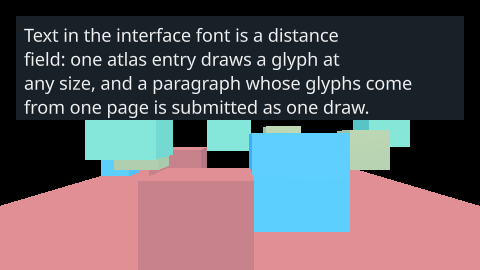
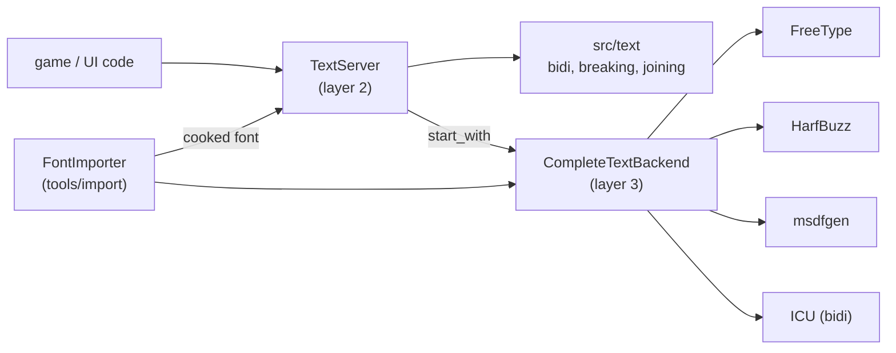
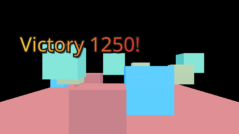

# Text and fonts in CyberEngine

How the engine loads fonts, shapes and lays out text, rasterises glyphs into atlases, imports and
cooks fonts, and draws text in the interface (issue #86). The contract is
[`text-and-fonts`](../../openspec/specs/text-and-fonts/spec.md); the module READMEs linked below
carry the detail.



## Contents

1. [The layers](#1-the-layers)
2. [Starting a text server](#2-starting-a-text-server)
3. [Fonts and faces](#3-fonts-and-faces)
4. [Shaping and layout](#4-shaping-and-layout)
5. [Atlases and render modes](#5-atlases-and-render-modes)
6. [Importing fonts](#6-importing-fonts)
7. [Text in the interface](#7-text-in-the-interface)
8. [Diagnostics](#8-diagnostics)
9. [Feature options and dependencies](#9-feature-options-and-dependencies)
10. [Testing](#10-testing)
11. [Pitfalls](#11-pitfalls)
12. [Not built yet](#12-not-built-yet)

## 1. The layers

| Module | Layer | What it is |
|---|---|---|
| [`src/text/`](../../src/text/README.md) `cy::text-unicode` | 2 | The Unicode algorithms in-tree: bidi, line breaking with a dictionary deferral, Arabic joining, justification, localisation. The minimal path and the test oracle |
| [`src/servers/text/`](../../src/servers/text/README.md) `cy::servers-text` | 2 | `TextServer`: faces, three glyph atlases, the shaping cache, face runs, bidirectional lines, paragraphs, cooked fonts, diagnostics. `TextBackend` is the seam below it |
| [`src/backends/text-complete/`](../../src/backends/text-complete/README.md) `cy::text-complete` | 3 | `CompleteTextBackend`: FreeType, HarfBuzz, msdfgen and ICU, one file each |
| [`tools/import/`](../../tools/import/README.md) `cy::import` | 7 | `FontImporter`: a font file in, a cooked font out |
| [`src/ui/text/`](../../src/ui/text/CMakeLists.txt) `cy::ui-text` | 4 | `TextPainter`: CyberUI's labels; the interface font and the built-in fallback |
| [`src/ui/render/`](../../src/ui/render/README.md) `cy::ui-render` | 4 | The `GlyphField` material in the interface shader, and `upload_text_atlases` |

No FreeType, HarfBuzz, ICU or msdfgen type appears above `src/backends/text-complete/`, and
`tools/layercheck/layercheck.py` fails the build if one of their headers is included anywhere else.



## 2. Starting a text server

```cpp
#include <cy/backends/text/complete_backend.h>
#include <cy/servers/text/server.h>

cy::text::CompleteTextBackend backend;          // must outlive the server
if (cy::Status started = backend.start(); !started) { /* ... */ }
cy::text::TextServer server;
cy::text::TextServerConfig config;
config.atlas.maximum_extent = 4096;             // the device's texture limit, or a budget below it
(void)server.start_with(config, backend);
```

`server.start(config)` instead starts the **minimal backend**: image-grid fonts only, left to right,
no shaping. Ask `server.capabilities()` what is available — never which backend is running.

## 3. Fonts and faces

A face is created per instance: size, render mode, hinting, variable-font axes, feature defaults and
synthetic styles are all part of `FontDesc`, and two instances are two faces with two sets of atlas
entries.

```cpp
cy::text::FontDesc desc;
desc.family = "Noto Sans";
desc.size_pixels = 24.0f;
desc.mode = cy::text::RenderMode::Grayscale;   // or SignedDistanceField, Monochrome
desc.hinting = cy::text::Hinting::Light;
std::memcpy(desc.axes[0].tag, "wght", 4);
desc.axes[0].value = 700.0f;
desc.axis_count = 1;
std::memcpy(desc.features[0].tag, "liga", 4);
desc.features[0].value = 0;                     // ligatures off for this face
desc.feature_count = 1;
auto face = server.create_face(desc, cy::text::FontSource{font_bytes});

cy::text::FallbackChain chain;
(void)chain.push(face.value());
(void)chain.push(arabic_face);                  // searched for what the first lacks
```

The bytes are not copied: keep them alive as long as the face. TrueType, OpenType (glyf and CFF),
TrueType collections (`FontSource::face_index`) and WOFF load; WOFF2 is refused, naming Brotli.

## 4. Shaping and layout

`shape`, `layout_line` and `layout_paragraph` split the text into runs of one face — a combining
mark stays with its base — and shape each through HarfBuzz: kerning, ligatures, Arabic joining and
marks, Indic reordering, Thai marks. A line is laid out bidirectionally: levels from ICU (or from
src/text/ with `CY_TEXT_ICU` off), each level run shaped in its own direction, the runs placed in
visual order. `ParagraphOptions::direction = Direction::RightToLeft` makes `Start` the right edge.

```cpp
cy::text::TextLine line;
(void)server.layout_line("ab \xd7\xa9\xd7\x9c\xd7\x95\xd7\x9d cd", chain, line);
for (const cy::text::ShapedGlyph& glyph : line.run().glyphs) {
    // left to right on the page; glyph.source_offset is the byte it came from
}
```

## 5. Atlases and render modes

| `PixelFormat` | Bytes | From | Drawn by |
|---|---|---|---|
| `Coverage` | 1 | grayscale or monochrome rasters, image-grid fonts | `BuiltinMaterial::Glyph`, point-sampled |
| `DistanceField` | 4 | msdfgen: the median of RGB is the distance, alpha the true distance | `BuiltinMaterial::GlyphField`, linear, at any size, with an outline band |
| `Colour` | 4 | COLR layers, premultiplied | `BuiltinMaterial::Image` |

`server.atlas(format)` is one growing page per format, least-recently-used under pressure, with
thrashing counted. A glyph's format is what the rasteriser produced: a COLR glyph in a grayscale face
is a colour raster. A distance field is generated at the face's size with `FontDesc::distance_range`
atlas pixels of field either side of the outline; it magnifies cleanly and rounds very sharp corners
slightly (`integration.text_complete` bounds the edge error at one and two times its size).

## 6. Importing fonts

```sh
build/dev/tools/import/cy_import_cli --project game --out game/cooked \
    --set mode=distance-field --set size-pixels=32 --set prerender=latin \
    --set axes=wght=400 --set features=tnum --set "fallbacks=Noto Sans Arabic" fonts/Interface.ttf
```

The Latin range of Noto Sans at 32 pixels as a distance field cooks to about 1.1 MB in 255 ms on the
development machine; as grayscale at 20 pixels it is a tenth of that.

| Option | Default | Meaning |
|---|---|---|
| `mode` | `distance-field` | `distance-field`, `grayscale` or `monochrome` |
| `size-pixels` | 32 | the size rasterised at |
| `distance-range` | 4 | field pixels either side of the outline |
| `hinting` | `light` | `none`, `light`, `full` (ignored by a distance field) |
| `prerender` | `latin` | `ascii`, `latin`, or `U+XXXX-U+YYYY` ranges, comma-separated |
| `fallbacks` | | family names, in order |
| `features` | | `liga=0,tnum` |
| `axes` | | `wght=700,wdth=90` |
| `face-index` | 0 | a collection's face |
| `family` | the file's stem | recorded in the cooked font |
| `synthetic-bold`, `synthetic-italic` | false | for a family without the face |

The cook pre-renders every glyph the ranges map to **and every glyph HarfBuzz's GSUB closure reaches
from them** — ligatures, contextual and oldstyle forms — plus `.notdef`, so shaping cooked text never
rasterises. At runtime:

```cpp
cy::text::CookedFont cooked;
(void)cooked.parse(asset_bytes);               // the bytes must outlive the face
auto face = server.create_face(cooked);         // pre-rendered glyphs placed, counted as preloaded
```

A codepoint in a range the font lacks is a `font-range-missing` warning; a set that does not fit the
largest page allowed is refused rather than cooked with holes.

## 7. Text in the interface

See [the runtime UI guide](ui.md#3-text). In short: `TextPainter::start` with
`ui::interface_font_bytes()` and `ui::interface_font_desc()` draws labels in Noto Sans as a distance
field, with `size`, outline, shadow, gradient and per-character colour on `TextStyle`; the built-in
bitmap font is the fallback face and the whole of the text with `CY_TEXT` off. Upload the pages with
`ui::render::upload_text_atlases` after the labels are set and whenever `atlas_revision()` changes.



## 8. Diagnostics

```cpp
server.end_frame();                             // once a frame
const cy::text::TextDiagnostics d = server.diagnostics();
// d.rasterised_last_frame, d.peak_frame_rasterisations, d.rasterisation_spikes (past
// TextServerConfig::rasterisation_spike), d.glyphs_preloaded, d.atlas_occupancy, d.thrashes,
// d.shaping_cache_hits / misses, d.fallbacks_taken, d.notdef_served
cy::Array<cy::text::FallbackReport> fallbacks;
(void)server.fallback_report(fallbacks);        // per primary face: codepoints and fallbacks
```

A spike is a frame that stalled on glyph work a pre-rendered range would have avoided; a primary
with a high fallback rate is the wrong primary.

## 9. Feature options and dependencies

| Option | Default | Gates |
|---|---|---|
| `CY_TEXT` | ON | FreeType 2.14.3, HarfBuzz 14.6.0, msdfgen 1.13, `src/backends/text-complete/`, the interface font compiled into `cy::ui-text` |
| `CY_TEXT_ICU` | ON (requires `CY_TEXT`) | ICU 78.3's bidirectional algorithm — sixteen files of `libicuuc`, no data file |

`-D CY_TEXT=OFF -D CY_TEXT_ICU=OFF` fetches none of the four; the server, its atlases, cooked-font
parsing and the minimal backend still build and their suites still run. Every library is pinned in
[`deps/manifest.toml`](../../deps/manifest.toml) and credited in [`THIRD_PARTY.md`](../../THIRD_PARTY.md);
the fonts in [`deps/fonts/`](../../deps/fonts/PROVENANCE.md) are Noto (OFL 1.1) subsets and one
colour test face of the project's own, all produced by `tools/content/make_fonts.py`.

## 10. Testing

| Suite | What it holds |
|---|---|
| `unit.text` | the server over a fake backend: face runs, newlines, right-to-left runs, bidirectional lines with src/text/'s levels, right-to-left alignment, the three atlases, closing faces, cooked fonts (round trip, every truncation refused, versions), the per-frame spike report, the fallback report |
| `integration.text_complete` | shaping goldens for Latin, Arabic, Devanagari and Thai from uharfbuzz; Arabic forms and bidi levels against src/text/; the N0 bracket case; variable axes; the distance-field edge bound; COLR; a mixed line; WOFF and TTC; WOFF2 and LCD refused; synthetic styles; the closure; an empty line |
| `integration.import_font` | a cooked Latin range lays Latin out with zero rasterisations, and the uncooked control rasterises; options recorded; the range warning; WOFF2 and the registry; option parsing |
| `integration.ui_interface_font` | the interface font in CyberUI (see the UI guide) |
| `unit.ui_render` | the `GlyphField` material on the host: glyph, outline band, magnification |
| `render.ui` (h), (i) | on a device: one draw for a paragraph, matching the host to one step; an outlined title against its golden image |

```sh
just test-unit -R text
build/dev/cy_test_integration_text_complete
build/dev/cy_test_integration_import_font
CY_RENDER_UPDATE_GOLDEN=1 build/dev/cy_test_render_ui -tc='(i)*'   # look before committing
python3 tools/content/make_fonts.py <dir of the upstream Noto files>  # regenerate deps/fonts/
```

## 11. Pitfalls

- **Keep the bytes alive.** A `FontSource` and a `CookedFont` are views; FreeType and HarfBuzz read
  the tables lazily for the face's whole life.
- **Faces are instances.** Changing size, weight or render mode is a new face, not a setting.
- **Upload after setting text.** An outline face is warmed with ASCII only; `set_text` rasterises the
  rest, so upload the pages after building the interface and whenever the revision changes.
- **`-D CY_TEXT=OFF` needs `-D CY_TEXT_ICU=OFF`.** The configure says so.
- **A TrueType glyph is placed by its side bearing.** A hand-made test font whose `hmtx` left side
  bearing disagrees with the outline's `xMin` is drawn shifted (`make_fonts.py` sets them equal).

## 12. Not built yet

WOFF2, CBDT and sbix colour bitmaps, SVG-in-OpenType, LCD subpixel rendering, subpixel positioning,
vertical layout, system-font queries, dictionary line breaking from shipped dictionaries, ICU's data
and its locale formatting, font-table kashida, split carets at direction boundaries, and 2D-world and
3D text (the interface draws its own; the runtime UI's world-space documents are #91's).
