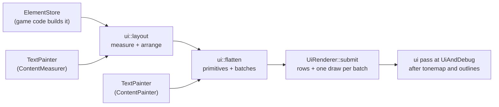
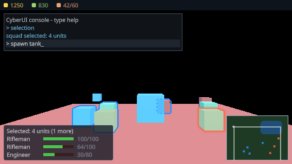
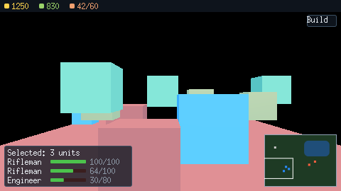

# Runtime UI in CyberEngine

How a game puts an interface on screen with CyberUI: build elements in the store, lay them out,
attach text, flatten them, and hand the stream to the interface pass. The route goes through
[`src/ui/README.md`](../../src/ui/README.md) and
[`src/ui/render/README.md`](../../src/ui/render/README.md); the contract is
[`ui-system`](../../openspec/specs/ui-system/spec.md).


*`samples/13-rts-selection`: the squad the drag box caught listed bottom-left, resources across the
top, the minimap with the camera's rectangle bottom-right, and the developer console — all one
`ElementStore`, one `flatten()` and one pass.*

## Contents

1. [The pieces](#1-the-pieces)
2. [Building an interface](#2-building-an-interface)
3. [Text](#3-text)
4. [Drawing it](#4-drawing-it)
5. [The developer console](#5-the-developer-console)
6. [A HUD from game code](#6-a-hud-from-game-code)
7. [Testing](#7-testing)
8. [Not built yet](#8-not-built-yet)

---

## 1. The pieces

| Target | Directory | What it does | Names a device? |
|---|---|---|---|
| `cy::ui` | `src/ui/` | the element store, layout, `.cyss`, input routing, flattening to primitives | no |
| `cy::ui-text` | `src/ui/text/` | `TextPainter`: an element's text measured and painted as glyph primitives, and the built-in font | no |
| `cy::ui-console` | `src/ui/console/` | `DevConsole`, the developer console | no |
| `cy::ui-render` | `src/ui/render/` | `UiRenderer`: the stream drawn at the frame's `UiAndDebug` stage | yes |

All four are behind `CY_UI`. Elements are not entities: `cy::ui` does not link `cy::ecs`.



## 2. Building an interface

An element is created in a parent, given a layout input and paint data, and flagged. Colours are
**premultiplied ARGB** (`0xAARRGGBB`).

```cpp
ui::ElementStore store(allocator);
auto root = store.create(ui::kNoElement, Name::intern("hud"));
store.layout_input(*root)->model = ui::LayoutModel::Absolute;   // children placed by anchors

auto panel = store.create(*root, Name::intern("panel"));
ui::LayoutInput& input = *store.layout_input(*panel);
input.anchor_min = input.anchor_max = Vec2{1.0F, 1.0F};          // bottom-right corner
input.offset_min = Vec2{-108.0F, -80.0F};
input.offset_max = Vec2{-6.0F, -6.0F};
ui::PaintData& paint = *store.paint(*panel);
paint.background = 0xFF1E3A24U;
paint.border_width = 1.0F;
paint.border_colour = 0xFF8FA3B5U;
paint.corner_radius = 3.0F;
(void)store.set_flags(*panel, ui::ElementFlags::Visible | ui::ElementFlags::ClipsChildren);
```

What the paint data means on screen:

| Field | Effect |
|---|---|
| `background` | the fill. Zero, with no border, means the element draws nothing — a layout container — and puts no primitive in the stream |
| `border_width`, `border_colour` | a border inside the bounds |
| `corner_radius` | rounds the fill, the border and an image alike |
| `opacity` | multiplies down the tree into every colour beneath |
| `material`, `atlas`, `uv` | `BuiltinMaterial::Image` samples an atlas page; `Glyph` is what text uses |
| `ElementFlags::ClipsChildren` | children are clipped to this element, intersected with every clip above |

When game state changes, write the input and mark what changed: a new colour or text of the same
size is `Dirty::Paint`; a size change is `Dirty::Measure`; a move is `Dirty::Arrange`.

## 3. Text

```cpp
cy::text::TextServer server;
(void)server.start(cy::text::TextServerConfig{});
ui::TextPainter text(allocator);
(void)text.start(server, ui::builtin_font(), /*atlas page*/ 1);

auto label = store.create(*root, Name::intern("label"));
(void)text.set_text(*label, "Gold 1250", ui::TextStyle{0xFFFFD34DU, /*pixel_scale*/ 1});
```

A label with no preferred size is measured by the painter (pass `&text` to `ui::layout`); its glyphs
are painted after its background and before its children (pass `&text` to `ui::flatten`).

**The built-in font is temporary.** It is the X Window System's public-domain `misc-fixed` 6x13,
printable ASCII, compiled in as data (`src/ui/text/src/builtin_font_data.h`, generated by
`src/ui/text/tools/make_builtin_font.py`; provenance in `deps/shipped-content.md`). It exists because
the engine cannot yet import, rasterise or SDF-generate a real font (#86). It goes through the real
text server — a face, shaping, layout, the glyph atlas — so a cooked font replaces it without changing
anything downstream. Draw it at whole-number `pixel_scale`s; it is point-sampled.

## 4. Drawing it

```cpp
ui::render::UiRenderer renderer(allocator);
(void)renderer.create(device, {width, height, output_format});
// outside a frame: the glyph atlas, and any image pages
(void)renderer.upload_atlas(1, rhi::Format::R8Unorm, text.atlas_extent(), text.atlas_extent(),
                            text.atlas_pixels());

// every frame, before the frame is assembled:
ui::LayoutReport laid;
(void)ui::layout(store, scale_settings, viewport, &text, laid);
ui::FlattenReport flattened;
(void)ui::flatten(store, ui::Rect{0, 0, viewport.x, viewport.y}, buffer, flattened, &text);
(void)renderer.submit(buffer, ui::resolve_scale(scale_settings, viewport));
sinks.ui = renderer.stage();          // rendering::assembly::FrameSinks
```

The pass runs after tonemapping, bloom, grading and the selection outlines, so a colour is the
output's bytes. With nothing to draw it records nothing and the frame is byte-identical to a frame
without it. `renderer.report()` says how many indirect draws it recorded — one per batch `flatten()`
made — and how many batches a clip emptied.

## 5. The developer console

```cpp
ui::DevConsole console(allocator);
ui::ConsoleStyle style;                      // anchors, rows shown, history, colours
(void)console.create(store, text, *root, style);
(void)console.add_command("spawn", &spawn, &game);
(void)console.type("spawn tank");            // from text input
(void)console.submit();                      // echoes, runs, prints the reply
(void)console.print("ready", ui::kConsoleWarning);
```

`help`, `clear` and `echo` are built in. The scrollback is a ring held by the console; the store
holds exactly `visible_rows` row elements whatever has been printed, and a print repaints them
without a relayout. `set_open(false)` collapses the panel out of layout and the stream.

## 6. A HUD from game code

`samples/13-rts-selection/hud.h` is a strategy HUD written as game code over the same calls:
`set_resources`, `set_selection` (one row per selected unit with a health bar) and `set_minimap`
(unit dots and the camera's rectangle, clipped by the minimap). The sample selects a squad with a
drag box, writes the selection into the HUD, and photographs the frame:

```
build/dev/samples/13-rts-selection/cy_sample_rts_selection --out docs/design/images
```

| The frame | With the HUD and the console |
|---|---|
|  |  |

### The same HUD from Swift

ABI 1.6 lets a scripting module build in the same store. `samples/13-rts-api/game/Hud.swift` is this
HUD rewritten in Swift with CyberdyneKit's declarative layer — panel for panel, colour for colour —
plus a Build button, and the RTS game there writes it from its own state every frame:

```swift
hud = try mountUI {
    Panel("resource-bar") {
        Label("0", colour: gold, name: "gold").id("gold")
        …
    }
    .layout(.anchored(min: Vec2(x: 0, y: 0), max: Vec2(x: 1, y: 0), offsetMax: Vec2(x: 0, y: 17))
                .flex(.row, gap: 4, align: .centre, padding: UIInsets(horizontal: 6, vertical: 2)))
    .style(UIStyle(background: panel))
    Button("Build", colour: text, name: "build-button") { _ in onBuild() }
}
try hud["gold"].setText("\(gold)", colour: gold)
```



*`render.rts_api_hud`: the HUD a Swift behaviour built through the ABI, over the pipeline suites'
scene. Without the button it is the C++ HUD's frame byte for byte.*

The host side is three calls on `cy::game_backend::UiAdapter` (`cy::game-backend-ui`), which
implements the ABI's `UiBackend` over the store, a `TextPainter` and an `Interaction` it owns:

```cpp
cy::game_backend::UiAdapter ui(allocator, store, text, root);
(void)ui.start();                              // the root transparent to hits, a HUD layer
cy::game_backend::bind(host, &ui);             // every ui_* entry now answers
// every frame, before the behaviours' frame update:
(void)ui.layout(scale_settings, viewport);
(void)ui.route_pointer(position, buttons_pressed, buttons_released);
input_adapter.set_pointer_focus(0, true, ui.pointer_over());
ui.drain_events([&](const CyUiEvent& event) noexcept { (void)runtime.ui_event(event); });
```

Deliver through `drain_events`, not a loop over `events()`: a receiver that moves focus or destroys
what it clicked queues a BLUR and a FOCUS while the batch is delivered, and `drain_events` keeps
those for the next frame instead of walking an array that is growing under it and clearing them.

A module reaches the root and its own elements only; the console beside them in the same store
answers `NOT_FOUND`. A press and a release of the left button over one button is a click, delivered
to the behaviours of the entity that owns it. The Swift side is in [the Swift guide](swift.md#the-interface-abi-16).

## 7. Testing

| Suite | What it holds |
|---|---|
| `unit.ui` | opacity down the tree, content painted in order under its clip, empty containers, the shape fields |
| `unit.ui_text` | the built-in font's glyphs, measurement, glyph placement and uv, the warmed atlas |
| `unit.ui_console` | a virtualised scrollback, commands, layout and what the console flattens to |
| `unit.ui_render` | the 64-byte row round-trips, the scissor rule, one draw per batch, the host reference |
| `unit.render_forward` | the interface stage's producer is handed the chain's last colour |
| `render.ui` | on a device: nothing to draw is byte-identical to the frame before the pass; the device matches the host reference to one step; order, nested clipping and opacity; the HUD and console against a golden image |
| `integration.game_backend_ui` | the ABI 1.6 entries over a real store: ownership, kinds, the progress fill, visibility, clicks, hits, focus, destroy |
| `render.rts_api_hud` | the Swift-built HUD flattens to the C++ HUD's primitives and draws the same bytes on a device; with its Build button against a golden image |

```sh
just test-suites render:^render.ui$
CY_RENDER_UPDATE_GOLDEN=1 build/dev/cy_test_render_ui   # rewrite references; look before committing
python3 src/ui/render/shaders/regenerate.py --slangc build/dev/Development/bin/slangc
just build-shaders --strict src samples
```

## 8. Not built yet

Issue #91's later stages: offscreen opacity groups, the HDR composite before tonemapping, custom UI
materials and blur-behind, world-space and surface-space documents, the widget set, the UI document
asset, animation, the immediate-mode API, the inspector and the conformance suite. Text is one line
of a bitmap font until #86. From a module (ABI 1.6): no style sheet or document asset, no navigation
driven from script, no text input, no image upload — five element kinds, set element by element.
