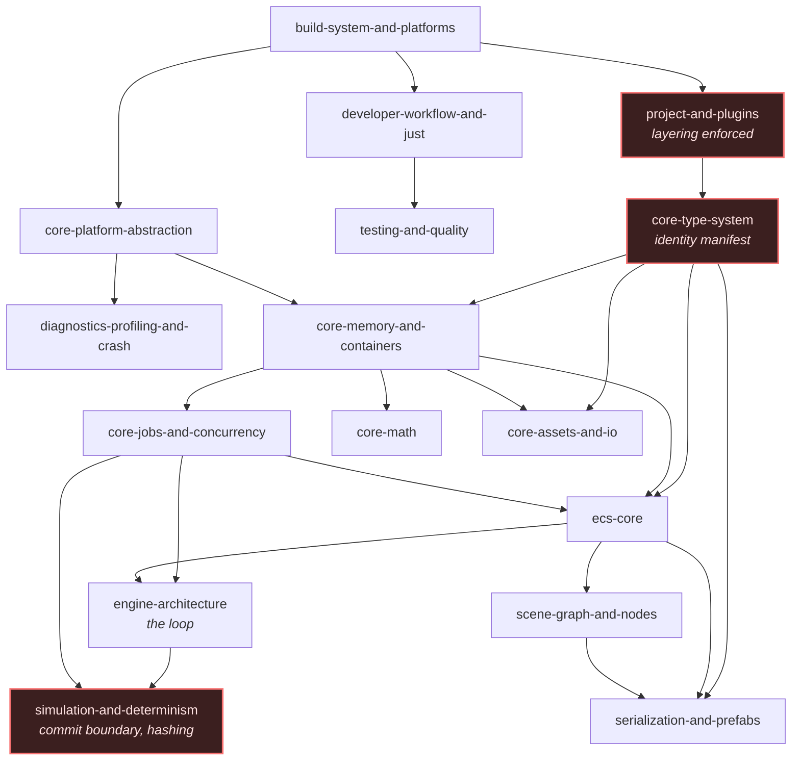
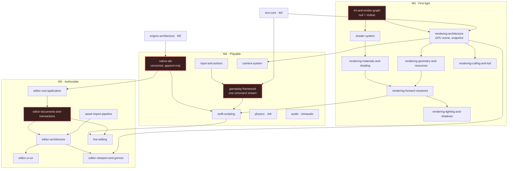
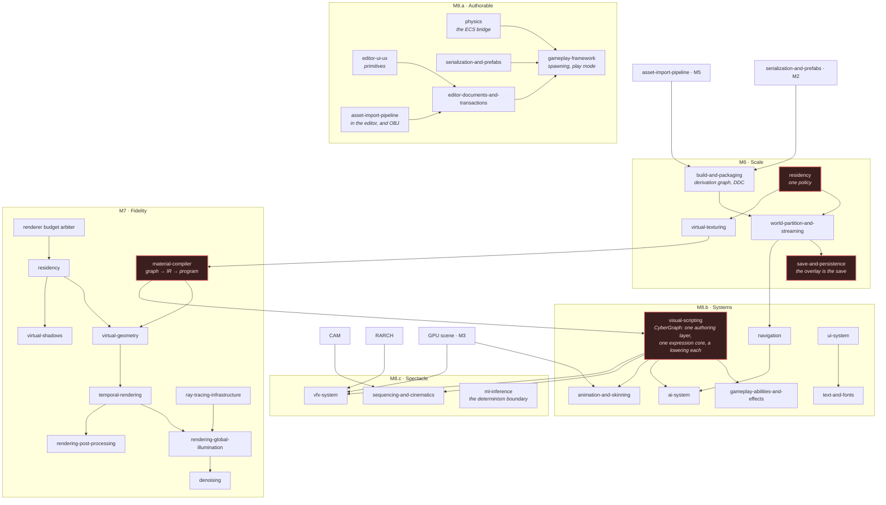
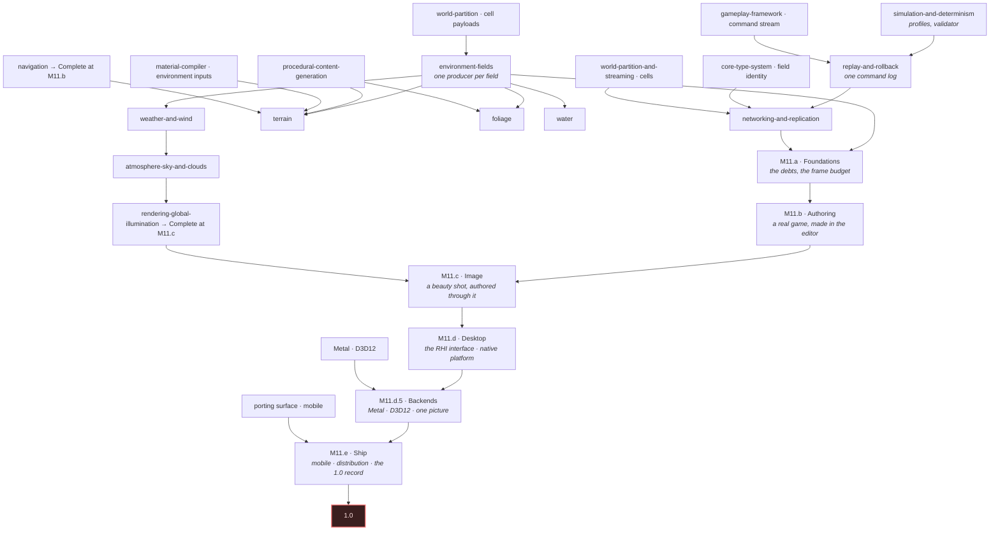

# Dependencies

Why [the ladder](../ROADMAP.md) is ordered the way it is.

Dependencies are taken from the specifications themselves — the interfaces a capability names, the
contracts it consumes. Where this document and a specification disagree, **the specification is
right and this document is wrong**, and the roadmap is corrected rather than the specification
relaxed.

The rule the graphs below encode:

> A capability may not reach **Working** before every capability it depends on has reached
> **Seed**, and may not reach **Complete** before its dependencies have reached **Working**.

---

## Foundation — M0 to M2

Deep and narrow. Almost nothing here can be done in parallel, which is why the roadmap treats M0,
M1 and M2 as one unbroken sequence rather than three deliverables.

Red nodes carry [invariants that cannot be retrofitted](../ROADMAP.md#the-invariants-that-cannot-wait).

The chain that sets the critical path is `core-type-system → ecs-core → engine-architecture →
simulation-and-determinism`: reflection and stable identity are what component storage is described
in, storage is what the loop schedules, and the loop is where the commit boundary lives.

---

## First playable — M3 to M5

Three arcs that converge. The renderer needs no scripting; scripting needs something to look at;
the editor needs both a boundary to talk over and a viewport to show.

**Why M4 before M5.** The editor SDK is generated from the same ABI the Swift overlay is. Exercising
that ABI against gameplay first means its mistakes surface against the simpler consumer, while
appending to the table is still free.

**Why the viewport points back at the renderer.** `editor-viewport-and-gizmos` deliberately has no
second renderer: the editor decides what should be shown, the renderer decides how it is drawn, and
picking runs engine-side so what is picked is what was actually rendered.

---

## Production scale — M6 to M8.b

Wider, because the foundations are in place — but with three hard sequencing constraints.

**`camera-system` precedes `sequencing-and-cinematics` and `rendering-architecture` precedes
`vfx-system`, and M8.c measured both rather than assuming them.** A cut drives cameras THROUGH the
camera stack — `sequencing-and-cinematics` requires that a sequence not write camera transforms, so
the stack, its blends and `CameraServer::cut()` all have to exist before a timeline can select a
shot; `src/sequencing/camera/` is one file and it is a consumer of `src/servers/camera/`, never the
other way round. And a particle system has nowhere to draw until something records the frame: M8.c
had to build the shader and pipeline layer above `FrameAssembly` (`src/rendering/pipeline/`) before
`src/rendering/particles/` had a pass to attach to, because `FrameAssembly` hands each pass's record
callback to its caller and, up to M8.b, every caller in the tree supplied none.

**The build graph precedes streaming** because cooked cells are derivations; a streaming system built
against an ad-hoc cook has to be rebuilt against the real one.

**Residency precedes both paging systems.** Virtual texturing, virtual shadows and virtual geometry
are three storages under one policy. Written independently they become three policies that fight
each other for the same budget.

**The material compiler precedes the other graph consumers — and NOT because they lower through
its IR, which M8.b's spike measured and refuted.** This paragraph used to say they did. What the
spike found is that the material IR is a hash-consed pure-expression DAG whose identity is a content
hash, so it has no back edges, cannot express a write, re-sorts commutative operands, deletes a
value nothing reads, and evaluates both arms of a select — **five of the seven consumers needed an
escape hatch against a budget of two**, and `visual-scripting`'s own "No universal representation"
requirement had already forbidden the idea by name. The ordering still holds, for a weaker and truer
reason: the material compiler is the tree's first worked example of graph → IR → optimisation →
program, and what M8.b generalised out of it is a shared pure-expression SSA core plus a lowering
per consumer. Discovering that one IR cannot express a consumer's semantics is cheap with one
consumer and expensive with seven, which is exactly what the spike bought.

**Two Complete cells moved out of M8.a at its closing gate, and neither move breaks a rule above.**
`serialization-and-prefabs` completes at M8.b rather than M8.a: its remaining requirement is "Apply
and extract", an editor operation over a data model that has supported it since M2, and it sits with
`live-editing` and `editor-viewport-and-gizmos`, which complete in the same milestone. The M8.a graph
above shows it feeding `gameplay-framework`'s play mode, and that edge is satisfied at Working, not
at Complete. `editor-documents-and-transactions` completes at M11.b rather than M8.a: its remaining
requirement is "Source control integration", a provider interface with Git, Perforce and a null
implementation, which no milestone between here and 1.0 schedules and which every other `editor-*`
row's Complete cell already waits for. Both edges out of them in the M8.a subgraph are Seed-level
prerequisites of a Working target, so the rule the graphs encode — Working needs Seed, Complete needs
Working — is unaffected, and `just roadmap-test` checks that rather than this paragraph.

---

## Shipping — M9 to M11.e

**Why networking is this late.** Replication schemas need stable field identity (M1), component
storage (M2), the command stream (M4), streamed cells for interest management (M6), and rollback
primitives that are the *same mechanism* as replay. Built before those, it is built twice.

**Why M11 is six rungs, and why they are in this order.** The rungs are not a partition of the work
by size: each one is a claim its own closing artefact can refute, and the edges above are what each
artefact depends on. **M11.a first**, because a world costing 122 ms a frame is one nobody can author
into and one nobody can tune a picture of. **M11.b before M11.c**, because a beauty shot assembled by
hand in C++ proves the renderer and nothing else, while one authored *through* the editor proves
both. **M11.d before M11.e**, because a porting surface is proved against a stub before it is proved
against a device nobody here owns. The argument is in
[`implement-m11-reach`](../../openspec/changes/implement-m11-reach/proposal.md) task 0.1 and the rule
it added is in `delivery-roadmap`.

**And M11.d.5 between M11.d and M11.e, because the edge above it is a toolchain rather than a
capability.** The split produced five rungs; M11.d's spike produced the sixth. Metal and D3D12 were
M11.d's, and no machine this project works on can compile either — Linux, one GPU vendor, no Apple
toolchain. The edge `Metal · D3D12 → M11.d.5` is the honest drawing of that: the backends depend on
the RHI interface M11.d settles, and the rung depends on hardware and toolchains that exist only on
legs of the continuous-integration matrix. `delivery-roadmap`'s *"A spike may resize a milestone as
well as redirect it"* is the rule, and
[`implement-m11d5-backends`](../../openspec/changes/implement-m11d5-backends/proposal.md) is the
change.

**Why environment is after game systems.** Terrain, foliage, water and weather are the largest block
of work whose absence blocks nothing else. They consume the field substrate, the streaming
contracts, the material compiler's environment-aware inputs and the GPU scene — all settled by M8.b.

---

## The three cycles

The specification set contains three genuine dependency cycles. Each is broken the same way: **the
contract seeds early, the implementation lands late.**

### 1 — World partition ↔ terrain

`world-partition-and-streaming` requires runtime cells to carry subsystem payloads; `terrain`
requires tiles to stream through those cells.

**Break**: the cell payload contract and the subsystem integration interface land at world
partition's Working tier in **M6**, with no terrain in existence. Terrain implements the contract as
a payload producer in **M10**. Both directions are satisfied without either waiting on the other.

**The break held and `world-partition-and-streaming`'s Complete cell still moved to M11.a**, because
the milestone that was to complete it closed on an artefact with **no streaming in it**:
`samples/10-world` keeps the whole world resident, meshes every terrain tile at level 0, and reports
`MeshReport::stitched_vertices` as zero precisely so a reader can see that nothing streamed. Terrain
produces the payload; the streaming binder `src/terrain/`'s README records as its largest gap is
still missing, and the sample's README says the artefact does not stand in for it.

### 2 — Global illumination ↔ atmosphere

`rendering-global-illumination` needs a sky radiance term; `atmosphere-sky-and-clouds` needs the
far-field illumination the GI scene provides, and aerial perspective needs the depth and volumetric
integration the renderer settles.

**Break**: an **analytic sky** seeds at **M7**, sufficient for the GI sky term and for the golden
images. The physical atmosphere, its precomputed tables and volumetric clouds land at **M10**, which
is why `rendering-global-illumination` was planned to complete at M10 rather than M7.

**THE ATMOSPHERE LANDED AT M10 AND THE SEAM WAS NEVER JOINED, so GI's Complete cell moved to M11.c.**
The break above is sound and the work to close it was simply not done: `gi/lighting.h` still
describes its two-colour gradient as *"the seam it will replace, not a second sky"*;
`sky_light.h` carries the three-line adapter and says a composition point writes it; **nothing in
the tree constructs a `gi::SkyTerm` from the atmosphere**, and neither module links the other —
`src/rendering/sky/CMakeLists.txt` records the absent dependency on `cy::rendering-gi` as
deliberate, which is what made the gradient fit measurable without a GI system present and is also
why nobody was obliged to join the two. M10's closing gate moved the cell rather than let a
completion the code does not support close silently; the evidence is in
[where M10's tiers are thin](capability-matrix.md#where-m10s-tiers-are-thin).

**THE SEAM IS JOINED, AND IT WAS NOT ONE ADAPTER.** M11.c built `src/rendering/sky_illumination/` as
the composition point: `SkyIllumination` fits a `gi::SkyTerm` from `sky::Atmosphere` through
`sky::fit_sky_gradient`, installs it through a new `IlluminationSystem::set_sky_term()`, derives the
sun from `sky::sun_illuminance`, and reports which sky lit the frame.
`m11c:gi-sky-term-constructed` runs it and is green. The four lines this document called "one adapter
at one composition point" were the adapter; the incremental refit, the invalidation cause and the
budget bound were the rest, which is why the module is a module.

**THE CYCLE IS NOT YET CLOSED, AND THE REMAINDER IS AN IMAGE CLAIM RATHER THAN A SEAM.**
`rendering-global-illumination` does not reach Complete at M11.c: M11.c did not close, and the row's
twenty-nine requirements have none mapped to a test, a gate or a recorded exemption
(`m11c:image-rows-at-complete-grade`). No shipping program lights its frame through the seam either —
`samples/07-fidelity` was wired through it and reverted, because an unscaled physical sky moved that
artefact's convergence from 0.846 to 0.609 and a scaled one left it at 0.842 against a 0.85
threshold. **So the cycle's mechanism is discharged and its tier claim is not**, and the rung that
records `rendering-global-illumination` at Complete is the rung that closes cycle 2.

### 3 — AI ↔ navigation ↔ world partition

`ai-system` needs navigation for locomotion; `navigation` needs streaming for its tiles;
`world-partition-and-streaming` would like agent density as a streaming input.

**Break**: navigation seeds at **M8.b** against M6's streaming, which is already complete in the
direction that matters. The third edge — density feeding back into streaming priority — is
**deferred**, recorded in [risks and deferrals](risks.md). It is an optimisation, not a contract,
and cutting it removes the cycle entirely.

**Terrain's half of the first edge landed at M10 and `navigation`'s Complete cell still moved to
M11.b**, with the rest of the rows a game exercises by being played.
`src/terrain/include/cy/terrain/collision.h` produces a `navigation::NavSourceGeometry` from
the collision representation with its material and slope data — the requirement
`Environment-driven navigation` names — and terrain's own `CMakeLists.txt` states the boundary: it
*"creates no body and builds no navmesh"*. That is one requirement of sixteen, and no M10 task named
this capability at all.

---

## Capabilities with no dependants

Four capabilities are consumed by nothing else in the specification set, which is why the roadmap
places them late and why they could move without disturbing anything:

| Capability | Consumed by | Placed at |
|---|---|---|
| `rendering-2d` | Nothing — a parallel pipeline sharing infrastructure | M8.b |
| `ml-inference` | `ai-system`, optionally | M8.c seed |
| `replay-and-rollback` | `networking-and-replication` only | M9 |
| `xr-support` | Nothing; deferred | prerequisites from M3 |

Where the roadmap places a capability with no dependants is a judgement about value, not a
constraint. Those are the four entries most likely to move, and moving them costs nothing.
