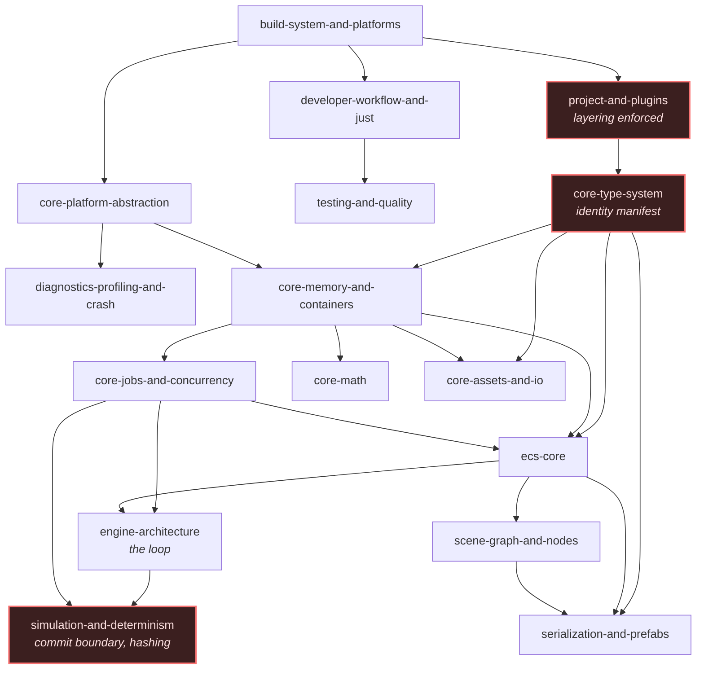
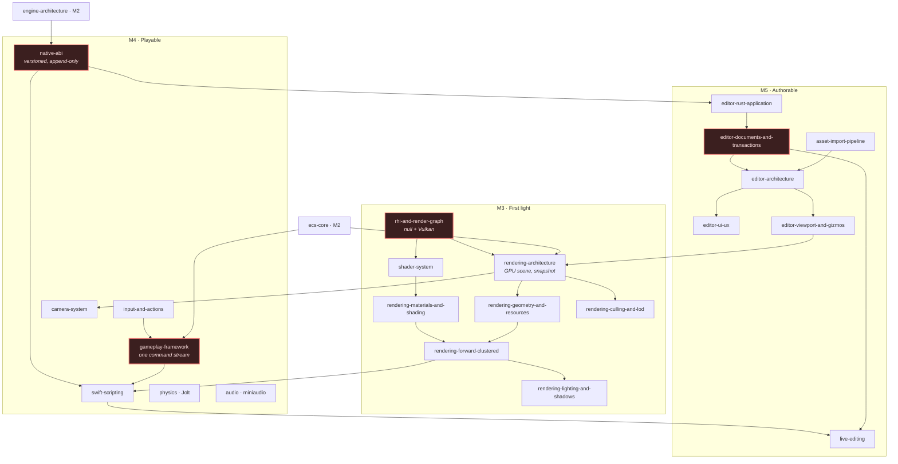
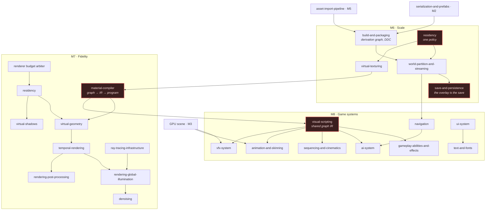
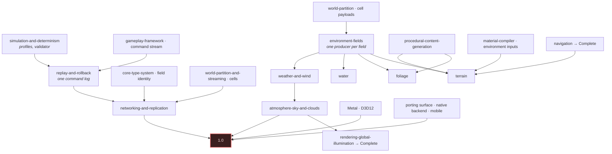

# Dependencies

Why [the ladder](../ROADMAP.md) is ordered the way it is.

Dependencies are taken from the specifications themselves — the interfaces a capability names, the
contracts it consumes. Where this document and a specification disagree, **the specification is
right and this document is wrong**, and the roadmap is corrected rather than the specification
relaxed.

The rule the graphs below encode:

> A capability may not reach **Working** before every capability it depends on has reached
> **Seed**, and may not reach **Complete** before its dependencies have reached **Working**.

---

## Foundation — M0 to M2

Deep and narrow. Almost nothing here can be done in parallel, which is why the roadmap treats M0,
M1 and M2 as one unbroken sequence rather than three deliverables.

Red nodes carry [invariants that cannot be retrofitted](../ROADMAP.md#the-invariants-that-cannot-wait).

The chain that sets the critical path is `core-type-system → ecs-core → engine-architecture →
simulation-and-determinism`: reflection and stable identity are what component storage is described
in, storage is what the loop schedules, and the loop is where the commit boundary lives.

---

## First playable — M3 to M5

Three arcs that converge. The renderer needs no scripting; scripting needs something to look at;
the editor needs both a boundary to talk over and a viewport to show.

**Why M4 before M5.** The editor SDK is generated from the same ABI the Swift overlay is. Exercising
that ABI against gameplay first means its mistakes surface against the simpler consumer, while
appending to the table is still free.

**Why the viewport points back at the renderer.** `editor-viewport-and-gizmos` deliberately has no
second renderer: the editor decides what should be shown, the renderer decides how it is drawn, and
picking runs engine-side so what is picked is what was actually rendered.

---

## Production scale — M6 to M8

Wider, because the foundations are in place — but with three hard sequencing constraints.

**The build graph precedes streaming** because cooked cells are derivations; a streaming system built
against an ad-hoc cook has to be rebuilt against the real one.

**Residency precedes both paging systems.** Virtual texturing, virtual shadows and virtual geometry
are three storages under one policy. Written independently they become three policies that fight
each other for the same budget.

**The material compiler precedes the other graph consumers.** Its IR is the shared graph
infrastructure that abilities, AI, animation, VFX and sequences all lower through. Discovering that
the IR cannot express a consumer's semantics is cheap with one consumer and expensive with seven.

---

## Shipping — M9 to M11

**Why networking is this late.** Replication schemas need stable field identity (M1), component
storage (M2), the command stream (M4), streamed cells for interest management (M6), and rollback
primitives that are the *same mechanism* as replay. Built before those, it is built twice.

**Why environment is after game systems.** Terrain, foliage, water and weather are the largest block
of work whose absence blocks nothing else. They consume the field substrate, the streaming
contracts, the material compiler's environment-aware inputs and the GPU scene — all settled by M8.

---

## The three cycles

The specification set contains three genuine dependency cycles. Each is broken the same way: **the
contract seeds early, the implementation lands late.**

### 1 — World partition ↔ terrain

`world-partition-and-streaming` requires runtime cells to carry subsystem payloads; `terrain`
requires tiles to stream through those cells.

**Break**: the cell payload contract and the subsystem integration interface land at world
partition's Working tier in **M6**, with no terrain in existence. Terrain implements the contract as
a payload producer in **M10**. Both directions are satisfied without either waiting on the other.

### 2 — Global illumination ↔ atmosphere

`rendering-global-illumination` needs a sky radiance term; `atmosphere-sky-and-clouds` needs the
far-field illumination the GI scene provides, and aerial perspective needs the depth and volumetric
integration the renderer settles.

**Break**: an **analytic sky** seeds at **M7**, sufficient for the GI sky term and for the golden
images. The physical atmosphere, its precomputed tables and volumetric clouds land at **M10**, and
GI reaches Complete there — which is why `rendering-global-illumination` completes at M10 rather
than M7.

### 3 — AI ↔ navigation ↔ world partition

`ai-system` needs navigation for locomotion; `navigation` needs streaming for its tiles;
`world-partition-and-streaming` would like agent density as a streaming input.

**Break**: navigation seeds at **M8** against M6's streaming, which is already complete in the
direction that matters. The third edge — density feeding back into streaming priority — is
**deferred**, recorded in [risks and deferrals](risks.md). It is an optimisation, not a contract,
and cutting it removes the cycle entirely.

---

## Capabilities with no dependants

Four capabilities are consumed by nothing else in the specification set, which is why the roadmap
places them late and why they could move without disturbing anything:

| Capability | Consumed by | Placed at |
|---|---|---|
| `rendering-2d` | Nothing — a parallel pipeline sharing infrastructure | M8 |
| `ml-inference` | `ai-system`, optionally | M8 seed |
| `replay-and-rollback` | `networking-and-replication` only | M9 |
| `xr-support` | Nothing; deferred | prerequisites from M3 |

Where the roadmap places a capability with no dependants is a judgement about value, not a
constraint. Those are the four entries most likely to move, and moving them costs nothing.
