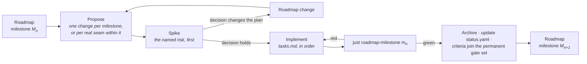

# Implementing the Roadmap

How a milestone on [the ladder](../ROADMAP.md) becomes code.

---

## A milestone is a set of OpenSpec changes

The roadmap states a milestone's entry conditions, the capabilities it advances, its closing
artefact and its exit criteria. It deliberately does **not** state the task breakdown — that belongs
to the change that implements it, because the breakdown is only knowable once the previous milestone
has closed.

So the working loop is:

**One change per milestone** is the default. Split only on a real seam — where nothing in the second
part can begin until the first has landed — never to make a review smaller. Four changes that only
mean anything together are one change with extra ceremony, and the milestone gate spans all of them
regardless.

## What every implementation change carries

| | |
|---|---|
| **Proposal** | Why this work, now. For an implementation change that is mostly *what the milestone buys that is expensive later* — not a restatement of the specifications. |
| **Design** | Only what the specifications leave open, and why each open question is settled the way it is. Rejected alternatives with their cost. |
| **Tasks** | The ordered plan. The spike first. Grouped by workstream, with the dependency between workstreams stated. Every task checkable. |
| **Deltas** | Any specification the implementation changed or corrected — including corrections to the roadmap itself. |
| **Capability and tier** | Which capabilities this advances, and to which tier. Recorded in the PR, and in `status.yaml` when it lands. |

## The rules that apply to all of them

From [`delivery-roadmap`](../../openspec/specs/delivery-roadmap/spec.md):

- **The spike goes first.** Each milestone names its most uncertain work; that work is attempted
  before the rest is scheduled, and its only deliverable is a decision. A spike may prototype a
  later capability provided the prototype is not merged.
- **Invariants land at Seed.** If the [invariant table](../ROADMAP.md#the-invariants-that-cannot-wait)
  names something for this milestone, it is not optional and it is not deferrable to the tier where
  it would be convenient.
- **Prerequisites before Working.** A capability may not reach Working before its prerequisites
  reach Seed, nor Complete before they reach Working. If that blocks the work, the roadmap is wrong
  and the fix is a roadmap change stating what was learned — not an exception.
- **Exit criteria are executable.** `just roadmap-milestone <id>` passes or fails; that result is
  the decision, not a judgement about it.
- **Closed milestones stay closed.** Once green, a milestone's criteria join the permanent gate set.
  A later change that breaks one does not merge unless it lands the recorded replacement.
- **`status.yaml` moves in the same commit as the work.** A tier claim the record does not support
  is drift, and `just roadmap-status` fails on drift.

## Where to look

| | |
|---|---|
| What closes the current milestone | [`docs/ROADMAP.md`](../ROADMAP.md), the milestone's exit criteria |
| What is implemented today | [`status.yaml`](status.yaml), or `just roadmap-status` |
| What is being built right now | [`openspec/changes/`](../../openspec/changes/) |
| Why the order is what it is | [`dependencies.md`](dependencies.md) |
| What is most likely to be wrong | [`risks.md`](risks.md) |

## Landed

**M1 · Substrate** — reflection with the committed identity manifest and its gate, the value types,
memory domains and chunked storage, the math conventions as executable tests, the job system with
access declarations, assets at Seed, and the project graph. Closes on `samples/01-headless-host`.
19 exit criteria pass; `three-platforms` is left to the CI matrix on a single-OS host.

Its spike resolved: incremental reflection regeneration is 92–292 ms against a single-file rebuild
that already costs 0.30–1.09 s, so it disappears into the noise. The cost is driven by how much STL
each annotated header transitively includes, not by type count — which is now a contract on
reflected headers.

**M0 · Ground** — the repository skeleton, the CMake build with layering enforced at configure time,
the `justfile` and the CI matrix, SDL3-backed and headless display servers behind engine-owned
interfaces, the trace with privacy classification required on every field, and the gates.

Three lessons worth carrying, each found by a gate agent auditing work other agents reported green:

- A privacy mechanism only covers the data model it can see. M0 shipped log sites built from
  `__FILE__` and registered as event *names*, structurally beyond the writer's redaction.
- A gate that is wired but never run is not a gate. M1's sanitizers were proven to catch bugs and
  then run by no CI job.
- A ledger can break the milestone it is checking. `just test-sanitize` left the ordinary build tree
  instrumented, so running M1's gate made the next M0 gate fail — and every earlier "M0 green after
  M1 green" had been luck of ordering.

## In flight

**M2 · World.** Entities, components, archetypes and queries; the node façade over them;
serialization and prefabs; the fixed-tick loop; and the determinism seeds every later milestone
assumes. Closes on a headless run that ticks 10,000 fixed steps, prints a hierarchical state hash,
and reproduces it exactly on re-run and after snapshot restore.

Its named risk, spiked first: **cook-time flattening**. Whether an authored hierarchy really lowers
to chunk-shaped blocks without runtime fixup is the assumption the whole storage decision rests on —
and M1's chunked storage is what it flattens into, which is why the spike is meaningful now rather
than theoretical.

M2 carries two invariants from [the table](../ROADMAP.md#the-invariants-that-cannot-wait): the fixed
tick's commit boundary with seeded random streams and state-hash hooks, and cook-time flattening to
archetype-native blocks.
