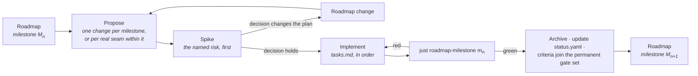

# Implementing the Roadmap

How a milestone on [the ladder](../ROADMAP.md) becomes code.

---

## A milestone is a set of OpenSpec changes

The roadmap states a milestone's entry conditions, the capabilities it advances, its closing
artefact and its exit criteria. It deliberately does **not** state the task breakdown — that belongs
to the change that implements it, because the breakdown is only knowable once the previous milestone
has closed.

So the working loop is:

**One change per milestone** is the default. Split only on a real seam — where nothing in the second
part can begin until the first has landed — never to make a review smaller. Four changes that only
mean anything together are one change with extra ceremony, and the milestone gate spans all of them
regardless.

## What every implementation change carries

| | |
|---|---|
| **Proposal** | Why this work, now. For an implementation change that is mostly *what the milestone buys that is expensive later* — not a restatement of the specifications. |
| **Design** | Only what the specifications leave open, and why each open question is settled the way it is. Rejected alternatives with their cost. |
| **Tasks** | The ordered plan. The spike first. Grouped by workstream, with the dependency between workstreams stated. Every task checkable. |
| **Deltas** | Any specification the implementation changed or corrected — including corrections to the roadmap itself. |
| **Capability and tier** | Which capabilities this advances, and to which tier. Recorded in the PR, and in `status.yaml` when it lands. |

## The rules that apply to all of them

From [`delivery-roadmap`](../../openspec/specs/delivery-roadmap/spec.md):

- **The spike goes first.** Each milestone names its most uncertain work; that work is attempted
  before the rest is scheduled, and its only deliverable is a decision. A spike may prototype a
  later capability provided the prototype is not merged.
- **Invariants land at Seed.** If the [invariant table](../ROADMAP.md#the-invariants-that-cannot-wait)
  names something for this milestone, it is not optional and it is not deferrable to the tier where
  it would be convenient.
- **Prerequisites before Working.** A capability may not reach Working before its prerequisites
  reach Seed, nor Complete before they reach Working. If that blocks the work, the roadmap is wrong
  and the fix is a roadmap change stating what was learned — not an exception.
- **Exit criteria are executable.** `just roadmap-milestone <id>` passes or fails; that result is
  the decision, not a judgement about it.
- **Closed milestones stay closed.** Once green, a milestone's criteria join the permanent gate set.
  A later change that breaks one does not merge unless it lands the recorded replacement.
- **`status.yaml` moves in the same commit as the work.** A tier claim the record does not support
  is drift, and `just roadmap-status` fails on drift.

## Where to look

| | |
|---|---|
| What closes the current milestone | [`docs/ROADMAP.md`](../ROADMAP.md), the milestone's exit criteria |
| What is implemented today | [`status.yaml`](status.yaml), or `just roadmap-status` |
| What is being built right now | [`openspec/changes/`](../../openspec/changes/) |
| Why the order is what it is | [`dependencies.md`](dependencies.md) |
| What is most likely to be wrong | [`risks.md`](risks.md) |

## Landed

**M3 · First light** — an explicit RHI with the null backend written before Vulkan, a render graph
that derives barriers, aliasing and cross-queue semaphores from declared reads and writes, Slang
shaders, the render server and GPU scene, clustered forward shading. 28 exit criteria pass.

Its spike proved the invariant on the real device: 13 cases, 0 failures, with
`SYNCHRONIZATION_VALIDATION` on across two queue families — including two compute passes writing
different array layers of one exclusive image while a graphics pass samples both. Transient aliasing
measured 64 MiB → 8 MiB, plan and device agreeing exactly.

Two findings from it outlive the milestone. **Vulkan validation does not police queue ownership
transfers or memory aliasing** — negative controls removing each produced zero errors and correct
pixels, so both must be structurally guaranteed rather than tested for. And **aliasing creates
dependencies the resource graph cannot see**: two independent chains on different queues whose
transients share memory will race, which is why alias edges are added before submits are cut.

**M2 · World**, **M1 · Substrate**, **M0 · Ground** — see the archive.

Six lessons, each found by auditing work that had been reported green:

- A privacy mechanism only covers the data model it can see.
- A gate that is wired but never run is not a gate.
- A ledger can break the milestone it is checking.
- A milestone's gate must actually be promoted when it closes.
- **A delivered backend that is off by default is a backend nothing tests.** `CY_RENDERER_VULKAN`
  kept M0's placeholder `OFF` through all of M3, so the sample rendered black while exiting 0 and
  `just test-render` passed in 0.03 s over two device-free suites.
- **Don't touch the machine while a ledger runs.** Two "regressions" in this project were concurrent
  builds contending for the same trees, not defects.

## In flight

**M4 · Playable.** The versioned append-only C ABI and its compatibility gate, the generated
`CyberdyneKit` Swift overlay, input with fixed-tick sampling, camera and audio at Seed, physics over
Jolt, and one validated command stream into the simulation. Closes on `samples/04-character`: a
third-person controller written entirely in Swift — move, jump, collide, hear it — with no C++ in the
project.

Its named spike: **hot reload across the ABI with live Swift objects**. If reload cannot preserve
state, M5's live-editing story changes shape, and that is cheaper to know now.

Two invariants bind here. The first published ABI symbol starts a compatibility obligation that
never ends, so the gate exists before the first consumer. And replay, rollback and lockstep are one
command log read three ways, which is only true if the simulation has exactly one input path.
