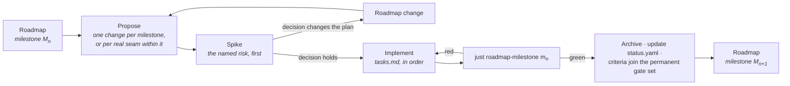

# Implementing the Roadmap

How a milestone on [the ladder](../ROADMAP.md) becomes code.

---

## A milestone is a set of OpenSpec changes

The roadmap states a milestone's entry conditions, the capabilities it advances, its closing
artefact and its exit criteria. It deliberately does **not** state the task breakdown — that belongs
to the change that implements it, because the breakdown is only knowable once the previous milestone
has closed.

So the working loop is:

**One change per milestone** is the default. Split only on a real seam — where nothing in the second
part can begin until the first has landed — never to make a review smaller. Four changes that only
mean anything together are one change with extra ceremony, and the milestone gate spans all of them
regardless.

## What every implementation change carries

| | |
|---|---|
| **Proposal** | Why this work, now. For an implementation change that is mostly *what the milestone buys that is expensive later* — not a restatement of the specifications. |
| **Design** | Only what the specifications leave open, and why each open question is settled the way it is. Rejected alternatives with their cost. |
| **Tasks** | The ordered plan. The spike first. Grouped by workstream, with the dependency between workstreams stated. Every task checkable. |
| **Deltas** | Any specification the implementation changed or corrected — including corrections to the roadmap itself. |
| **Capability and tier** | Which capabilities this advances, and to which tier. Recorded in the PR, and in `status.yaml` when it lands. |

## The rules that apply to all of them

From [`delivery-roadmap`](../../openspec/specs/delivery-roadmap/spec.md):

- **The spike goes first.** Each milestone names its most uncertain work; that work is attempted
  before the rest is scheduled, and its only deliverable is a decision. A spike may prototype a
  later capability provided the prototype is not merged.
- **Invariants land at Seed.** If the [invariant table](../ROADMAP.md#the-invariants-that-cannot-wait)
  names something for this milestone, it is not optional and it is not deferrable to the tier where
  it would be convenient.
- **Prerequisites before Working.** A capability may not reach Working before its prerequisites
  reach Seed, nor Complete before they reach Working. If that blocks the work, the roadmap is wrong
  and the fix is a roadmap change stating what was learned — not an exception.
- **Exit criteria are executable.** `just roadmap-milestone <id>` passes or fails; that result is
  the decision, not a judgement about it.
- **Closed milestones stay closed.** Once green, a milestone's criteria join the permanent gate set.
  A later change that breaks one does not merge unless it lands the recorded replacement.
- **`status.yaml` moves in the same commit as the work.** A tier claim the record does not support
  is drift, and `just roadmap-status` fails on drift.

## Where to look

| | |
|---|---|
| What closes the current milestone | [`docs/ROADMAP.md`](../ROADMAP.md), the milestone's exit criteria |
| What is implemented today | [`status.yaml`](status.yaml), or `just roadmap-status` |
| What is being built right now | [`openspec/changes/`](../../openspec/changes/) |
| Why the order is what it is | [`dependencies.md`](dependencies.md) |
| What is most likely to be wrong | [`risks.md`](risks.md) |

## Landed

**M5 · Authorable** — the editor as a Rust client over the C ABI: documents, transactions as the
only persistent write path, a command registry with typed parameters and declared effect classes,
engine-side picking, asset import, and a scripted session that survives its hosted runtime being
SIGKILLed mid-edit. 99 of 101 criteria pass; the two skipped are CI-matrix-only.

**It also flattened the milestone ledger.** A ledger now evaluates the permanent set once,
deduplicated, plus its own criteria, and invokes no other ledger — `four-profiles` runs once against
four times before. The subtle part is what flattening loses: *every criterion of every green earlier
milestone is in the newest ledger* was free under chaining and is silent when lost, so it now has a
regression test of its own.

Its gate demoted **four of its own tiers** rather than accepting them, because *the editor has never
spoken to this engine* — the process the artefact kills is a Rust stub that holds no world.
`live-editing`, `editor-ui-ux` and `editor-architecture` fell to Seed, `project-and-plugins` to
Working, each with the argument recorded beside the criterion.

And the fourth profile caught a real defect in the milestone's headline mechanism: a race in
`Session::lose` meant the editor fell back to no-runtime **in silence**, losing the offer to restart
that `editor-rust-application` requires. Fixed at the pump, with a regression test that fails 3/3
against the old code and 0/30 with the fix.

**M4 · Playable**, **M3 · First light**, **M2 · World**, **M1 · Substrate**, **M0 · Ground** — see
the archive.

Seven lessons, each found by auditing work that had been reported green:

- A privacy mechanism only covers the data model it can see.
- A gate that is wired but never run is not a gate.
- A ledger can break the milestone it is checking.
- A milestone's gate must actually be promoted when it closes.
- A delivered backend that is off by default is a backend nothing tests.
- A criterion that runs a different configuration from its gate cannot speak for it.
- **Don't touch the machine while a ledger runs** — two "regressions" were concurrent builds.

## In flight

**Kept current by the closing gate of each milestone.** It said *M5.5 · Operable* until M10's gate,
five rungs after M5.5 closed — a section about what is happening now is worthless the moment it stops
being now, which is the same argument `docs/roadmap/open-debts.md` is generated for. That document is
derived and cannot rot; this one is written by hand and did.

**M10 · Worlds — closing.** Environment as one substrate with one producer per field. Seven modules
that did not exist (`src/environment/`, `src/terrain/`, `src/water/`, `src/foliage/`, `src/weather/`,
`src/pcg/` and the GPU half of `src/vfx/`) plus `src/rendering/sky/` extended in place, and
`samples/10-world`: one world, seven modules, one simulated day, no content at all — no asset, no mesh
and no texture — from a seed on the command line.

The named risk was **region invalidation in PCG**, and its spike ran at the head of the milestone
over twenty-four configurations and twelve trials each. The contingency did not fire: partial
regeneration reproduces a full one exactly, for output and for generated identity both — **in 2 of 24
configurations**, the two holding all four conditions of `design.md` §1.2 at once. Every configuration
missing any one of the four diverges, and the dangerous one is a statically-closed invalidation,
which reproduces *more often than not* (7 of 12) and would have looked sound to a one-edit spike.

What the gate refused to claim is on the record rather than in a drawer: `save-and-persistence`
demoted a **second** time and its Complete cell moved to M11; four declared gaps that run and fail and
name M11; three Complete cells moved out of M10's column for rows the milestone never examined; and
the artefact's frame budget missed by seven times, **measured across the cycle rather than asserted at
one time of day**.

**M11 · Reach — scoped, and it is five rungs.** `openspec/changes/implement-m11-reach/` asked the
question the matrix had carried since M6 — is M11 one milestone or two? — and answered **five**. Its
load had grown from 48 to **65 of the 76 capabilities** in two steps at M10's gate alone, and
sixty-five Complete cells behind one closing artefact is a gate that cannot name what it is looking
at. The seam is the artefact, not the count, and the order is what each artefact depends on.

| Rung | Change | For | Artefact |
|---|---|---|---|
| **M11.a** · Foundations | `implement-m11a-foundations/` | the seven inherited gaps, the 122 ms frame budget, one cross-leg digest job that answers three criteria, `save-and-persistence` re-scoped | the world demo inside 16.7 ms on a device, streaming |
| **M11.b** · Authoring | `implement-m11b-authoring/` | `editor-architecture` and `live-editing` off the Seed they have sat at since M5, the editor finished, the gameplay rows | **a real sample game**, made through the editor |
| **M11.c** · Image | `implement-m11c-image/` | `material-compiler` and `shader-system` first, then the eight rows the picture is made of | **an art-directed beauty shot**, authored through that editor |
| **M11.d** · Desktop | `implement-m11d-desktop/` | Metal native, D3D12, a native `Platform` and `DisplayServer`, the gate set | `samples/11-ship` on desktop |
| **M11.e** · Ship | `implement-m11e-ship/` | mobile, the full matrix, distribution, the sweep | `samples/11-ship` everywhere, and the 1.0 record |

Each rung has its own ledger under `tools/roadmap/milestones/`, its own gate in `gates.toml` at
`joins-on-close`, its own floor in `selftest.MINIMUM_CRITERIA` and its own spike in
[risks entry 12](risks.md) — **none of which has run**. The seven inherited gaps are re-pointed rather
than deleted: six name **M11.a** and `record-matches-plan-history` names **M11.e**, because it cannot
pass until the last of its four rows is evaluated and recorded.

**Nothing below M11.a is started.** The rungs' changes carry proposals, designs, task lists and spec
deltas; no rung has entered its body of work, which is what each rung's handover criterion checks and
what all four of them report today.
