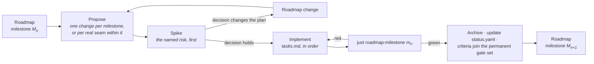

# Implementing the Roadmap

How a milestone on [the ladder](../ROADMAP.md) becomes code.

---

## A milestone is a set of OpenSpec changes

The roadmap states a milestone's entry conditions, the capabilities it advances, its closing
artefact and its exit criteria. It deliberately does **not** state the task breakdown — that belongs
to the change that implements it, because the breakdown is only knowable once the previous milestone
has closed.

So the working loop is:

**One change per milestone** is the default. Split only on a real seam — where nothing in the second
part can begin until the first has landed — never to make a review smaller. Four changes that only
mean anything together are one change with extra ceremony, and the milestone gate spans all of them
regardless.

## What every implementation change carries

| | |
|---|---|
| **Proposal** | Why this work, now. For an implementation change that is mostly *what the milestone buys that is expensive later* — not a restatement of the specifications. |
| **Design** | Only what the specifications leave open, and why each open question is settled the way it is. Rejected alternatives with their cost. |
| **Tasks** | The ordered plan. The spike first. Grouped by workstream, with the dependency between workstreams stated. Every task checkable. |
| **Deltas** | Any specification the implementation changed or corrected — including corrections to the roadmap itself. |
| **Capability and tier** | Which capabilities this advances, and to which tier. Recorded in the PR, and in `status.yaml` when it lands. |

## The rules that apply to all of them

From [`delivery-roadmap`](../../openspec/specs/delivery-roadmap/spec.md):

- **The spike goes first.** Each milestone names its most uncertain work; that work is attempted
  before the rest is scheduled, and its only deliverable is a decision. A spike may prototype a
  later capability provided the prototype is not merged.
- **Invariants land at Seed.** If the [invariant table](../ROADMAP.md#the-invariants-that-cannot-wait)
  names something for this milestone, it is not optional and it is not deferrable to the tier where
  it would be convenient.
- **Prerequisites before Working.** A capability may not reach Working before its prerequisites
  reach Seed, nor Complete before they reach Working. If that blocks the work, the roadmap is wrong
  and the fix is a roadmap change stating what was learned — not an exception.
- **Exit criteria are executable.** `just roadmap-milestone <id>` passes or fails; that result is
  the decision, not a judgement about it.
- **Closed milestones stay closed.** Once green, a milestone's criteria join the permanent gate set.
  A later change that breaks one does not merge unless it lands the recorded replacement.
- **`status.yaml` moves in the same commit as the work.** A tier claim the record does not support
  is drift, and `just roadmap-status` fails on drift.

## Where to look

| | |
|---|---|
| What closes the current milestone | [`docs/ROADMAP.md`](../ROADMAP.md), the milestone's exit criteria |
| What is implemented today | [`status.yaml`](status.yaml), or `just roadmap-status` |
| What is being built right now | [`openspec/changes/`](../../openspec/changes/) |
| Why the order is what it is | [`dependencies.md`](dependencies.md) |
| What is most likely to be wrong | [`risks.md`](risks.md) |

## Landed

**M5 · Authorable** — the editor as a Rust client over the C ABI: documents, transactions as the
only persistent write path, a command registry with typed parameters and declared effect classes,
engine-side picking, asset import, and a scripted session that survives its hosted runtime being
SIGKILLed mid-edit. 99 of 101 criteria pass; the two skipped are CI-matrix-only.

**It also flattened the milestone ledger.** A ledger now evaluates the permanent set once,
deduplicated, plus its own criteria, and invokes no other ledger — `four-profiles` runs once against
four times before. The subtle part is what flattening loses: *every criterion of every green earlier
milestone is in the newest ledger* was free under chaining and is silent when lost, so it now has a
regression test of its own.

Its gate demoted **four of its own tiers** rather than accepting them, because *the editor has never
spoken to this engine* — the process the artefact kills is a Rust stub that holds no world.
`live-editing`, `editor-ui-ux` and `editor-architecture` fell to Seed, `project-and-plugins` to
Working, each with the argument recorded beside the criterion.

And the fourth profile caught a real defect in the milestone's headline mechanism: a race in
`Session::lose` meant the editor fell back to no-runtime **in silence**, losing the offer to restart
that `editor-rust-application` requires. Fixed at the pump, with a regression test that fails 3/3
against the old code and 0/30 with the fix.

**M4 · Playable**, **M3 · First light**, **M2 · World**, **M1 · Substrate**, **M0 · Ground** — see
the archive.

Seven lessons, each found by auditing work that had been reported green:

- A privacy mechanism only covers the data model it can see.
- A gate that is wired but never run is not a gate.
- A ledger can break the milestone it is checking.
- A milestone's gate must actually be promoted when it closes.
- A delivered backend that is off by default is a backend nothing tests.
- A criterion that runs a different configuration from its gate cannot speak for it.
- **Don't touch the machine while a ledger runs** — two "regressions" were concurrent builds.

## In flight

**M5.5 · Operable.** The editor a person can see and operate, and one an agent can drive. Inserted
rather than renumbered, because M5's row claimed `editor-ui-ux` at Working while closing on a
scripted session — the row was wrong when it was written, and `delivery-roadmap` requires an artefact
that exercises its capabilities *through the entry points a user would use*.

The toolkit question, deferred for five milestones as an implementation detail, is answered:
**egui + egui_dock over wgpu**, chosen not on the zero-copy criterion — all three candidates passed
that — but because `dear-imgui-wgpu` gamma-corrects the imported frame, so proving the viewport image
is the engine's becomes a tolerance rather than an equality, and because Dear ImGui exposes nothing
to any accessibility tree.

It also brings `editor-agent-interface` to Working rather than M8. The capability is the loop, not
the tools: compose a scene, write a gameplay script, build and reload, play, **look**, decide.

Design references are binding: `docs/design/` now carries the identity, the transform gizmo, the
scene orientation gizmo and the editor scene view. Two things in them are deliberately not followed —
the active-state red, which collides with red meaning both the X axis and error, and the ban on
arrows in the orientation widget, which was my error rather than the reference's.
