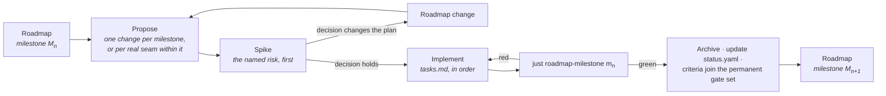

# Implementing the Roadmap

How a milestone on [the ladder](../ROADMAP.md) becomes code.

---

## A milestone is a set of OpenSpec changes

The roadmap states a milestone's entry conditions, the capabilities it advances, its closing
artefact and its exit criteria. It deliberately does **not** state the task breakdown — that belongs
to the change that implements it, because the breakdown is only knowable once the previous milestone
has closed.

So the working loop is:

**One change per milestone** is the default. Split only on a real seam — where nothing in the second
part can begin until the first has landed — never to make a review smaller. Four changes that only
mean anything together are one change with extra ceremony, and the milestone gate spans all of them
regardless.

## What every implementation change carries

| | |
|---|---|
| **Proposal** | Why this work, now. For an implementation change that is mostly *what the milestone buys that is expensive later* — not a restatement of the specifications. |
| **Design** | Only what the specifications leave open, and why each open question is settled the way it is. Rejected alternatives with their cost. |
| **Tasks** | The ordered plan. The spike first. Grouped by workstream, with the dependency between workstreams stated. Every task checkable. |
| **Deltas** | Any specification the implementation changed or corrected — including corrections to the roadmap itself. |
| **Capability and tier** | Which capabilities this advances, and to which tier. Recorded in the PR, and in `status.yaml` when it lands. |

## The rules that apply to all of them

From [`delivery-roadmap`](../../openspec/specs/delivery-roadmap/spec.md):

- **The spike goes first.** Each milestone names its most uncertain work; that work is attempted
  before the rest is scheduled, and its only deliverable is a decision. A spike may prototype a
  later capability provided the prototype is not merged.
- **Invariants land at Seed.** If the [invariant table](../ROADMAP.md#the-invariants-that-cannot-wait)
  names something for this milestone, it is not optional and it is not deferrable to the tier where
  it would be convenient.
- **Prerequisites before Working.** A capability may not reach Working before its prerequisites
  reach Seed, nor Complete before they reach Working. If that blocks the work, the roadmap is wrong
  and the fix is a roadmap change stating what was learned — not an exception.
- **Exit criteria are executable.** `just roadmap-milestone <id>` passes or fails; that result is
  the decision, not a judgement about it.
- **Closed milestones stay closed.** Once green, a milestone's criteria join the permanent gate set.
  A later change that breaks one does not merge unless it lands the recorded replacement.
- **`status.yaml` moves in the same commit as the work.** A tier claim the record does not support
  is drift, and `just roadmap-status` fails on drift.

## Where to look

| | |
|---|---|
| What closes the current milestone | [`docs/ROADMAP.md`](../ROADMAP.md), the milestone's exit criteria |
| What is implemented today | [`status.yaml`](status.yaml), or `just roadmap-status` |
| What is being built right now | [`openspec/changes/`](../../openspec/changes/) |
| Why the order is what it is | [`dependencies.md`](dependencies.md) |
| What is most likely to be wrong | [`risks.md`](risks.md) |

## Landed

**M2 · World** — the archetype ECS over M1's chunks, the node façade that caches nothing,
serialization and prefabs, the fixed-tick loop, and the determinism seeds. 26 exit criteria pass.

Its spike **changed the specification**, which is what spikes are for. The claim that a cooked cell
activates as a bulk copy was measured and found to be *a bulk copy plus a bounded fixup*: every
row's key is a live entity the cooker cannot know, and a cooked reference holds a cell-local index.
471 memcpys for 471 chunks at 2.5–2.7 ns/entity, then keys at 0.4 and reference slots at 0.6 —
21.4% of the payload, 25–27% of activation. The capability specs had always said "bulk copy **and
fix up references**"; the design note had compressed it. It also proved a new requirement: the
cooker must emit the reference sites, because asking the registry per row costs 4.7–5.2× more and
degrades activation into the reflection walk cooking exists to eliminate.

**M1 · Substrate** — reflection with the committed identity manifest and its gate, the value types,
memory domains and chunked storage, the math conventions as executable tests, the job system with
access declarations. 19 criteria pass.

**M0 · Ground** — the skeleton, the build with layering enforced at configure time, the workflow and
the gates. 14 criteria pass.

Four lessons, each found by a gate agent auditing work reported green:

- A privacy mechanism only covers the data model it can see.
- A gate that is wired but never run is not a gate.
- A ledger can break the milestone it is checking.
- **A milestone's gate must actually be promoted when it closes.** `milestone-m1` sat at
  `joins-on-close` through all of M2 — a ledger nothing ran, over code that changed underneath it.

## In flight

**M3 · First light.** An explicit RHI with a null backend written *before* Vulkan, a render graph
that computes its own barriers, Slang shaders, the render server and the GPU scene, clustered
forward shading. Closes on a lit, textured, shadowed frame under golden-image tests, with the same
frame rendered through the null backend in CI.

Its named risk, spiked first with veto power: **barrier and aliasing derivation under async
compute**. If the model cannot derive correct semaphores across queues, the alternative is explicit
synchronisation in every pass — the outcome the milestone exists to prevent.

M3 carries two invariants: barriers are computed and never written by a pass, and camera-relative
rendering with reversed-Z asserted *from the device* rather than from arithmetic. Its section 1 is
seven debts M2's gate recorded, including a `four-profiles` flake a pull request is now exposed to
three times over.
