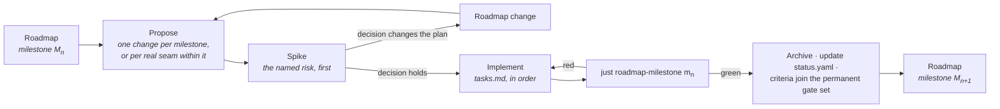

# Implementing the Roadmap

How a milestone on [the ladder](../ROADMAP.md) becomes code.

---

## A milestone is a set of OpenSpec changes

The roadmap states a milestone's entry conditions, the capabilities it advances, its closing
artefact and its exit criteria. It deliberately does **not** state the task breakdown — that belongs
to the change that implements it, because the breakdown is only knowable once the previous milestone
has closed.

So the working loop is:

**One change per milestone** is the default. Split only on a real seam — where nothing in the second
part can begin until the first has landed — never to make a review smaller. Four changes that only
mean anything together are one change with extra ceremony, and the milestone gate spans all of them
regardless.

## What every implementation change carries

| | |
|---|---|
| **Proposal** | Why this work, now. For an implementation change that is mostly *what the milestone buys that is expensive later* — not a restatement of the specifications. |
| **Design** | Only what the specifications leave open, and why each open question is settled the way it is. Rejected alternatives with their cost. |
| **Tasks** | The ordered plan. The spike first. Grouped by workstream, with the dependency between workstreams stated. Every task checkable. |
| **Deltas** | Any specification the implementation changed or corrected — including corrections to the roadmap itself. |
| **Capability and tier** | Which capabilities this advances, and to which tier. Recorded in the PR, and in `status.yaml` when it lands. |

## The rules that apply to all of them

From [`delivery-roadmap`](../../openspec/specs/delivery-roadmap/spec.md):

- **The spike goes first.** Each milestone names its most uncertain work; that work is attempted
  before the rest is scheduled, and its only deliverable is a decision. A spike may prototype a
  later capability provided the prototype is not merged.
- **Invariants land at Seed.** If the [invariant table](../ROADMAP.md#the-invariants-that-cannot-wait)
  names something for this milestone, it is not optional and it is not deferrable to the tier where
  it would be convenient.
- **Prerequisites before Working.** A capability may not reach Working before its prerequisites
  reach Seed, nor Complete before they reach Working. If that blocks the work, the roadmap is wrong
  and the fix is a roadmap change stating what was learned — not an exception.
- **Exit criteria are executable.** `just roadmap-milestone <id>` passes or fails; that result is
  the decision, not a judgement about it.
- **Closed milestones stay closed.** Once green, a milestone's criteria join the permanent gate set.
  A later change that breaks one does not merge unless it lands the recorded replacement.
- **`status.yaml` moves in the same commit as the work.** A tier claim the record does not support
  is drift, and `just roadmap-status` fails on drift.

## Where to look

| | |
|---|---|
| What closes the current milestone | [`docs/ROADMAP.md`](../ROADMAP.md), the milestone's exit criteria |
| What is implemented today | [`status.yaml`](status.yaml), or `just roadmap-status` |
| What is being built right now | [`openspec/changes/`](../../openspec/changes/) |
| Why the order is what it is | [`dependencies.md`](dependencies.md) |
| What is most likely to be wrong | [`risks.md`](risks.md) |

## Landed

**M4 · Playable** — the versioned append-only C ABI and its gate, the generated `CyberdyneKit`
overlay, input with fixed-tick sampling, physics over Jolt, camera and audio at Seed, and one
validated command stream. 26 exit criteria pass. Closes on `samples/04-character`: a controller
written entirely in Swift.

Its spike returned a more useful answer than yes. Hot reload works, but **not in place** — state
survives by serialize, migrate-by-name, recreate, measured across 40 consecutive edit/rebuild/reload
cycles at 0.13 ms mean. In-place preservation *looks perfect* until a type layout changes and then
corrupts silently: v2 code reading v1 objects reported `health=17` (v1's `ammo`) and a String field's
raw bit pattern as an integer, with no trap and no diagnostic. And `dlclose` of a Swift image is
unsafe on Linux — the next module maps over the same addresses, so a stale call jumps into unrelated
live code. A 20-cycle test passed *by luck* because two images were the same size.

**M3 · First light**, **M2 · World**, **M1 · Substrate**, **M0 · Ground** — see the archive.

Seven lessons, each found by auditing work that had been reported green:

- A privacy mechanism only covers the data model it can see.
- A gate that is wired but never run is not a gate.
- A ledger can break the milestone it is checking.
- A milestone's gate must actually be promoted when it closes.
- A delivered backend that is off by default is a backend nothing tests.
- Don't touch the machine while a ledger runs.
- **A criterion that runs a different configuration from its gate cannot speak for it.** M4's
  sanitizer criterion pre-configured its tree with the Slang front end off to work around one known
  failure — and thereby hid two nobody had found, while the CI job it stands for went on failing.

## In flight

**M5 · Authorable.** The editor as a Rust client of a hosted runtime — documents and transactions as
the only write path, viewport and gizmos with engine-side picking, asset import, live editing over
M4's proven reload model. Closes on a scripted session that survives having the runtime killed
mid-edit.

Scheduled **first**, before any editor code: the **flattened milestone ledger**. A ledger currently
begins by running the previous one's, twelve deep by M11 — 123 criterion invocations over 89 distinct
criteria, with `four-profiles` executed four times by a single run. M4's gate found a unit case that
failed four ledgers at once purely through that nesting. Deduplication is a correctness property
here, not an optimisation.

Its named risk is the live bridge: every selection, gizmo drag and property edit crosses a process
boundary, and whether that feels local is measured rather than argued.
