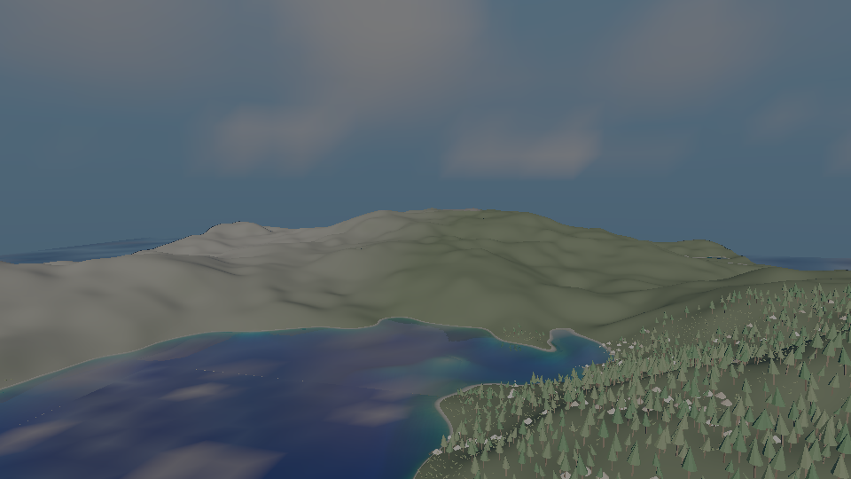

# add-aerial-perspective

Distance in `samples/10-world` is now the atmosphere's: every surface its lit path draws — terrain,
forest, and the sea when water shading is off — is attenuated by the air between it and the eye and receives the light that air scatters toward it,
read from `sky::AerialPerspectiveTable` integrated from the same atmosphere and tables as the sky.
The dome's clear sky is that same atmosphere, integrated with the same step rule, so distant ground
fades into the sky beside it.

With `--no-aerial-perspective` the take is the one the base commit drew, 192 of 192 frames
byte-identical (`evidence/frame-identity.txt`). Every test named in `tasks.md` section 4 was seen red
under a mutation (`evidence/falsification.txt`).
