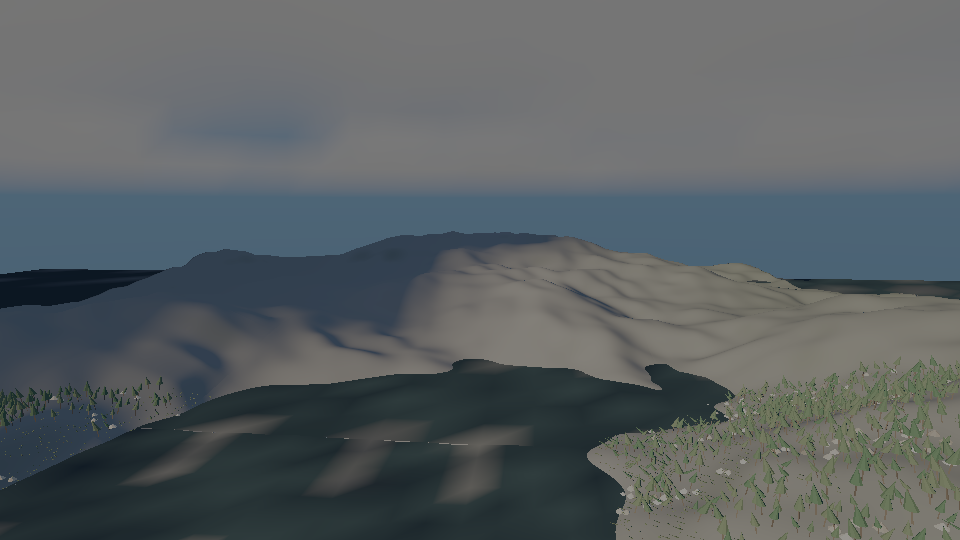
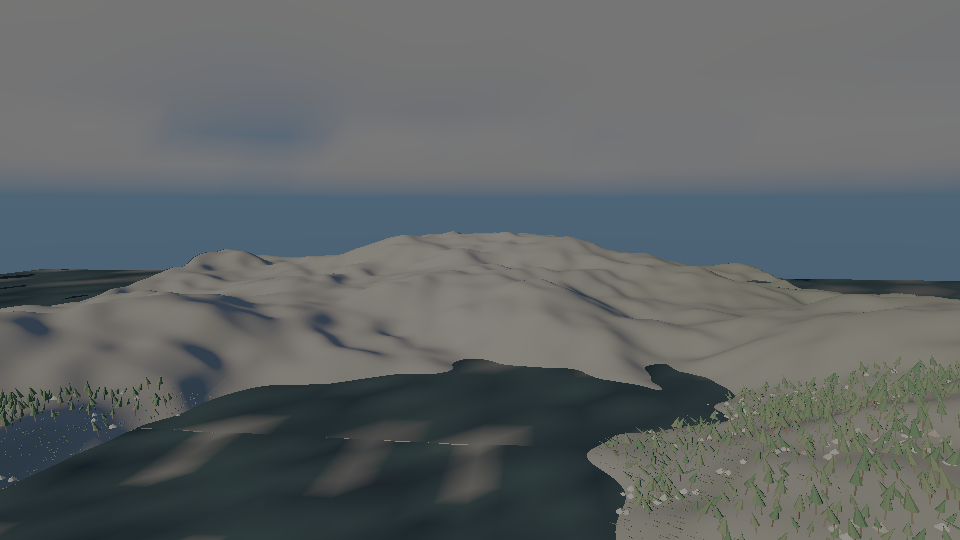

# add-cloud-shadows

Clouds now cast soft, moving shadows on everything the sun lights in `samples/10-world`: terrain,
foliage and water sample the `cloud-shadow` field per fragment and the direct sun is attenuated by
it. The sky dome and the ambient term are not. The field is marched from the same `CloudField` the
sky's lighting uses, at the frame's time, so it drifts with the weather's wind.

With `--no-cloud-shadows` the take is the one origin/main drew, 192 of 192 frames byte-identical
(`evidence/frame-identity.txt`). Every test named in `tasks.md` section 3 was seen red under a
mutation (`evidence/falsification.txt`).
