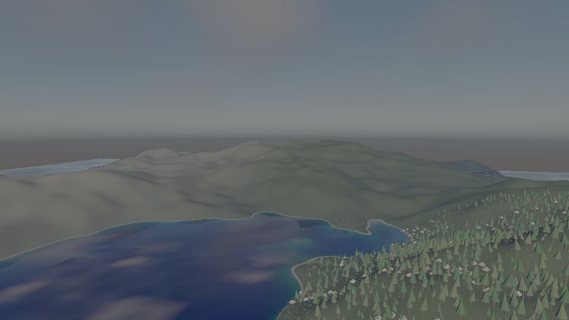
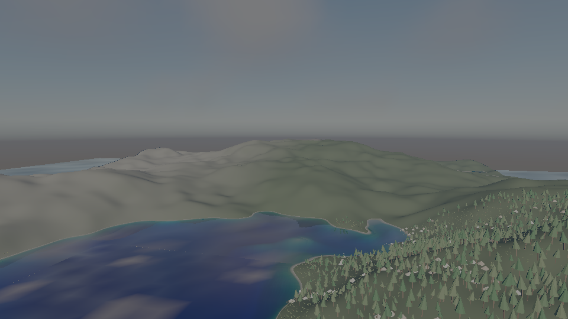

# add-volumetric-fog

Volumetric fog fills a froxel volume with a height fog and authored fog volumes, lights it with the
frame's own sun through the directional shadow map and with its ambient term, integrates it front to
back, and every surface is seen through it. Where an occluder stands between the sun and the air, the
froxels behind it scatter no sunlight: the light shafts between the Colonnade's columns.

In `samples/10-world` the same march writes the atmosphere's own froxel table with the fog
composited in, so a morning mist lies in the valleys under the air that was already there.

Off is the frame before, byte for byte. Every device case was seen red under a mutation
(`evidence/falsification.txt`).
