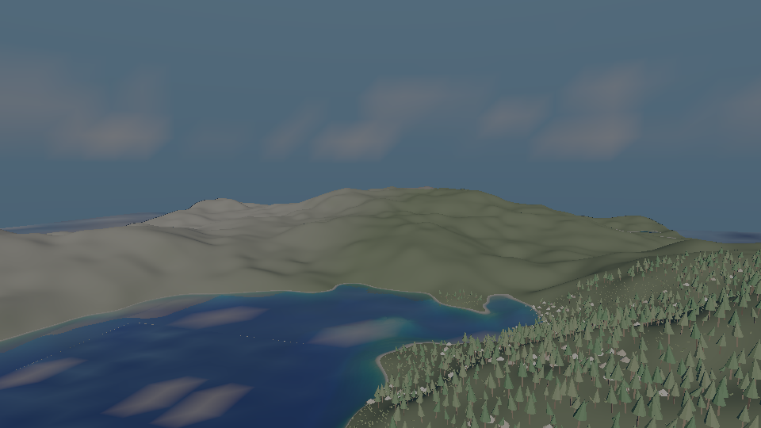
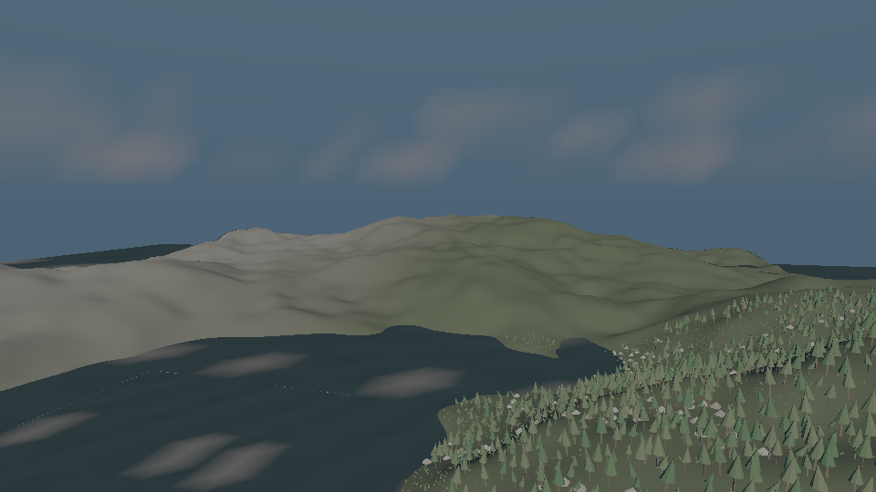
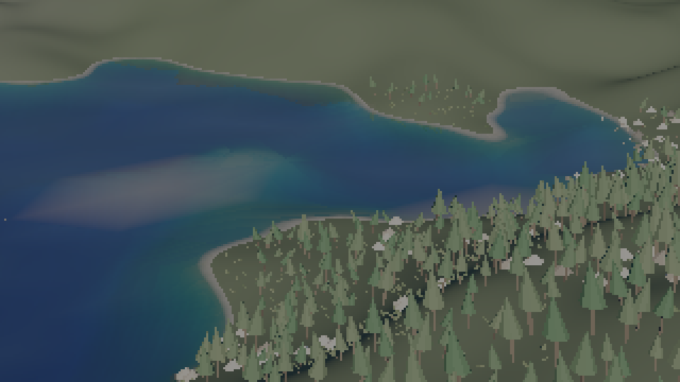
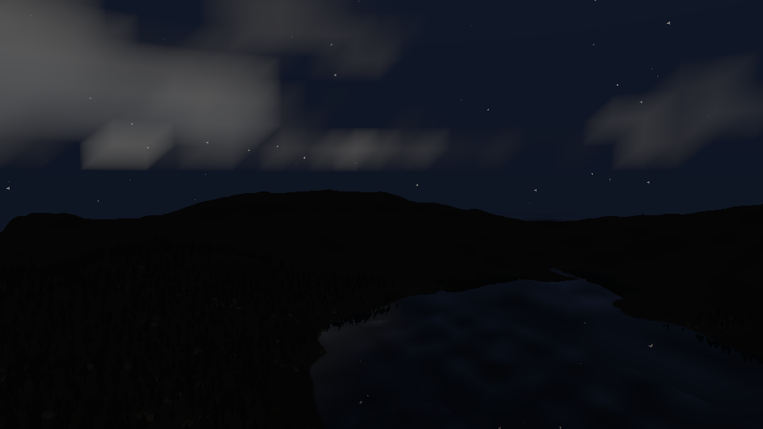

# add-water-shading

The sea in `samples/10-world` is shaded as water: the bed shows through the shallows and fades into
the channel by Beer-Lambert over the path to it, with the body's own absorption and in-scatter; the
surface reflects the sky and the land through a planar mirror, weighted by Fresnel; the shore foams
where the column is thin; and the sun is focused on the shallow bed by the curvature of the ocean's
own wave trains.

With `--no-water-shading` the take is the one 0f1dfd1 drew, 192 of 192 frames byte-identical
(`evidence/frame-identity.txt`). Every case of `render.world_water` was seen red under a mutation
(`evidence/falsification.txt`).
