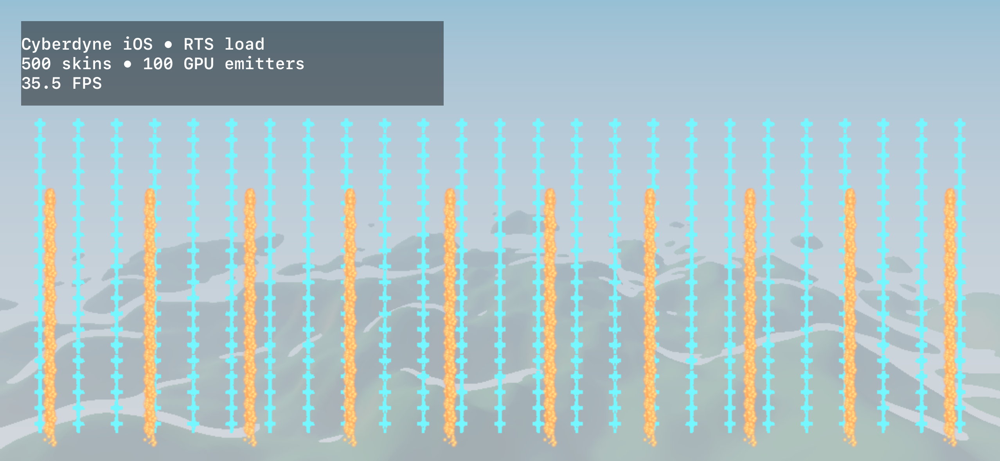

# Physical iPhone Metal validation

- Captured: 2026-09-20T17:34:09+00:00
- Hardware: iPhone 16
- OS: iOS 27.0
- Backend: `metal`
- GPU reported by RHI: `Apple A18 GPU`
- Native display: 2556 × 1179
- Render drawable: 1074 × 495
- Linear render scale: 0.420
- Terrain quality: 3 octaves, 32 maximum march steps
- GPU skinning: 500 models, 18000 vertices, 5 shared animated bones
- GPU VFX: 100 independent emitters, 51200 device-resident slots, 400 simulation dispatches, 51200 fixed-capacity draw instances
- CPU particle readback: disabled
- FPS samples: 35.33, 37.50, 34.83, 30.08, 32.99, 34.48, 34.91, 34.82, 36.49, 35.47, 36.86, 34.91, 36.81, 35.45, 35.88, 35.60, 34.93, 34.50
- Median FPS: 35.13
- Range: 30.08–37.50 FPS
- Combined-scene baseline: 60.09 FPS median
- Stress-load delta: -24.96 FPS (-41.5%); 28.47 ms median frame interval
- Contract: platform `ios`, one fullscreen window, desktop operations rejected, Metal surface, four touch events

