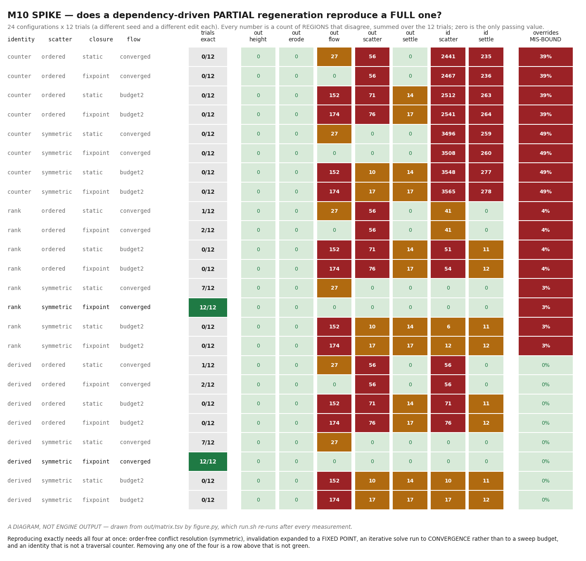

# Design: M10 — Worlds

## 1. The spike, and what it answered

**M10's named risk is region invalidation in PCG**, and `docs/ROADMAP.md` states the consequence:
getting dependency-driven partial regeneration wrong means either stale content or full-world
regeneration, and both are project-defining. The spike ran at the head of the milestone, before
`procedural-content-generation`'s graph had a dependency model anyone had coded against. It is
`~/cyberdyne-spikes/m10-pcg-spike/` — outside the repository, as M3's, M5.5's, M6's, M7's, M8.b's
and M9's were, because a prototype under `docs/` fails `just quality-layers`, correctly. `bash
run.sh` reproduces every number below in about four seconds and redraws the figure.

**What it did**: built a five-node PCG graph over 24x24 regions of 8x8 cells — 36 864 cells —
carrying the three kinds of edge a real graph has, so that an answer can be attributed to an edge
rather than to the graph. `height` has no edge at all (a pure function of world coordinates).
`erode` is a **bounded gather**: K relaxation passes need a K-cell halo, so one region of halo is
provably exact and this node is the control. `flow` is the **transitive** edge and the whole of the
risk: a region reads only its four neighbours' boundary outflow — a declared radius of one, which is
what any implementation would declare — but water crosses the map, so the reachable set is unbounded
and data-dependent. `scatter` resolves conflicts between neighbouring regions. `settle` is a
**long-range gather**: a 5x5 local maximum, then a road reaching three regions.

Randomness is the engine's own `cy::determinism::RandomStream`, included from the tree rather than
re-implemented, because §3 below says PCG's deterministic derivation is `random.h`'s counter-based
streams and nothing else.

Four axes, twenty-four configurations: **identity** (`counter`, a global traversal counter; `rank`,
(region, ordinal among survivors); `derived`, a stream draw keyed by the candidate's own slot),
**conflict resolution** (`ordered`, rejected by whatever is already accepted; `symmetric`, rejected
by a strictly higher priority), **invalidation closure** (`static`, the declared edges once;
`fixpoint`, expanded while anything still changes) and **the flow solve** (`converged`; `budget2`,
two sweeps and ship it). Each measured over **twelve trials** — six edit sites x two edit shapes, a
different seed every time.

***`docs/design/images/m10-pcg-spike-matrix.png` — a DIAGRAM, not engine output***, and it says so
on its own face. Every number is a count of regions that disagree between the partial regeneration
and the full one, summed over the twelve trials, drawn from `out/matrix.tsv` by the spike's
`figure.py`; `run.sh` redraws it at the end of every run, so the committed picture cannot describe a
matrix that is no longer there.

### 1.1 The answers, as numbers

| Question | Answer |
|---|---|
| Does a dependency-driven partial regeneration reproduce the full regeneration of the same seed, bit for bit, including generated identity? | **Yes — in 2 of 24 configurations, in all 12 of 12 trials, for output and identity both.** They are the two holding all four conditions of §1.2 at once. Every configuration missing any one of the four diverges |
| What is the blast radius of one edit, in regions? | **19 of 576 regions actually change** at `flow`, 13 at `height`, 6 at `scatter`, 1 at `settle` (means over 12 trials). The sound configuration **invalidates 40 at `flow` and 179 at `settle`** to find them — §1.3, and the surprise is which node the bookkeeping is in |
| Does a hand-placed override survive the regeneration of its region? | **Under `derived`, always: 0 mis-bound of 7 877 placed**, across full and partial regenerations alike. Under `counter`, **43% are silently mis-bound** by a full regeneration; under `rank`, 3.7% |
| Does the same hold on a second architecture, or for a GPU execution domain? | **NOT EVALUATED — §1.5.** This host has one architecture and one GPU vendor |

### 1.2 The finding: four conditions, and each one is load-bearing

The answer is not "caching is sound" or "caching is unsound". It is that **partial regeneration
reproduces the full one exactly when, and only when, four properties hold together**, and the spike
holds three of them fixed while breaking the fourth, twelve times each:

| Condition | What it costs to drop it |
|---|---|
| **Order-free conflict resolution.** A node may read its neighbours' *candidates*; it may not read their *accepted output* and let traversal order decide | `ordered` reproduces in **2 of 12** at best. In a full run a region later in the traversal has nothing accepted yet; in a partial run the cache is already holding its points, and 36 to 48 rejections across the twelve trials have no other cause |
| **Invalidation expanded to a fixed point.** A region whose output changed re-dirties everything that reads it, repeatedly, until nothing new changes | `static` — the declared radius-one edge, applied once — reproduces in **7 of 12**. This is the dangerous cell: a one-edit, one-seed spike would have called a statically-closed invalidation sound **more often than not** |
| **An iterative solve run to convergence, not to a sweep budget.** Strictly-downhill flow is acyclic, so its fixed point is unique and independent of sweep order and count; two sweeps is not that fixed point | `budget2` reproduces in **0 of its 12 configurations, in any of the 12 trials**. It is the only axis with no survivor anywhere: 152 to 174 `flow` regions disagree, because a partial run sweeps a different set of regions a different number of times and a budgeted result is a function of exactly that |
| **An identity not assigned by traversal order.** `derived` and `rank` both reproduce; `counter` never does | `counter` diverges on identity in **all 12 trials of all 8 of its configurations**, with 2 441 to 3 565 regions carrying different ids per configuration. Output was bit-identical in the best of them; only the labels moved |

**`rank` and `derived` are not interchangeable, and the override column is what separates them.**
Both reproduce the full regeneration — a rank is a stable label as long as the output it labels is
stable. What a rank cannot do is survive an edit: reject one candidate and every survivor after it
renumbers, so an override placed before the edit rebinds to its neighbour. §1.4.

### 1.3 The blast radius, and the node the bookkeeping is actually in

"A partial regeneration that touches the world is a full regeneration with extra bookkeeping" is the
question `design.md` asked, and the measurement moves the worry:

| node | regions the edit actually changes | regions the sound configuration invalidates |
|---|---|---|
| `height` | 13 of 576 | 17 |
| `erode` | 15 | 33 |
| `flow` — the transitive edge, the named risk | 19 | 40 |
| `scatter` | 6 | 44 |
| `settle` — a 5x5 gather then a 3-region road | **1** | **179** |

**The transitive edge is cheap and the long-range gather is not.** The fixed point follows water
across a watershed for roughly twice the regions it ends up changing, which is a normal cost for an
invalidation that is sound. `settle` invalidates **31% of the world to find one changed region**,
because a declared radius of 2 composed with a declared radius of 3 dilates the dirty set by 5 in
every direction before anything is evaluated. That is a fact about long-range gathers and not about
this node: any PCG operator whose declared reach is several regions will dominate the cost of every
edit near it, and the answer is a provenance record of what each region actually read, not a wider
radius. The spike does not build one; §4 below says what that leaves for `procedural-content-generation`.

### 1.4 Overrides, and the one outcome that is worse than losing them

7 877 hand-placed overrides across the twelve trials, each naming a generated instance by its
identity, each rebound after the regeneration. Three outcomes, and the third is the one to design
against:

| identity | bound | lost | **mis-bound** |
|---|---|---|---|
| `counter` | 4 521 | 5 | **3 351 — 43%** |
| `rank` | 7 515 | 70 | **292 — 3.7%** |
| `derived` | 7 642 | 235 | **0** |

**`lost` is visible and `mis-bound` is not.** A lost override is a dropped edit: the instance it
named is genuinely gone, because the edit removed it, and `derived`'s 235 are exactly that. A
mis-bound override silently moves a *different* object, and nothing in the world reports it —
`counter` does this to 43% of overrides on an ordinary full regeneration, before partial
regeneration is involved at all. An override model chosen after the cache is chosen is an override
model that loses, and this is the measurement that says so.

### 1.5 What the spike cannot answer on this host

Reported through the ledger's own mechanism rather than as a sentence. `tools/roadmap/milestones/m10.toml`
declares two criteria carrying `where = "ci"` with a reason, so `tools/roadmap/criteria.py`'s
`unmet_requirement()` reports them **NOT EVALUATED** rather than passing them — M9's
`lockstep-cross-platform` is the shape, and the same rule applies: NOT EVALUATED is never a pass.

- **`pcg-regeneration-cross-platform`** — this host is one x86-64 machine. The spike's graph is
  float arithmetic over `random.h`'s integer streams, and M9 §1.2 already measured that the engine's
  own primitives agree between clang 18 and gcc 13 on this architecture while `-march=native` with
  contraction at the compiler's default moves 13 of 16 workloads. Whether a region generated on one
  architecture reproduces on another is the same question M9 refused to answer here and it is
  refused here for the same reason.
- **`pcg-gpu-domain-agreement`** — `procedural-content-generation`'s execution domains include a GPU
  one. This host has one GPU vendor, so "the GPU domain reproduces the CPU domain's output" can be
  measured against one driver and one vendor's floating-point behaviour, which is not the claim.
  `requires = "gpu"` would be *met* here and would report a pass on evidence that does not support
  it, so the criterion carries `where = "ci"` instead — the mechanism's own way of saying "another
  machine".

### 1.6 What the spike cost the plan

**`procedural-content-generation` keeps caching and spatial invalidation, and gains four
requirements it must satisfy to be allowed them.** §4's contingency — "if the spike says partial
regeneration cannot be made to reproduce the full one, caching and spatial invalidation come out" —
does not fire: it can be made to reproduce, exactly, in every trial. What changes is that the four
conditions of §1.2 are now requirements on the row rather than implementation details inside it, and
each is a test before it is prose:

1. **Invalidation is a fixed point, not a declared radius.** The refusal shape M10 uses elsewhere
   applies: a node that declares a reach and is then observed to read outside it is a defect the
   graph should name, not tolerate.
2. **A graph node is a pure function of its declared inputs.** An operator that reads a sibling's
   *output* rather than its *inputs* is order-dependent and must be refused at graph-compile time,
   the way `environment-fields` refuses a second producer at registration.
3. **An iterative operator declares convergence, not a budget.** A budget is a legitimate runtime
   lever, but the budgeted result is not cacheable and must not be recorded as if it were.
4. **Generated identity is derived from stable identifiers — seed, node, region, and the
   candidate's own slot** — never from a traversal counter and never from a rank among survivors.
   `simulation-and-determinism`'s phrase for stream identity is the phrase for this too, and
   `substream` then `draw` is the derivation. It is also the exit criterion `tasks.md` 4.2 already
   names, and §1.4 is the number it has to beat.

And one defect the spike found in itself, recorded because it looked exactly like a failure of the
thing being measured rather than of the code measuring it: `derived` was first computed as
`fold_multiply(region + 1, slot + 1)`, which for small operands is plain `a * b` — the high half of
the product is zero, so there is nothing to fold — and `a * b` is not injective, so region 1 slot 5
and region 5 slot 1 were one instance. It reported 93 of 455 overrides mis-bound under a scheme that
**cannot** mis-bind. **An identity scheme is only as stable as the function deriving it**, which is
the fourth requirement's real content.

**And what the spike refuses to report**, because this project has shipped a determinism test that
passed on the very defect it was written for, its scene having never contended. Two preconditions
run before the matrix and both were watched to fail:

- **a harness that is not deterministic** — two identical full runs are compared first, and a
  disagreement exits 2 with `THE HARNESS IS BROKEN` rather than printing a matrix;
- **an `ordered` variant that never contended** — its order-dependence can only show where a
  candidate is rejected by a region the traversal has not reached, and counting that in a *full* run
  gives zero by construction. The first version of the meter did exactly that, reported
  "reproduces", and was caught by the refusal it now carries: the count is taken in the **partial**
  runs and a zero exits 3 with `this report is void`.

`README.md` in the spike lists the four mutations run against the finished report — the control
node's halo cut to zero (`12/12` fell to `6/12`), the comparator blinded to identity (`counter`
flipped to `12/12`, so the identity half is what condemns it and it is live), the generator poisoned
(precondition red, exit 2), and the contention meter's own masking bug (exit 3).

## 2. One substrate, and the producers that are not allowed to fork it

M9's subtitle was "one command log, read five ways" and its design named the failure it guarded
against: five readers growing five records of what happened. **M10's version of that failure is
seven producers growing seven fields that mean the same thing** — terrain writing a wetness it
computed, weather writing another, foliage sampling a third.

So the substrate is declared once, and **one producer per field** is enforced at registration with a
refusal that names both producers. That is the same shape as M9's configuration-time determinism
refusal and M8.c's cook-time refusal, and it is picked for the same reason: a diagnostic that fires
at runtime has already shipped the defect.

The consumers — gameplay, rendering, audio, navigation — read fields. A consumer that writes one is
the bug this milestone is shaped to make impossible rather than to detect.

## 3. Determinism is inherited, not re-invented

`simulation-and-determinism` reached Working at M9 with a classification model, a firewall at the ECS
write path and a lint. **M10 adds no second mechanism.** A gameplay-visible field is authoritative
state and is classified as such; a presentation-only field is firewalled by the machinery that
already exists; `procedural-content-generation`'s "deterministic derivation" is `random.h`'s
counter-based streams and nothing else.

The one thing M10 owes determinism is **`tests/determinism/`**, which M9's own gate found empty:
`tests/CMakeLists.txt` promises the kind joins the taxonomy at M9 and `testing-and-quality` gives it
a location and a 10 s budget. Golden replays, replay and save fuzzing and the transactional save
tests live there, and a procedurally generated world is the first workload large enough for a golden
replay to be worth committing.

## 4. Which of these rows are actually contingent, stated rather than assumed

Eight rows to Working and three to Complete is a large load, and the honest position at proposal
time is that they are not equally risky:

- `environment-fields` is the milestone. Every other world row writes into it, and a substrate
  designed after its first two producers exist is a substrate with two special cases in it.
- `terrain`, `water` and `atmosphere-sky-and-clouds` are large but well-understood: each has a
  specification with a settled shape and no dependency on the spike's answer.
- `procedural-content-generation` is the row that depended on section 1, **and the spike has run**.
  The contingency did not fire: partial regeneration reproduces the full one exactly, in every trial,
  for output and for generated identity both, so **caching and spatial invalidation stay in scope**.
  What the spike adds to the row is four conditions it must satisfy to be allowed them — §1.6 — each
  of which is a test before it is prose, and the knowledge that the expensive node is the long-range
  gather rather than the transitive edge everyone was worried about.
- `foliage` and `weather-and-wind` are downstream of the substrate and of PCG's placement.
- **The three Complete rows are the ones M9 demoted, and each is blocked on a named, running
  criterion rather than on a design question.** If those criteria do not go green, the rows do not
  move, and a second demotion of the same row means the row is mis-scoped rather than late — that is
  a finding about the plan, and it belongs in the next milestone's proposal rather than in its gate.

**The demotion this design predicted, if one were needed, was `procedural-content-generation`** — it
was the only row whose scope a spike decided. That spike has now run and the row's scope survives it
intact, so this design no longer predicts a demotion. If one is needed it will be for a reason
nothing here has measured, and that is a finding for the gate rather than a forecast for the plan.

## 5. What this milestone deliberately does not do

- **No new renderer architecture.** The render graph, the material compiler and the shader system are
  M3's, M7's and M8.b's settled answers; volumetric clouds and water shading are passes in the graph
  that exists.
- **No second determinism mechanism**, and no relitigating the firewall's enforcement point. M8.c
  decided it at the ECS write path and proved it by mutation; M9 armed it.
- **No cross-platform claim.** `simulation-and-determinism`'s Complete cell sits at M11 with the
  deterministic math module, because the guarantee it turns on cannot be measured on one
  architecture, and M9's gate refused to claim it on a single host.
