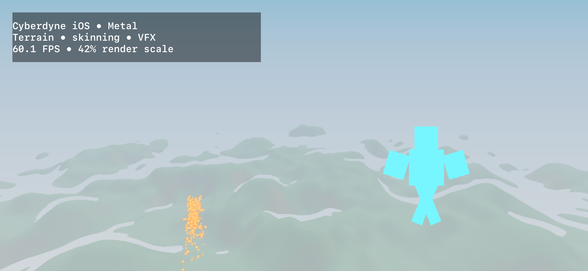

# Physical iPhone Metal validation

- Captured: 2026-09-20T17:22:46+00:00
- Hardware: iPhone 16
- OS: iOS 27.0
- Backend: `metal`
- GPU reported by RHI: `Apple A18 GPU`
- Native display: 2556 × 1179
- Render drawable: 1074 × 495
- Linear render scale: 0.420
- Terrain quality: 3 octaves, 32 maximum march steps
- GPU skinning: 36 vertices, 5 animated bones
- GPU VFX: 512 device-resident slots, 4 simulation dispatches, 512 fixed-capacity draw instances
- CPU particle readback: disabled
- FPS samples: 55.09, 60.10, 60.10, 60.09, 60.06, 60.12, 60.08, 60.09, 60.09, 60.09, 60.09, 60.10, 60.09
- Median FPS: 60.09
- Range: 55.09–60.12 FPS
- Contract: platform `ios`, one fullscreen window, desktop operations rejected, Metal surface, four touch events

