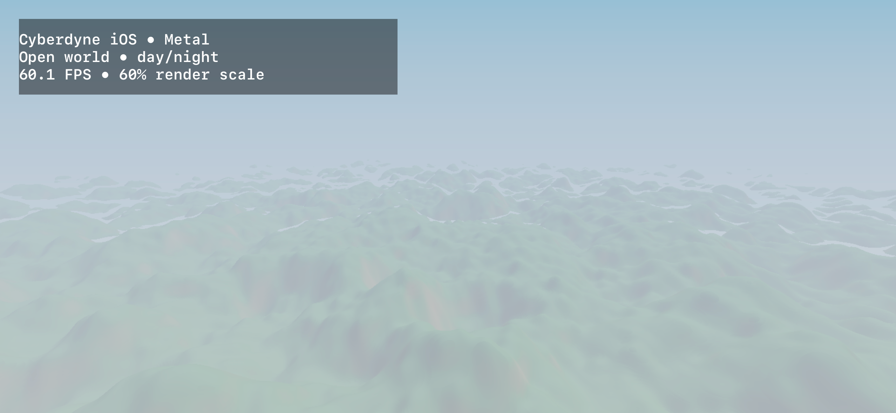

# iPhone 16 mobile rendering comparison

Both runs used the same physical iPhone 16 on iOS 27.0 and the native Metal backend on its Apple
A18 GPU.

| Measurement | Baseline | Optimized |
|---|---:|---:|
| Native display | 2556 × 1179 | 2556 × 1179 |
| Render drawable | 2556 × 1179 | 1534 × 707 |
| Linear render scale | 1.000 | 0.600 |
| Terrain octaves | 6 | 4 |
| Maximum march steps | 92 | 64 |
| FPS samples | 19.75, 18.42, 17.44, 17.17, 16.91, 16.75 | 45.86, 60.09, 60.10, 60.10, 60.09, 60.08, 60.11, 60.09, 60.10, 60.10, 60.10 |
| Median FPS | **17.30** | **60.10** |

The optimized median is 3.47 times the baseline. The drawable shades 64.01% fewer pixels. Together
with the bounded shader loops, the maximum terrain-octave evaluations per frame fall by 83.31%.
The first optimized sample includes application warm-up; all ten subsequent samples remained
between 60.08 and 60.11 FPS during the twelve-second run on an already warmed device.

The baseline Metal System Trace independently observed 15–16 displayed surface swaps per second
after warm-up. The uninstrumented application log above is the performance criterion because
system-wide Metal tracing measurably perturbs this small device workload.

## Baseline

## Optimized

