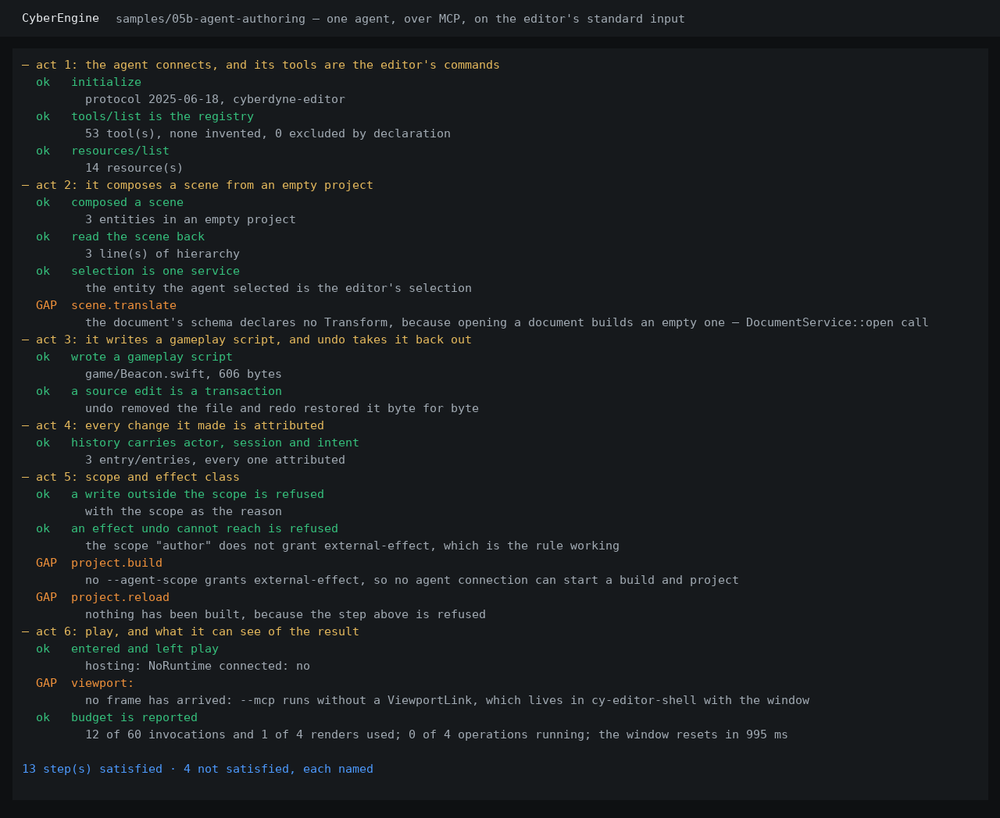

# `samples/05b-agent-authoring` — the M5.5 artefact an agent drives

> **An agent composes a scene, writes gameplay source, and is told what it may not do.** Task 4.2.
>
> ```
> just run-agent-authoring
> just run-agent-authoring --shot docs/design/images/agent-authoring-m5b.png
> ```
>
> CTest entry: `smoke.agent_authoring`. **No display and no graphics device**, which is why this is
> the half of M5.5 that runs in continuous integration.



## Why this artefact exists

`design.md` §3 states the loop the milestone is for:

```
compose a scene  ->  write a gameplay script  ->  build and reload  ->  play  ->  LOOK  ->  decide
```

and §5 says why it cannot be the same artefact as the window: *"A single artefact cannot demonstrate
both a person operating an editor and an agent authoring through it, and pretending otherwise would
repeat M5's mistake in a different shape."*

One editor process, started with `--mcp --agent-scope author`, and `authoring.py` on the other end of
its standard input speaking newline-delimited JSON-RPC 2.0. The client is **hand written and depends
on nothing**: a driver built out of the editor's own types would prove nothing about the wire.

## What it does, act by act

| Act | What is exercised | What is asserted |
|---|---|---|
| 1 · connect | `initialize`, `tools/list`, `resources/list` | every tool offered is a command the registry has. The same binary is run a second time with `--list-commands` and the two sets are compared, because **a hand-written tool entry is invisible from either side alone** and is the first of the twelve patterns `editor-agent-interface` forbids. |
| 2 · compose | `scene.create-entity` ×3, `edit.select`, `hierarchy:`, `selection:` | three distinct entities in an empty project, read back, and the agent's selection *is* the editor's selection |
| 3 · author | `source.write`, `sources:`, `edit.undo`, `edit.redo` | the file appears on disk with the exact bytes; **undo removes it and redo restores it byte for byte** — which is the half of "a source edit is a transaction" that a document test cannot make |
| 4 · attribute | `history:` | every entry carries `[agent]`, the session and the intent (task 5.5) |
| 5 · scope | `source.write` outside `game/`, `project.build` | both refused, each naming the reason — the directory scope and the effect class |
| 6 · play & look | `play.enter`, `play:`, `play.leave`, `viewport:`, `budget:` | play is entered and left; the budget reports what the connection has spent |

## The four steps that do not close, and what each is waiting on

Every one of them is **attempted on every run** and reported by name, in the terminal and in the
committed screenshot above. None is skipped, faked, or left out. The rule is
`samples/05-editor-session`'s, set at M5: an artefact that quietly narrows its claim to what happens
to work reports a milestone as closed that is not.

### 1 · `scene.translate` — nothing in the scene can be placed

> `this document's schema declares no Transform component with translation, rotation, scale fields`

Opening a document constructs an empty one: `DocumentService::open` calls `Document::new`, a name
and an empty schema, because there is no world loader. Nothing in the tree outside a test ever calls
`DocumentSchema::declare_type`. So a scene can be **composed** — the entities are real, they are in
the history, and undo restores them exactly — and nothing in it can be **placed**.

The manipulation path itself is real and tested: `cy_editor_services::manipulate` opens the same
`Drag` a gizmo press opens, against the focused viewport's own space, pivot and increments.

### 2 · `project.build` — no agent connection can start one

> `the scope "author" does not grant the effect class external-effect`

**That refusal is correct, and this driver asserts it as a satisfied step rather than a gap.**
Running a compiler is an effect undo cannot reach, and `editor-agent-interface` requires such a class
to be granted deliberately rather than prompted for.

What is missing is a scope that grants it. `cy-editor-app/src/main.rs` declares `read` and `author`
and no third, so today there is no way to start the editor such that an agent could build. One more
arm in that `match`, granting `EffectClass::ExternalEffect` under a name that says what it is, closes
this step and the one below it.

### 3 · `project.reload` — nothing has been built

> `nothing has been built · What would help: invoke project.build first`

Follows from the step above. The reload path itself is built: `cy-editor-protocol` carries `Reload`
and `Reloaded`, `RuntimeSession::reload` sends them, and `ProjectService` gives every generation its
own library file name — which M4 measured as the difference between a reload that works and one
where the new image's type lookup finds the old image's metadata. **The C++ runtime does not answer
those two messages yet**, which is the second half of this step and is recorded in the agent-crate
handoff.

### 4 · `viewport:` — the agent cannot look at what it built

> `no frame has arrived from the runtime for this viewport · the editor shows nothing rather than an
> approximation, and so does this`

The transport is real, measured, and photographed by this milestone's other artefact: the editor's
window composites the runtime's own dma-buf image with no copy through the CPU. But the code that
claims frames from it — `ViewportLink` — lives in `cy-editor-shell` with the window, and `--mcp` runs
without a window. So the **LOOK** step of the loop has an implementation and no host in this
configuration.

This is the gap that matters most, because looking is what makes the loop authoring rather than data
entry. It is also the smallest of the four in code: a headless frame source for the agent's own
viewport (`AGENT_VIEWPORT`), fed from the same `ViewportSession` the window uses.

## What the artefact proves that is not obvious

* **The agent's tools are the editor's commands, checked rather than promised.** 53 of them,
  compared against `--list-commands` on the same binary in the same run.
* **The agent's history is the human's history.** Same document, same transactions, one extra field.
* **The agent is strictly less capable than the person at the window**, which is task 5.6: the two
  refusals in act 5 are things a human at the same editor can do, refused for this connection because
  it declared a narrower scope.
* **A source edit undoes.** The file is gone after `edit.undo` and back after `edit.redo` — this is
  a real file in a real project directory, checked from outside the editor.

## What is in this directory

| | |
|---|---|
| `authoring.py` | the artefact, and the MCP client |
| `project/` | an empty project with a `game/` directory. Copied into the work directory on every run, because the agent **writes into it** and a second run must not start from the first run's result |
| `CMakeLists.txt` | the CTest entry, and why this directory declares no C++ target |
