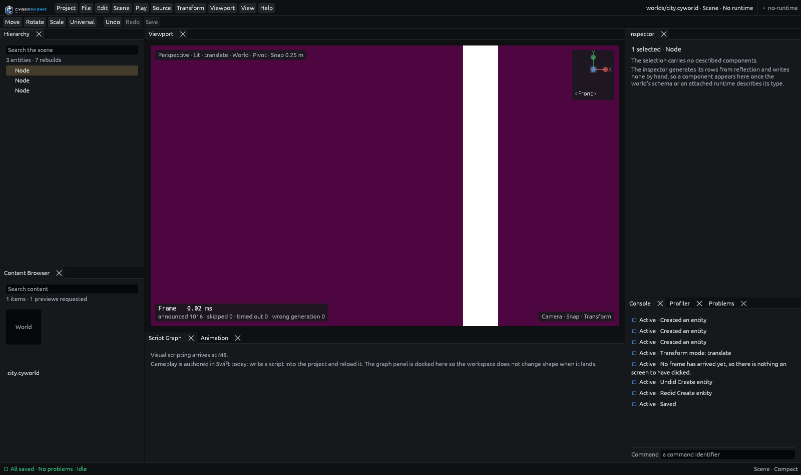

# `samples/05b-editor-window` — the M5.5 artefact a person drives

> **The editor opens, and somebody uses it.** Task 4.1.
>
> ```
> just run-editor-window                 # run it
> just run-editor-window --hold          # ... and leave the window open at the end
> just run-editor-window --shot docs/design/images/editor-window-m5b.png
> ```
>
> CTest entry: `smoke.editor_window`. Needs a display; **skips loudly** where there is none.



## Why this artefact exists

M5 closed on a scripted session, and `implement-m5b-operable/proposal.md` says plainly why that was
not enough: *"A Python script driving command objects does not exercise docking or keyboard-first
operation through the entry points a user would use."* This is the artefact that does.

Two processes and a real X11 session:

| | |
|---|---|
| `cy-viewport-publisher` | the runtime's half of the viewport transport. A second process that allocates `VkImage`s with an explicit DRM format modifier, exports them as dma-bufs, and hands them and two timeline semaphores across a Unix socket. A **fixture**, not the engine — but the wire it speaks is the one the engine's runtime will speak. |
| `cyberdyne-editor` | the editor, with a window, opened on `project/`. |
| `window.py` | this driver, which operates that window through **XTEST**: synthesised key presses and pointer drags delivered to the X server rather than to the application. |

Nothing here is a test hook. The editor cannot tell this driver from a hand on a keyboard, which is
exactly the property M5's artefact could not have.

## What it does, act by act

| Act | What is driven | What is asserted |
|---|---|---|
| 1 · open | the window maps and the transport connects | the viewport's pixels are **saturated**, which the editor's own charcoal chrome never is — so those pixels came out of another process's GPU allocation. The journal is empty. |
| 2 · author | `Ctrl+Shift+N` three times, then a click on an outliner row | three journal records, three outliner rows, and a selection |
| 3 · manipulate | `W`, then a pointer drag across the viewport | **an open step** — see below |
| 4 · undo | `Ctrl+Z`, `Ctrl+Shift+Z`, then `Ctrl+P`, typing, `Escape` | the outliner loses a row and gets it back; the journal stays at three records, which is what an append-only record of *commits* should do; the palette **covers the viewport** — a charcoal surface over another process's saturated frame, which is a colour question with an unambiguous answer — and `Escape` uncovers it |
| 5 · save | `Ctrl+S` | the journal goes from three records to zero — `file.save` discards it only after the write. Then a **second, headless editor** opens the same document over the same journal and is offered no recovery. |

## How a window is observed

Three observables, and none of them is "it did not crash".

1. **The journal.** `--journal <dir>` makes every committed transaction a length-prefixed record in
   `<document>.cyjournal`, appended and flushed on commit. This driver parses that file itself
   rather than asking the editor, because an observable the editor computed would only be the editor
   agreeing with itself.
2. **The outliner's rows.** Undo and redo do not touch the journal, correctly. So they are observed
   where a person observes them — by counting the bands the outliner draws. A count of drawn rows
   rather than a reading of text: it needs no font, no interface scale and no locale.
3. **The viewport's pixels.** `editor-visual-language` requires the chrome to be dark and neutral.
   The publisher's frame is not. "The viewport region is saturated" is therefore a claim no
   toolkit-drawn approximation could satisfy, and it is task 2.1 photographed rather than asserted.

## Every wait is a deadline

There is not one `sleep` in this driver that stands in for a result. A window answers a key press
when its next frame runs, and on a loaded machine that is not a fixed number of milliseconds. Two
agents on this milestone reported exactly that shape of flake in their own suites, so:

* `until(predicate, seconds)` is the only wait;
* focus is **waited for and re-asserted** against `_NET_ACTIVE_WINDOW` before anything is typed —
  a synthesised key press goes wherever the server thinks focus is, and assuming it is here is both
  a wrong result and a rude one;
* every load-bearing key press goes through `press_for`, which re-sends it **only while nothing
  has changed** — never on a timer. An X server drops nothing, but a window that is not yet
  focused or has not run a frame can miss a press, and a driver that pressed `Ctrl+Z` twice because
  the first press was merely *slow* would undo two things and report a wrong result rather than a
  flake. The three `Ctrl+Shift+N` presses are counted, and the final journal count is asserted to be
  exactly three, so a doubled press fails loudly instead of being absorbed;
* the outliner is polled from **its own rectangle** rather than from a full window capture, because
  a full 1600×950 read per poll is most of what such a loop costs — which is how a deadline that is
  generous in seconds becomes a deadline of four attempts on a machine that is also running a
  compiler.

Verified: four consecutive green runs with six CPU-saturating processes alongside.

**It takes the keyboard while it runs.** The driver activates the editor's window and types into it,
so on a desktop session it will pull focus for the twenty seconds it lasts. `smoke.editor_window` is
declared `RUN_SERIAL` for the same reason — two of these at once would type into each other.

## The one act that does not close

**A gizmo drag moves nothing, and it is not the viewport's fault.**

`DocumentService::open` calls `Document::new`, which is a name and an **empty schema**, because
there is no world loader — nothing outside a test ever calls `DocumentSchema::declare_type`.
`TransformBinding::of_schema` therefore finds no `Transform`, the gizmo has nothing to bind to, and
a drag over the viewport commits nothing. The inspector says the same thing in its own words:
*"The selection carries no described components."*

The drag act performs the drag anyway, asserts that nothing was committed, and reports it by name on
every run. It will report as satisfied the day opening a world produces content. What is *not*
missing is the gizmo: `cy-editor-viewport`'s own suites hold its three states, its snapping, its
pivot and space modes, its per-axis numeric entry and its one-transaction rule — against a document
that declares a `Transform`, which a test can build and an editor cannot yet open.

## Task 4.4 — the built editor against the reference imagery, and which one is right

`editor-visual-language` requires that *"a reference that no longer reflects the intended language
SHALL be replaced rather than left to decay"*, and that where a reference and the specification
disagree the specification wins. Here is every difference between
[`editor-window-m5b.png`](../../docs/design/images/editor-window-m5b.png) and the two references,
with a verdict.

| | reference | built | which is right |
|---|---|---|---|
| **Header mark** | `CYBERDYNE · ARTIFICIAL INTELLIGENCE`, large, far left | the CyberEngine horizontal lockup, small | **the implementation.** The product is CyberEngine and Cyberdyne is the publisher (task 1.5b). The references brand the publisher as the product, which is one of the four things `docs/design/editor-visual-language.md` already records as wrong. **The references should be replaced.** |
| **Header centre** | `DesertFrontier - RTSGame` | `worlds/city.cyworld · Scene · No runtime`, then a `no-runtime` pill | **the implementation.** Whether a runtime is attached is load-bearing from M5.5 onward and belongs where the eye already goes. |
| **Console tabs** | Output Log · Message Log · **Blueprint Log** | Console · Profiler · Problems | **the implementation.** "Blueprint" is another engine's product vocabulary — task 1.8's first item — and `cy-editor-interface`'s vocabulary gate rejects it. **The references should be replaced.** |
| **Performance overlay** | top-left, FPS / Frame / Draw / GPU / Mem | **bottom-left**, `Frame 0.00 ms` and the transport's counters | **the reference**, on position: `docs/design/editor-visual-language.md`'s own region table says "The performance overlay sits top-left". The implementation puts it bottom-left. The *content* is the implementation's — announced / skipped / timed out / wrong generation is what there is to say about a frame at M5.5 — but the corner should move. |
| **Orientation widget** | top-right, three axes, no rings, no boxes | top-right, three axes, no rings, no boxes | **they agree.** |
| **Toolbar** | icons: select mode, play, build, transform, snapping, viewport options | text: Move · Rotate · Scale · Universal, then Undo · Redo · Save | **the reference**, and the implementation is *thinner* rather than wrong: play, snapping and the viewport options are registered commands reachable from the menus and the palette, and are not in the toolbar. |
| **Outliner** | per-row visibility toggles at the right edge | none | **the implementation.** `NodeState` has no visibility field, and a toggle that did nothing would be worse than none. The specification's own scenario ("a reference does not gate a milestone") covers this. |
| **Inspector** | Transform · Unit · AI · Abilities · Rendering, with X red / Y green / Z blue vector fields | "The selection carries no described components" | **the implementation.** The inspector is generated from reflection and writes no rows by hand; with an empty schema and no runtime, nothing is described and saying so is the requirement rather than a shortfall. |
| **Selection** | a thin gold outline on the object in the viewport | a gold row in the outliner; no outline in the viewport | **correct by architecture, and it needs an engine.** The outline is drawn by the renderer, not by the editor — `editor-viewport-and-gizmos` forbids a second renderer — and there is no engine world to outline. |
| **Content browser** | rendered thumbnails per asset | a flat tile per item | **the reference**; thumbnail rendering is not built. Thinner, not wrong. |
| **Left tool rail** (adventure reference) | a vertical rail of mode-level tools | none | **the reference**; not built. |
| **Window controls** | drawn into the header | the system's own decorations | **the implementation** on this platform; the specification does not require client-side decorations, and drawing our own on X11 would cost more than it says. |

Two consequences follow, and only one of them is in this change:

* **What is right here is recorded here.** Three rows above say the references are wrong and why —
  the publisher branded as the product, another engine's vocabulary in the console, and a header that
  says nothing about the runtime.
* **The references themselves are not replaced in this change, and `docs/design/editor-visual-language.md`
  is not edited to point at the two new images.** That document and those reference files are not
  this change's to edit. Whoever owns them should: add
  `docs/design/images/editor-window-m5b.png` and `agent-authoring-m5b.png` to the document as
  *"what was actually built at M5.5"*, fold the three verdicts above into the four-things-not-to-copy
  section, and move the performance overlay to the top-left corner in `cy-editor-shell`.

## Two defects observed while driving it

* **Notification toasts cover the panel beneath them**, and their widths are ragged. Corrected after
  M5.5's gate looked: an earlier draft of this section reported that toasts overlap *each other* and
  that the text of both is unreadable, and that is not what happens — `notify.rs` stacks them in a
  vertical `Ui` with `add_space`, and the artefact's own captures show them stacked and individually
  legible. What they do is sit over the Console panel with right-aligned edges of differing width.
  Smaller than the original claim, and left here in its corrected form rather than deleted, because a
  defect report that overstates sends the next reader hunting for something that was never there.
  Visible in `build/<dir>/editor-window/shots/06-palette.png`.
* **The window draws the runtime's frames and the viewport model never learns that any arrived.**
  Clicking in the viewport says *"No frame has arrived yet, so there is nothing on screen to have
  clicked"* while the overlay a few centimetres away reads `announced 1016 · skipped 0`. It is not a
  wrong message, it is a missing edge: `cy-editor-shell::viewport_link` composites the imported
  texture and calls `session.set_view_state(...)`, but nothing ever pushes a
  `PresentedFrame` into `cy_editor_viewport::Viewport`'s stream — the shell calls `Viewport::pump`
  nowhere. So `Viewport::pick` returns `None`, `interaction_view()` falls back to the editor's own
  requested state rather than the state the frame was rendered with, and the published gizmo layout
  has nothing to arrive on. Everything downstream of "what frame is on screen" is dark while the
  screen is full of frames. `ViewportSession` already implements `Transport`, so the fix is one
  `viewport.pump(&mut session, now)` per frame in `ViewportLink::begin_frame`.

Neither is in this artefact's files.

## What is in this directory

| | |
|---|---|
| `window.py` | the artefact |
| `project/` | an empty project. Copied into the work directory on every run, so a run never edits it |
| `CMakeLists.txt` | the CTest entry, and every reason this directory declares nothing at all |
