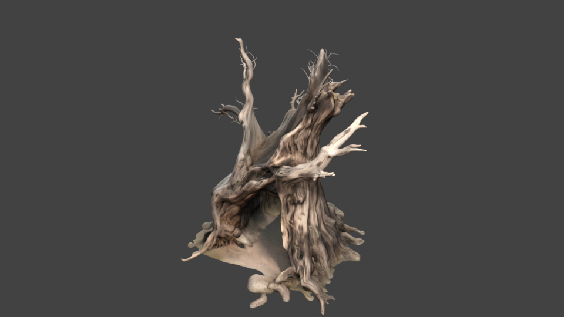
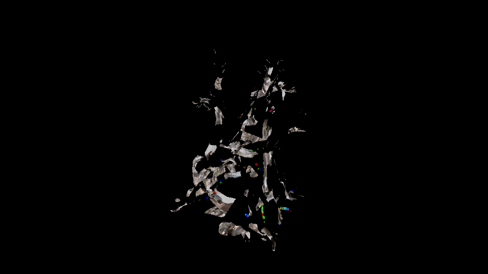

# `samples/05b-editor-window` — the artefact a person drives

> **The editor opens, and somebody uses it.** M5.5 task 4.1; **M7 tasks 5b.1 to 5b.7**.
>
> ```
> just run-editor-window                 # run it
> just run-editor-window --hold          # ... and leave the window open at the end
> just run-editor-window --shot docs/design/images/editor-viewport-engine-frame.png
> ```
>
> CTest entry: `smoke.editor_window`. Needs a display; **skips loudly** where there is none.
>
> On macOS, use the native Metal runtime and IOSurface editor transport documented in the root
> [README](../../README.md#building-and-running-the-metal-editor-on-macos).


**That picture is M7's exit criterion.** The 3D world in the viewport is the ENGINE's — rendered by
`cy::sample::first_light::Renderer` through the render graph on a Vulkan device, in another process,
and imported by the editor as a dma-buf without a copy. The transform gizmo on the selected box is
the engine's too: its handles come from `cy::render::build_gizmo_layout`, the engine draws exactly
those handles into the frame and publishes exactly those handles to the editor, and the editor
hit-tests what it was sent. Until M7 the viewport showed a magenta test pattern from a fixture in
the editor's own Cargo workspace.

## Authoring an empty scene with an FBX

Open or create a `.cyworld` in the editor. Drop an FBX from Finder or the file manager into the
editor window. The external import stages the FBX and companion textures in the project, cooks the
mesh, and adds its mesh instance to the open world. Select the instance in the hierarchy or viewport,
use the Move, Rotate, and Scale gizmo modes, then save the world. The runtime reads the same world
transactions and shows the cooked geometry with its full node transform on the next frame.
For a new empty world, the editor sends the current unsaved world when import first adds component
declarations. The runtime can therefore resolve the new mesh and material fields immediately;
subsequent transforms continue through the ordinary transaction stream.

The authored viewport uses `FrameAssembly` and `FrameRecorder` on Metal or Vulkan. It reads `.cyprim`
sources and imported cooked mesh identities, uses mesh section material assignments, and derives
picking and camera framing from the transformed mesh bounds. An empty world starts with no fixture
boxes. Missing cooked assets are reported by identity. Embedded and external FBX base-colour images
are cooked as texture sub-assets and resolved through the material's stable asset identity. Metal
binds the cooked texture in the frame's sampled texture table. The editor preview adds neutral fill
light so the material remains legible in a scene without authored lighting.

| Blender reference | Engine Metal capture |
| --- | --- |
|  |  |

Both images use the same tree FBX from issue #13. The engine image is a device capture of a scene
containing only that object; Blender uses separate studio lighting and a slightly closer camera.
The bark pattern and mesh silhouette agree. FBX image UVs are converted to the renderer's top-origin
coordinates, and Metal transfers BC7 textures using compressed-block row strides.

The [live editor capture](../../docs/design/images/editor-live-textured-fbx-metal.png) shows the
same imported tree selected in an authored world, with its mesh and material identities visible in
the Inspector and the engine's Metal viewport showing the cooked texture.

The [MCP import capture](../../docs/design/images/editor-mcp-import-reopened-metal.png) shows the
tree after MCP placement and Move, Rotate, and Scale, followed by saving and reopening the world.
The [live MCP capture before saving](../../docs/design/images/editor-mcp-live-fbx-before-save-metal.png)
shows the textured tree and its edited transform while the on-disk world was still the empty
`cyworld 1` file. That scripted session placed the FBX twice, once automatically after external
import and once through an explicit MCP `asset.import` call.

The Metal pixel regressions are `smoke.editor_authored_frame_metal` and
`render.pipeline_metal`; they cover empty-to-mesh rendering and substitution of a material texture
in the engine's forward frame.

## Material Graph cube

Open `project/worlds/material-graph.cyworld` to see a Plane, a Cube, a directional light,
and a Camera. The Cube's `MeshRenderer.material` references
`project/materials/copper_clay.cygraph`, which the engine authored from the four-node
`copper_clay.cymatcanvas` source: a `float3` color constant feeds Diffuse, a scalar
one feeds Diffuse weight and Output opacity, and Diffuse feeds Output surface. Select **Graph Cube**, switch to **Material
Graph**, and click **Open graph** to see and edit those nodes and links. **Validate** and
**Compile** send the visible graph to the engine material service.

To regenerate the canonical material after editing the canvas source outside the editor,
run `cy_material author project/materials/copper_clay.cymatcanvas --graph
project/materials/copper_clay.cygraph` from this sample directory. The current editor
panel compiles edits for preview but does not save `.cygraph` files. The authored scene
renderer currently resolves constant-color Diffuse graphs with opaque output to its
standard material path; other graph shapes report an unsupported-material error.

The [live scene capture](../../docs/design/images/editor-material-graph-scene-metal.png)
shows the graph-colored Cube and its shadow on the Plane. The
[node capture](../../docs/design/images/editor-material-graph-nodes-metal.png) shows the
reopened four-node source and a successful engine compile.

## Swift cube during Play

Open `project/worlds/spinning-cube.cyworld` for a self-contained Plane, tinted cube, light, and
Camera. `project/game/SpinCube.swift` registers the `SpinCube` behaviour; the cube's
`ScriptBehaviour.class` field attaches it to that node. Run **Project → Build**, wait for the Swift
module build to finish, then press Play. The behaviour rotates the cube 45 degrees per second
around local Z on fixed ticks. Pause holds its angle; Stop restores the saved identity rotation.
Select the cube and click the arrow beside `ScriptBehaviour.class` in the Inspector to open
`SpinCube.swift` in the editor's Swift Workspace.
The cube's `degreesPerSecond` property appears below `ScriptBehaviour.class` in the Inspector.
Changing it writes an authored per-object value to the world; save the scene and press Play again
to apply that speed to the Swift behaviour. The sample starts at 45 degrees per second.
The [export Inspector capture](../../docs/design/images/editor-script-export-inspector.png)
shows the authored value beside its Swift declaration. For another behaviour, declare a matching
field on its authored `ScriptBehaviour` component with the same name and value kind as the Swift
`@Export` property; the hosted runtime applies authored scalar and text fields on Play.
The workspace colors Swift syntax and the sample's `Package.swift` gives SourceKit-LSP the
`CyberdyneKit` dependency for diagnostics. Save edited source, then choose **Build**. A successful
build automatically reloads the running Play session. **Reload Module** can also reapply the latest
successful build explicitly. The reload status reports success or a reason for refusal. Stop and
Play again also loads the newest successful build.
The Swift source list shows project scripts and hides SwiftPM's `.build` checkout and generated
package files. The code area grows with the Swift Workspace panel while keeping diagnostics below it.
The runtime refuses Play with a specific message if the scene names a script but no built module
exists. Audio remains unavailable in this sample host.
Stop older sample runtimes when switching projects: each active host continues rendering even
without an attached editor and can delay the visible viewport on the same GPU.

The same cube sits beside the imported tree in the live issue #13 demo at
`/tmp/cy-editor-scene-view-demo/worlds/main.cyworld`. The source FBX and cooked assets remain in
that local project. Captures show the [authored cube beside the tree](../../docs/design/images/editor-spincube-tree-edit-metal.png)
and [the cube rotated by its Swift behaviour](../../docs/design/images/editor-spincube-tree-playing-metal.png).
`smoke.editor_script_runtime` runs the built Swift module against an authored cube and checks
rotation, Pause, and exact restoration on Stop.

## Why this artefact exists

M5 closed on a scripted session, and `implement-m5b-operable/proposal.md` says plainly why that was
not enough: *"A Python script driving command objects does not exercise docking or keyboard-first
operation through the entry points a user would use."* This is the artefact that does.

Two processes and a real X11 session:

| | |
|---|---|
| `cy_editor_window_runtime` | **the engine.** M3's scene and renderer on a real Vulkan device, publishing over the viewport transport (`src/backends/viewport/`) and answering the editor's gizmo intents and transactions over the editor bridge (`src/runtime/editor_bridge/`). Until M7 this was `cy-viewport-publisher`, a fixture in the editor's Cargo workspace that cleared an image to a colour and moved a white bar. |
| `cyberdyne-editor` | the editor, with a window, opened on `project/` and attached to that runtime with `--host`. |
| `window.py` | this driver, which operates that window through **XTEST**: synthesised key presses and pointer drags delivered to the X server rather than to the application. |

Nothing here is a test hook. The editor cannot tell this driver from a hand on a keyboard, which is
exactly the property M5's artefact could not have.

## What it does, act by act

| Act | What is driven | What is asserted |
|---|---|---|
| 1 · open | the window maps and the transport connects | the viewport's pixels are **saturated**, which the editor's own charcoal chrome never is — so those pixels came out of another process's GPU allocation. The outliner draws the three entities `project/worlds/city.cyworld` declares. The journal is empty. |
| 2 · author | `Ctrl+Shift+N` three times, then a click on an outliner row | three journal records, three more outliner rows, and a selection |
| 3 · manipulate | the toolbar's **Move**, then a pointer drag **from the handle the engine published** | the engine answered with a layout; the X arrow it *drew* is within a handful of pixels of where the layout *says* it is; the drag commits exactly one transaction; the object **moves in the engine's world**, read out of the engine's own next answer; and the undo puts it back to within a pixel |
| 4 · undo | `Ctrl+Z`, `Ctrl+Shift+Z`, then `Ctrl+P`, typing, `Escape` | the outliner loses a row and gets it back; the journal stays at three records, which is what an append-only record of *commits* should do; the palette **covers the viewport** — a charcoal surface over another process's saturated frame, which is a colour question with an unambiguous answer — and `Escape` uncovers it |
| 5 · save | `Ctrl+S` | the journal goes from three records to zero — `file.save` discards it only after the write. Then a **second, headless editor** opens the same document over the same journal and is offered no recovery. |

## How a window is observed

Three observables, and none of them is "it did not crash".

1. **The journal.** `--journal <dir>` makes every committed transaction a length-prefixed record in
   `<document>.cyjournal`, appended and flushed on commit. This driver parses that file itself
   rather than asking the editor, because an observable the editor computed would only be the editor
   agreeing with itself.
2. **The outliner's rows.** Undo and redo do not touch the journal, correctly. So they are observed
   where a person observes them — by counting the bands the outliner draws. A count of drawn rows
   rather than a reading of text: it needs no font, no interface scale and no locale.
3. **The viewport's pixels.** `editor-visual-language` requires the chrome to be dark and neutral.
   The publisher's frame is not. "The viewport region is saturated" is therefore a claim no
   toolkit-drawn approximation could satisfy, and it is task 2.1 photographed rather than asserted.

## Every wait is a deadline

There is not one `sleep` in this driver that stands in for a result. A window answers a key press
when its next frame runs, and on a loaded machine that is not a fixed number of milliseconds. Two
agents on this milestone reported exactly that shape of flake in their own suites, so:

* `until(predicate, seconds)` is the only wait;
* focus is **waited for and re-asserted** against `_NET_ACTIVE_WINDOW` before anything is typed —
  a synthesised key press goes wherever the server thinks focus is, and assuming it is here is both
  a wrong result and a rude one;
* every load-bearing key press goes through `press_for`, which re-sends it **only while nothing
  has changed** — never on a timer. An X server drops nothing, but a window that is not yet
  focused or has not run a frame can miss a press, and a driver that pressed `Ctrl+Z` twice because
  the first press was merely *slow* would undo two things and report a wrong result rather than a
  flake. The three `Ctrl+Shift+N` presses are counted, and the final journal count is asserted to be
  exactly three, so a doubled press fails loudly instead of being absorbed;
* the outliner is polled from **its own rectangle** rather than from a full window capture, because
  a full 1600×950 read per poll is most of what such a loop costs — which is how a deadline that is
  generous in seconds becomes a deadline of four attempts on a machine that is also running a
  compiler.

Verified: four consecutive green runs with six CPU-saturating processes alongside.

**It takes the keyboard while it runs.** The driver activates the editor's window and types into it,
so on a desktop session it will pull focus for the twenty seconds it lasts. `smoke.editor_window` is
declared `RUN_SERIAL` for the same reason — two of these at once would type into each other.

## The act that did not close, and how it closed

At M5.5 and again at M6 this artefact reported, on every run:

> `GAP   the gizmo drag — the drag committed nothing`

and **returned 0**. Two separate defects, and the second is the worse one.

The drag itself failed because every piece of the path existed and no two of them were joined.
`cy_editor_viewport::layout` hit-tested a published layout, `cy_editor_protocol` carried
`GizmoIntent` and `GizmoGeometry`, `cy_editor_services::gizmo` encoded the intent and decoded the
answer — and nothing in `src/` produced a layout, so there was no handle at any coordinate. M6's
artefact then dragged from a hard-coded (47 %, 38 %) of the window, hoping one was there.

M7 closed it end to end:

* `src/servers/render/gizmo.{h,cpp}` produces the geometry — screen-constant, in the frame's own
  pixels, in the editor's encoding;
* `samples/05b-editor-window/runtime/` draws exactly those handles into the frame it publishes and
  answers the intent with exactly those handles, rescaled into the viewport's pixels;
* `cy_editor_services::RuntimeMirror` asks once a frame, refuses an answer for a frame nobody asked
  about, and forwards what the document commits and undoes so the engine's world keeps up;
* this driver reads the published layout out of `--layout <file>` and aims the drag at the **X
  arrow**, then checks that where it aimed and where the arrow is drawn are the same place.

And the second defect — a run that reported a gap and passed — is fixed where it belongs: in
`samples/harness/artefact.py`, whose `Report.exit_code` is **derived** from the recorded gaps. No
later artefact can repeat it without deleting that module. M7 tasks 5b.4 and 5b.5.

### And how it re-opened, found at M11.c

From 38e86ed the run reported `GAP the gizmo drag … committed nothing` again, and this time the
editor was not at fault. That change put the open-document strip under the toolbar and moved the
viewport's panel down 29 px, to (301, 120)–(1236, 661) in the 1600×950 window. `viewport_rect`
still held M7's proportions, so the drag was aimed 29 px above the X arrow and the editor correctly
treated the press as the start of a selection. Instrumenting the shell showed it directly: the
press arrived at viewport pixel (517, 267) and the published X arrow was at (516, 296).

The mapping check this README describes above should have caught it and could not: when
`handle_in_window` found no arrow colour near the mapped point it returned the mapped point, and
the drift check compared that point with itself. It now returns `None`, the act fails naming the
mapping, and `integration.editor_window_selftest` (`window.py --selftest`, no display needed) holds
both halves — a handle drawn where the mapping puts it is found, one drawn 29 px away is refused, and
`viewport_rect` puts the panel where the dock draws it.

Two more defects stood behind that one, and the corrected mapping exposed both:

* **The "selection by pointer" act was clicking a button.** It clicked a fixed 14.8 % down the
  window, which after 38e86ed is the outliner's "Create Empty Entity" button, and reported success
  without looking. The drag then moved the fourth entity that click created, and the undo check —
  which counts outliner rows against the count act 2 took — failed with "9 to 10 rows". `act_select`
  now aims at the first entity row it can see and requires the click to have selected it and
  changed nothing: same journal, same row count, and the row wearing the selection fill.
* **The runtime wedged on a busy disk.** It rewrote `--layout` on every published layout, and the
  rename over the previous file made ext4 flush the new one first — 0.14 to 0.55 s per rename on the
  render thread, measured under strace while other builds held the disk at 60 % full I/O pressure.
  The heartbeat stopped, the editor declared the runtime wedged, and no frame with a gizmo in it
  reached the window. `runtime/layout_file.{h,cpp}` now writes only when the geometry changed, and
  `integration.editor_window_layout_file` holds it.

## The keyboard, and what M6 concluded about it

M6 recorded that *"XTEST does not deliver synthesised key events in this X session"*, reproduced it
with a small python-xlib program, and planned around it. **That conclusion was wrong.**

It is the screensaver. A locked or blanked session holds an active keyboard *and* pointer grab, so
every synthesised event goes to the locker instead of the application — while the windows underneath
keep rendering, so a screenshot still comes back and everything looks fine. Measured here:
`grab_keyboard` on the root window answers `AlreadyGrabbed` while `cinnamon-screensaver` is active
and `Success` a second after `--deactivate`, and key events start arriving at the editor in the same
second. The symptom is intermittent by nature — it depends on how long the machine has been idle —
which is exactly why it was diagnosed as a property of XTEST.

So `window.py` now does two things it did not: it calls `wake_the_display()` before it drives
anything, and it *checks* with `keyboard_arrives()` rather than assuming. Where keys genuinely do
not arrive, the acts that need them report **not evaluated** — not passed and not failed
(`delivery-roadmap`, and `harness.artefact.Report.not_evaluated`) — and the pointer drives the rest,
including the drag, the selection and the toolbar's Undo, Redo and Save.

## Task 4.4 — the built editor against the reference imagery, and which one is right

`editor-visual-language` requires that *"a reference that no longer reflects the intended language
SHALL be replaced rather than left to decay"*, and that where a reference and the specification
disagree the specification wins. Here is every difference between
[`editor-window-m5b.png`](../../docs/design/images/editor-window-m5b.png) and the two references,
with a verdict.

| | reference | built | which is right |
|---|---|---|---|
| **Header mark** | `CYBERDYNE · ARTIFICIAL INTELLIGENCE`, large, far left | the CyberEngine horizontal lockup, small | **the implementation.** The product is CyberEngine and Cyberdyne is the publisher (task 1.5b). The references brand the publisher as the product, which is one of the four things `docs/design/editor-visual-language.md` already records as wrong. **The references should be replaced.** |
| **Header centre** | `DesertFrontier - RTSGame` | `worlds/city.cyworld · Scene · No runtime`, then a `no-runtime` pill | **the implementation.** Whether a runtime is attached is load-bearing from M5.5 onward and belongs where the eye already goes. |
| **Console tabs** | Output Log · Message Log · **Blueprint Log** | Console · Profiler · Problems | **the implementation.** "Blueprint" is another engine's product vocabulary — task 1.8's first item — and `cy-editor-interface`'s vocabulary gate rejects it. **The references should be replaced.** |
| **Performance overlay** | top-left, FPS / Frame / Draw / GPU / Mem | **bottom-left**, `Frame 0.00 ms` and the transport's counters | **the reference**, on position: `docs/design/editor-visual-language.md`'s own region table says "The performance overlay sits top-left". The implementation puts it bottom-left. The *content* is the implementation's — announced / skipped / timed out / wrong generation is what there is to say about a frame at M5.5 — but the corner should move. |
| **Orientation widget** | top-right, three axes, no rings, no boxes | top-right, three axes, no rings, no boxes | **they agree.** |
| **Toolbar** | icons: select mode, play, build, transform, snapping, viewport options | text: Move · Rotate · Scale · Universal, then Undo · Redo · Save | **the reference**, and the implementation is *thinner* rather than wrong: play, snapping and the viewport options are registered commands reachable from the menus and the palette, and are not in the toolbar. |
| **Outliner** | per-row visibility toggles at the right edge | none | **the implementation.** `NodeState` has no visibility field, and a toggle that did nothing would be worse than none. The specification's own scenario ("a reference does not gate a milestone") covers this. |
| **Inspector** | Transform · Unit · AI · Abilities · Rendering, with X red / Y green / Z blue vector fields | "The selection carries no described components" | **the implementation.** The inspector is generated from reflection and writes no rows by hand; with an empty schema and no runtime, nothing is described and saying so is the requirement rather than a shortfall. |
| **Selection** | a thin gold outline on the object in the viewport | a gold row in the outliner; no outline in the viewport | **correct by architecture, and it needs an engine.** The outline is drawn by the renderer, not by the editor — `editor-viewport-and-gizmos` forbids a second renderer — and there is no engine world to outline. |
| **Content browser** | rendered thumbnails per asset | a flat tile per item | **the reference**; thumbnail rendering is not built. Thinner, not wrong. |
| **Left tool rail** (adventure reference) | a vertical rail of mode-level tools | none | **the reference**; not built. |
| **Window controls** | drawn into the header | the system's own decorations | **the implementation** on this platform; the specification does not require client-side decorations, and drawing our own on X11 would cost more than it says. |

Two consequences follow, and only one of them is in this change:

* **What is right here is recorded here.** Three rows above say the references are wrong and why —
  the publisher branded as the product, another engine's vocabulary in the console, and a header that
  says nothing about the runtime.
* **The references themselves are not replaced in this change, and `docs/design/editor-visual-language.md`
  is not edited to point at the two new images.** That document and those reference files are not
  this change's to edit. Whoever owns them should: add
  `docs/design/images/editor-window-m5b.png` and `agent-authoring-m5b.png` to the document as
  *"what was actually built at M5.5"*, fold the three verdicts above into the four-things-not-to-copy
  section, and move the performance overlay to the top-left corner in `cy-editor-shell`.

## Two defects observed while driving it

* **Notification toasts cover the panel beneath them**, and their widths are ragged. Corrected after
  M5.5's gate looked: an earlier draft of this section reported that toasts overlap *each other* and
  that the text of both is unreadable, and that is not what happens — `notify.rs` stacks them in a
  vertical `Ui` with `add_space`, and the artefact's own captures show them stacked and individually
  legible. What they do is sit over the Console panel with right-aligned edges of differing width.
  Smaller than the original claim, and left here in its corrected form rather than deleted, because a
  defect report that overstates sends the next reader hunting for something that was never there.
  Visible in `build/<dir>/editor-window/shots/06-palette.png`.
* **Fixed at M7: the frame's age was measured on the wrong clock.** Every viewport in M5.5's and
  M6's screenshots carried *"The runtime has not produced a frame for 1788285426327 ms; this image
  is stale"* over an image that was arriving sixty times a second. That number is the Unix epoch in
  milliseconds: `panels::viewport::monotonic_micros` read `SystemTime::now()` while a frame's
  `produced_micros` comes from the runtime's `CLOCK_MONOTONIC`. The advisory
  `editor-viewport-and-gizmos` requires — "the editor SHALL surface when it is viewing a stale or
  degraded stream" — was therefore on permanently, which is the same as being off.
  `a_frames_age_is_measured_on_the_clock_the_announcement_carries` is the regression.
* **Fixed at M5.5's successor: the window draws the runtime's frames and the viewport model never learns that any arrived.**
  Clicking in the viewport says *"No frame has arrived yet, so there is nothing on screen to have
  clicked"* while the overlay a few centimetres away reads `announced 1016 · skipped 0`. It is not a
  wrong message, it is a missing edge: `cy-editor-shell::viewport_link` composites the imported
  texture and calls `session.set_view_state(...)`, but nothing ever pushes a
  `PresentedFrame` into `cy_editor_viewport::Viewport`'s stream — the shell calls `Viewport::pump`
  nowhere. So `Viewport::pick` returns `None`, `interaction_view()` falls back to the editor's own
  requested state rather than the state the frame was rendered with, and the published gizmo layout
  has nothing to arrive on. Everything downstream of "what frame is on screen" is dark while the
  screen is full of frames. `ViewportSession` already implements `Transport`, so the fix is one
  `viewport.pump(&mut session, now)` per frame in `ViewportLink::begin_frame`.

Neither is in this artefact's files.

## What is in this directory

| | |
|---|---|
| `window.py` | the artefact |
| `runtime/` | **the engine on the far end of the transport.** M3's scene and renderer, the viewport publisher, the editor bridge, the gizmo geometry, the CPU compositor that draws it into the frame, and — since M8.a — the editor's own world |
| `one_world.py` | the M8.a probe: it speaks the editor's protocol to the runtime, creates an object, asks where the gizmo is and picks it there |
| `project/` | a project with a world in it — three entities in `worlds/city.cyworld`, written by the engine's own authoring schema. Copied into the work directory on every run, so a run never edits it |
| `CMakeLists.txt` | the CTest entry, and why the runtime is declared before the `CY_BUILD_TESTS` guard |

## One world — what M8.a changed here

The three bullets this section used to hold were the three things the runtime could not do, and all
three were the same thing: it held its own scene rather than the editor's world. It holds the world
now.

    cy_editor_window_runtime --project samples/05b-editor-window/project \
                             --world worlds/city.cyworld --host /tmp/c.sock

`runtime/world_view.h` opens **the same `.cyworld` the editor opens** through
`cy::scene::serialization::read_world`, and the file's nodes are written into the scene's object
slots every frame. So:

* **An identity names a node, not the next unused object.** `runtime/session.h`, whose own header
  called itself a stand-in, is gone. A node's identity is derived here the way `cy_editor_core::ids`
  derives it — an FNV-1a-128 of the document's asset path and the node's ordinal — so the object the
  editor selects is the object the gizmo lands on, and an identity from another document names
  nothing rather than something.
* **A create creates and a scale scales.** The editor's operation stream is applied by
  `cy::scene::serialization::apply_transaction`, and the field identifiers in it are the ones the
  world file's own `type` section declared. There is no gizmo-mode guess left.
* **A pick is answered.** `WorldView::publish` writes a `GpuInstance` and a `DrawItem` per drawn
  object out of the same placement the frame was drawn from, and `runtime/pick_wire.cpp` decodes the
  editor's `PickRequest` and encodes the answer `cy::render::pick_ray` produced.

`one_world.py` drives all three against a running runtime over the editor's own protocol, and is
the measurement rather than the assertion:

```
editor-window-runtime: world     4 node(s) presented, 0 overflowed the 64 slots; 1 transaction(s), 2 field(s) applied, 1 created, 0 deleted
editor-window-runtime: same-frame 1 change(s) measured, worst 0 frame(s) and 1338 us from commit to the frame that carried it
editor-window-runtime: picking   2 answered, 1 candidate(s) reported
  gizmo_centre: (320.0, 180.0)
  candidates: [('0d583fb848ef21ba', 11.03)]
```

`0d583fb848ef21ba` is the low half of `NodeId::in_document(DocumentId::of_asset(
"worlds/city.cyworld"), 4)` — the fourth node of that document, which is the one the driver created
and which the runtime had never heard of when it started.

## What the runtime is still a stand-in for

* **The frame reaches the shared image through host memory.** The engine renders on the RHI's device
  and the publisher owns its own, so the frame is read back and uploaded — 106 µs a frame at
  1280x720, measured. `src/backends/viewport/README.md` says what would remove it.
