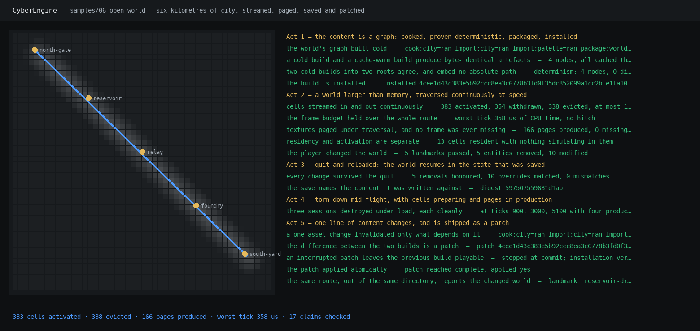

# `samples/06-open-world` — the M6 artefact



*Six kilometres of city, the fixed route across it, and every claim the run checked.*

```
just run-open-world                          # all five acts, the whole route
just run-open-world --only patch             # one act
just run-open-world --ticks 1800             # a shorter route, which is what CTest runs
just run-open-world --shot docs/design/images/open-world-m6.png    # refresh the picture
just test-smoke -R open_world                # the same thing, as a test
```

## What it claims, and where each claim is checked

M6's row in [the roadmap](../../docs/ROADMAP.md) is *"a world larger than memory, and a build that is
a graph rather than a script"*, and its closing artefact is one sentence with five acts in it. Every
one of them is checked against what the two programs printed, and a claim that does not hold **fails
the run** — there is no act here that reports a gap.

| Act | The claim | How the driver knows |
|---|---|---|
| 1 · ship | The content is a graph, and a cold build and a cache-warm build produce byte-identical artefacts | Four nodes; the second build is four cache hits and the two package manifests are compared byte for byte; `cy_build determinism` builds twice into two roots and greps the artefacts for absolute paths |
| 2 · play | A world larger than memory, traversed continuously at speed, with textures paging and the frame budget holding | Cells activated, withdrawn and **evicted** while at most a few per cent of the world is resident; every tick's CPU time against a threshold; pages produced with **zero missing samples**; cells resident with nothing simulating in them |
| 3 · resume | Saved, quit, reloaded, and resumed in the same state | A second process loads the save, reactivates exactly the cells it holds state for, and matches every removal and every override against the live world |
| 4 · teardown | A session can be destroyed mid-flight | Three runs aborted at three points of the route with four production workers, each required to exit cleanly |
| 5 · patch | A content change is cooked, packaged and shipped as a patch | The derivation key of the node that does not read the change **does not move** and the three that do **all move**; the patch is produced, an interrupted application leaves the previous build verifiable, the real one applies, and the same route reports the changed world |

## The two programs, and why there are two

`cy_sample_open-world` is the game. It is a real program that streams a real world: it reads its
content **out of an installation, by logical name**, cooks 2,304 cells from it, drives
`cy::world::WorldStreaming` along a fixed route with `cy::render::vt::VirtualTextureSystem` paging
two textures under `cy::residency::ResidencyServer`, records what the player changed in the
persistence overlay, and writes it through `cy::save::SaveArchive`.

`openworld.py` is everything around it that is not one process: `cy_build` running the graph,
producing the package, installing it, diffing two builds into a patch and applying it, and the game
started three times over the same installation directory. M5's and M5.5's artefacts are drivers for
the same reason — what is being demonstrated is a relationship between processes, and a C++ program
that pretended to be all of them would be demonstrating itself.

**The game cannot tell where its bytes came from**, which is the whole of act 5.
`build::Installation::read("world/city.cells")` resolves a logical name through the manifest in
force; after the patch the same name resolves to a different digest and the same route reports a
different world, with nothing in the game changed.

## The world is a description, not data

`project/world/*.cyopenworld` holds numbers — extent, cell size, seed, props per cell, a prop
palette and five landmarks — and `content.cpp` cooks the cells from them, deterministically in the
seed and in nothing else. Six kilometres of city at 128 m cells is 2,304 cells and 92,165 persistent
entities; a repository carrying those would be measuring git rather than the engine.

The two source files are separate on purpose. The cooked stream is their concatenation, so editing
one of them must rebuild exactly the derivations that read it and leave the other's import in the
cache — which is what act 5 measures, in the outcome column of a build report a person can read.

## Three things this artefact is deliberately honest about

* **The budgets measure three different things, and the entity budget is small.**
  `entity_memory_bytes` counts the **staged ECS rows only** — 41 rows of 36 bytes is under two
  kilobytes per cell — so sixty-four kilobytes is about thirty-five cells and the route evicts
  continuously. The first draft of this sample set it to megabytes, evicted nothing all run, and
  reported success. The cell payloads are charged to the I/O budget instead, which is where the
  tens of megabytes the route reads come from.
* **There are two overlay models in this tree and this program meets both.**
  `cy::world::PersistenceOverlay` holds raw component bytes addressed by a runtime component index;
  `cy::save::Overlay` holds per-field value records addressed by `reflect::TypeId`. `run.cpp`
  converts between them and says so at the point it does it. That conversion is the honest cost of
  the duplication, not a design: `src/save/README.md` carries the recommended resolution.
* **Nothing here is on a GPU.** The virtual texturing is the address spaces, the page tables, the
  caches, the feedback path and the producers; the device side is M7's. That is why this artefact
  runs in continuous integration, and why the picture above is a map rather than a screenshot.

## What is in this directory

| | |
|---|---|
| `main.cpp` | the command line and the three acts a single process can do: `traverse`, `resume`, `report` |
| `content.h` / `content.cpp` | the `cyopenworld 1` stream, the four components, and the cell cook |
| `run.h` / `run.cpp` | the session: streaming, paging, the route, the save and the resume |
| `openworld.py` | the five acts, the checks, and the committed picture |
| `project/` | the world's description and its `cybuild 1` derivation graph |
| `CMakeLists.txt` | the target, and the CTest entry that runs the whole artefact on a shorter route |

## Which of these numbers is a measurement, and which is one sample

Re-measured four times on a machine verified empty — no compiler, no test runner, nothing else of
this project's alive — immediately after M6 closed:

| Run | median | p99 | worst | hitches |
|---|---:|---:|---:|---:|
| 1 | 166.5 us | 195.4 us | 392.2 us | 0 |
| 2 | 166.9 us | 211.2 us | 376.1 us | 0 |
| 3 | 166.7 us | 188.8 us | 371.3 us | 0 |
| 4 | 166.3 us | 191.6 us | 365.9 us | 0 |

**The median is stable to ±0.3 us across runs. The worst tick moves over 26 us, and every quiet run
is WORSE than the 358 us this artefact printed when the milestone closed.** So the figure most
likely to be quoted is the least reproducible one, and the run that produced the headline was the
most favourable sample rather than the cleanest.

Quote the median and the p99. The worst tick is worth printing — a hitch has to show up somewhere —
but it is a single extreme, not a figure to compare across builds.

The counters do not move at all: 383 activated, 354 withdrawn, 338 evicted, 166 pages, 0 missing
samples, 13 cells resident with nothing simulating in them, in every run. That is why
`m6.toml`'s `continuous-traversal` criterion asserts *identical counters across two runs* and not a
time — "which is what makes the timing a measurement of the code rather than of the machine", in its
own words. That criterion was written correctly; this note exists so the printed output is read the
same way.

Prompted by the ClaySpaceDesktop session on this machine, which found two of its own figures taken
under load — 106 ms and 108 ms — re-measuring clean at 32.53 ms and 171.79 ms. One fell, one rose 60
per cent. Contention does not inflate a number predictably; it makes it not a number.
