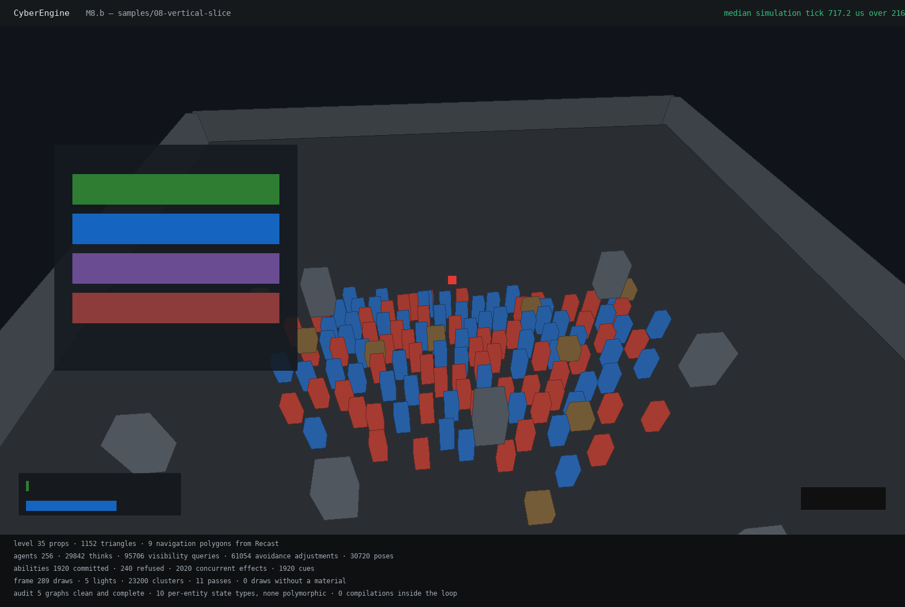

# samples/08-vertical-slice — the M8.b artefact

*A playable game: a level, characters that animate and think, abilities with effects, a heads-up
interface, sound and a 2D menu — every one of them the engine's real module, driven in one tick.*

```
just run-vertical-slice                     # build, play, measure, and draw the picture
just run-sample vertical-slice --agents 512 # the program alone
ctest --test-dir <build> -R smoke.vertical_slice
```



## What is here

| | |
|---|---|
| `cy_sample_vertical-slice` | the game. `main.cpp` reads a command line and prints `key = value`; `slice.cpp` builds the level; `systems.cpp` authors and compiles the graphs and musters the characters; `tick.cpp` is the loop, the audit and the projection; `presentation.cpp` is the interface, the menu, the sound and the assembled frame. |
| `slice.py` | the driver. Four acts, every claim the program printed checked, the picture drawn from the frame's own draw list. It reports through `samples/harness/artefact.py`, so a recorded gap cannot exit zero and an extreme value cannot be the headline. |

The target's dependency list is the point. Before this directory `cy::rendering-assembly`,
`cy::animation`, `cy::ai`, `cy::navigation`, `cy::ui`, `cy::audio-acoustics`, `cy::camera`,
`cy::rendering2d`, `cy::gameplay-abilities` and `cy::graph` were each reachable only from their own
test binaries. M7's closing gate said of eight rendering modules that they were "linked by nothing
but their own test binaries"; this is the line that removes that sentence.

## The tick, in the order it runs

```
think     AiRuntime::update_tiers → PerceptionScheduler::update → AiRuntime::think
navigate  find_path over the navmesh · Crowd::set_desired_velocity · Crowd::step · integrate
animate   AnimationBatch::advance_all (deterministic) → evaluate_range (skippable)
act       ActivationPipeline::activate ×N → EffectSystem::advance → the objective script
present   cy::ui layout/flatten/audit · rendering2d::build_batches · audio tiers and music
frame     SnapshotExtractor → SceneIndex::apply → FrameAssembly::assemble
```

Nothing in that list is interpreted. Five graphs are authored with `cy::graph::Graph` and compiled
once, before the loop: the objective script and the ability program by `cy::graph::script`, the pose
program by `cy::graph::pose`, the behaviour program by `cy::graph::behaviour`, and the camera rig by
`cy::graph::camera` on the shared expression core. `Slice::audit()` is what says so — see below.

## The five things this artefact is asked to prove, and how each is checked

**1. No graph is interpreted at runtime.** `InterpretationAudit` is three independent checks and
each can fail on its own: every authored graph audits clean **and complete** (`AuditReport::complete`
is a third answer beside pass and fail, and a gate that read `missing` alone would go green the day
a plugin failed to load); no compilation happens inside the loop, counted by the slice's own compile
calls and read before and after it; and no per-entity state type of any consumer is polymorphic,
which is `std::is_polymorphic_v` over the ten state types, reported per type rather than as one
boolean. `--interpret-control` is the negative control: it puts an object with a virtual `tick()` in
the loop, the audit finds it by name, and the program exits non-zero. Act 4 passes only when that
run **fails**.

**2. Cost is bounded by configuration.** The scale act runs 8,000 agents and 2,000 agents and
compares them. Every declared budget (`Budgets` in `slice.h`, printed by the program so the driver
compares a measurement against the source rather than against a number copied into a script) must
hold, **and** the cost per agent at four times the population must be within the declared linearity
factor. The second is the one that means something: a budget alone measures the host, and a
linearity factor catches a quadratic on any machine.

What does the bounding is the AI LOD policy, and the artefact prints the distribution so a reader
can see which dial did it. Two configuration decisions are load-bearing and are argued at their
lines: the tier distances are written for **this** arena rather than left at the default written for
a world tens of kilometres across, and the arena's size scales with the population so that the
density is constant — eight thousand characters in a 48 m square is 0.29 m² each, which is closer
than they can physically stand, and every neighbour query would then be measuring the overcrowding.

**3. Determinism.** Two slices in one process (`--replay`), and two processes. Both fold the same
digest: every character's quantised placement each tick, the AI's per-tick state hash, the effect
system's digest, the attribute store's digest and every activation identity.

**4. An authored mesh reaches a renderer.** M8.a's photograph showed an authored sphere as a box
because `MeshRenderer` had no reflected type and no reference ever became a handle. Here the chain
runs end to end: the component is reflected (task 11.3's first half), `bind_render_assets` resolves
its reference against the level's own mesh table (the second half), the extract stage publishes the
handle, and a surface query resolves each draw through `SceneIndex::surface_of`. The picture's
colours are the **material slot the frame resolved**, read back out of the scene index — which is
why the two teams are two colours over one mesh.

**5. The interface holds its budget and passes its accessibility audit.** `cy::ui`'s own
`audit_accessibility`, over the one interactive element, with no finding.

## Why the picture is drawn and not captured

`FrameAssembly` hands a pass's record callback to its **caller** — "it does not own the shaders or
the pipelines" — and this sample supplies none, so there is no swapchain to photograph. Writing one
would mean a second renderer beside `samples/03-first-light`'s, with its own shaders, its own
pipelines and its own drift.

What is committed instead is the frame's own answer, drawn. Every shape in the picture is one item
of the **sorted draw list** the assembly produced; its bounds are the spatial index's; its
silhouette is the mesh handle `surface_of(slot)` published — the one `bind_render_assets` resolved,
looked up in the level's mesh table, **not** in the sample's record of what it authored; its colour
is the material slot, read back the same way; and its corners were projected by `projection * view`
in C++, by `cy::Mat4`, before `slice.py` saw them.

That distinction was a finding of M8.b's closing gate rather than a design: `kind_of` searched the
level's own `props` array for the entity and answered the kind this sample had authored, which
draws the same picture whatever the renderer resolved — and would have drawn M8.a's
sphere-as-a-box correctly while the defect was still there. Breaking `resolve_mesh` to answer one
handle for every reference now collapses every silhouette in the picture to the ground mesh, and
`the frame names as many distinct meshes as the level interned` goes red; before the gate, both
stayed green. The heads-up interface is `cy::ui`'s own flattened primitives and the menu is
`cy::rendering2d`'s own batched instances. Nothing in the driver re-derives what is on screen; it
reads a file the program wrote and paints it.

## The seams M8.c attaches to

**M8.c extends this slice rather than building a second one**, so the two things it adds have
somewhere to attach. Both seams exist today and neither is a placeholder.

| M8.c's | attaches at | what it consumes |
|---|---|---|
| `vfx-system` | `ActivationPipeline::cues()` | The activation pipeline already emits a cue per committed activation, carrying (activation identity, cue tag, simulation point). `tick.cpp`'s `act()` counts them; a particle system reads them instead. A cue is suppressed by (activation, cue, simulation point), so a re-simulation must pass the recorded identity in `ActivationRequest::identity` — that is what lets the ledger recognise a repeat, and it is the constraint a particle system inherits. |
| `vfx-system`, on the render side | `FrameSinks::passes[...]` and `SceneIndex` | The frame is assembled with a `FrameSinks` whose surface query is supplied and whose pass callbacks are not. A particle pass is one more callback in that array plus one more entry in the spatial index; nothing in `presentation.cpp` changes shape. |
| `sequencing-and-cinematics` | `ViewState` in `tick.cpp` and `brain.rig_output` | The camera is a compiled rig program evaluated every tick with its inputs named. A sequence drives cameras by supplying those inputs, which is that specification's own "a sequence does not write camera transforms". |
| `sequencing-and-cinematics`, for gameplay | `kit.phases` and the objective script | Authoritative change is ordered commands. `PhaseController::enter` and `cy::graph::script`'s host interface are the two places a timeline would issue them, and both already refuse what they are meant to refuse. |

## Findings this artefact measured, in files it does not own

Each was found by running and each is reproduced by a command. The first was CLOSED at the closing
gate, in the module that owns it, with a regression test; the other three are open, and none of them
is fixed here because the file belongs to another module.

**1. `ScriptProgram::digest()` was not reproducible across processes — FOUND HERE, FIXED AT THE
GATE.** `finish_digest` (`src/graph/src/lower_script.cpp`) hashed each constant as raw bytes —
`hash_bytes(digest, &constant, sizeof(constant))` — and `script::Value` is 32 bytes of which four
are padding between `z` and `handle` that no member initialiser touches. Three runs of the same
graph gave three digests. A probe run inside this sample settled the cause and a byte dump settled
it beyond argument: bytes 20 and 21 of every constant held a fragment of a spilled stack address,
so they moved with address-space layout — which is why the same run reproduced under
`--profile release` and not under `--profile dev`, the shape of an indeterminate value rather than
of a logic error. This is a cook key and the back-end selection key `visual-scripting` requires to
be stable, so it reached further than this artefact.

`src/graph/` now hashes the five fields through `script::hash_constant`, and
`src/graph/tests/test_lowering.cpp` carries the regression: it compares the program's own digest
against the same sum recomputed field by field, having first asserted that the padding really is
dirty, so a return to hashing the object fails on this tree every time. Restoring the old line was
run and the case went red. `sizeof(Immediate)` in `src/graph/include/cy/graph/expr.h` gained a
`static_assert` beside the three places that still hash a struct as bytes, because that layout is
flat today and nothing was stopping it from not being.

**2. `Crowd::rebuild_grid` is O(agents × occupied cells).** Its comment says the cell lookup is
"O(1) in the common one because agents arrive in position order", and the scan restarts from the
beginning of the cell table every time, so an agent in the last cell scans every cell before it.
Measured on this machine at 8,000 agents over a 179 m arena: **72 ms a tick with 2 m cells and 9 ms
with 11 m cells**, the whole difference being the scan. `crowd_cell_size()` in `internals.h`
chooses the cell that minimises the sum of the two costs and says why; a hash of the cell key would
make the build linear and make that function unnecessary.

**3. `PerceptionScheduler`'s broad phase has no spatial index.** Its header describes step 2 as
"broad-phase by declared filter — faction, range, layer — **over a spatial grid**"; `gather()` loops
every target for every due observer, and `build_batch` then scans the queries already built for each
request, so the cost is (due observers × targets × queries built). At 8,000 agents with the default
20 m sight range in a 48 m arena that was 140 ms a tick. It is bounded here by configuration — a
crowd member sees nine metres, and only the squad is registered as a perception target, which is
`PerceptionTarget`'s own "what is perceivable is a gameplay question" — but the shape is worth
closing.

**4. `ThinkReport::starved` counts an agent promoted out of a coarse tier.** Starvation is measured
as `tick > last_think_tick + tier_think_interval(current tier)`, and a `Statistical` agent is
skipped entirely so its `last_think_tick` goes stale. When the LOD policy promotes it, it is
reported starved for as long as the stale timestamp lasts, although it thought exactly when its tier
said it should. `ai-system` says "zero is the requirement; a gate reads this and nothing else", so
the definition matters: measuring against the interval the agent was AT when it last thought would
report what the requirement means.

## What is deliberately not here

No cinematic and no particles — M8.c's, and the seams above are where they attach. No physics
solver: the level is static geometry and the characters are steered by the crowd, which is what
`navigation`'s own "this is a stand-in for the character controller" note describes; `physics`
closed at M8.a and a body per character would be measuring Jolt rather than this milestone. No
recorded render pass: see "why the picture is drawn and not captured".
