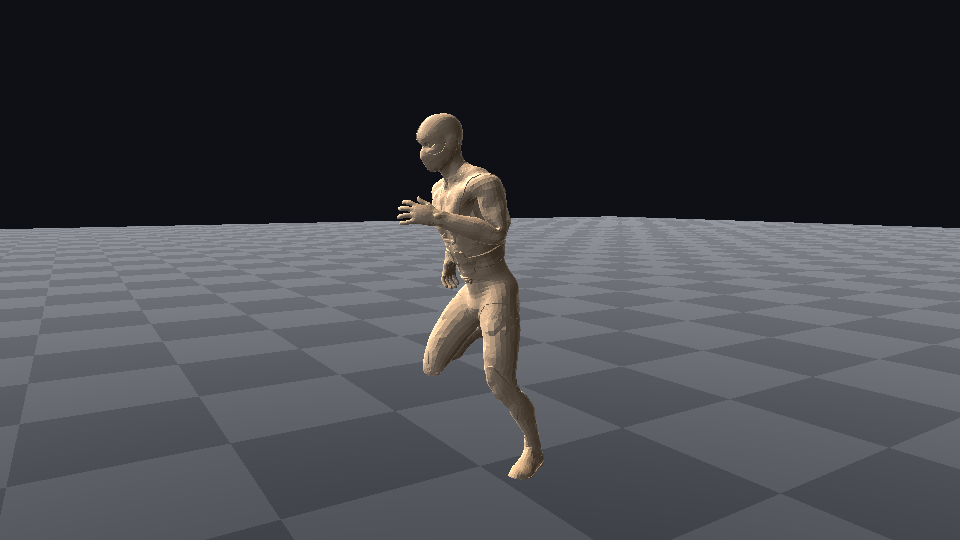

# `samples/09b-animated-character` — four Mixamo files, one character, one video

M8.d's artefact. It imports four FBX exports, retargets three of their clips onto the rig that came
with the fourth, compiles a four-state locomotion machine over them, evaluates a pose at a fixed
timestep, publishes it into the GPU pose world, skins the character with the compute dispatch that
reads it, and writes one PNG per frame.



The still is one frame. **The claim is the motion**, and a single frame of a skinned character is
indistinguishable from a single frame of a posed one, so the artefact the milestone commits is the
video: `docs/design/videos/animated-character.mp4` — thirteen seconds, idle to walk to run to a
death, at 30 frames per second.

```
just capture-animated-character --sources <directory holding the four .fbx files>
```

## What it actually demonstrates

| Link | Where it lives | What this program does with it |
|---|---|---|
| FBX → skeleton | `tools/import/` step 7 | 65 joints, 22 of 22 humanoid slots mapped, from each of the four files |
| FBX → clip | `tools/import/` step 8 | one clip per file, 0.63 s to 9.93 s, quantised by the engine's own codec |
| rig → rig | `cy/animation/retarget_build.h` | the three animation-only rigs disagree with the mesh's rig by up to **29.89°** at rest; `build_retarget_profile` pairs all 65 joints and `bake_clip` absorbs the difference |
| clips → machine | `cy/graph/locomotion.h` | four states, seven transitions, compiled by `compile_pose` |
| machine → pose | `cy/animation/evaluate.h` | `advance` then `evaluate`, fixed step, no wall clock |
| pose → matrices | `cy/animation/pose_world.h` | `publish_pose`, double buffered; the offset alternates every frame |
| matrices → vertices | `cy/rendering/skinning/` | a compute dispatch, on the device |
| vertices → pixels | this directory | the dispatch's output buffer bound as vertex buffer 0 |

Nothing on the CPU writes the vertices that appear in the picture. `SkinPass::upload_mesh` writes the
bind pose into a separate input buffer; the buffer the draw binds is device-local, written only by
`skin.slang` and read only by a vertex fetch. The barrier between the dispatch and the draw is
derived by the render graph, with synchronisation validation on and its error count reported.

## What it does NOT demonstrate — read this before quoting the video

**The skin weights are not the artist's.** `tools/import/`'s `MeshData` has no joint-index or
joint-weight arrays and `write_cooked_mesh` has no attribute bit for them, so the cooked mesh this
program reads says nothing about which bone moves which vertex. `Walking.fbx` carries exactly that
information — one skin deformer, 65 clusters, up to six influences per vertex — and the import
pipeline drops it, which its own `skipped-rig` diagnostic says out loud. `derive_influences` in
`character.cpp` therefore binds the mesh itself, by distance to each bone's segment, and the program
prints `skin  DERIVED, NOT IMPORTED` above the numbers. Everything downstream of that is the engine's
real path — the same `VertexStream::Skin` layout, the same dispatch, the same bone matrices. What is
substituted is the SOURCE of the weights and nothing else.

The visible cost is at the hips: a distance bind has no notion of which limb a vertex belongs to, so
where two limbs are close in the T-pose a few vertices take weight from the wrong leg and stretch
between them during the run.

**The character does not travel.** All four Mixamo exports are in-place takes, with the root's
horizontal motion removed at export, so it runs on the spot. Nothing here fakes a forward velocity to
improve the picture; the camera follows the hips because a clip that did travel would need it, and on
these four it does nothing. The death is the exception — the fall's displacement is part of the
animation, and the hips end 0.9 m behind where they started.

**This is not the engine's forward frame.** `cy::rendering::pipeline`'s `FramePipelines` binds its
normal stream as `Rgba16Sfloat` because `rhi::Format` has no `Rgba16Snorm`, while the skinning
dispatch writes the engine's cooked `PackedNormalTangent`, which is 16-bit snorm. The positions would
bind through `FramePipelines` today; the frames would not. Rather than invent a second frame encoding
for one consumer, this artefact binds the one stream whose format is unambiguous and recovers the
normal per pixel from the screen-space derivatives of the world position — flat shading, every
triangle its own facet. So `rendering-geometry-and-resources` must not be advanced on the strength of
this picture.

## The sources

Four Mixamo exports, 1 to 17 MB each, **not in this repository** and not redistributable:
`Breathing Idle.fbx`, `Walking.fbx`, `Running.fbx`, `Dying Backwards.fbx`. `--sources` says where they
are. `Walking.fbx` is the only one with a mesh.

## Why there is no CTest entry

It needs a graphics device AND those four files. A suite that skipped on every machine without both
is a suite whose failure nobody would notice — the same argument `just capture-virtual-geometry`
makes. What is gated automatically is every link underneath it: `unit.import`, `unit.animation`,
`integration.animation_runtime`, `integration.graph_compiler`, `render.skinning` and
`render.skinned_draw`.

## Two defects this artefact found

Both are in modules it does not own, both are worked around in place with the reason written beside
the workaround, and both were found by the program's own `worst joint step between two frames`
measurement rather than by looking at the picture.

1. **`bake_clip` ends every baked clip on its source's FIRST frame.** It resamples
   `floor(duration * rate) + 1` frames, so its last sample is taken at exactly `duration`, and
   `Clip::sample` wraps that by the source's loop mode — `wrap()` under `LoopMode::Loop` sends
   `duration` to zero. FBX carries no loop flag, so step 8 gives every imported clip the runtime's
   `Loop` default. On a cycle that is invisible; on a death it is a character that falls over for
   4.6 seconds and stands up in one frame. Measured: 2,427 mm of joint movement in one thirtieth of a
   second. `character.cpp` declares the source non-looping for the duration of the bake.

2. **A state's clip clock restarts when its incoming blend completes.**
   `graph::pose::advance` sets `PoseInstance::state_time = 0` the instant a transition finishes,
   and `LocomotionDriver::follow` derives the clock from it — but during the blend the incoming state
   was already being sampled, from `blend_elapsed`. The incoming clip therefore jumps backwards by
   one blend duration on the frame it becomes active: 0.15 s of a 0.633 s run cycle, 802 mm in one
   frame. `animation::advance`'s `reset_state_times` does the same by another route. `main.cpp`'s
   `StateClocks` keeps its own clocks, which is what `locomotion.h` says the host is for.
