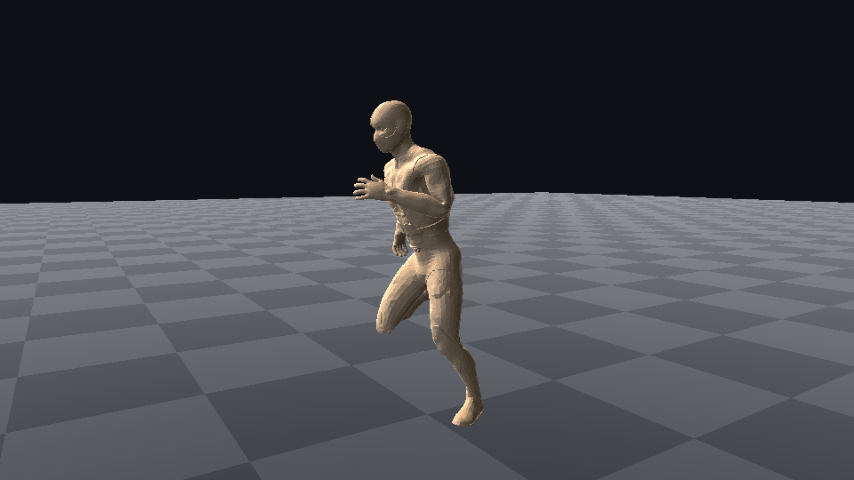

# `samples/09b-animated-character` — four Mixamo files, one character, one video

M8.d's artefact, ported onto the engine's animation runtime by issue #76. It imports four FBX
exports, COOKS them — the rig's skeleton, three clips retargeted onto it, and a four-state locomotion
program compiled at cook time — LOADS the cooked records by asset id through the asset system, and
animates one entity carrying an `Animator` with the engine's `AnimationSystem` inside a
`runtime::Simulation` at a fixed tick. The system publishes into the GPU pose world, the compute
dispatch skins the character from it, and the program writes one PNG per frame. The only per-frame
animation code the program has is the request it raises.



The still is one frame. **The claim is the motion**, and a single frame of a skinned character is
indistinguishable from a single frame of a posed one, so the artefact the milestone commits is the
video: `docs/design/videos/animated-character.mp4` — thirteen seconds, idle to walk to run to a
death, at 30 frames per second.

```
just capture-animated-character --sources <directory holding the four .fbx files>
```

## What it actually demonstrates

| Link | Where it lives | What this program does with it |
|---|---|---|
| FBX → skeleton | `tools/import/` step 7 | 65 joints, 22 of 22 humanoid slots mapped, from each of the four files |
| FBX → clip | `tools/import/` step 8 | one clip per file, 0.63 s to 9.93 s, quantised by the engine's own codec |
| rig → rig | `cy/animation/retarget_build.h` | the three animation-only rigs disagree with the mesh's rig by up to **29.89°** at rest; `build_retarget_profile` pairs all 65 joints and `bake_clip` absorbs the difference |
| clips → machine | `cy/graph/locomotion.h` | four states, seven transitions, compiled by `compile_pose` at COOK time |
| imports → cooked records | `cy/import/animation_cook.h` | `cook_locomotion_set`, the `animation` build-graph producer's work: a skeleton, four clips and a program |
| records → rig | `cy/animation/library.h` | loaded by asset id through `AssetSystem`, bound by clip name |
| entity → pose | `cy/animation/animation_system.h` | the `AnimationSystem`: advance per simulation tick, evaluate in `Stage::Animation`, no wall clock |
| pose → matrices | `cy/animation/pose_world.h` | published into the system's pose world, double buffered; the offset alternates every frame |
| matrices → vertices | `cy/rendering/skinning/` | a compute dispatch, on the device |
| vertices → pixels | `cy/rendering/pipeline/` | the engine's forward frame: the skinned depth, shadow and opaque pipelines draw the dispatch's output |

Nothing on the CPU writes the vertices that appear in the picture. `SkinnedScene::add_mesh` writes the
bind pose into a separate input buffer; the buffer the frame binds is device-local, written only by
`skin.slang` and read only by a vertex fetch. The barriers between the dispatch and the frame's
passes are derived by the render graph, with synchronisation validation on and its error count
reported, and the program fails if any frame did not draw the character from the skinning output in
all three of the depth prepass, the shadow and the opaque pass.

## What it does NOT demonstrate — read this before quoting the video

**The skin weights were not the artist's until M11.b, and the program says which it used.** Through
M10, `tools/import/`'s `MeshData` had no joint-index or joint-weight arrays and `write_cooked_mesh`
had no attribute bit for them, so the cooked mesh this program read said nothing about which bone
moves which vertex. `Walking.fbx` carries exactly that information — one skin deformer, 65 clusters,
up to six influences per vertex — and the import pipeline dropped it, which its own `skipped-rig`
diagnostic said out loud. `derive_influences` in `character.cpp` therefore bound the mesh itself, by
distance to each bone's segment.

M11.b task 6.1 gave `MeshData` those arrays and taught both model importers to fill them, so this
program now prefers the file's own bindings and prints **`skin  IMPORTED`** above the numbers; it
falls back to `derive_influences` and prints **`skin  DERIVED, NOT IMPORTED`** when the cooked mesh
carries none, which is what an older cache entry is. The fallback is kept rather than deleted
because deleting it would turn a stale cache entry into a character-shaped explosion instead of a
line of text. Everything downstream is the engine's real path either way — the same
`VertexStream::Skin` layout, the same dispatch, the same bone matrices.

The visible cost of the fallback is at the hips: a distance bind has no notion of which limb a
vertex belongs to, so where two limbs are close in the T-pose a few vertices take weight from the
wrong leg and stretch between them during the run. **The video in this directory was captured with
the derived bind**, so that artefact is in it; a re-capture on an imported skin should not have it.

**The character does not travel.** All four Mixamo exports are in-place takes, with the root's
horizontal motion removed at export, so it runs on the spot. Nothing here fakes a forward velocity to
improve the picture; the camera follows the hips because a clip that did travel would need it, and on
these four it does nothing. The death is the exception — the fall's displacement is part of the
animation, and the hips end 0.9 m behind where they started.

**Since issue #76 stage 3 this IS the engine's forward frame**, and the video is not. The character
is a skinned draw in the frame: `skinning::SkinnedScene` uploads the pose world's dirty range into
one pose buffer and skins the character in one compute pass, and `FramePipelines`' skinned depth,
shadow and opaque pipelines draw the output, binding the dispatch's `PackedNormalTangent` stream as
the `rhi::Format::Rgba16Snorm` it was written in — smooth normals, the clustered lights, a
directional shadow on a tiled ground, per-object motion vectors. The sample's own pipeline and its
shader are gone. The committed video predates that: it was drawn with flat shading rebuilt from
screen-space derivatives, because the frame could not then bind the skinned normal stream; the still
`docs/design/images/animated-character-frame.png` is frame 165 through the frame.

## The sources

Four Mixamo exports, 1 to 17 MB each, **not in this repository** and not redistributable:
`Breathing Idle.fbx`, `Walking.fbx`, `Running.fbx`, `Dying Backwards.fbx`. `--sources` says where they
are. `Walking.fbx` is the only one with a mesh.

## Why there is no CTest entry

It needs a graphics device AND those four files. A suite that skipped on every machine without both
is a suite whose failure nobody would notice — the same argument `just capture-virtual-geometry`
makes. What is gated automatically is every link underneath it: `unit.import`, `unit.animation`,
`integration.animation_runtime`, `integration.graph_compiler`, `render.skinning` and
`render.skinned_draw`.

## Two defects this artefact found, fixed by issue #76

Both are in the runtime, both were found by the program's own `worst joint step between two frames`
measurement rather than by looking at the picture, and both were worked around here until the frame
system needed them gone. Each now has a regression test that fails on the old code.

1. **`bake_clip` ended every baked clip on its source's FIRST frame.** It resamples
   `floor(duration * rate) + 1` frames, so its last sample is taken at exactly `duration`, and
   `Clip::sample` wrapped that by the source's loop mode — `wrap()` under `LoopMode::Loop` sends
   `duration` to zero. On a death that was a character that falls over for 4.6 seconds and stands up
   in one frame: 2,427 mm of joint movement in one thirtieth of a second. `bake_clip` now samples the
   end with `Clip::sample_unwrapped`, and `character.cpp` no longer declares the source non-looping
   for the bake.

2. **A state's clip clock restarted when its incoming blend completed**, jumping the incoming clip
   back by one blend duration — 0.15 s of a 0.633 s run cycle, 802 mm in one frame — and every clock
   wrapped whatever the loop flag. A state's clips now start when it becomes a blend's target, and a
   held clock stops at the duration. `main.cpp`'s `StateClocks` is gone.

## What moving onto the engine path changed in the picture

Captured before (the M8.d program, main at `ed7f90c9`) and after, 390 frames at 960x540 and 30 fps,
the take is NOT byte-identical, and the difference is the engine's rather than the sample's:

- **The clocks are the runtime's.** `StateClocks` started a blend target's clock at one tick and kept
  an unwrapped elapsed time; the runtime starts it at zero on the tick the blend begins and wraps it
  incrementally. After every transition the incoming clip plays one frame (1/30 s) later, and a
  wrapped clock can differ in its last bits.
- **The clips are adopted, not re-authored.** The program used to dequantise every cooked clip and run
  the codec a second time; now the keys arrive exactly as the importer's codec stored them, so the
  walk and the three bakes' sources differ by up to one quantisation step.
- **The bakes end on the source's last frame** (defect 1 above) rather than on a source declared
  non-looping for the bake, which samples the same pose by a different route.

Measured by comparing the two takes frame by frame (pixels whose grey difference is non-zero, of
518,400):

| Frame | When | Pixels that differ | Why |
|---|---|---|---|
| 0 | idle | 47 | the idle's bake source is adopted rather than re-encoded: silhouette edges move by a fraction of a pixel |
| 30 | idle | 189 | the same |
| 61 | the idle-to-walk blend has begun | 15,224 | the walk's clock now starts on the tick the blend begins, one frame later than `StateClocks` started it |
| 111, 200, 300 | walk, run, death | 24,000–30,000 | every later clip carries that one-frame phase difference |
| 389 | the death, held | 126 | both hold the death's last frame, so the pictures converge again |

No frame of the two takes is byte-identical, and the gates the program applies — every state
reached, no frozen pose, both double-buffered ranges alternating, zero validation errors — pass on
both. The worst joint step between two frames moved from 381.7 mm at frame 211 to 374.5 mm at frame
212, the run-to-walk blend, which is one frame later for the reason in the table.
