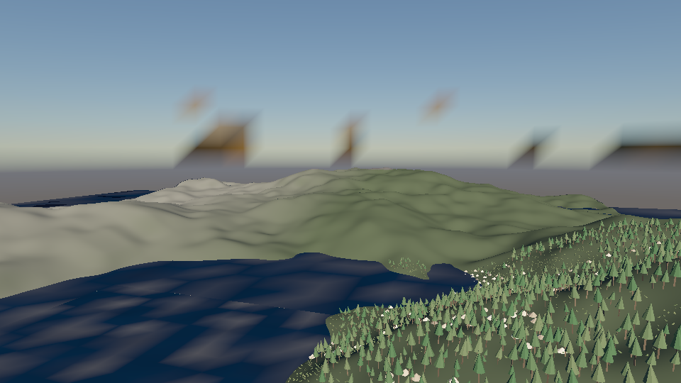
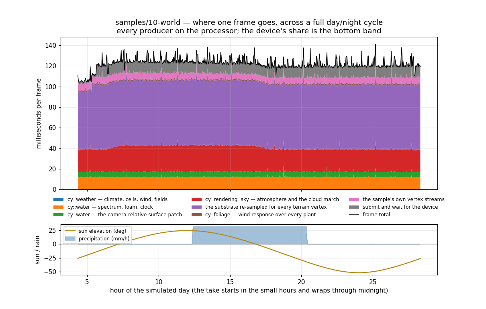

# `samples/10-world` — M10's artefact

Seven modules, one world, one day.

    just capture-world

writes `docs/design/images/m10-world.png`, `docs/design/images/m10-world-budget.png` and
`docs/design/videos/m10-world.mp4`. It needs a graphics device and **no content at all** — there is
no asset, no mesh and no texture anywhere in this artefact. The world is generated from the seed on
the command line.

## What this program claims

M10 landed `src/environment/`, `src/pcg/`, `src/terrain/`, `src/water/`, `src/foliage/`,
`src/weather/` and the atmosphere half of `src/rendering/sky/`, and every one of them was reached
only from its own suite. This is the first target in the repository that names all seven. What it
demonstrates is not any one of them; it is the ARROW between them, and the arrow is the substrate:

| step | module | what it does here |
|---|---|---|
| generate | `cy::pcg` | a nine-node graph over 576 regions of 64 m produces an elevation raster and a scattered point set |
| adapt | `cy::pcg-adapters` | the accepted points become **foliage clusters**, through `FoliageOutputAdapter`. No entities |
| cook | `cy::terrain` | the raster becomes 36 level-0 tiles plus two derived levels, and **claims** the `soil` field |
| float | `cy::water` | a spectral ocean, and **claims** `water-depth`, `water-distance`, `water-flow` and `water-shore-wetness` |
| blow | `cy::weather` | a climate over the terrain's own elevation, and **claims** `wind`, `temperature`, `wetness`, `snow-depth` and fourteen more |
| plant | `cy::foliage` | **reads** the substrate and terrain's surface back out, places tens of thousands of plants, and **reads** `wind` to move them |
| light | `cy::rendering::sky` | the atmosphere, the volumetric cloud deck weather drives, and the light everything is shaded by |

**None of those modules links another.** `cy::weather` does not link `cy::water`; `cy::water` does
not link `cy::terrain`; `cy::pcg` links neither `cy::foliage` nor `cy::ecs`; none of them links the
renderer. Those absences are requirements made checkable by the link graph, and the wiring has to
happen somewhere — an artefact is where.

Three things in this world are the substrate being load-bearing rather than decorative, and each
one disappears if a producer is removed:

* **The beaches** are `water-distance`, the two-pass chamfer transform `cy::water`'s shoreline
  publishes, read at every terrain vertex and mixed to sand inside 14 m of the water — so the hem
  follows the coast into every inlet instead of following a contour line. **Look for it on the open
  west coast in the video's early frames, not in the still**, and the reason it is faint is itself
  the substrate working: 14 m is three or four vertices of a 4 m lattice, and the same vertex then
  has `wetness` (1.00 all morning, darkening it by nearly half) and `vegetation` (pulling it back
  toward grass) applied over it, both of them `cy::weather`'s. Three producers compose in one colour
  and the wettest of them wins. Delete water's producer and the hem goes entirely, and not by
  accident: `water-distance` declares its default as the FAR end of its range rather than zero,
  precisely so that a world with no shoreline data reads as "no water near here" instead of as one
  continuous beach.
* **The snow** is `snow-depth`, which `cy::weather` accumulates. The run prints it at two probes —
  the world's centre and 600 m WEST of it — and they do not move together: the western probe climbs
  continuously from the start of the take (0.06 m by 05:21, and 0.36 m by 10:21, the hour the still
  is taken in) while the centre reads exactly 0.000 m through the whole morning. That is a westerly's
  windward side accumulating orographic precipitation, from the declared model rather than a painted
  patch, and it is why the left-hand hills in the still are white and the ones behind them are not.
  The centre only goes white when the front arrives at midday, and thaws once it has passed.
  (The number at frame 0 is the one exception and it is a transient: both probes are within a
  millimetre of zero before anything has had time to settle.)
* **The trees lean** because `foliage::evaluate_response()` reads a `ClusterWind` prepared from the
  `wind` field that `cy::weather` published — one field sample per cluster, not per plant. In the
  still they stand nearly upright in a morning whose hour lines read 4-8 m/s; by 15:21, with the
  front's 18 m/s over them, they are bent close to the horizontal. That is what the species'
  declared stiffness does with that wind and not an animation — the lean is the wind field made
  visible, and it is the one thing in this picture a reader can check against a printed number,
  because the hour lines report the wind the response was evaluated from.

## What this program does NOT claim

**Every producer here runs on the processor.** M10 shipped no `.slang` module for an environment
field, a terrain material, a water surface, grass expansion or a cloud march; six of its agents each
recorded that gap against their own row, and this artefact closes none of them.

So what the renderer beside `world.cpp` draws is geometry and per-vertex colour those modules
computed on the CPU, through one pipeline with one Lambert term and a Blinn-Phong lobe for water.
Specifically it is **not**:

* not `rendering::pipeline`'s forward frame, not the visibility buffer, not virtual geometry;
* not the material system — no terrain material page is bound on a device, and
  `terrain::MaterialPageCache` is not in the link line;
* not `environment::build_field_image()`'s GPU field image — every field read here is
  `FieldStore::sample_deterministic()` on the host;
* not `water`'s surface published into the GPU scene, and not its underwater, caustic or reflection
  passes;
* not `foliage`'s GPU wind response or GPU grass expansion, and not its impostor or aggregate tiers —
  the plant proxies are this sample's own cone and prism, drawn up to a declared cap with the number
  actually drawn reported every frame;
* not a per-pixel cloud march — the sky is a dome of 6 384 directions (56 rings of 112), each one a
  real `sky::compose_sky()` call, and the rasteriser interpolates between them. **That is what the
  straight-edged slabs in the still are.** Four degrees of sky per quad is enough for the
  atmosphere's gradient and far too coarse for a cloud edge, so a cloud bank arrives as a faceted
  wedge; the MODEL under it is the shipped march and the RESOLUTION is a dome. A sky shader would
  draw the same clouds per pixel and this is the artefact of not having one;
* not `rendering-post`'s tone mapping or auto-exposure — `World::shade_sky()` divides by the frame's
  own mean sky radiance and the fragment stage applies Reinhard and a gamma, and both say so.

There is also no STREAMING: the whole world is resident, every terrain tile is meshed at level 0,
and `MeshReport::stitched_vertices` is reported precisely so that a reader can see it is zero. The
streaming binder `src/terrain/`'s README records as its largest gap is still missing, and this
artefact does not stand in for it.

**And there are no RIVERS.** M10 tasks.md 7.1 asks for "terrain with rivers and an ocean"; this world
has an ocean, a fjord coastline and no river. `cy::water`'s `RiverNetwork` is built and tested —
Catmull-Rom spline networks, continuity-conserved discharge, junctions that add their tributaries,
bed profiles, turbulence from curvature and drop — and authoring one needs a centreline somebody
drew. The generator produces a `flow` raster that a river network could be traced from; tracing it is
a step this artefact does not take, and saying so is cheaper than a river that was really a blue
stripe. The other absences of the same shape: no `vfx-system` effect plays in this world (spray at
the shore and snow in the air are both `cy::vfx` work that wants the GPU path M10 section 5 built and
no sample drives), and no plant is ever PROMOTED to an entity, because promotion is a gameplay call
site and this artefact has no gameplay in it.

## The three tasks this artefact answers

**7.1 — the world.** Above. Run it and read the report it prints; every number in it is read back
off the module that produced it.

**7.2 — streamed and persistent.** `World::deform_and_round_trip()` stamps a crater through
`terrain::TerrainDeltaStore`, records it into `world::PersistenceOverlay` as a subsystem blob under
`terrain::kOverlayChannelTerrain`, **clears the delta store and verifies the crater is gone**,
restores from the overlay alone, and compares 289 probes over the crater's footprint against the
surface as it stood before the save — bit for bit, because a height delta is stored and restored as
the same `f32` and a tolerance would hide a lossy round trip. The clear-and-verify step is there
because a restore that MERGED would pass whether or not the overlay held anything at all.

What it does not do is save and resume the world's OTHER state. Weather's fields are declared
`persistent` and nothing writes them to a save; `src/environment/`, `src/terrain/`, `src/water/` and
`src/weather/` all record the same missing piece — `save-and-persistence`'s field-overlay encoding.
The half of 7.2 this artefact answers is the terrain half.

**The world is the seed, and nothing else.** Two runs of this program with the same seed write
byte-identical frames — `frame_0000.png` and the still both hash the same, and the whole report is
identical line for line apart from the output directory in it. `--seed 0x1234` is a different world
in the same breath: 2 183 generated points against 2 581, 37 190 plants against 37 381, and a
different picture. That is `cy::determinism::RandomStream` under every producer here, and it is
worth checking rather than assuming, because a capture that was accidentally constant would look
exactly like a capture that was correct.

**7.3 — the budget as a curve.** `--budget <csv>` writes every frame's cost, per producer, and the
collector plots it.

**The honest headline is that this does not hold a frame budget.** At 960x540 with 576 generated
regions, 295 000 terrain triangles, 37 000 placed plants and up to 415 000 triangles drawn, one frame
costs **about 122 ms on average and about 145 ms at worst** — seven times a 60 Hz budget.

**THOSE FIGURES ARE QUOTED LOOSELY ON PURPOSE, BECAUSE THE LAST DIGIT BELONGS TO THE MACHINE.** Six
captures of the same seed on this host gave means of 121.57, 121.62, 121.75, 122.03, 122.16 and
123.90 ms, and worst frames of 140.88, 143.41, 144.38, 144.82, 145.66 and 147.47 ms. The mean holds
a 2.3 ms band and the worst a 6.6 ms one, and the one capture two milliseconds above the rest lifted
the pure-arithmetic bands — the ocean patch 5.1 ms to 6.2 ms, the foliage response 1.04 ms to
1.46 ms — rather than the band that waits on the device, which is what "the machine was busy" looks
like from inside a frame. So the table below is ONE capture's, re-running `just capture-world` will
move its tenths, and nothing in this document should be read as reproducible to better than a couple
of per cent. What every capture agrees on is the SHAPE: the same three bands dominate in the same
order in all six, and no rearrangement of them comes within a factor of seven of 16 ms.

The curve says where the mean goes, and every one of the three largest bands is something a
shipping engine would not do on the processor at all:

| band | mean in the capture above | what it is, and what would delete it |
|---|---|---|
| the substrate re-sampled per terrain vertex | 63.0 ms | four `sample_deterministic()` calls at each of 152 000 vertices, every frame, because that is what makes a snowfall and a beach visible without a material that samples the field on the device. `cy/field.slang` — the debt `src/environment/`'s README records — deletes this band |
| the cloud march | 23.2 ms | 6 384 `compose_sky()` calls a frame, each marching the cloud slab and the atmosphere. A sky shader deletes this band |
| water's simulation | 12.0 ms | mostly the foam field: its advection and decay touch every cell every tick and the cost is quadratic in the resolution. Measured at 47 ms a frame at 256 cells; it ships at 128 |
| submit and wait | 11.4 ms | the device, and the only band in the table that is not the processor |
| the ocean patch | 5.1 ms | 16 trains summed at each of ~4 000 camera-relative vertices |
| the sample's vertex streams | 5.8 ms | this artefact's own cost, not the engine's |
| `cy::weather` | 0.29 ms | the whole climate, the cell hierarchy, the wind composition and the field publication — **the smallest band in the table**, and the one that has a declared budget |
| `cy::foliage` wind | 1.05 ms | one field sample per cluster and one `evaluate_response()` per drawn plant |

The curve is otherwise NEARLY flat across the cycle, and where it is not, it moves for one reason
only. Frame cost is 125.1 ms mean while the sun is up and 120.0 ms while it is down, and about three
quarters of that 5 ms is the cloud march: `sky_ms` is 25.5 ms with the sun above the horizon and
21.7 ms below it, and the step happens AT the horizon crossing rather than gradually — 23.1 ms in
the last ten degrees before sunrise, 25.5 ms in the first ten after. A march with no sun above the
horizon does no sun-lighting work through the slab, and that is the only band in the table whose
cost knows what time it is. Every other producer is flat to within its own run-to-run noise: the
substrate is 63.3 ms by day against 62.8 by night, and water is 12.0 ms either way. The sky's
25.5/21.7 split came out the same in every capture measured, and the substrate's half-millisecond
day/night difference had the same sign in each — the direction is the model's, the tenths are not.

**The storm is nearly invisible in the cost**, which is the result worth taking away. Across the 239
frames carrying more than 20 mm/h the frame is 122.9 ms against the take's own 122.0 ms mean, and
`cy::weather`'s whole band — climate, the cell hierarchy, the wind composition, the field
publication — has a mean of 0.29 ms in every capture and a worst single frame between 0.65 ms and
1.76 ms across them, the transition into the front included. The thing this world cannot afford is
DRAWING itself, not simulating itself.

## Reading order

`world.h` first — its header comment is the map. Then `world.cpp`, which is one function per module
in the order the dependencies force. `stage.h`/`stage.cpp` are the renderer and name no module above
`cy::rhi`; `shaders/world.slang` is forty lines and says what it is not.

## Running it

    # the whole thing, as the recipe runs it
    just capture-world

    # the world and its report with no device and no pictures — a second and a half
    build/<profile>/samples/10-world/cy_sample_world --headless

    # a different world
    build/<profile>/samples/10-world/cy_sample_world --headless --seed 0x1234 --regions 16

| flag | what it does |
|---|---|
| `--frames <dir>` | write `frame_%04d.png` per frame |
| `--still <path>` | write one frame a second time, for the committed image |
| `--budget <path>` | write the per-frame, per-producer cost as a CSV |
| `--headless` | generate, cook, claim, place and simulate; draw nothing |
| `--seconds <s>` | length of the take, which is always exactly one simulated day |
| `--fps <n>` | frames per second of the take. One frame is one simulated tick |
| `--width`, `--height` | refused unless even, for the video encoder's 4:2:0 |
| `--seed <n>` | the world seed. Accepts `0x` |
| `--regions <n>` | regions per side. 24 is the 24x24 grid M10's spike measured on |
| `--still-frame <n>` | which frame the still is taken from |

## There is no CTest entry here, and that is deliberate

The picture needs a graphics device. `just/run.just`'s own note about `capture-virtual-geometry`
states the rule this follows: "It needs a graphics device. On a machine without one the tool says so
and writes nothing, which is why this is a recipe a person runs and not a test." A suite that skipped
on every machine without one would be a suite whose failure nobody would notice.

What IS gated automatically is everything underneath it: `unit.environment`,
`integration.environment_gpu`, `unit.terrain`, `integration.terrain_*`, `unit.water`,
`integration.water_*`, `unit.foliage`, `integration.foliage_*`, `unit.weather`,
`integration.weather_*`, `unit.pcg`, `integration.pcg_*` and `unit.sky` each test one of the parts
this artefact composes.
