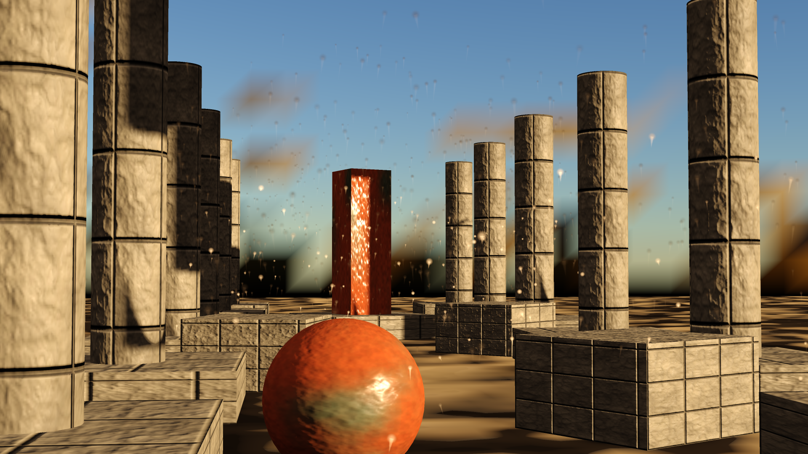
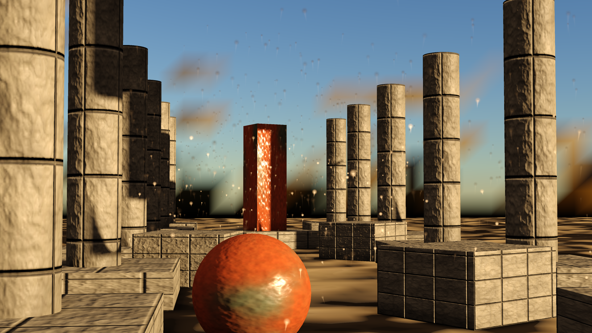
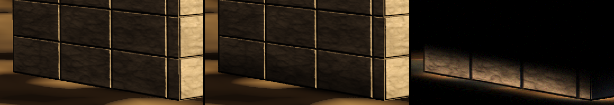
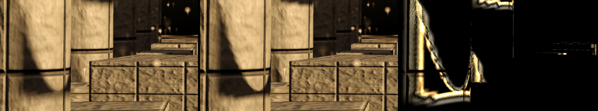

# `samples/12-beauty` — the first frame in which a material decided a pixel

> **M11.c's closing artefact.** Section 7 of `openspec/changes/implement-m11c-image/tasks.md`.
>
> ```
> just capture-beauty-shot                          # the picture, the before/after and the manifest
> just capture-beauty-shot --video                  # ... and the turntable
> just capture-beauty-shot --regenerate-textures    # ... regenerating the source images first
> just capture-ambient-occlusion                    # the shot with ambient occlusion off and on
> just measure-beauty-mip-chain                     # does the shot read its cooked mip chain?
> just capture-beauty-bloom                         # the same shot with and without bloom
> just capture-soft-shadows                         # the shot with soft and contact shadows off and on
> ```
>
> No CTest entry: the picture needs a graphics device, and on a machine without one the program says
> which device it did not find and writes nothing.



The provenance — what a person authored, what the renderer produced, and what this frame does not
contain — is [`docs/design/beauty-shot.md`](../../docs/design/beauty-shot.md), and the machine-readable
half is `docs/design/images/m11c-beauty-shot.manifest`, built from the frame's own `AssemblyReport`
rather than from anything this program believes.

## The sentence this artefact exists for

M11.c's ledger opens with a measurement rather than a complaint:

> There is no texture in this repository. Outside `docs/`, the tree holds exactly six image files —
> four editor identity marks and two golden references. Every material in every picture the project
> has produced is constants.

M11.c's spike then walked the path that would have to close to change that, and came back with
**four of six junctions closing and the two ends missing**: the material editor refused to open, the
importer named BC7 and delivered uncompressed RGBA8, nothing in the tree bound the material texture
table, and no assembled frame drew a compiled material program. This program is the other end of all
four.

## What it runs, in order

| | |
|---|---|
| **author** | three material graphs, placed and wired on `cy_editor_interface::specialised::graph::GraphCanvas` — THE canvas, the one `editor-architecture` forbids a sixth bespoke graph editor beside |
| **compile** | `lower_material` → `lower_graph` → `compile_material` → `assemble_translation_unit`. Twelve programs a material, one cook key each |
| **shader** | `slangc` over the generated module and `shaders/beauty.slang`, which is the fragment-stage lowering the engine does not generate — `slang_program.h` says so in as many words |
| **cook** | `cy::import::TextureImporter`: PNG in through M11.c's own DEFLATE decoder, BC7 and BC5 blocks with a nine-level mip chain out through M11.c's own encoder |
| **bind** | the blocks uploaded and bound at **(set 0, binding 1)**, which is where `cy/material.slang` declares `cyMaterialTextures[]` — imported rather than restated, so the Slang compiler checks the agreement rather than a comment |
| **assemble** | `cy::rendering::assembly::FrameAssembly`: eight passes, the post chain's three stages, the exposure the shot file commits and `cy/fullscreen.slang`'s tone curve |
| **capture** | the 8-bit output AND the linear scene colour, read back out of **one** submission, plus a manifest |

## The files

| | |
|---|---|
| `shot.h` | the committed scene's shape, and the artefact's honesty contract in its header |
| `shot.cpp` | the `.cyshot` parser and the `.cyprim` loader. Every refusal is about something the picture would have been wrong about |
| `stage.cpp` | the device: the cook, the uploads, the descriptor sets, the shadow map, the frame, and the two readbacks |
| `shaders/beauty.slang` | five entry points and the one thing it decides that the material cannot — which attributes the material sees, and what the engine's light loop does with the surface it returns |
| `main.cpp` | the command line, the sidecar check, and the turntable. `--albedo-levels 1` is a CONTROL: level 0 of every albedo map's cooked chain and nothing beneath it |
| `measure_mip_chain.py` | `just measure-beauty-mip-chain`'s judge: the full chain rendered twice must agree, and against albedo level 0 alone must DIFFER and be the less aliased |

## Three things in here that were found by looking at a picture

Each is commented where it is fixed, because each is the kind of defect that produces a plausible
image rather than an obvious one:

1. **A BC5 normal map has no blue channel.** Reading `.xyz` from it gives z = 0, which decodes to
   −1 and turns every normal inside out. Every upward-facing surface in the frame was black and
   nothing else said so. `texture.h` chose BC5 for exactly the reason that makes this happen — *"Z is
   reconstructed in the shader from X and Y"* — and the shader now does.
2. **A zeroed material parameter block draws a black material however the graph was authored.** The
   authored defaults live in the module's own declarations, so `cy_material author` writes them into
   the sidecar and the frame uploads them.
3. **The sky's ambient term is its mean RADIANCE, not its irradiance.** The factor of π between them
   is the difference between a picture with a sun in it and a flat one: multiplying by the irradiance
   made the ambient π times too strong, the sun invisible against it, and every shadow in the frame a
   shade of the same grey.

## Bloom, with and without

`--bloom` puts bloom into the frame's post chain at step 9 with the grade the shot file carries
(`bloom threshold-stops`, `intensity`, `scatter`, `levels`): the threshold is written in stops above
the white the exposure maps to 1.0 and converted to scene units by `bloom_threshold_for_exposure`.
Without the flag bloom is absent — no pass, no target — and the frame is the one M11.c published:
`bloom-beauty-off.png` is pixel-identical to `m11c-beauty-shot.png`.
`just capture-beauty-bloom` photographs both from one set of compiled programs:

| Without bloom | With bloom |
|---|---|
|  |  |

`docs/design/images/bloom-beauty-on.manifest` is the bloomed frame's provenance; its post-stage
list names `Bloom` at step 9, before exposure.

## What it does not claim

The full list is in the provenance, and the short version is: no anti-aliasing stage (the frame is
supersampled and the manifest says three post stages, none of them temporal), no global illumination
pass, no ambient occlusion pass in the published frame (it is `--ambient-occlusion on`, at the end
of this file), procedural geometry, and a normal map and an occlusion channel sampled by the FRAME
because the compiled-material closure vocabulary has no term for either.

**The air is the one thing in this frame that is not content.** Three ember emitters are authored in
`embers.cpp` — node by node, on `cy::vfx`'s shipping node library and through its shipping compiler
— because there is no on-disk VFX asset format in this tree to author them into, and no VFX graph
editor to author them with. What the field proves is the runtime, not an authoring path, and the
provenance says so where the rest of this list is.

## Ambient occlusion, off and on

`--ambient-occlusion on|off` is the setting, off by default. On, the program records the frame's
own `DepthPrepass` stage from its own buffers (`record_prepass`, drawing `sceneVertex` with
`scenePrepassFragment`, which writes the geometric normal octahedrally), switches
`PostChainConfig::ambient_occlusion` on, hands the stage to `occlusion::AmbientOcclusionPass`, and
shades with `sceneFragmentOccluded` against the prepass depth — tested, not written. The term
multiplies the sky term only; `sceneFragment`, the entry point the published frame is drawn with, is
unchanged in what it computes. The radius (1.5 m) and power (1.5) are content, in `shot.cyshot`.

| Ambient occlusion off | Ambient occlusion on |
|---|---|
|  |  |



`just capture-ambient-occlusion` writes `docs/design/images/ambient-occlusion-{off,on,detail}.png`
and `ambient-occlusion-on.manifest`, and `tools/docs/compare_ambient_occlusion.py` fails it unless
the off picture is `m11c-beauty-shot.png`'s pixels exactly and no pixel got brighter.

## Soft and contact shadows, off and on

`--soft-shadows on|off` is the setting, off by default. On, the program records the depth and
normal prepass, declares the frame's `ContactShadows` stage through
`contact_shadows::ContactShadowPass`, and shades through `sceneFragmentSoft`: the sun's map
filtered by `cy/shadow.slang`'s percentage-closer soft filter — a blocker search and a kernel whose
radius is `(blocker - receiver) * tan(sun angular radius)`, so the far ends of the long shadows
soften and their feet stay sharp — and darkened further by the contact term where the trace toward
the sun found an occluder the 3.7 cm map texels and the 5 cm normal offset lose. The sun's angular
radius (0.265 degrees) and the trace's reach are content, in `shot.cyshot`. Ambient occlusion
composes with it.

| Soft shadows off | Soft shadows on |
|---|---|
|  |  |



`just capture-soft-shadows` writes `docs/design/images/soft-shadows-beauty-{off,on,detail}.png` and
`soft-shadows-beauty-on.manifest`, and `tools/docs/compare_soft_shadows.py` fails it unless the off
picture is `m11c-beauty-shot.png`'s pixels exactly.
