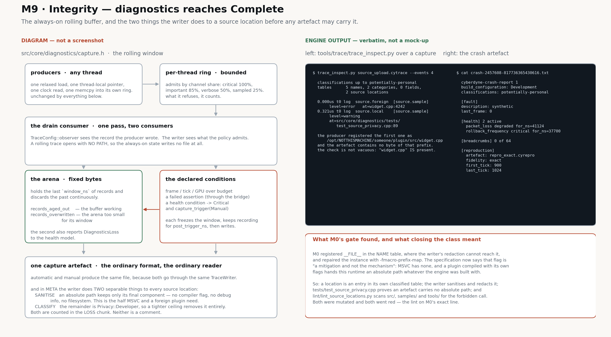

# `src/core/diagnostics/` — layer 0

One trace, one timeline, one clock. Every subsystem the engine will ever have emits into what is
declared here, and the reason it is in M0 rather than M4 is that a diagnostic field's **privacy
classification** cannot be added retroactively — it would be an audit of every field ever written,
performed by someone who did not write them.

**Governed by**: `diagnostics-profiling-and-crash`. Decisions: `design.md` §2. Tasks: 3.5.1–3.5.9,
and M9 task 5.3.

## The invariant

A field's classification is a required argument of the macro that declares it. There is no overload
that omits it, no default, and no second way to obtain a `FieldId`.

```cpp
CY_TRACE_FIELD(frame_index, u64,    cy::Privacy::Public)
CY_TRACE_FIELD(user_path,   string, cy::Privacy::Sensitive)
```

- Two arguments is `error: macro "CY_TRACE_FIELD" requires 3 arguments, but only 2 given`.
- A classification computed at run time does not compile: `require_classification()` is `consteval`.
- A field type that does not exist names itself: `CY_DIAG_FIELD_TYPE_uint64` is undefined.
- An id that was never registered carries no classification, so the writer redacts it and counts it.

`tests/test_field_macro.py` compiles four declarations and requires exactly one of them to succeed.

### A source location is classified data, not a name (M9)

M0 registered `__FILE__ ":" __LINE__` in the NAME table and `AssertionFailure::file` beside it. A
name is interned unredacted into the metadata table, so that put the build machine's directory
layout — including the account name it sits under — structurally beyond the writer's reach. M0's
gate found it and repaired it with `-fmacro-prefix-map` in `cmake/compilers.cmake`.

The specification now forbids the shape by name and says what the flag is worth: *"Compiler flags
that strip source prefixes are a **mitigation and not the mechanism**: they do not exist on every
toolchain."* MSVC has no equivalent, and a plugin compiled with its own flags hands this runtime an
absolute path whatever the engine was built with.

So a location is an entry in its own table (`source.h`), a record carries a `LocationId` in `b`, and
the writer does two separable things when it resolves the table into `META`:

* **Sanitisation** — a path under the declared source root loses that prefix; a path that is still
  absolute keeps only its final component. This depends on no compiler, no debug information and no
  filesystem. It is counted as `LossReason::SourcePathSanitised`.
* **Classification** — the sanitised remainder is `Privacy::Developer`, so an artefact written under
  a tighter ceiling carries the id and the line and no path at all. It is counted as a redaction.

Both halves are checked and both were proved failable by mutation:
`tests/test_source_privacy.cpp` (the artefact contains no absolute path, and does contain the file's
name, so the check is not vacuous), and `lint/lint_source_locations.py`, which scans `src/`,
`samples/` and `tools/` for the forbidden call and goes red on M0's exact line. The lint has a
`--self-test` that fails if it stops finding the shape it exists to find.



*Left panel is a diagram. Right panel is engine output — `tools/trace/trace_inspect.py` over a
capture this module wrote, and a crash artefact — pasted verbatim.*

### The rolling buffer, and what triggers a capture (M9)

`capture.h` is the "always-on rolling diagnostic buffer" the specification asks for, and the sentence
it is built around is *"a profiler SHALL NOT be required to be attached beforehand for a hitch to be
diagnosable"*. The trace's producers and rings are untouched: the buffer is a CONSUMER, subscribed
through `TraceConfig::observer`, copying each drained record into a fixed arena and discarding the
past continuously. `rolling_open()` opens the one trace with **no path**, so the always-on state
writes no file at all.

A trigger stops the discarding for `post_trigger_ns` and then writes the held window through an
ordinary `TraceWriter` — so an automatic capture and a manual one are the same format, read by the
same reader. The declared conditions are a frame, tick or GPU budget (`rolling_note_frame()` and its
siblings, which also pump `rolling_poll()`), a failed assertion (through the bridge), and a health
condition transitioning to Critical.

Two kinds of loss, counted separately because they mean different things: `records_aged_out` is the
buffer working, and `records_overwritten` is the arena too small for the configured window.

### Health, and what the crash artefact carries

`health.h` aggregates the conditions the specification lists into one place readable in every build
type — and readable from a signal handler, which is why it is a fixed array of relaxed atomics with
no lock. The crash report now carries `[health]` (what was wrong, at what level, for how long) and
`[reproduction]` (the artefact that replays the window, and its **fidelity**), and states the
absence of a reproduction rather than omitting the section.

`reproduction.h` writes the artefact that ties a replay slice, a capture and a crash report
together. It is a MANIFEST and not a container: this module is layer 0 and `replay-and-rollback` is
layer 4, so it names the slice rather than holding it. It **refuses** to write an artefact with no
slice, and one claiming less than exact fidelity with no reason — an artefact that implies a fidelity
it does not have sends a reader looking for a cause it already knew about.

**Redaction is the writer's**, not the producer's. A producer says what a value *is* by declaring its
field; the writer decides what may be written by comparing that declaration against the artefact's
declared ceiling. A capture carries the ceiling it was written under, and a redacted field keeps its
entry and loses its value, so the gap is visible rather than silently misleading. No policy admits
`Secret` at any ceiling: credentials, tokens, private communications and personal files have no path
into any artefact. `ExportPolicy` can be tightened and cannot be widened.

## What is here

| Header | What it declares |
|---|---|
| `privacy.h` | `cy::Privacy`, `cy::ExportPolicy` |
| `field.h` | compiled identifiers: `CY_TRACE_FIELD`, `CY_TRACE_NAME`, `CY_TRACE_CATEGORY`, the registry |
| `trace.h` | the timeline: event kinds, channels, emission, lifecycle, `EmissionCost` |
| `log.h` | `CY_LOG`, levels, category floors — records on the same timeline |
| `breadcrumb.h` | the bounded ring that survives when the trace does not |
| `crash.h` | the crash artefact and the handler that writes it |
| `bridge.h` | the two seams `src/core/base/` declares, filled in by this module |
| `format.h` | the capture's wire format, shared with `tools/trace/trace_inspect.py` |
| `source.h` | source locations, as classified redactable data rather than as names |
| `health.h` | the health model: what is wrong, at what level, and since when |
| `capture.h` | the always-on rolling buffer, and the capture a declared condition triggers |
| `reproduction.h` | the artefact that links a crash to a replay slice, and states its fidelity |

The emission path, in order: one relaxed load of "is a trace open", one thread-local pointer, one
monotonic clock read, one bounds check in the producer's own ring, and a `memcpy` of a record it
composed on its stack. No allocation, no string formatting, no hashing, no lock, no call into
another subsystem. A producer refused by the loss policy increments one relaxed counter and returns.

**Loss is recorded, never silent.** Per-thread rings, and a channel is admitted only while the buffer
is below its share: critical 100%, important 85%, verbose 50%, sampled 25%. What is refused is
counted per channel, emitted as a `Loss` record on the timeline where the gap is, and totalled in the
artefact's `LOSS` chunk. The same chunk carries the fields the export policy removed and the
registrations the fixed-capacity metadata table refused.

## Overhead — measured, not claimed

`diagnostics-profiling-and-crash` requires overhead to be bounded and declared. These are from
`cy_diag_overhead`, 400 000 samples per measurement, Linux, gcc 13.3.0, `--profile dev`, on the
machine M0 was implemented on. Re-run it rather than trusting the table:

```
build/<dir>/src/core/diagnostics/tests/cy_diag_overhead 400000 [trace-path]
```

| State | ns per instant | +2 fields | scope pair |
|---|---:|---:|---:|
| compiled in, no trace open | 4–5 | 4–5 | 5–9 |
| log record below the level floor | 0.6 | | |
| open, recording, artefact to `/dev/null` | 30–37 | 32–39 | 60–73 |
| open, recording, artefact to disk (77 MB written) | ~43 | ~46 | ~85 |
| open, background consumer draining | 32–43 | 34–46 | 64–90 |
| `CY_PROFILING=ON`, Tracy republishing every record | 95–320 | 85–160 | 200+ |

Against a 16.67 ms frame:

- **shipping, minimal telemetry** — 200 events a frame: 6–9 µs, **0.04–0.05% of the frame**. The
  requirement is "well under one per cent".
- **development, normal tracing** — 5 000 events a frame: 150–215 µs, **0.9–1.3%**. The requirement
  is "a small single-digit percentage".
- **full instrumentation** — Tracy on: explicitly higher, which is what the requirement allows.

The dominant term in the recording figures is the monotonic clock read, not the buffer write.
`measure_emission_cost()` is public, so the engine can report the cost of its own diagnostics.

## Artefacts

A capture is `CYTRACE\0`, then chunks — `META` identifier tables and build identity, `EVTS` one
thread's records, `LOSS`, `ENDX` the chunk index — and the file's last eight bytes are the index's
own offset, so a long capture opens by reading its index and loading regions on demand. `META` is
written at open as well as at close, so a capture a crash truncated still resolves what was
registered before it started. Compression is `None` at M0; the chunk header already carries both
lengths, so turning on zstd changes the writer and the readers, not the format.

A crash report is text, written by a path that assumes the process is damaged: no allocation, no
lock, no variadic formatter, no subsystem re-entry. The path, the identity strings and the report
buffer are prepared when the handler is installed. It carries the build identity, the declared
classification ceiling, the signal or exception, the last frame the process reached, the breadcrumb
ring, and the backtrace with module identities and offsets — symbol-independent, symbolicated later
against the archived symbols. A report already written by a fatal assertion is not overwritten by the
`SIGABRT` that assertion raised.

```
just diagnose-trace <capture> [--events N] [--kind counter] [--json]
just diagnose-crash [report] [--directory <dir>] [--symbolicate]
```

## Seams, and what is deliberately not here

- **`src/core/base/`** owns the type aliases, `cy::Expected<T, Error>`, the assertion macros and
  their behaviour per configuration. `trace_open()` installs this module into base's assertion
  handler and its diagnostic sink; `trace_close()` restores them. A warning a layer above emits
  becomes a classified record on this timeline instead of a line on standard error.
- **Tracy** is a backend of this trace, behind `CY_PROFILING`, never a second timeline. With the
  option off there is no Tracy target, the sink compiles to nothing, and the trace is complete.
- **The crash handler's operating-system half** is two translation units selected by the build, not
  an `#ifdef` in a shared file. When `Platform::install_crash_handler()` lands (task 3.2.1), this
  becomes its implementation. The Windows unit is written and **unverified** — M0 was implemented on
  Linux and CI does not exist yet.
- **Not here, and named in the specification**: the health model, the always-on rolling buffer and
  automatic capture, profiler views, remote and dedicated-server transport, telemetry export,
  reproduction artefacts, graphics-device and shader diagnostics. Each needs a subsystem that does
  not exist yet — a renderer, a job system, a replay — and each lands on this transport rather than
  beside it. M0 is the transport, the classification, the loss policy and the artefacts.
