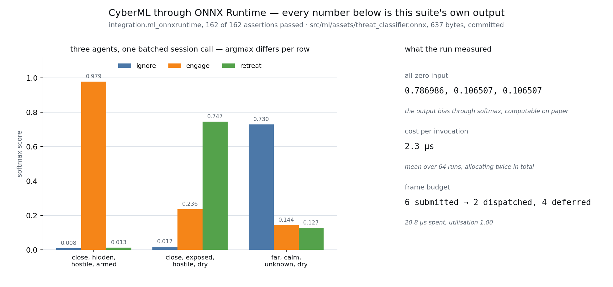

# src/ml/ — CyberML

Running trained machine-learning models inside the engine. `ml-inference` at **Seed**, M8.c
section 4.

This is inference, not training. Models are trained externally and imported. **The engine does not
implement a neural runtime** — the specification says so in its own Purpose, and this module is
what it says the engine's contribution is instead: the asset model, the tensor and session API, the
backend abstraction, the scheduling and the budget, and the determinism boundary.



*Not a diagram.* Every number on that figure is parsed out of a run of
`integration.ml_onnxruntime` by `tools/plot_capture.py`, which exits non-zero and draws nothing if a
measurement is missing. The three bars are what ONNX Runtime returned for three agents in one
batched session call over the committed 637-byte model, and they match `tools/make_threat_classifier.py`'s
own reference arithmetic to six decimal places.

## What is here

| File | What it owns |
|---|---|
| `include/cy/ml/tensor.h` | `ElementType`, `TensorShape` with its dynamic dimensions, `TensorSpec`, and `Tensor` — owned or borrowed, engine-allocated, reshaped rather than reallocated |
| `include/cy/ml/model.h` | `ModelAsset`: the payload, the declared inputs and outputs, the validated backends, the precision, the **determinism classification**, the content hash, and the `CYML1` container |
| `include/cy/ml/backend.h` | `InferenceBackend`, `BackendSession`, `BackendCapabilities`, the registry and the selection rule, and `create_onnxruntime_backend` |
| `include/cy/ml/session.h` | `InferenceSession` — synchronous and batched execution, reuse across invocations, the pinning decision, and `ResultScope` |
| `include/cy/ml/schedule.h` | `InferenceBudget`, `InferenceScheduler`, `AsyncResult` and `FrameReport` — the per-frame budget, deferral by priority, and staleness |
| `cook/include/cy/ml/cook.h` | The bridge from a `ModelAsset` to `cy::gameplay::ModelPinning`, which the cook-time firewall reads |
| `assets/threat_classifier.onnx` | 637 bytes. The committed model `integration.ml_onnxruntime` loads and runs |
| `tools/make_threat_classifier.py` | That model's provenance: run it to regenerate, diff to verify |

## The two things worth reading the code for

### 1. The determinism boundary, in two halves that are not interchangeable

`ml-inference` states the rule and then says where it is enforced:

> Model output SHALL NOT drive authoritative gameplay state … unless the session is **pinned**: a
> fixed backend, fixed precision, and a configuration the model asset declares as verified
> reproducible.
>
> A non-pinned model feeding an authoritative node SHALL be **rejected at cook time**.

**Cook time** is `cy::gameplay::check_inference_bindings` in `<cy/gameplay/cook_firewall.h>`. It
lives in `src/gameplay/` and not here, for the reason that header gives at length: a gate inside the
module it gates is a producer checking itself, and the gate must be callable from a cook built with
`CY_ML` **off**. What this module owes it is `cy::ml::pinning_of`, three field copies written once
so that "pinned" does not acquire a second definition. `unit.ml_cook` drives the whole gate over
real assets.

**Run time** is `InferenceSession::write_origin()` and `ResultScope`, over
`<cy/ecs/firewall.h>`. A session is where "pinned" stops being a claim in a file and becomes one
bit:

```cpp
{
    const cy::ml::ResultScope scope(session, "ai.threat-classifier");
    world.add(entity, ThreatLevel{...});   // refused unless the session is pinned
}
```

`is_pinned()` is a comparison of two digests, not a flag: the session computes
`configuration_digest(backend, precision, device)` for what it is actually running and compares it
with what the asset declares verified. **The same asset on another device is not pinned**, which is
the `"across backends, devices, and driver versions"` clause enforced by arithmetic.

A runtime refusal is **not** the cook-time requirement, and neither is a substitute for the other:
the cook gate prevents a desync between two machines whose content disagrees; the runtime scope
catches a model somebody wired up after the cook.

### 2. The budget is checked before a request runs, not after

`InferenceScheduler` separates three obligations `ml-inference` states together:

* `dispatch()` picks what the budget allows, **highest priority first with ties by submission
  order**, and defers the rest — reporting how many, and which priority was starved.
* `pump()` is the only call that can spend time on a model. `dispatch()` never runs one, which is
  what "asynchronous inference SHALL never stall the frame" means as a property of the code.
* `result()` answers with the previous result and its age when nothing completed this frame. A
  caller that never checks `frames_stale` still gets an answer.

With a `jobs::JobSystem` the work runs on workers; without one it runs inline during `pump()`. The
second is a declared mode rather than a fallback that pretends, and the destructor waits for
anything in flight — `integration.ml_runtime` destroys a scheduler with thirty-two jobs running to
prove it.

## The backends

`ml-inference` names four — ONNX Runtime (portable default), Core ML, DirectML, TensorRT — and
**one is implemented**: ONNX Runtime, behind `CY_ML_ONNXRUNTIME`. The other three are enumerators a
model asset can declare itself validated against, because that list is authored on a machine that
has none of them, and an enumerator with no backend makes a cook refuse rather than guess.

`src/ml/src/onnxruntime_backend.cpp` is the only translation unit in the repository that may include
an ONNX Runtime header. That is structural, not a promise: the include sits inside
`#if defined(CY_ML_ONNXRUNTIME)`, `cy::dep::onnxruntime` is a PRIVATE dependency so its include
directories are not inherited, and `tools/layercheck/layercheck.py` carries the rule as a build gate
beside Jolt's and miniaudio's. It uses the **C API**, because the engine compiles with
`-fno-exceptions` and `Ort::` reports failures by throwing.

## The two options, and what each costs

| Option | Default | What it gates | What it costs |
|---|---|---|---|
| `CY_ML` | **ON** | This directory and its four suites. Fetches nothing | Nothing but its own compilation |
| `CY_ML_ONNXRUNTIME` | **OFF** | The onnxruntime fetch and the one translation unit that names its types | 746 MB of clone, a dozen archives of upstream's own, and a **2m37s** from-empty build of the library alone at 24 jobs on an idle machine |

`CY_ML` is on because the module is delivered and rule 3 of every milestone since M4 says a
delivered capability whose option defaults off is a capability nothing tests. `CY_ML_ONNXRUNTIME` is
off because `thirdparty-dependencies`' "bounded cost" criterion is a real gate and four minutes on
every default configure is not bounded — the number is in `deps/manifest.toml` beside the entry.

With the option off, `create_onnxruntime_backend` returns `Unavailable` naming the configure line,
`InferenceSession::create` fails the same way, and a caller takes its declared fallback. That is
`ml-inference`'s own "no backend available" scenario, and it is what makes CyberML optional.

### Three things the fetch needed, none of them obvious, all of them measured

Recorded here because each one presents as a defect in something else, and each cost a build to
find. The full reasoning is at the call sites in `cmake/dependencies.cmake` and `deps/manifest.toml`.

1. **ONNX Runtime calls `find_package()` directly**, not through FetchContent, so
   `FETCHCONTENT_TRY_FIND_PACKAGE_MODE` does not cover it. On a machine with Anaconda on `PATH` the
   configure fails inside re2's `find_dependency()`; on a machine that has ever built Eigen through
   vcpkg it silently uses that Eigen — CMake's **user package registry** (`~/.cmake/packages/`) is
   consulted before any prefix path. The build then failed inside a stranger's header. A dependency
   that resolves differently depending on what else the developer has ever built is not pinned,
   whatever the manifest says, so the registry is turned off for this configure.
2. **Eigen cannot be downloaded from gitlab.com** — its archive URL answers HTTP 403 to anything
   that is not a browser, reproducibly. So Eigen is in `deps/manifest.toml` at the commit upstream's
   own `deps.txt` pins, fetched by git, and handed to ONNX Runtime through
   `onnxruntime_USE_PREINSTALLED_EIGEN`. That also puts a library a shipped game links into
   `THIRD_PARTY.md`, which is where the licence report needs it.
3. **A shallow fetch of an arbitrary commit is a server policy, not a client one.** GitHub allows
   `uploadpack.allowReachableSHA1InWant`; GitLab does not, and the failure reads "Failed to checkout
   tag", which looks like a bad pin. The acquisition loop now decides `GIT_SHALLOW` from the host.

## What the suites are

| Suite | Tier | What it drives |
|---|---|---|
| `unit.ml` | unit | Shapes, tensors, the asset and its container, the registry, the selection rule, sessions over a backend that is not a runtime, and the budget's arithmetic |
| `unit.ml_cook` | unit | The cook-time boundary end to end over real model assets |
| `integration.ml_runtime` | integration | A session's write origin reaching the ECS firewall, dispatch onto worker threads, and teardown with work in flight |
| `integration.ml_onnxruntime` | integration | **The committed model, loaded and run**, its batched argmaxes, its allocation count over 64 ticks, and cook-time validation refusing a corrupt model. Declared only when `CY_ML_ONNXRUNTIME` is on — never registered and skipped |

## What is deliberately not here

* **No AI graph node.** `ml-inference` requires CyberML to be *usable* from the AI graph, and
  `ai-system` SHALL NOT depend on it. There is no edge from `cy::ai` to `cy::ml` in this build, and
  the node that binds a model is the cook's resolution rather than a link. The cook driver call that
  would refuse a graph binding a non-pinned model is `tools/cook/`'s, and `cy::ml::pinning_of` is
  the half of it that lives here.
* **No Core ML, DirectML or TensorRT backend.** Each is a platform SDK and a separate dependency
  decision; the abstraction is what Seed asks for and the portable default is what runs.
* **No model parsing.** `read_model_asset` reads the container and treats the payload as opaque.
  The engine never looks inside a model — that is the "SHALL NOT implement a neural network runtime"
  rule applied to the loader as well as to the executor.
* **No Swift surface yet.** `ml-inference`'s gameplay-API requirement asks for one; the C++ surface
  is deliberately small enough to bind, and binding it is `native-abi`'s work rather than this
  module's.
