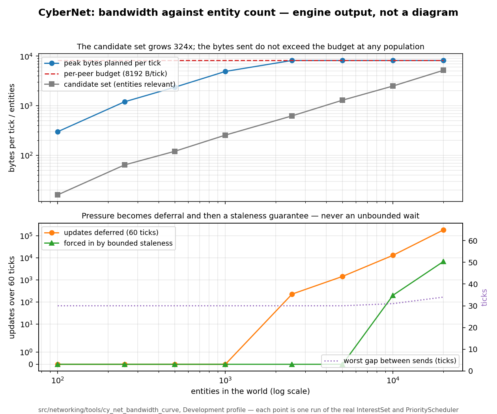

# `src/networking/` — CyberNet

**M9 section 4.** Three network modes and their prerequisites, the authority model and its handover,
the transports and the one reliability layer they share, compiled replication schemas, baselines and
deltas, spawning and RPCs, interest management, the priority scheduler and its bandwidth budget,
prediction and reconciliation, lag compensation, and the dedicated server.

Layer `scene` (4) — the rung `gameplay/`, `world/`, `graph/`, `camera/` and `replay/` chose.
Behind **`CY_NETWORKING`**, which until this milestone gated nothing.

---

## `CY_NETWORKING` stops gating nothing

`CY_NETWORKING` has been declared in `cmake/features.cmake` since M0. Before M9 there was **no
`if(CY_NETWORKING)` and no `#if defined(CY_NETWORKING)` anywhere in the tree**, so the option and its
absence produced byte-identical output — which is exactly the shape M8.b's closing gate found in
`CY_UI`, and which M8.c's gate wrote into this change as a delta requirement so that M9 would start
from it rather than discover it.

What changed:

| | Before M9 | Now |
|---|---|---|
| Default | `OFF` | `ON` — `delivery-roadmap` fails a capability at Working whose `CY_*` option defaults off |
| `if(CY_NETWORKING)` | nowhere | `src/CMakeLists.txt`, around `add_subdirectory(networking)` |
| `#if defined(CY_NETWORKING)` | nowhere | `include/cy/networking/networking.h` — one `#error`, for the out-of-tree consumer the CMake gate cannot reach |
| What it gates | nothing | `src/networking/` — the module, its tool and its three suites |
| What it fetches | nothing | nothing. The reliability layer is the engine's own and the UDP backend is POSIX sockets, so there is no transport library in `deps/manifest.toml` and no entry to add to `THIRD_PARTY.md` |
| Built with it off | never | yes, and the full suite run in both directions |

**It removes the transport, not the record.** `src/replay/`'s `ReplicationInputCursor` is
deliberately outside this option: `replay-and-rollback` forbids a second representation of
participant intent, and a replication layer that could not see the session's record would grow one.

---

## The dependency list is the dedicated server requirement

```
cy::core-base  cy::core-determinism  cy::core-memory  cy::core-reflect  cy::ecs  cy::gameplay
cy::replay
```

No renderer, no audio, no interface, no GPU. `networking-and-replication` requires a dedicated
server build to "exclude: the renderer, VFX, UI, client audio, and the editor" **at build time rather
than at runtime**, and that is what this list makes true: none of them is reachable, so the exclusion
is a property of the link graph rather than a promise. `tests/test_server.cpp` asserts the same thing
from the source side with five `__has_include` guards — adding any of those dependencies stops that
translation unit compiling.

---

## What is here, file by file

| Header | What it owns |
|---|---|
| `mode.h` | `NetworkMode`, the prerequisites `verify_mode()` checks, `CompatibilityScope` and `join_verdict()` |
| `authority.h` | `NetworkId` and its minter, `Topology`, `AuthorityRegistry` and the two-phase handover |
| `transport.h` | The `Transport` interface, `DeliveryMode`, `TransportSecurity`/`admissible_for()`, `NetworkConditions` |
| `reliability.h` | `DatagramHeader`, `ReliabilityChannel`, `ReliableEndpoint` — sequencing, acknowledgement, retransmission, the replay window, ordered delivery |
| `local_transport.h` | `LocalNetwork` (the seeded condition simulator) and `LocalTransport` |
| `udp_transport.h` | `UdpTransport` over POSIX sockets, and what it does not provide |
| `schema.h` | `FieldEncoder`, `CompiledSchema`, `SchemaSet`, `BitWriter`/`BitReader`, the change mask |
| `replication.h` | `PeerBaseline`, `SnapshotWriter`/`SnapshotReader`, spawns and despawns, `ReferenceResolver` |
| `rpc.h` | `RpcRegistry`, the direction/authority/bounds/rate-limit validation, the intent boundary |
| `interest.h` | `InterestSet` — relevance producing candidates, incrementally, over world-partition cells |
| `scheduler.h` | `PriorityScheduler`, the network LOD bands, the bandwidth budget and the degradation order |
| `prediction.h` | `InputBuffer`, `PredictionLedger`, `CorrectionSmoother`, `ProxyHistory` |
| `server.h` | `DedicatedServer`, `CookExclusions`/`apply_cook_profile()` |
| `profiler.h` | The three causal questions, and the aggregate counters beside them |

---

## Four decisions a later phase should not relitigate

### 1. Lockstep asks the determinism registry for `SamePlatform`, not for `Lockstep`

This is the milestone's brief — *"lockstep is only as true as the spike says it is"* — as a line of
code, and it is deliberate rather than an oversight.

`determinism::guarantees_of(DeterminismProfile::Lockstep)` carries `cross_platform_reproducible`, and
`DeterminismConfiguration::require()` refuses that obligation in this tree: there is no deterministic
math module, so every `CrossPlatform` or `Lockstep` session is rejected with
`DeterministicMathMissing`. `networking-and-replication` does not ask for that guarantee either —
**"Cross-platform lockstep SHALL NOT be supported"** — and asks instead for a declared compatibility
scope that every participant must match.

So the two halves of lockstep's contract go to the two things that can answer them:

* **`SamePlatform`** — the same binary on the same architecture reproduces state bit-exactly — is
  asked of the determinism registry, and it is exactly what M9's spike measured (design.md §1.1).
* **"From commands alone"** is `replicates_state(Lockstep) == false`, here.
* **"Every participant matches"** is `join_verdict()`, which refuses a peer differing in platform,
  architecture or build identity.

`tests/test_mode.cpp`'s last case asserts both halves, and mutation 5 below shows what goes red if
someone makes the engine claim the guarantee nobody has measured.

### 2. The reliability layer is shared, not the UDP backend's

`networking-and-replication` asks for "a UDP transport with its own reliability layer" and, four
requirements later, for replay protection and sequence validation from **every** transport. Written
inside the UDP backend, the second would have to be written again for the local transport — and the
first thing to diverge between two copies of window arithmetic is the replay window, which is the
half that is a security property. So `reliability.h` is one implementation over an unreliable
datagram substrate and both backends compose it. That is also what makes the in-process test a real
test of retransmission and duplicate rejection rather than a test of a simplification.

### 3. A delta is against what the peer **acknowledged**, never against the last send

Deltaing against the last send is one array instead of two and is wrong the first time a packet is
lost: the client decodes against a baseline it never received and every field it touches is silently
garbage, with no error anywhere. `PeerBaseline` therefore holds two copies per (entity, component) —
acknowledged, and sent-since — and an acknowledgement promotes. Mutation 3 below is that exact
shortcut, and it goes red.

### 4. Interest management is a scheduler, not a predicate

`InterestSet` produces candidates and never looks at a budget; `PriorityScheduler` decides what is
sent. Two objects, because the failure of one is that a bandwidth budget quietly becomes a visibility
rule and a player stops seeing an enemy because the network was busy.

---

## The bandwidth curve — measured, not asserted at one population

The exit criterion is *"Bandwidth stays within budget as entity count scales; interest management is
**measured**, not assumed"*, and tasks.md repeats the word. `tools/cy_net_bandwidth_curve` runs the
real `InterestSet` and the real `PriorityScheduler` at eight populations for sixty ticks each, over a
world that gets **denser** rather than bigger — the peer's sixteen cells of sixty-four, its budget,
its relevance distance and its band table are the constants.

```
$ build/networking/src/networking/tools/cy_net_bandwidth_curve
population,candidates,examined,peak_selected,selected_total,deferred_total,frequency_reduced_total,precision_reduced_total,forced_by_staleness_total,peak_bytes,bytes_budget,worst_gap_ticks
100,16,16,16,104,0,0,0,0,300,8192,30
250,64,64,64,416,0,0,0,0,1200,8192,30
500,121,121,121,908,0,0,0,0,2370,8192,30
1000,256,256,256,1808,0,0,0,0,4920,8192,30
2500,625,625,395,4436,230,230,0,0,8190,8192,30
5000,1296,1296,489,9054,1446,1446,0,0,8190,8192,30
10000,2500,2500,413,17118,13016,13016,0,204,8190,8192,31
20000,5184,5184,431,18376,182527,181764,0,6842,8190,8192,34
```

Read across: **the candidate set grows 324-fold and the peak bytes per tick never exceed the
budget** — 8190 of 8192 at every population from 2 500 up. The pressure becomes deferral
(`frequency_reduced`, step one of the degradation order) and then a staleness guarantee
(`forced_by_staleness`, from 10 000 up), and the **worst observed gap between two sends of the same
entity stays at 30–34 ticks** across a two-hundred-fold change in population. That last number is
what "bounded staleness" means when it is measured rather than claimed.



***`docs/design/images/m9-bandwidth-curve.png` is ENGINE OUTPUT, not a diagram***, and it says so on
its own face. `tools/curve.py` draws it from the CSV above and from nothing else.

The tool **exits non-zero if any tick exceeded the budget**, so it reports a gap rather than printing
a curve that looks fine. `tests/test_scheduler.cpp` asserts the same property over four populations,
which is what the integration tier can afford.

---

## Every check here was shown to fail

Five one-line mutations, each applied to the tree, built, run, and reverted. The pastes are in the
phase's report; the summary:

| Mutation | What goes red |
|---|---|
| 1. `select()` stops consulting the budget | three scheduler cases, including `bytes_planned <= budget` at every tick of every population |
| 2. `condition_stream()` ignores the session seed | `the condition simulator is seeded, so a failure is reproducible` — the different-seed half |
| 3. `record_sent()` promotes immediately, so a delta is against the last **send** | `a delta is against what the peer acknowledged, not the last send` |
| 4. `begin_handover()` moves authority optimistically | `a handover has exactly one authority at every step`, and the expiry case |
| 5. `profile_required_by(Lockstep)` returns `DeterminismProfile::Lockstep` | `a lockstep session whose subsystems can meet it is accepted` — the engine would be claiming cross-architecture convergence nobody has measured |

Two more checks were shown to fail the same way, both of them preprocessor rather than runtime:

* The five `__has_include` guards in `tests/test_server.cpp`: a probe translation unit compiled
  **with** the renderer, audio, UI, VFX and RHI include paths added fires all five `static_assert`s,
  and without them fires none.
* The `#error` in `include/cy/networking/networking.h`: compiled against the **`CY_NETWORKING=OFF`
  build's own generated `cy_features.h`** it fires, and against the `ON` build's it compiles.

## Both directions, run

| | `CY_NETWORKING=ON` | `CY_NETWORKING=OFF` |
|---|---|---|
| CTest entries in the `unit` tier | 73 | 72 |
| CTest entries through the `integration` tier | 143 | 141 |
| Networking targets in the build graph | `cy_networking`, three suites, one tool | none |
| `just test-all` | green | green |

The difference is exactly this module's three suites. `-D CY_NETWORKING=OFF` removes the directory
and nothing else changes.

## Four profiles, and one thing they agree about

| Profile | Configuration | `networking_core` | `networking_session` | `networking_udp` | curve |
|---|---|---|---|---|---|
| `debug` | Debug, `-O0`, `CY_UNOPTIMISED` | 40/40 | 31/31 | 5/5 | exit 0 |
| `dev` | Development, `-O2` | 40/40 | 31/31 | 5/5 | exit 0 |
| `profile` | Profile, `-O2 -g` | 40/40 | 31/31 | 5/5 | exit 0 |
| `release` | Shipping, `-O3` + IPO | 40/40 | 31/31 | 5/5 | exit 0 |

**The bandwidth curve is byte-identical in all four**, down to the last column. That is not a
coincidence and it is worth stating: every term of the priority score, every distance comparison and
every budget arithmetic in `scheduler.h` is integer, for the reason `interest.h` gives about
relevance — a decision made in floating point is a decision two builds can make differently, and a
lockstep session compares the result of what was sent. The four profiles are where that stops being
an argument.

The `unit` tier's one-millisecond-per-case CPU budget is enforced inside the binary by
`cy::test::BudgetGuard`, so `networking_core` passing in **Debug** is the statement that matters:
`-O0` is where a case that belonged in `integration` shows up.

---

## What is not here, said rather than implied

* **No WebSocket transport.** `networking-and-replication` names one for browser targets. This tree
  has no browser target and nothing that could exercise one, so writing it would be writing code no
  test can run — which is how previous milestones acquired the defects their gates found. It is a
  declared gap.
* **No DTLS, and therefore no encryption or peer authentication over UDP.** `UdpTransport::security()`
  says so, and `admissible_for(security, Deployment::Shipping)` **refuses** — which is the
  specification's "no transport SHALL be offered as a default without them" as a refusal rather than
  as an intention. Closing it is a dependency this milestone did not take.
* **No replication over a real world.** This module has no `ecs::World` in any signature: schemas are
  compiled from `reflect::TypeInfo` and instances are addressed as bytes, which is what lets ten
  thousand entities be driven in a test with no world. The system that walks a world's packed arrays
  into `SnapshotWriter` belongs to the sample that runs a session.
* **No IPv6.** A second socket path with no test on this host would be a second thing nobody has run.
* **Windows and macOS are unverified.** One architecture, one operating system. The socket half
  compiles on Linux and macOS and returns `Unsupported` elsewhere; only Linux/x86-64 has been run.
