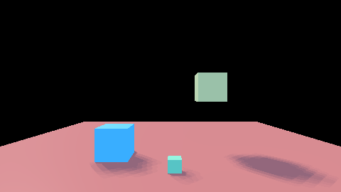

# `src/rendering/contact_shadows/` — layer 4

Screen-space contact shadows on the device: a short trace toward the directional light through the
prepass depth, and the persistent target the forward pass reads as an ADDITION to the shadow map's
visibility.

**Governed by**: `virtual-shadows` — "Contact and traced refinement" — with its budget lever,
`ShadowLever::Refinement`, from `src/rendering/shadows/budget.h`. Change:
`openspec/changes/add-soft-contact-shadows/`, which also carries the soft filter in
`cy/shadow.slang` and `src/rendering/lighting/soft_shadows.h`.

## The files

| File | What it holds |
|---|---|
| `contact.h` | `ContactShadowSettings`, `ContactShadowView`, the push-constant block, `apply_refinement`, and `contact_shadow_reference` — the trace on the host, expression for expression |
| `contact_pass.h` | `ContactShadowPass`: the pipeline, the persistent target, and the stage the frame declares through `FrameStageDeclaration` |
| `shaders/contact_shadows.slang` | `cyContactShadows`, the trace |
| `shaders/regenerate.py` | recompiles it and rewrites `src/contact_spirv.h` and `src/contact_msl.h` |

## The frame

```
depth + normal ─► trace toward the light ─► target ─► opaque: sun visibility = min(map, target)
   (prepass)
```

`AssemblyDescription::contact_shadows` is the setting. On, `ForwardFrame` derives the `DepthNormal`
prepass and at its `FramePassKind::ContactShadows` stage hands the declaration to this module
(`FrameSinks::contact_shadows`), which declares one compute pass writing the target it imported
(`AssemblyView::contact_shadows`). The caller names `target_view()` at a slot of the frame's texture
table and sets `pipeline::kSoftShadowContact` with that slot in `FrameViewData::soft_shadow_control`
(`lighting::write_soft_shadow_words`). Off, no stage is declared and nothing here runs; with the
stage declared and the flag clear the frame does not read the term and is byte-identical to the
frame without it (`render.soft_shadows`, case (a)).

## Four decisions, and why

**Lift the start by a pixel's footprint along the prepass normal.** The depth buffer holds a surface
at pixel centres, and at a grazing view half a pixel of rounding is more depth than a tap near the
start has climbed; without the lift an open floor darkens itself. With it, every tap is above its own
surface by more than the rounding, and `integration.rendering_contact_shadows` holds an open plane at
exactly one at three light elevations.

**Thickness, not infinite depth.** A tap behind a depth sample by more than `thickness` is behind a
surface that is in front of the occluder, not inside it; without the bound every silhouette would
cast a shadow across whatever lies behind it on screen.

**Fade over the second half of the trace.** An occluder in the first half is full shadow; one found
near the end fades to none, so the term has no edge at `length`.

**The darker of the two, in the frame.** The trace cannot see what is off screen or behind the
nearest surface; the map cannot see what is smaller than its texel. `cy/frame.slang` takes `min`, so
an occluder both see is not counted twice.

## Importance and budget

Per pixel: a pixel farther than `max_distance` metres or facing away from the light is not traced.
`apply_refinement(settings, lever_value)` scales `max_distance` by `ShadowLever::Refinement`'s value
(1, 0.5 and 0 by default), so the budget removes refinement from far receivers first and at zero
traces nothing, while the paged result underneath is untouched.

## Backends

Vulkan is built and tested (`render.soft_shadows`). Metal's MSL is generated and committed with the
depth bound as `DepthTexture2D`, so Metal sees `depth2d`; it is compiled by Slang only on this host.
D3D12 is not supported: no DXIL is embedded.

## What it looks like

`render.soft_shadows` writes its frames beside the test binary; the pairs are published under
`docs/design/images/`. The pipeline scene with a directional map, off and with both the soft filter
(a 0.05 rad light, wide enough to see at 480x270) and the contact term on — the box hanging 1.6 m
above the floor casts the soft shadow, the two resting on it stay sharp at their feet:

| Off | Soft and contact shadows on |
|---|---|
|  |  |

And case (d)'s frame — a 128-texel map, 14 cm a texel, too coarse for the contact — with the contact
term off and on:

| Coarse map | Coarse map and contact term |
|---|---|
|  |  |

The beauty shot, off and on, is `just capture-soft-shadows` (`samples/12-beauty/README.md`).
