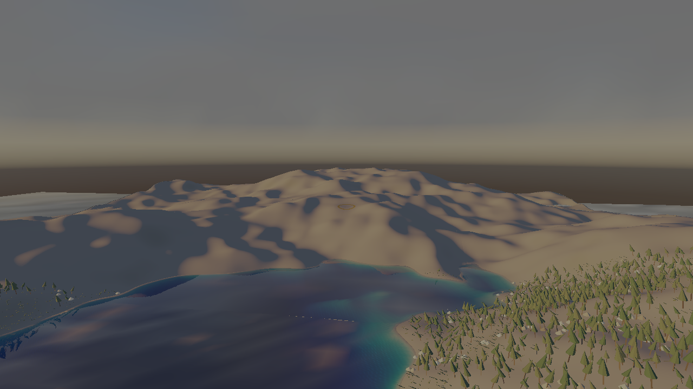

# `src/rendering/decals/` — layer 4

Decals in the forward frame: the table a fragment reads a view's decals from, its upload into the
frame's bindless texture table, and the view-block words that name it.

**Governed by**: `rendering-lighting-and-shadows` — "Decals". OpenSpec change `add-decals`.

| Beauty shot, decals off | Decals on: scorch on the gravel, moss at the pillars' feet |
|---|---|
|  |  |

| `samples/10-world`, no marker | `--ground-marker`: a move order's ring on the terrain |
|---|---|
|  |  |

## Four modules, one seam each

| Module | Owns | Knows nothing of |
|---|---|---|
| `cy::rendering-lighting` (`decals.h`) | what a decal is: the box, the two fades, `decal_application_order`, the budget and its eviction | a device |
| `cy::rendering-forward` (`cluster.h`) | the oriented-box bound, `ClusterElementType::Decal` | decals as such |
| `cy::rendering-assembly` | ranking a view's decals and assigning them beside the lights, as their own element type | a table |
| **this module** | `pack_decal_table`, `DecalTableTexture`, `write_decal_frame` | how a cluster is assigned |

The shader half is `src/rendering/shaders/cy/decal.slang`, called by `cy/frame.slang`'s forward
fragment — and by `samples/12-beauty/shaders/beauty.slang` and `samples/10-world/shaders/world.slang`,
which read the same words from their own bindings.

## The path of one decal

1. **Spawn** — a `DecalInstance` in a `DecalBudget`, or any span of them.
2. **Assign** — `AssemblyView::decals`. The assembly ranks them (ascending `sort_order`, ties on
   `id`: a total order, so the array's own order is irrelevant) and adds one cluster element per decal
   — its oriented box in view space, bounded by the sphere through its corners, masked by its
   channels — to the pass that assigns the lights. The lists name ranks and `assign_clusters` writes
   them ascending, so a list is walked in application order by construction. A decal whose channels
   are empty is in no list: a decal layer of none costs nothing.
3. **Pack** — `pack_decal_table(decals, assembly.decal_order(), materials, origin)`: a 24-word
   header and 36 words per decal, camera-relative in double precision; with `clusters` set, a copy
   of the assembly's decal lists for a shader that has no cluster buffers of its own.
4. **Upload** — `DecalTableTexture::upload` outside a frame, or `declare_upload` + `stage` into one
   when the lists are only known once the frame is assembled. `Rgba8Unorm`, one word per texel,
   1024 texels a row: every device filters it, and a texel-centre sample returns the word bit for
   bit.
5. **Apply** — `write_decal_frame(slot, rows, flags, view)`. The forward fragment finds its cluster,
   reads the `Decal` header of the lists its light loop reads, and for each rank blends the decal's
   albedo, roughness, metallic and emission by `coverage × angle fade × distance fade × edge fade`
   times the per-channel weight, and tilts the shading normal by the decal's relief — all BEFORE the
   light loop, so the decal is lit, shadowed and occluded exactly as the surface under it.

## What the numbers are

Everything a decal writes is a SURFACE PROPERTY — linear albedo, perceptual roughness — never a
colour on screen. The beauty shot's are measured: soot and char reflect two to four per cent of
visible light; a moss mat about five per cent red, nine green and two blue. Relief is the mark's
height at full coverage in metres, and the normal is tilted by its gradient in the decal's plane
(surface-gradient bump mapping), which preserves the receiver's own normal-map detail rather than
replacing it. The free parameters are named where they are set: the fade angle (60° by default, the
angle past which a projection stretches more than twice), the distance fade, and each shape's two
authored parameters — a painted mask would be the same decision in a texture.

## Tests

Built and run in Development and Debug on an RTX 5060 (Vulkan, validation and synchronisation
validation on, 0 errors). Every device case below has been proved red by a mutation of the code it
names and green again once restored: `openspec/changes/add-decals/evidence/falsification.txt`.
`references/decals_off.png` was drawn by this suite against main's `frame_spirv.h`, before the
header was regenerated (`evidence/frame-identity.txt`).

- `unit.rendering_decals` — the table word for word: the header, a record relative to the origin in
  double precision, the lists copied out of an assignment, and the refusals.
- `unit.render_forward` — the oriented box rejects clusters its sphere cannot, and never adds
  one; `integration.render_assembly` — decals are assigned beside the lights as their own type, in
  their own order, and a decal in no channel is in no list.
- `render.decals` — on a device: no table is byte-identical to a committed reference drawn by the
  pre-change frame shader; a decal layer of none, the wrong channels or a full distance fade is
  byte-identical to no decal; a decal changes only pixels inside its box and every pixel well
  inside it; in the receiver's umbra a decal is exactly what it is with the sun off; a steep face
  inside the box is untouched; a later decal covers an earlier one and the array order changes
  nothing; the clustered frame is the frame that walks every decal; twenty thousand decals record
  no draw of their own; relief tilts the normal and zero relief changes nothing. At case (h)'s
  density — 312 marks a square metre — every floor cluster is at the grid's 32-element cap, so the
  lists keep the nearest and count the rest as overflow; the case requires that, not a list holding
  all twenty thousand.

Two defects the device suite found, each with its regression case: `cluster_bounds` counted tile
rows from the bottom of the image while `clusterCoordOf` counts pixel rows from the top, so every
cluster list — lights included — was read mirrored across the horizontal centre line
(`unit.render_forward`, "tile row 0 is the top of the image"); and `cyDecalTableListEntry` added
word 7 to a list offset that is already a table word (`render.decals` (g), the table's own lists).

The beauty shot's `--decals off` frame is byte-identical to the published
`docs/design/images/m11c-beauty-shot.png`.

## What is not here

- **GPU-scene residency.** Decals are assigned by the assembly's CPU cluster pass — the pass the
  lights use, and the reference `rendering-forward-clustered` says the compute pass is checked
  against. Nothing publishes a decal into `render::GpuScene` or culls one in a dispatch.
- **The GPU material table.** A decal names a `DecalMaterial`, resolved into its record at pack
  time, rather than a slot of the frame's material table.
- **The prepass.** The depth prepass's normal target is the receiver's: ambient occlusion and the
  contact trace do not see a decal's relief.
- **One table texture.** `declare_upload` assumes the previous frame's reads completed; a host with
  frames in flight keeps one `DecalTableTexture` per frame.
- **Cluster overflow drops the farthest decal**, as it drops the farthest light — deterministically,
  and counted in `ClusterStatistics::overflow` — so a cluster holding more than
  `max_elements_per_cluster` decals loses marks rather than order.
