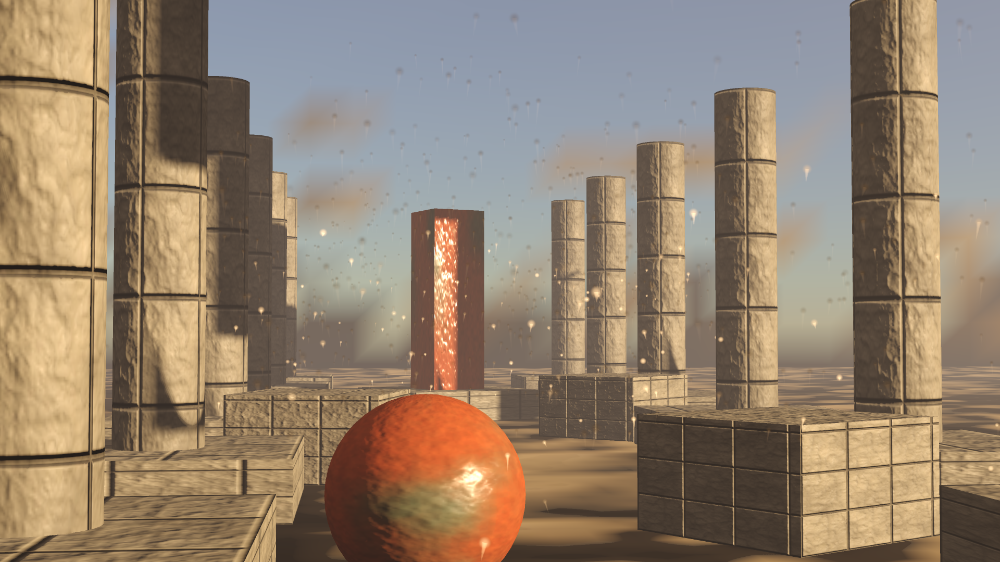

# `src/rendering/fog/` — layer 4

Volumetric fog and light shafts: a froxel volume filled with a participating medium, lit by the
frame's own sun through the directional shadow map and by its ambient term, integrated front to
back, and applied to every surface the frame draws.

**Governed by**: `rendering-post-processing` — "Volumetric fog", and `add-volumetric-fog`'s
"Volumetric fog executes on the device".

**Status: built and run on Vulkan (Linux, RTX 5060); Metal emitted but not run.** `src/fog_spirv.h`
and `src/fog_msl.h` are generated by `shaders/regenerate.py` with the pinned Slang 2026.9.2. The
numbers in "What is tested" are the ones those runs printed. No Apple device ran the MSL.



`samples/12-beauty --fog on`; `docs/design/images/volumetric-fog-beauty-off.png` is the same shot
off, and `samples/10-world`'s README has the world's pair.

## The files

| File | What it holds |
|---|---|
| `medium.h` | the height fog and the authored volumes, in radiative-transfer quantities; `extinction_for_visibility`; `sample_medium` |
| `volume.h` | the camera, the light, the shadow lookup, the device constants, the stored layouts, `fog_at`, `integrate_fog_column`, `single_scattering_reference` |
| `fog_pass.h` | `FogPass`: the dispatch, its target, and the frame's stage |
| `shaders/fog_march.slang` | the march, in two variants: the texture the forward pass reads, and the atmosphere's table with the fog in it |
| `shaders/regenerate.py` | recompiles both and rewrites `src/fog_spirv.h` and `src/fog_msl.h` |
| `../shaders/cy/volumetric_fog.slang` | the lookup a shading pass makes, over any texture source |

## From the setting to the pixel

| Where | What |
|---|---|
| `PostChainConfig::volumetric_fog`, `AssemblyDescription::post` | the setting: step 3 of the chain, off by default |
| `FramePassKind::VolumetricFog` | the frame's stage: after the shadow pass, whose map it reads, and before the opaque pass, which reads the volume |
| `FogPass::stage()`, `FrameSinks::volumetric_fog` | the producer the frame hands the stage to |
| `FrameViewData::volumetric_fog_control` | the texture-table slot `cy/frame.slang`'s forward fragment reads the volume at |

## The quantities are the radiative-transfer ones, and only those

A medium is an extinction coefficient in 1/m, a single-scattering albedo, a Henyey-Greenstein `g`
and an emission. There is no fog colour and no fog start or end distance anywhere in this module:
the colour a fog takes is the light that reaches it times its albedo, and how far one sees through
it is Koschmieder's law, `sigma_t = 3.912 / V` for a meteorological visibility `V`. The height fog is
the isothermal atmosphere's own exponential profile above a base altitude, constant below it. A
mixture's sun scattering is each medium's coefficient times its OWN phase function, which is why
`sample_medium` takes the scattering angle rather than returning one `g`.

**The light is the frame's.** `FogLight` is the sun's illuminance as the surfaces are shaded with it
and the ambient radiance they are lit with, in the frame's own units. An isotropic ambient radiance
is scattered by `sigma_s`, because a phase function integrates to one over the sphere. So the fog in
front of a sunlit wall and the wall itself are lit by one sun, and neither can be tuned apart.

**The free parameters are the air.** A scene states a visibility, a base altitude, a scale height,
an albedo and a `g`, each a number a weather report or a droplet table gives. The volume's
resolution and sub-steps are the only renderer choices.

## One march per column

The four stages the requirement names — density injection, lighting injection, filtering and
integration — are one loop, run by one thread per (x, y) column of the volume:

```
for each slice, for each of `steps` equal sub-steps:
    p   the sub-step's midpoint on the column's ray
    J   sun_scattering(p) E V_shadow(p) + scattering(p) L_ambient + emission(p)
    S  += T J (1 - exp(-sigma_t ds)) / sigma_t;   T *= exp(-sigma_t ds)
store (T, S) at the slice's far edge
```

The step is `rendering-post-processing`'s own `integrate_froxel`: the analytic integral of a
homogeneous sub-step, not a point sample times the length. The medium and the shadow map are read at
every sub-step rather than once at a froxel's centre, which is what resolves a shaft narrower than a
slice is deep.

**No filter pass and no history.** The sub-step midpoints are fixed, so the volume is deterministic
and there is no noise for a filter or a temporal reprojection to remove. What that costs is aliasing
of shafts thinner than a froxel, and a volume that is rebuilt whole every frame. The requirement
asks for temporal reprojection through `temporal-rendering`; that is not built, and the coverage
map's exemption says so.

## The camera is the aerial perspective table's

The basis, the tangents of half the field of view, the column's ray with +y up, and slice `i`'s far
edge at `froxel_slice_depth(volume, i)` metres along forward, integrated from the eye:
`sky::AerialPerspectiveTable`'s geometry, word for word. The texture's header is that table's five
header words plus the eye (`unit.rendering_fog` compares the two), so one sampler shape reads both,
and the lookup interpolates the same way — bilinear across columns, linear in depth from an implicit
identity slice at the eye, so a surface a metre away is not given the first slice's whole haze.

## Two targets

**`FogTarget::Texture`** — one `Rgba32Sfloat` texture, 2W by 1 + H·D: a six-texel header in row 0,
then per slice and row the column's transmittance at texel x and its in-scattering at texel W + x.
A 2D texture because every consumer reads through a 2D texture-table slot. `cy/frame.slang` and
`samples/12-beauty` read it through `cy/volumetric_fog.slang`.

**`FogTarget::AerialTable`** — `sky::pack_aerial_perspective`'s layout in a buffer, with the
atmosphere composited in. When `FogFrame::air` names the atmosphere's table, the march reads each
slice's stretch of air out of it — `T = T(far) / T(near)`, `S = (S(far) − S(near)) / T(near)` —
turns it into the extinction and source of a homogeneous medium that transmits and adds exactly that,
and marches it WITH the fog, per channel. The air is then in front of the fog and behind it in the
proportion they share each slice. `integration.rendering_fog_air` holds the three consequences: an
empty fog reproduces the table, a switched-off table leaves the fog as it was, and together they
transmit the product. `samples/10-world` binds it where the atmosphere's table was.

## Off, and empty, are the frame before

With the setting off no pass is declared and no slot is written, and every consumer's fragment is
the arithmetic it was. With it on over an empty medium the volume holds exactly one and exactly zero,
and the lookup's interpolation is written `a + (b − a) t` rather than with the intrinsic, which may
be evaluated as `a (1 − t) + b t` and does not return exactly one between two texels that both hold
one. `render.volumetric_fog` requires both frames byte-identical.

## What is tested

| Suite | What it can fail on |
|---|---|
| `unit.rendering_fog` | Koschmieder's two percent; the height profile; every shape inside, outside and on its edge; the mixture's phase; the constants' refusals; the header against the aerial table's; the shadow lookup |
| `integration.rendering_fog_march` | the march against the single-scattering integral (worst in-scattering 9.9e-4, transmittance 6.4e-4) and a closed form; the empty medium's exact identity; the lookup against the march. Integration because each marches whole columns, 1.5 to 18 ms of CPU |
| `integration.rendering_fog_air` | the atmosphere composition's three consequences |
| `render.volumetric_fog` | (a) off byte-identical to `tests/references/volumetric_fog_off.png`, drawn by main's frame shader before it was regenerated; (b) an empty medium byte-identical to off, every froxel exactly one and zero; (c) of the open-air froxels the map covers, the 3674 wholly in an occluder's shadow all scatter under a tenth of the sun and the 59339 wholly in the open all over nine tenths; (d) the device's volume against the single-scattering integral (worst 8.2e-4) and the host march (3.8e-5); (e) a floor through an absorbing fog keeps 0.64 near and 0.32 far, no channel brighter; (f) the table variant against the host march over a table the processor built (7.1e-5). Each case was proved red by a mutation: `openspec/changes/add-volumetric-fog/evidence/falsification.txt` |
| `unit.render_forward` | the stage between the shadow pass and the opaque pass, its declared read, and its refusals |

## What is not here

Temporal reprojection and a filter pass (above). Indirect light from the radiance cache: the ambient
term is the frame's own ambient radiance, and `rendering-global-illumination`'s radiance cache is not
read. Punctual and spot lights in the medium: only the directional sun is marched, so the
requirement's spot-light shaft scenario is met by the sun's. Arbitrary density functions: the height
fog is the one density function. Particles and trails, which are drawn by their own shaders and
read no volume; the frame's transparent surfaces are drawn by the same forward fragment as its
opaque ones and are seen through the fog, their in-scattering blended with their alpha.
