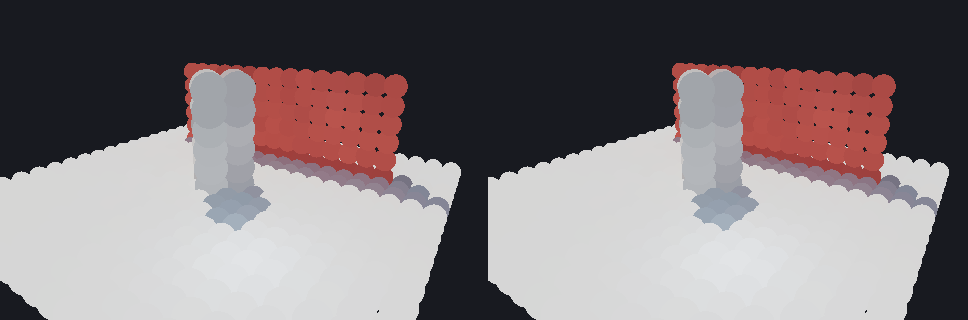

# `src/rendering/gi_gpu/` — layer 4

CyberGI on the device, first slice: the GI scene's distance-field clipmaps and surface cards
uploaded incrementally (issue #35, stage 1), and the surface cache's card lighting in compute
(stage 2). **Nothing here is composited into the frame yet** — that is stage 4 — so no frame the
tree draws reads anything this module writes.

**Governed by**: `rendering-global-illumination` — "Surface cache", "Distance field
representation", "Incremental invalidation". Change: `openspec/changes/add-gpu-gi-surface-cache/`.



The lit cards of `render.gi_gpu`'s courtyard — a floor, a pillar casting the sun's shadow through a
shadow map, a red wall, a blue lamp — after four frames of the update, splatted as discs: the host
surface cache on the left, the device one on the right.

## The files

| File | What it holds |
|---|---|
| `gpu_scene.h` | `GpuGiScene`: the page table, the brick pool, the cards, the card state, the lookup grid, the lights, the shadow map, the three pipelines, and a trace batch against the uploaded field |
| `gpu_surface_cache.h` | `GpuSurfaceShading`: a `gi::SurfaceShadingBackend` that shades the selected pages in compute |
| `shaders/gi_gpu_common.slang` | the one descriptor set, the constant words, and every host function the dispatches transcribe |
| `shaders/gi_trace.slang` | `cyGiTraceRays`: `DistanceField::sphere_trace` over the uploaded field |
| `shaders/gi_cards.slang` | `cyGiShadeCards` and `cyGiCommitCards`: the card update, in two dispatches |
| `shaders/regenerate.py` | recompiles the three entry points and rewrites `src/gi_gpu_spirv.h` and `src/gi_gpu_msl.h` |

## Three modules, one seam each

| Module | Owns | Knows nothing of |
|---|---|---|
| `cy::rendering-gi` | the field, the cards, the scheduler, the lookup, and the host oracle in `card_lighting.h` | a device |
| **this module** | the device copy and the dispatches | how a brick is solved or which page to shade |
| `cy::rendering-pipeline` | the frame | this module, until stage 4 |

The choice between host and device is one call: `IlluminationSystem::set_surface_shading(&shading)`
(or `SurfaceCache::set_shading_backend`). The cache keeps every decision — allocation,
invalidation, the prioritised budgeted selection (`SurfaceCache::select`), the lookup a traced hit
resolves through — and the backend does the arithmetic on the pages the cache chose.

## What a caller does

```cpp
GpuGiScene scene;
scene.create(allocator, device, {});
GpuSurfaceShading shading;
shading.bind(scene, system.field(), system.surfaces().lookup_radius());
shading.set_shadow_map(&sun_shadow);           // optional; a gi::ShadowMap
shading.set_gather({rays, max_distance, sky});
system.set_surface_shading(&shading);
// per frame:
system.update(context);                        // selects, and submits: uploads what moved
shading.declare(graph);                        // shade, commit, copy back
// ... execute, wait for the fence; the next update() retires the results ...
```

## Incremental, and how that is checked

The field keeps a change journal: `DistanceField::generation()` counts scrolls and `last_changes()`
lists the bricks the last scroll solved — re-solved because an invalidation cause reached them, or
exposed by the scroll. A device copy one generation behind applies that list; anything else rebuilds
its page table from `visit_bricks` and reports `full`. Cards carry `SurfacePage::revision`, bumped by
allocation, release and invalidation, and a card is written when its revision moved. A still frame
uploads nothing: `render.gi_gpu`'s `a moved object re-uploads only the bricks it touched` checks
all three.

## How close the device is to the host

Measured on the RTX 5060 (`render.gi_gpu`, Vulkan):

| | |
|---|---|
| sphere trace, 1 024 rays in the room | MEASURED_TRACE |
| door moved | MEASURED_DOOR |
| room, six converged frames, direct | MEASURED_ROOM_DIRECT |
| room, six converged frames, accumulated | MEASURED_ROOM_BOUNCE |
| courtyard under the shadow-mapped sun, direct | MEASURED_YARD_DIRECT |
| budget 48 over 402 pages | exactly the host selection each frame, every page valid after 9 frames |

## What is not here

- **The composite.** Stage 4: the per-pixel resolve, the denoiser transcription, and the forward
  frame's ambient term. Until then the frame is untouched.
- **The radiance cache and the tracing tiers on the device.** Stage 3. The card gather here traces
  the field and reads the cards directly — the surface-cache radiosity — rather than reading a
  radiance cache that is still host-side.
- **Frames in flight.** Every buffer is host-visible and written in place, which is right for a
  suite that drains each frame; stage 4 adds per-frame staging before a live frame uses this.
- **The frame's shadow cascade.** The shadow map is a `gi::ShadowMap` depth array the host provides
  (captured from the field, or assigned from a renderer's pass); binding the cascade is stage 4.
- **The budget.** The device cost is not yet in `GiBudget` or the arbiter's ladders (stage 5).
- **D3D12.** SPIR-V and MSL are committed and `just build-shaders --strict` compiles every entry
  point for DXIL too, but there is no D3D12 bundle in the module yet.
