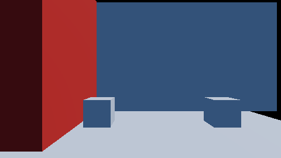
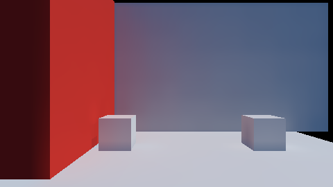

# `src/rendering/light_probes/` — layer 4

An irradiance volume in the forward frame: `gi::IrradianceVolume`'s probes as a texture the forward
pass samples in place of the flat ambient, and the view-block words that place the volume.

**Governed by**: `rendering-global-illumination` — "Irradiance volumes and light probes".
OpenSpec change `add-light-probes`.

| Off: the flat ambient | On: the irradiance volume |
|---|---|
|  |  |

With ambient occlusion on as well, the volume's term is darkened at the contacts — where the walls
and the cubes meet the floor — and left alone in the open:
[light-probes-with-occlusion.png](../../../docs/design/images/light-probes-with-occlusion.png).

The pipeline suites' scene rearranged into a corner (`render.light_probes`): a red wall, a white back
wall and two white cubes on a white floor, one 100 000 lux sun travelling toward -x with no z
component. The back wall and the cubes' fronts face the camera and receive no direct light, so what
they show is the ambient term alone. Off, it is one colour everywhere. On, the back wall is lit by
the sunlit floor (brightest at its foot), and the wall and the cube beside the red wall turn red
while the far ones do not.

## Three modules, one seam each

| Module | Owns | Knows nothing of |
|---|---|---|
| `cy::rendering-gi` (`irradiance_volume.h`, `proxy_scene.h`) | the grid, the capture, the update policy, the sampling rule, `pack_texels` | a device |
| `cy::rendering-pipeline` (`FrameViewData::probe_volume_*`, `cy/frame.slang`) | the frame block and `probeVolumeAmbient` | GI |
| **this module** | the texture, its upload, `write_probe_volume` | how a probe was captured |

The shader function is a transcription of `IrradianceVolume::ambient`; `render.light_probes` case (c)
holds the two to the same picture over the back wall.

## What a caller does

1. Configure a `gi::IrradianceVolume` over the region, capture it (`capture_all`) from a
   `SceneTracer` + `RadianceLookup` + `SkyTerm` — `gi::BoxProxyScene` is one — and run `update()` as
   the policy says.
2. `ProbeVolumeTexture::upload(volume)` outside the device frame. It copies only when the volume's
   generation changed.
3. Put `texture.slot(n)` in the frame's set 0 texture table and call `write_probe_volume(n, volume,
   texture.layout(), camera, upload.view)` before the frame's upload.

A frame that skips step 3 draws the flat ambient exactly as before; case (d) holds it to a committed
reference drawn by the pre-change shader.

## What is not here

Not full dynamic GI. No capture on the device; nothing re-captures when a light moves unless the
caller invalidates or uses `Amortised`; probes on a regular grid only; no specular; the visibility
term is six axis distances per probe; the sky in the capture is the frame's flat ambient as a
uniform radiance, which is what makes the volume agree with the flat term where only sky is seen.
No beauty-shot integration: `samples/12-beauty` has no GI scene to capture from.
