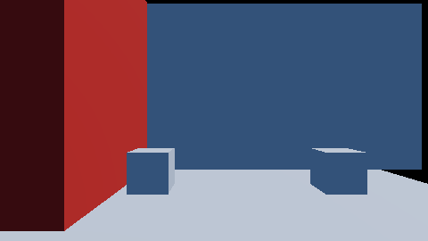
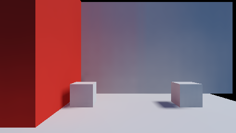
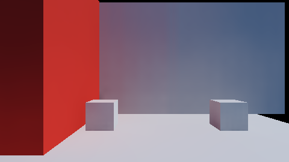
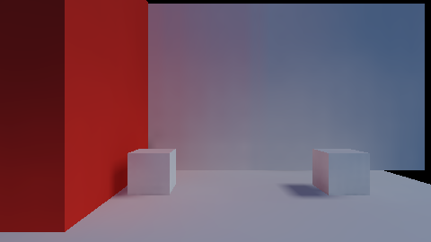
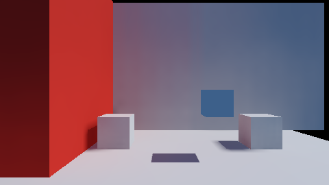
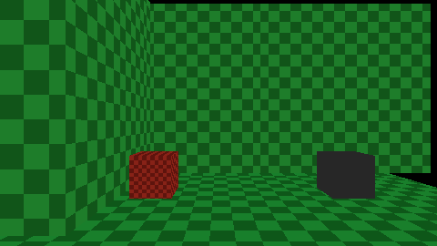

# `src/rendering/lightmaps/` — layer 4

A baked lightmap in the forward frame: `lightmap_bake::BakedLightmap`'s planes as textures the
forward pass samples at its ambient term, the view-block words that describe them, and the one rule
— read off `gi::exclusion_for()` — for which ambient source a surface takes.

**Governed by**: `rendering-global-illumination` — "Lightmap baking", "UV2 and chart packing".
OpenSpec changes `add-lightmap-baking` and `add-lightmap-frame-shadow-mask`. Issue #36, stages 3
(the frame's half) and 4, and the mip chain.

| No lightmap: the flat ambient | The corner's lightmap |
|---|---|
|  |  |

`render.light_probes`' corner — a red wall, a white back wall and two white cubes on a white floor
under one 100 000 lux sun — baked by `lightmap_bake::bake_lightmaps` from the same boxes. The back
wall and the cubes' fronts face the camera and receive no direct light, so what they show is the
ambient term. With the lightmap the back wall is lit by the sunlit floor and turns red beside the
red wall, and the cube beside it does too.

The two pictures are the Vulkan leg's, captured before the frame read the shadow mask. The bake
behind the right-hand picture then: six boxes, one 256 x 256 page, 10 649 texels traced at 24
samples and one bounce, 8 881 more filled by dilation, about 0.5 million rays, in 0.9 s on one core
of the development machine. Today the cubes' UV2 cells leave the padding one mip level needs (see
"The mip chain"), and the same bake traces 10 180 texels, fills 19 184 by dilation and casts 0.49
million rays in 0.91 s (M2 Max, one core); on the device, every level included, it is 640 KiB as
irradiance (Rgba16Sfloat), 1 280 KiB directional and 1 920 KiB SH L1, and the sun's shadow mask
320 KiB more. The atlas itself, first plane, cropped to the rows the corner uses:

## Three modules, one seam each

| Module | Owns | Knows nothing of |
|---|---|---|
| `cy::rendering-lightmap-bake` | the atlas, the bake, the encodings, the cooked payload, `sample_lightmap` | a device |
| `cy::rendering-pipeline` (`FrameViewData::lightmap_*`, `GeometrySource::lightmap_uvs`, `cy/frame.slang`) | the frame words, the fourth vertex stream and `lightmapAmbient` | GI |
| **this module** | the planes' textures and upload, `write_lightmaps`, `frame_ambient_source` | how a texel was traced |

`lightmapAmbient` is a transcription of `lightmap_bake::atlas_coordinate` and `sample_lightmap`;
`render.lightmaps` (b) holds the frame to the host sampler over every pixel of the corner.

## What a caller does

1. Bake (or load a cooked `lightmap`, `decode_lightmap_asset`) and `LightmapTextures::upload` it
   outside the device frame: every plane and the shadow mask, every mip level. An unchanged
   lightmap is not copied again, but finding it unchanged hashes every texel, so call it when a
   lightmap was baked or loaded rather than every frame.
2. Put `textures.slot(plane, n)` for each plane — and `textures.shadow_mask_slot(m)` when
   `has_shadow_mask()` — in the frame's set 0 texture table, and call
   `write_lightmaps(slots, lightmap, mode, frame_light_ids, upload.view)` before the frame's upload,
   with the stable id of each of the frame's lights in `AssemblyView::lights`' order. Under a mode
   `exclusion_for()` says excludes lightmaps (`Probe`, `Dynamic`, `None`) it writes nothing.
3. Give each lightmapped draw its rectangle: `DrawSurface::gi_address = lightmap.addresses[i]`.
4. Put the meshes' cooked `TexCoords2` in `GeometrySource::lightmap_uvs`, laid out like UV0.

A draw whose address is zero is lit as before, and a frame with no lightmap, or one no draw
addresses, is byte-identical to the frame drawn before lightmaps existed: `render.lightmaps` (c)
holds it to `references/lightmaps_absent.png`, a copy of `render.light_probes`' reference drawn by
the frame shader of 0f1dfd1.

## Which ambient source

The frame's ambient is ONE source, where the resolve's is a confidence-weighted mean of several: the
lightmap and the volume each already hold the sky and the bounces. `frame_ambient_source` takes the
highest-priority source `exclusion_for()` admits — lightmap, volume, flat sky — and `render.lightmaps`
(d) binds a volume beside the lightmap and requires every lightmapped pixel unchanged and the one
unlightmapped cube to take the volume.

## The baked lights

`write_lightmaps` matches the bake's `gi::GiLight::id`s against the frame's lights and writes which
frame light each shadow-mask channel shadows (`lightmap_shadow_lights`) and which frame lights'
direct terms the texels already hold (`lightmap_direct_lights`, every static light). On a
lightmapped surface `cy/frame.slang` reads the mask once, at the ambient term's coordinate, and:

- a **stationary** light's direct term is the frame's — its intensity and colour, so it can be moved,
  dimmed or recoloured at run time — times `min(realtime shadow, mask channel)`;
- a **static** light's direct term is not shaded at all: it is in the texels;
- every other light is shaded as it was.

A lightmap the frame cannot describe is refused, and the refusal writes nothing. The frame can name
a static light only among its first 128 lights (`pipeline::kMaxLightmapDirectLights`), and one past
that fails `write_lightmaps` with `InvalidArgument`. The light words are built apart from the view,
so a refused view still has no lightmap switched on over half its baked lights. Whether a level
reaches that cap depends on where its caller puts the static lights in `AssemblyView::lights`.

`render.lightmaps` holds it on the device, on the M2 Max's Metal leg:

| Case | Measured on Metal |
|---|---|
| (g) the stationary sun, dimmed to 35% at run time | the 103 floor pixels deep in its baked shadow move by 0, the lit floor by −169; unmatched to the bake, the same shadowed pixels are lit and move by −171 |
| (h) the static sun | adds nothing to any of 119 117 lightmapped pixels (worst 0), still lights the unlightmapped cube (worst 139), and the texels alone light the floor 324 brighter than an indirect-only bake |
| (k) a stationary point light, the mask's second channel, through the cluster walk | its 899 shadowed floor pixels move by 0 dimmed to 30%, the lit floor by −56 |
| (m) the stationary sun with its real-time shadow map bound, and a movable box no bake saw hanging over the floor | the frame through both shadows is, channel for channel, the darker of the frame through the mask alone and the frame through the map alone, at every pixel (worst 0); the map alone darkens 1 117 pixels past the mask, the box's shadow among them |
| (c) no lightmap | byte-identical to `references/lightmaps_absent_metal.png`, the corner drawn by main's frame shaders on the same machine |

| Stationary sun, baked shadow | The same frame, no baked shadow | Dimmed to 35% at run time |
|---|---|---|
|  |  |  |

(m), below, shows the baked mask and the real-time map together. The floating box has no lightmap
and is in no bake, and only the map sees its shadow on the lightmapped floor.

## The mip chain

The atlas's gutter and chart padding were laid out for `AtlasLayout::mip_levels` levels below the
base, and the bake now fills them (`lightmap_bake::build_lightmap_mips`, filtered per chart — see
`lightmap_bake/README.md`). The upload carries every level of every plane and of the mask, and the
frame samples both with the implicit level of detail. (i) reads every level back off the device and
finds the bake's halves byte for byte; (l) draws a probe atlas grey at level 0 and red below it,
and the far floor, minified, reads red (6 606 of 6 606 pixels) where the near floor reads grey (0 of
2 578). The chain costs a third of the base: the corner's directional bake with its mask is
1 920 KiB on the device, 1 536 KiB of it level 0.

## The texel-density view

`write_lightmap_debug_view(render::DebugViewMode::LightmapDensity, target, view)` — or
`write_lightmap_density_view(target, view)` — draws every lightmapped surface as a checker of its
own lightmap texels, green at the target density, toward blue at half of it, toward red at twice it,
and every other surface flat grey. The density is measured, not looked up: texels per metre are the
screen-space derivatives of the atlas coordinate over those of the position. It is the engine half
of the editor's `viewport.view-mode.lightmap-density`. (j): the back wall, baked at the level's
density, is green (rgb 23 105 33); the near cube, at four times it, red (115 27 18); the
unlightmapped cube grey (39 39 39). The same wall measured against four times the target is blue
(18 41 114). The colour is divided by the frame's exposure: two stops brighter, the view is the same
to the byte.

## What it costs

`render.lightmaps` (n) times the corner (480x270) three ways, one frame of each in turn over 96
frames. On the M2 Max the median frame times were:

| Configuration | Median frame time |
|---|---|
| No lightmap | 3 352.6 µs |
| Lightmap, static sun, no mask | 3 340.4 µs |
| Lightmap, stationary sun through its mask | 3 354.0 µs |

The interquartile ranges are about 90 µs. At this size the lightmap's cost is below what the
measurement resolves.

These are host-clock times, measured from the start of a frame's recording until the device goes
idle. They are not GPU times: `rhi-metal`'s timestamps sample nothing on Apple silicon (#65). A
GPU-only figure at a production resolution is still owed.

## Two legs

`render.lightmaps` runs on Vulkan and `render.lightmaps_metal` on Metal, from one source. On this
tree's development Mac only the Metal leg has a device; the Vulkan leg compiles and skips, and its
cases — and its pinned reference, drawn by the Vulkan frame — need a run on the Linux RTX machine.

**The first run there (RTX 5060, NVIDIA 580.95.05, 2026-09-30)** found two things. Thirteen of the
fourteen cases pass, and (c)'s pinned reference matches byte for byte.

- **(i) left the atlas laid out for a copy.** `read_level` imported a texture as sampled, copied one
  level out and never put it back, so the next import's claim was false and Vulkan validation
  reported six sampled reads of a level still in `TRANSFER_SRC_OPTIMAL`. Metal has no layouts,
  which is why the Mac never saw it. The readback now ends on a sampled read, as `LightmapTextures`'
  own upload does, and (i) runs with no validation error.
- **(c) loses the device on this driver.** Its fourth `CornerRun`'s second frame ends in
  `vkDeviceWaitIdle` returning `VK_ERROR_DEVICE_LOST`, and the kernel logs Xid 109 (`CTX SWITCH
  TIMEOUT`). It is deterministic, and it follows the device's history rather than the case: four
  lightmapped runs on one device draw, as do two unlit runs followed by three lightmapped ones,
  while one unlit run followed by three runs that bind a lightmap loses the device on the fourth. With
  `VK_EXT_device_fault` the driver reports an invalid READ inside the VA of the frame's transient
  depth image from two frames earlier, destroyed after the device had gone idle, and that VA is no
  longer bound. The frame names that depth image nowhere: it passes no descriptor to the forward
  shader, the fault stays with the temporal pass's depth binding replaced and with transient
  aliasing switched off, and keeping retired depth images alive is the only change that removes it.
  Core and synchronisation validation report nothing up to the loss; GPU-assisted validation
  reports nothing and the run draws; the same binary draws all four of (c)'s runs on this host's
  Intel UHD 770 (Mesa ANV 25.2.8) and on lavapipe. The evidence points at the NVIDIA driver's handling of a
  destroyed depth attachment, not at a use the engine makes of it, so (c) stays red and nothing in
  it was relaxed. Recycling transient images across frames instead of destroying them would avoid
  the pattern and is the candidate workaround.

## What is not here

A streamed atlas; per-region mask channels (a fifth stationary light is refused by the bake); the
editor-hosted runtime (`samples/05b-editor-window`) drawing a cooked lightmap, and so the density
view inside the editor's own viewport, which draws no debug view of any kind yet.
