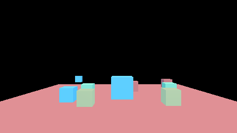
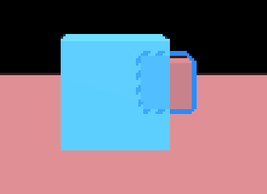

# `src/rendering/selection/` — layer 4

Selection outlines and unit highlights: a mask of the objects a game marked, drawn with the frame's
own geometry, and an edge pass that outlines them over the tonemapped colour — solid for a
selection, a softer glow for the object under the cursor, and dimmed and dashed where something
hides the object.

**Governed by**: `editor-viewport-and-gizmos` — "The rendering responsibility split" puts
"selection outlines, highlight rendering, and overlays" on the engine's side — and
`editor-visual-language` — "Selection appearance". Change: `openspec/changes/add-selection-outlines/`,
which adds "Selection and highlight outlines" to `rendering-post-processing` for the strategy-game
case neither of those asks for: many units, hover, and the occluded display.

## The files

| File | What it holds |
|---|---|
| `highlight.h` | `HighlightSet` (marks by stable identity, a palette of up to 255 styles), `OutlineSettings`, the composite's constants, and `outline_reference` — the edge pass on the host, expression for expression |
| `outline_pass.h` | `OutlinePass`: the mask and composite pipelines, the style ring, and the stage the frame declares through `FrameStageDeclaration` |
| `selection_component.h` | `SelectionHighlight`, the gameplay component, and `gather_highlights` |
| `shaders/selection_mask.slang` | `cyOutlineMaskVertex` and `cyOutlineMaskFragment`, through `cy.frame`'s own placement |
| `shaders/selection_outline.slang` | `cyOutlineVertex` and `cyOutlineComposite`, the edge pass |
| `shaders/regenerate.py` | recompiles both and rewrites `src/selection_spirv.h` and `src/selection_msl.h` |

## The frame

```
post-process ─► output ─────────────────────┐
                                             ├─► composite (blended) ─► ui and debug ─► present
marked opaque draws ─► mask + mask depth ───┘      ▲
   (frame geometry, sets 0 and 1)                  └── prepass depth: hidden or on screen
```

`AssemblyDescription::selection_outlines` is the setting. On, `ForwardFrame` declares the
`FramePassKind::SelectionOutlines` stage after the post-process and before the interface, and hands
it to this module (`FrameSinks::selection_outlines`), which declares two passes: the mask — the
opaque draws whose stable identity is marked, drawn again into a transient `R32Uint` word a pixel
(the style slot) and a transient depth, tested only against each other — and the composite, a
full-screen triangle over the colour the chain ended in. Off, no stage is declared. On with nothing
marked, the mask clears, nothing is drawn into it, the composite is not recorded, and the frame is
the frame without the stage, byte for byte (`render.selection_outlines`, case (e)).

## What a game does

In C++, with the pass:

```cpp
highlights.select(unit, kTeamBlue);          // solid, `selected_width` pixels
highlights.hover(enemy, kEnemyHover);        // a glow, `hovered_width` pixels
pass.set_highlights(&highlights, settings);
sinks.selection_outlines = pass.stage(recorder);
```

From gameplay, in C++ or Swift, a component on the unit's entity, gathered once a frame:

```cpp
world.add(unit, highlight_id, &SelectionHighlight::selected(kTeamBlue));
gather_highlights(world, highlight_id, highlights);
```

```swift
try world.highlight(unit, .selected(red: 40, green: 140, blue: 255))
try world.highlight(enemy, .hovered(red: 255, green: 96, blue: 64))
try world.clearHighlight(unit)
```

A mark is keyed by the entity's bits, which is the stable identity the extract stage gives the
entity's draws — never a GPU slot or a draw index, both of which move. The component is registered
by name, so Swift finds it with `world_find_component` and writes it with `world_add_component` —
no new ABI entry. `unit.abi_selection` drives that path through `cy_get_interface`.

## Five decisions, and why

**After the tone curve.** An outline before bloom blooms; before exposure it is scaled by the
scene's exposure. After the curve the colour asked for is the colour in the output, and the suite
checks it byte for byte. The hovered glow is the edge pass's own falloff for the same reason.

**The marked objects drawn again, not an id channel in the prepass.** Nothing is drawn when nothing
is marked, the frame's shaders are untouched, and — because the mask tests marked objects only
against each other — the mask holds the whole silhouette of a partly hidden unit, which is what the
occluded style needs. The mask uses the frame's own placement functions, so a visible marked surface
lands on the prepass depth; `OutlineSettings::depth_tolerance` absorbs the last bits.

**One push word, split 24/8.** The mask pipeline shares the frame's layout for sets 0 and 1, so it
must share its one-word push range; the draw index takes 24 bits and the style slot 8. The palette
holds 255 distinct (kind, colour) pairs, compacting unused ones before refusing a new one.

**Nearest marked pixel, strictly nearer wins.** Outside a silhouette the edge pass takes the nearest
marked pixel whose style reaches it, row by row, and a tie goes to the first in scan order — on the
device and on the host alike, so the suite compares the two pixel for pixel.

**Discard, don't blend zero.** A pixel with nothing to draw is discarded, so the output is untouched
by construction rather than by a blend unit's rounding.

## Cost

The composite searches a disc of the widest style in use: 289 taps a pixel at the eight-pixel
maximum, 25 at the default two-pixel selection alone. A separable exact distance transform would
make that 34 at the price of a second target; it is the change to make if widths grow. The mask pass
costs one position-only draw per marked draw.

## Backends

Vulkan is built and tested (`render.selection_outlines`). Metal's MSL is generated and committed —
the mask with `CY_FRAME_METAL` and `CY_MATERIAL_METAL_ARGUMENT_BUFFER`, as `cy/frame.slang` asks of
every importer — and is not exercised on this host. D3D12 is not supported: no DXIL is embedded.

## What it looks like

`samples/13-rts-selection` photographs a squad selected by a drag box, an enemy under the cursor and
a unit behind a building (`docs/design/images/rts-selection-*.png`), and `render.selection_outlines`
writes its own frames beside the test binary (`selection-outlines-*.png`).

| Nothing selected | Selected, hovered, and one unit behind a building |
|---|---|
|  |  |


