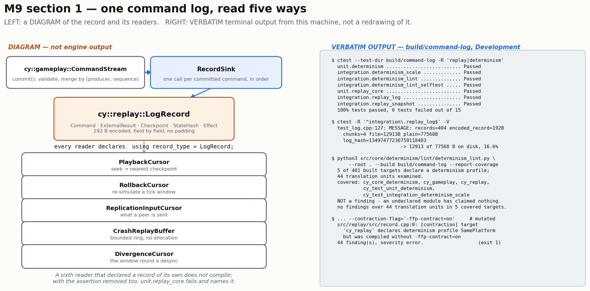
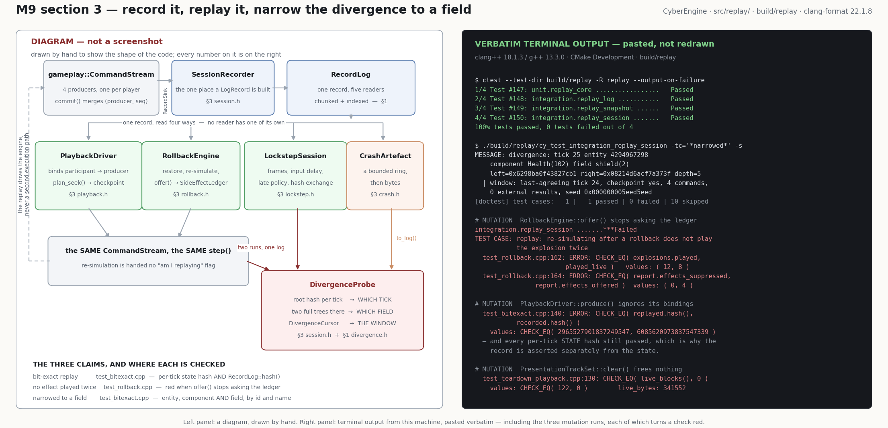

# `src/replay/` — one record, five readers

Layer 4 (`scene`), `cy::replay`, headers `<cy/replay/*.h>`, namespace `cy::replay`.

Governed by `openspec/specs/replay-and-rollback/spec.md`, which reaches **Working** at M9. This
directory is M9 **sections 1 and 3**: the first half is the record and the four things written into
it or read out of it; the second half, at the bottom of this file, is the loop that reads it back
into a running session — playback and seeking, rollback re-simulation, lockstep and the crash
artefact. Section 4 (the transport) is `src/networking/` and is **not here**.

| File | Task | What it owns |
|---|---|---|
| `record.h` | 1.1, 1.5 | `LogRecord`, its encoding, `LogReader`, `log_readers()` |
| `log.h` | 1.1 | `RecordLog`, the chunk index, the compatibility manifest, `write_log`/`read_log` |
| `external.h` | 1.2 | `ExternalResults` — the one door an external value comes through |
| `snapshot.h` | 1.3 | `SnapshotKind`, `StateCapture`, `CheckpointPolicy`, `SnapshotRing` |
| `ledger.h` | 1.4 | `SideEffectLedger` — what must not be applied twice |
| `readers.h` | 1.5 | Playback, rollback, replication input, the crash ring |
| `divergence.h` | 1.5, 2.5 | The divergence window — the fifth reader |

The seam that fills it is `cy::gameplay::CommandStream::RecordSink`, in
`src/gameplay/include/cy/gameplay/command.h`.



***`docs/design/images/m9-one-record-five-readers.png` — the LEFT panel is a DIAGRAM and says so on
its own face; the RIGHT panel is VERBATIM terminal output from this machine, pasted rather than
redrawn.*** The numbers in it are measurements: 404 records at 192 bytes encoded compress to 12 913
of 77 568 bytes on disk (16.6%), and the determinism lint covers 5 of 401 built targets — a ratio
the lint prints on every run rather than a sentence anyone has to trust.

## The six claims worth arguing with

### 1. The five readers cannot fork the record, and that is checked rather than reviewed

`replay-and-rollback` requires that "Replay, rollback, and lockstep SHALL share one command log" and
that "A second representation of participant intent SHALL NOT exist". It states that over **three**
readers and the engine has **five**: the crash replay buffer and the divergence validator read the
same records and neither appears in that list.

So `LogRecord` is the record; every reader declares `using record_type = LogRecord;`;
`static_assert(ReadsTheOneRecord<X>)` in `record.cpp` names every one of them; and `log_readers()`
is built out of `bind_reader<>()` rather than restated.
`tests/test_one_record.cpp` compares the five bindings' record identity against `LogRecord`'s and
the enumeration's coverage against `LogReader::Count`.

**Proved by mutation, at both depths.** `bind_reader<>()` is constrained on `DeclaresARecord` and
*not* on `ReadsTheOneRecord`, deliberately: if binding required the record to be `LogRecord`, then
substituting a reader's record would be a compile error and the runtime case could never be reached
— a check with no way to fail. So there are two mutations and two failures.

`RollbackCursor::record_type` pointed at a struct of its own:

```
$ cmake --build build/command-log --target cy_replay
src/replay/src/record.cpp:250:15: error: static assertion failed
  250 | static_assert(ReadsTheOneRecord<RollbackCursor>);
      |               ^~~~~~~~~~~~~~~~~~~~~~~~~~~~~~~~~
src/replay/src/record.cpp:250:15: note: constraints not satisfied
```

The same mutation with that assertion removed as well, so the build gets through:

```
$ ctest --test-dir build/command-log -R '^unit\.replay_core$' --output-on-failure
unit.replay_core .................***Failed
TEST CASE:  replay: every reader of the command log reads LogRecord and not a type of its own
  test_one_record.cpp:43: ERROR: CHECK_EQ( binding.record_type_id, LogRecord::kRecordTypeId )
    values: CHECK_EQ( 1380928588, 1129925681 )
  test_one_record.cpp:44: ERROR: CHECK_EQ( binding.record_size, sizeof(LogRecord) )
    values: CHECK_EQ( 16, 208 )
[doctest] test cases: 26 | 25 passed | 1 failed
```

Restoring the alias makes both pass again.

### 2. The record is fixed-size, and its encoding never touches padding

Every record is `kEncodedRecordSize` bytes whatever its kind, so the in-memory log is an array, the
crash ring is a ring of values with no allocation, and seeking within a chunk is arithmetic. It
costs: a state-hash record carries a `Command`'s worth of bytes it does not use. The crash replay
buffer is the reader that decides the trade, because a bounded ring written from a crash path cannot
allocate and cannot afford a variable stride.

`encode()`/`decode()` write each field at a fixed offset, little-endian. A `memcpy` of the struct
would write its padding, and padding is whatever last occupied those bytes — two runs agreeing about
every value would produce different files, which is exactly the class of defect this milestone
exists to detect. `tests/test_record.cpp` builds the same record by two routes, one of which dirties
every byte of the struct first, and compares the encoded bytes.

### 3. The ledger keys on the tick and NOT on the `(epoch, tick)` pair

`epoch.h` is explicit that a moment is a pair and that two points with the same tick in different
epochs are different moments. A rollback restores a checkpoint, which advances the epoch. **If the
ledger keyed on the pair, the re-simulated tick would never match the entry the first simulation
wrote, every explosion would play twice, and the ledger would be an elaborate way of storing
nothing.** The key is `(kind, instance, tick)`; the epoch is recorded beside it so a diagnostic can
say "first realised in epoch 1, suppressed in epochs 2 and 3".

`ExternalResults` matches on `(source, tick)` for the same reason and says so at the function.

**The duplicate-effect proof is a negative control.** `docs/ROADMAP.md` makes it an exit criterion
and `replay-and-rollback`'s M9 delta requires the demonstration rather than the assertion. The
mutation: `SideEffectLedger::realise()`'s duplicate branch replaced with an unconditional
`return EffectVerdict::Realise;`.

```
$ ctest --test-dir build/command-log -R '^unit\.replay_core$' --output-on-failure
unit.replay_core .................***Failed
TEST CASE:  replay: re-simulating a tick does not play the explosion twice
  test_ledger.cpp:85: ERROR: CHECK_EQ( explosions_played, 1U )      values: CHECK_EQ( 3, 1 )
  test_ledger.cpp:86: ERROR: CHECK_EQ( ledger.report().realised, 1U )   values: CHECK_EQ( 3, 1 )
  test_ledger.cpp:87: ERROR: CHECK_EQ( ledger.report().suppressed, 2U ) values: CHECK_EQ( 0, 2 )
  test_ledger.cpp:90: FATAL ERROR: REQUIRE_EQ( ledger.size(), 1U )      values: REQUIRE_EQ( 3, 1 )
TEST CASE:  replay: an instance from a session counter suppresses nothing, and it is visible
  test_ledger.cpp:152: ERROR: CHECK_EQ( keyed_played, 3U )          values: CHECK_EQ( 6, 3 )
TEST CASE:  replay: an achievement waits for the authority and a muzzle flash does not
  test_ledger.cpp:169: ERROR: CHECK( ... == EffectVerdict::SuppressedAlreadyRealised )
```

`test_ledger.cpp` also carries the control in the other direction — a different tick, entity or kind
*is* a different effect — because a ledger that suppressed everything would pass the first case and
is the same defect as one that suppresses nothing.

### 4. What a `ReplayCheckpoint` is here, and the gap that is stated rather than discovered

`cy::ecs::Snapshot` already is the fast current-layout encoding and it **restores entity identifiers
exactly**, which is what makes a restored checkpoint reproduce a hash rather than report a
divergence on every entity. `StateCapture` generalises it: the kind decides the encoding and which
providers take part, and the provider state travels beside the entity state.

`Rollback` and `ReplayCheckpoint` hold an `ecs::Snapshot`; `SaveCheckpoint` and `DebugCapture` hold
`ecs::serialize`'s tagged stream, and `restore()` **refuses** those two — `ecs::deserialize` mints
fresh entities, so restoring one would put the right values under the wrong identities. "The save
encoding SHALL NOT be used for rollback" is therefore a property of the object rather than a rule
someone follows, and `holds_in_memory_snapshot()`/`holds_tagged_stream()` are what
`tests/test_snapshot.cpp` checks it with.

**THE GAP.** A *file-backed* replay checkpoint that restores identity verbatim needs an
identity-preserving serialiser for `ecs::Snapshot`, and `src/ecs/` has none. A `ReplayCheckpoint`
here is an in-memory capture with a compressible provider half — what a seek within a running
session needs, and not what writing a two-hour replay to disk needs. It belongs to section 3's owner
and is written down here rather than found at the gate.

### 5. Teardown is tested under load, and the instrument had to be replaced to do it

Every structure here is bounded and therefore evicts, and **eviction is where a bounded structure
leaks**: the object that goes away is the one nobody is looking at. `tests/test_teardown.cpp` drives
the crash ring, the ledger, the log and the rollback window past their bounds and asserts that every
block comes back.

Proved by mutation — the evicted capture left undestroyed in `SnapshotRing::evict_to_budget()`:

```
$ ctest --test-dir build/command-log -R '^integration\.replay_snapshot$' --output-on-failure
TEST CASE:  replay: the rollback ring frees every capture it evicts and every one it still holds
  test_teardown.cpp:257: ERROR: CHECK_EQ( counting.live_blocks(), u64{0} )  values: ( 80, 0 )
  test_teardown.cpp:258: ERROR: CHECK_EQ( counting.live_bytes(), u64{0} )   values: ( 35920, 0 )
```

**A FINDING ABOUT `cy::TrackingAllocator`, FOUND BY WRITING THIS.** It was the obvious instrument
and it is not usable for this: it reports a **false double free whenever the upstream hands back an
address it recently returned**, which is what an allocator does constantly. With nothing leaked at
all, on this tree at dd24144:

```
200 x { p = tracking.allocate(512, 8); tracking.deallocate(p, 512, 8); }
   -> live=100  bytes=51200  double_frees=100  total=200
```

Every second free is scored as a double free and its block is left on the live list, so the "leak"
it reports is exactly half of a balanced workload. The signature is `live == double_frees`, and it
appeared identically for `cy::ecs::Snapshot` and for this module's own containers — three subjects
reporting the same impossible symmetry, which is how it was found. **`cy::ecs::Snapshot` is clean**;
the counting allocator in `test_teardown.cpp` says so. `src/core/memory/` is not this phase's to
change, so the repro is recorded here and reported rather than worked around in silence.

### 6. A defect the Profile build found that the dev build could not

`SnapshotRing::evict_to_budget()` and `SideEffectLedger::drop_oldest()` both shrink an array by one.
Written the obvious way — `resize(container.size() - 1)` — they compile at `-O0` and **fail the
Profile and Shipping builds**:

```
$ cmake --build build/command-log-profile --target cy_replay
In function 'cy::construct_at<replay::StateCapture*>',
    inlined from 'cy::Array<T>::resize' at array.h:194,
    inlined from 'cy::replay::SnapshotRing::evict_to_budget()' at snapshot.cpp:276:
allocator.h:130: error: '__builtin_memset' specified bound 18446744073709551608 exceeds
    maximum object size 9223372036854775807 [-Werror=stringop-overflow=]
```

GCC 13 at `-O2` loses the loop condition's guarantee that the size is at least two, concludes the
subtraction may wrap, and reports a `memset` of 18 446 744 073 709 551 608 bytes inside `resize`'s
*growth* path — which it can only reach when the new count is larger. `pop_back()` has no arithmetic
to widen and both now use it. The defect is a diagnostic rather than a bug, and it is exactly the
class M9's brief names: it is invisible in the profile everybody builds and red in two of the four.

## What is deliberately absent

* ~~**No playback driver and no rollback loop.**~~ **M9 section 3 added both** — `playback.h`,
  `rollback.h`, `lockstep.h`, `crash.h` and `session.h`, below. What section 1 listed as absent is
  now the second half of this README.
* **No transport.** `ReplicationInputCursor` lives here rather than in `src/networking/` on purpose:
  the record a peer sends is the session's record whether or not `CY_NETWORKING` is on, and a
  replication layer that declared its own would be the second representation the specification
  forbids. What the option removes is the transport that drains the cursor.
* **No renderer, no audio, no GPU.** None is reachable from this module's dependency list, which is
  what makes `replay-and-rollback`'s "Reconstruction needs no renderer" a property of the link graph
  rather than a promise.


---

# M9 section 3 — the systems that read the record back

Section 1 built the record and five cursors over it and listed the loop as deliberately absent.
This is the loop.

| File | Task | What it owns |
|---|---|---|
| `session.h` | 3.1, 3.2 | `SessionRecorder` (the write side), `DivergenceProbe`, `format_divergence` |
| `playback.h` | 3.1 | `PlaybackClock`, `PlaybackDriver`, `SeekPlan`, presentation tracks |
| `rollback.h` | 3.2 | `RollbackEngine` — restore, re-simulate, and the one door an effect comes through |
| `lockstep.h` | 3.3 | `LockstepSession` — frames, input delay, the late policy, the hash exchange, resynchronisation |
| `crash.h` | 3.4 | `CrashArtefact` — the bounded ring, flushed into something loadable |



***`docs/design/images/m9-replay-rollback-divergence.png` — the LEFT panel is a DIAGRAM and says so
on its own face; the RIGHT panel is VERBATIM terminal output from this machine, pasted rather than
redrawn.***

## The five claims worth arguing with

### 1. "Bit-exact" is asserted over the record as well as over the state, and the difference is measured

`docs/ROADMAP.md`'s criterion is "A recorded replay reproduces the final state hash exactly,
including after seeking". That is satisfiable by a replay which reached the same world through a
*different record* — and the first thing anyone does with such a replay is compare its log against a
peer's and get a false desync.

So `tests/test_bitexact.cpp` asserts **both**: the per-tick state hash at every one of forty ticks,
and `RecordLog::hash()` over the replay against the recording's. That second half is only reachable
because `PlaybackDriver::bind_participant()` reproduces the recording's producer topology —
`CommandStream::commit()` merges on `(producer order, record order)`, `CommandBuffer::record()`
stamps a per-producer sequence, and `record_hash()` folds `command.sequence` in.

**Proved by mutation.** `PlaybackDriver::produce()` made to ignore its bindings and send every
participant to producer 0:

```
$ ctest --test-dir build/replay -R '^integration\.replay_session$' --output-on-failure
integration.replay_session .......***Failed
TEST CASE:  replay: a recorded session replays to the same log and the same state, tick by tick
  test_bitexact.cpp:140: ERROR: CHECK_EQ( replayed.hash(), recorded.hash() ) is NOT correct!
    values: CHECK_EQ( 2965527901837249547, 6085620973837547339 )
TEST CASE:  replay: flattening the producer topology keeps the state and loses the record
  test_playback.cpp:153: ERROR: CHECK_EQ( driver.unbound_participants(), kTicks * kPlayers )
    values: CHECK_EQ( 0, 96 )
```

Note which assertions did **not** fail: every per-tick state-hash comparison still passed. That is
the whole point of asserting the record separately, and `tests/test_playback.cpp`'s second case is
the standing negative control for it — it flattens the topology deliberately and asserts that the
state matches while the log does not.

### 2. The duplicate-effect proof is at the rollback loop, not at the ledger

`test_ledger.cpp` (section 1) mutates `SideEffectLedger::realise()` and shows the ledger's own
arithmetic going red. That proves the ledger suppresses a duplicate key. It does **not** prove that
the rollback loop consults it — a loop that re-simulated without ever calling `offer()` would pass
every case in that file, and the exit criterion is about the loop.

So the mutation here is one line in `RollbackEngine::offer()`: the `ledger_->realise(...)` call
replaced with an unconditional `EffectVerdict::Realise`. The window, the restore, the cursor and the
re-simulation all survive it; only the decision is gone.

```
$ ctest --test-dir build/replay -R '^integration\.replay_session$' --output-on-failure
integration.replay_session .......***Failed
TEST CASE:  replay: re-simulating after a rollback does not play the explosion twice
  test_rollback.cpp:162: ERROR: CHECK_EQ( explosions.played, played_live )
    values: CHECK_EQ( 12, 8 )
  test_rollback.cpp:164: ERROR: CHECK_EQ( report.effects_suppressed, report.effects_offered )
    values: CHECK_EQ( 0, 4 )
```

Eight explosions became twelve: the four in the re-simulated window played a second time. The case
also carries the control in the other direction — a ledger that suppressed *everything* would pass
the assertion above and is the same defect — by running forward until the simulation offers a new
effect and asserting it plays.

**`step` is handed no "am I re-simulating" flag**, on purpose. `replay-and-rollback` requires
re-simulation to be "identical in path to normal simulation"; a flag would be an invitation to
differ, and the first thing that differed would be the thing this milestone exists to detect.

### 3. The divergence is narrowed to a field, and the line is read rather than trusted

`tests/test_bitexact.cpp` runs two identical four-player sessions, perturbs **one field of one
component of one entity** in one of them at tick 25, and narrows. Verbatim:

```
divergence: tick 25 entity 4294967298 component Health(102) field shield(2)
  left=0x6298ba0f43827cb1 right=0x08214d6acf7a373f depth=5
  | window: last-agreeing tick 24, checkpoint yes, 4 commands, 0 external results,
    seed 0x000000005eed5eed
```

The case asserts the entity, the component identity **and its name**, the field identity **and its
name**, and then asserts the three negatives that a localiser naming the first thing it found would
fail: not the other component, not any other entity, and the two hashes differ.

**The refusal is checked too, and it took two mutations.** `DivergenceProbe::narrow()` refuses a
comparison that did not diverge — and so does `DivergenceCursor::capture()` underneath it, so
removing one guard leaves the check green. Removing **both**:

```
TEST CASE:  replay: narrowing refuses a comparison that did not diverge
  test_bitexact.cpp:317: ERROR: CHECK_FALSE( probe.narrow(...).has_value() ) is NOT correct!
    values: CHECK_FALSE( true )
  test_bitexact.cpp:318: ERROR: CHECK_FALSE( report.valid )  values: CHECK_FALSE( true )
```

That the first mutation left it green is worth recording rather than hiding: the guard is at two
depths, and a mutation pass that stopped at the outer one would have reported a check that cannot
fail when the check is fine.

### 4. A capture at `(e, T)` is the state **before** tick T ran, and getting it wrong looks exactly like a determinism bug

Written down once in `rollback.h` and obeyed everywhere. The first version of
`tests/test_bitexact.cpp` captured its checkpoints *after* `live_tick(T)`, and the seek case failed
with two unrelated-looking hashes — the seek re-simulated tick 20 on a world that had already run
it. A convention that is only in people's heads produces exactly that failure, on a path where
everyone's first guess is floating point.

### 5. What the crash artefact reproduces off-machine, and what it does not

`CrashArtefact` carries the build identity, the simulation point, the bounded ring's records, the
recent state hashes (**derived from those records**, never passed in beside them) and the divergence
capture when there is one. `tests/test_crash.cpp` writes it, reads it back into a *different*
object, turns it into a `RecordLog`, drives a fresh four-player session through the recovered window
and compares the resulting state hash against the one the artefact itself carries. Not "the file
parsed" — the final seconds actually happened again.

**THE GAP, and it is section 1's, inherited.** The world the window starts from comes from the
session's **checkpoint store**, not from the artefact's bytes, because a restorable checkpoint holds
an `ecs::Snapshot` and `src/ecs/` has no identity-preserving serialiser for one (`serialize()`
writes values, `deserialize()` mints fresh entities — the right values under the wrong identities,
which is a divergence by the state hash's own definition). So what this artefact reproduces
off-machine today is the window's **inputs** and not its starting world. That is enough for
`replay-and-rollback`'s own scenario when the developer has the session's checkpoints, and it is not
enough to post a crash artefact to a stranger. Closing it is a change to `src/ecs/`.

## Two findings from writing this

**`PresentationTrackSet::add()` stores the name pointer rather than copying it** — the convention
`determinism::HashNode::name` follows — and a caller that fills one stack buffer per track gives
every track the same name, so the second `add()` refuses it as a duplicate. Found by
`tests/test_teardown_playback.cpp`, which did exactly that; the header now says so at the function.

**`LockstepSession::input_delay()` resolved by arrival order in its first form.** The scan took the
last entry in the array whose effective tick had passed, which is the last one *scheduled* rather
than the latest one *applicable*. Two peers told about the same two delay changes in different
orders would have computed different delays — a desync produced by the mechanism that exists to
prevent one. `tests/test_lockstep.cpp` schedules them out of order for exactly this reason.


## One observation for whoever runs the closing gate

`unit.replay_core` failed **once**, in a run launched while a whole-tree `just quality-lint` was
saturating four cores and two other build trees were compiling (load average 18). The failure text
was not captured — the invocation had no `--output-on-failure` — and it has not recurred: **23
consecutive runs** since, including six with sixteen spinning processes competing for the machine,
six in parallel at `-j 4` and `-j 8`, and four full profiles' worth of runs, are green.

It is recorded rather than dismissed because it is the same shape M8.c's closing gate reported for
`unit.render_gpu_culling`, `smoke.editor_window` and the editor's `across_a_process_boundary`: a
suite that is red one run in three under sustained load teaches people to re-run the gate. This
module's `unit` suites are arithmetic over small arrays with no world, no device and no I/O — the
tier's own criterion — so if it recurs the thing to suspect is the harness's budget calibration
under contention, not the case.
